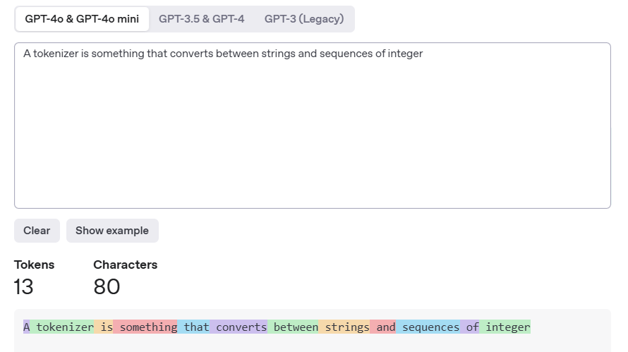

## Tokenizer详解: 现代大语言模型的“翻译官”
在自然语言处理 (NLP) 领域, 我们经常讨论模型的宏伟架构、巧妙的注意力机制和庞大的参数量. 但在所有这些复杂计算开始之前, 有一个至关重要却常被忽视的步骤: **分词 (Tokenization)**. Tokenizer 正是执行这一任务的工具, 它是连接人类语言与模型数学世界的关键桥梁.
本文将深入探讨现代LLM中Tokenizer的角色, 特别是其核心算法之一: **字节对编码 (Byte-Pair Encoding, BPE)**.
### 1. Tokenizer的核心使命: 从字符串到数字序列
首先, 我们要明确一个基本事实: 语言模型本质上是数学函数, 它们不理解“单词”, 只理解“数字”. Tokenizer的核心使命就是完成这个转换.
> 因此LLM可以认为是一个巨大的矩阵
> A tokenizer is something that converts between strings and sequences of integer.
正如这句话所说, 分词器将原始文本字符串, 转换为一个整数序列 (即Token ID), 反之亦然. 每一个ID都对应着词汇表 (Vocabulary) 中的一个特定“片段” (Token).

这个过程可以分解为三步:
1. **输入 (Input):** 我们有一个完整的句子, 就像一张写满文字的纸.
2. **分词 (Tokenization):** Tokenizer就像一个智能碎纸机. 它不是随意地把纸切成碎片, 而是按照预先学好的规则, 将句子切分成一系列有意义的、大小不一的片段. 这些片段就是**Tokens**. 比如, “tokenizer”这个词可能保持完整, 而“unbelievable”可能会被切分成“un”和“believable”.
3. **ID映射 (ID Mapping):** “碎纸机”的每个出口都连接着一个编号系统. 每个切分出来的Token都会被赋予一个独一无二的整数ID. 例如, “tokenizer” 可能对应ID `99665`, “is” 对应ID `382`.
4. **向量化 (Vectorization):** 得到这些ID后, 模型会通过一个巨大的查询表 (即Embedding Matrix) , 将每个ID转换为一个高维向量 (Embedding). 这才是模型真正开始处理的输入.
这个“智能碎纸机”是如何学习切割规则的呢? 这就引出了我们的核心——子词 (Subword) 算法.
### 2. 为何需要子词算法? BPE的崛起
最简单的分词方法是按空格切分. 但这种方法有两个致命缺陷:
- **词汇表爆炸 (Vocabulary Explosion):** "run", "running", "ran" 会被视为三个独立的词, 极大地增加了词汇表的大小.
- **未登录词 (Out-of-Vocabulary, OOV) 问题:** 如果模型在训练时没见过 "de-tokenization" 这个词, 它就不知道如何处理.
为了解决这些问题, **子词 (Subword)** 算法应运而生, 而 **BPE (Byte-Pair Encoding)** 是其中最成功和最广泛使用的一种.
BPE的核心思想非常优雅: **它不在单词层面操作, 而是通过数据驱动的方式, 学习如何将单词拆分成更小的、有意义的子词单元.**
### 3. BPE工作原理: 两阶段过程
BPE的实现分为两个阶段: **训练阶段** (学习合并规则) 和 **分词阶段** (应用规则).
#### 阶段一: 训练 - 学习如何“合并”
这是BPE的“学习”过程, 其目标是建立一个包含高频子词的词汇表.
1. **准备语料库和初始词汇表:**
   - 首先, 我们需要一个庞大的文本语料库 (比如维基百科或Common Crawl的一部分).
   - BPE的初始词汇表非常简单: 它包含了所有可能出现的基础字符. 在现代LLM中, 为了处理所有Unicode字符而不错漏, 初始词汇表通常是256个**字节 (Bytes)**. 这也是它名字中“Byte-Pair”的由来.
2. **迭代合并:**
   - 算法会统计语料库中所有相邻字节对 (Byte Pair) 的出现频率.
   - 找到频率最高的那个字节对, 比如 `('t', 'h')`.
   - 将这个字节对合并成一个新的、更大的单元, 记为 `'th'`.
   - 将这个新的单元 `'th'` 添加到词汇表中.
   - 在整个语料库中, 用新的单元 `'th'` 替换掉所有的 `('t', 'h')`.
   - 重复这个过程 (寻找最高频的相邻对、合并、加入词汇表、替换), 直到词汇表达到预设的大小 (例如, GPT-3的词汇表大小约为5万).
**举个简单的例子:**
假设我们的语料库中有单词: `(low, 5)`, `(lower, 2)`, `(newest, 6)`, `(widest, 3)`. (括号内为词频)
- **初始:** 字符为 `l, o, w, e, r, n, s, t, i, d`.
- **第一次合并:** 假设 `(e, s)` 出现频率最高 (来自new**es**t和wid**es**t). 我们合并它们得到新单元 `'es'`, 并加入词汇表. 语料库变为 `(l o w, 5)`, `(l o w e r, 2)`, `(n ew es t, 6)`, `(w i d es t, 3)`.
- **第二次合并:** 假设 `(es, t)` 频率最高. 合并得到 `'est'`. 词汇表加入 `'est'`. 语料库变为 `(l o w, 5)`, `(l o w e r, 2)`, `(n ew est, 6)`, `(w i d est, 3)`.
- **继续合并...** 最终, 像 `'low'` 这样的高频词可能会被合并成一个完整的Token, 而像 `'lower'` 可能会被表示为 `'low'` 和 `'er'`.
通过这个过程, BPE自动地学习到了哪些是常见的单词 (如`the`, `is`), 哪些是常见的词根、前缀和后缀 (如`est`, `er`, `re-`, `-ing`).
#### 阶段二: 分词 - 应用已学规则
当Tokenizer训练完成后, 它就拥有了一套固定的词汇表和一套按优先级排序的合并规则. 当它遇到一个新句子时:
1. 首先将句子拆分成基础字符/字节序列.
2. 然后, 严格按照训练时学到的合并规则的**优先级顺序** (从最高频的合并开始), 对序列进行迭代合并.
3. 当无法再进行任何合并时, 最终得到的序列就是分词结果.
这个过程巧妙地解决了OOV问题. 即使遇到一个从未见过的词, 如 "GPTtokenizer", BPE最差也能将其拆分为一系列已知的子词或单个字节, 例如 `['GPT', 'token', 'izer']`. **模型永远不会遇到完全未知的东西.**
### 4. 实例分析

图片来源: [https://platform.openai.com/tokenizer](https://platform.openai.com/tokenizer)
> **句子:** "A tokenizer is something that converts between strings and sequences of integer"
> **对应的Token ID:** `[32, 99665, 382, 3543, 484, 64809, 2870, 18279, 326, 45665, 328, 16336, 198]`
我们可以对这个结果进行一些推断:
- **常见的词是单个Token:** 像 `is` (ID: 382), `that` (ID: 484), `and` (ID: 326), `of` (ID: 328) 这类极其常见的词, 几乎肯定在BPE的训练早期就被合并成了一个完整的Token.
- **专有名词/高频词也是单个Token:** `tokenizer` (ID: 99665), `sequences` (ID: 16336) 和 `integer` (ID: 198) 虽然更长, 但在NLP语料库中是高频词, 因此它们也被学习成了一个单独的Token.
- **空格的处理:** 请注意第一个ID `32`. 在很多现代Tokenizer (如Llama系列)中, 这是一个特殊的Token, 通常代表一个前导空格. 之后的很多Token, 如 `is` (ID: 382),  `that` (ID: 484)等, 很可能在内部就包含了前面的空格. 这是为了区分一个单词在句首和句中的情况.
- **Token ID的任意性:** 这些ID `99665`, `382`, `3543` ... 本身没有数学意义. 它们只是词汇表这个大字典里的“门牌号”. 模型只关心用这个门牌号去Embedding矩阵里取出对应的向量.
### 结论: 不可或缺的基石
Tokenizer虽然不像Transformer那样光芒四射, 但它是一个默默无闻的英雄. 通过BPE这类精巧的子词算法, 它解决了词汇表规模和未登录词两大核心难题, 实现了效率和表达能力的完美平衡.
它使得模型能够:
1. 用有限的、可控大小的词汇表来表示无限的语言现象.
2. 理解并生成新词和罕见词.
3. 以一种数据驱动的方式, 捕捉语言的形态学规律 (如词根词缀).
因此, 下一次当您看到一个LLM生成流畅的文本时, 请记住, 这一切都始于Tokenizer那个看似简单却极其智能的“第一步”——将您的文字, 精准地翻译成模型能够理解的数字语言.
课程主讲Percy Liang指出 无分词方法(Tokenizer-free approaches),这些方法直接处理原始字节,不进行分词,用一种特定的架构直接接收原始字节,虽然很有前景,但还没被应用到前沿领域
## Q&A
1. 看到分词器的结果是有时候是连空格的,比如[ hello] 和 [hello] 这两个在embedding之后有区别吗 
   有区别的 空格也是token的一部分,不像传统的NLP,LLM时代会将所有东西都考虑进去. 而且,根据惯例,不知道是啥原因,空格经常会出现在token之前
2. 空格放在单词前面是人为的还是自然形成的？
   是人为的,但是是经过大量测试的,放在后面可能会出问题. 而且现代分词器会进行预分词,空格放在单词前面是在这个阶段确定的
