# Lecture 11: 如何用好 Scaling Law (Scaling Case Studies & μP)

**主讲人**: CS336 Instructor
**核心议题**: Scaling Law 的工程实践、案例研究（Cerebras-GPT, MiniCPM, DeepSeek）、WSD 学习率调度、μP (Maximal Update Parametrization) 的数学推导与实证验证。

---

## 1. 引言：为什么需要 Scaling Law？

上一讲我们探讨了 Scaling Law 的理论基础，特别是 Chinchilla 论文提出的计算最优比例（约 20:1 的 Token/Parameter 比）。然而，在实际工程中，我们面临着更复杂的问题：

> **核心疑问**: Chinchilla 的方法真的有效吗？在 Log-Log 图上拟合曲线真的能指导大模型训练吗？

具体来说，我们需要回答：
1. **IsoFLOP 分析**可靠吗？能否真正指导 Token/Parameter 的权衡？
2. 能否用 Scaling Law 来设置**最优学习率**？
3. 应该选择什么样的**架构或参数化方法**来实现稳定的缩放？

### 1.1 后 Chinchilla 时代的竞争格局

自 Chinchilla 论文发表及 ChatGPT 爆发以来，前沿实验室对 Scaling 细节变得**讳莫如深**。讲师提到，他曾向前沿实验室的人询问 Scaling 策略，得到的回答是："我们绝对不会告诉你任何关于 Scaling 的事情。"

因此，我们转向那些公开了详细 Scaling 研究的"半生产级"模型：
- **Cerebras-GPT** (2023)
- **MiniCPM** (2024, 面壁智能)
- **DeepSeek LLM** (2024, 深度求索)

此外，还有一些新近发布的模型提供了部分 Scaling 信息：
- **Llama 3** (Meta, 2024)
- **Hunyuan Large** (腾讯, MoE 模型)
- **MiniMax-01** (混合线性注意力模型)

> **讲师评价**: 至今为止，MiniCPM 和 DeepSeek 仍然是我们拥有的**最详细的公开 Scaling 研究**。

---

## 2. 案例研究：Cerebras-GPT

### 2.1 概览

Cerebras-GPT 是一系列从 **111M 到 13B** 参数的模型，使用 Chinchilla 比例（约 20:1 Token/Parameter）进行训练。

**核心发现**: 使用 **μP (Maximal Update Parametrization)** 可以显著提高 Scaling 的稳定性和可预测性。

### 2.2 μP vs 标准参数化 (SP)

下图展示了使用标准参数化 (SP) 和 μP 的模型在测试 Loss 上的对比：

> **关键观察**:
> - **蓝色 (SP)**: 标准参数化下，Loss 曲线与预测值有较大偏离（振荡）
> - **橙色 (μP)**: μP 下的 Loss 曲线更接近拟合的 Scaling Law 预测线
> - μP 的表现**不亚于甚至优于** Pythia 和 GPT-J

### 2.3 μP 参数表

如果你想实现 μP，Cerebras-GPT 论文附录提供了一个清晰的参数对照表：

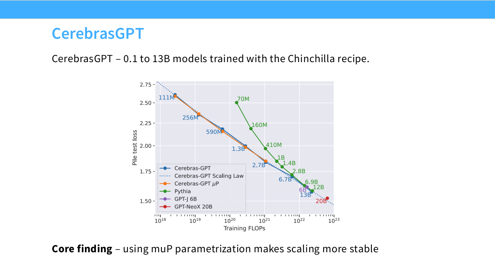

**核心规则** (与标准参数化对比):
1. **初始化**: 所有非 Embedding 层的权重按 $1/\text{width}$ 缩放
2. **学习率**: 每层的学习率按 $1/\text{width}$ 缩放

### 2.4 小规模超参数搜索

Cerebras 的策略是：
1. 将模型缩小到 **40M** 参数的代理模型
2. 在小规模上进行**大范围超参数搜索**
3. 借助 μP 保持超参数稳定，然后直接 Scale Up

---

## 3. 案例研究：MiniCPM

### 3.1 概览

MiniCPM 的目标是训练**高质量的小型模型** (1.2B - 2.4B 参数)，但投入大量计算进行优化。

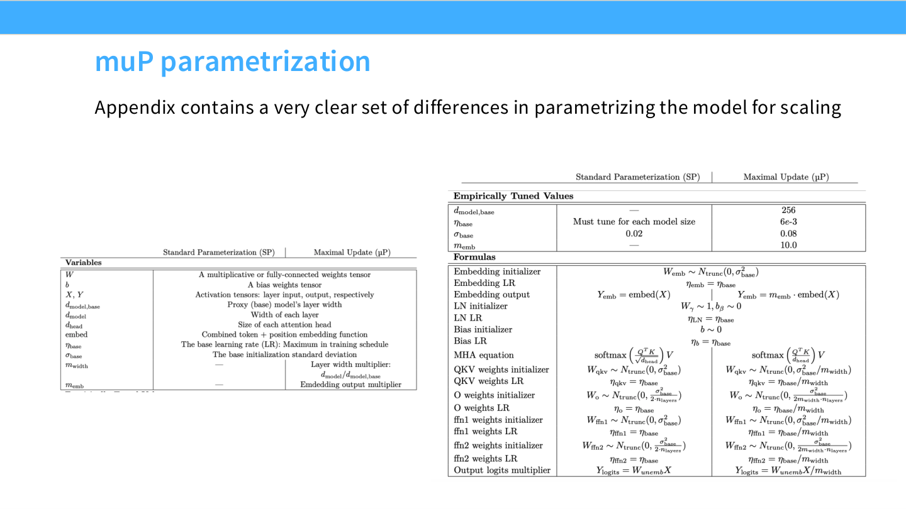

> **性能表现**: 在发布时，MiniCPM 在其参数量级别上表现优异，1.2B/2.4B 模型击败了当时大多数 2B 模型，甚至匹配了许多 7B 模型。

### 3.2 MiniCPM 的 μP 实现

MiniCPM 同样采用 μP 来稳定超参数：

**参数设置**:
- Embedding 层: 普通缩放
- 残差连接 (MLP): 按 $\sqrt{\text{num\_layers}}$ 缩放
- 初始化: $1/\text{base\_width}$ (fan-in)
- 学习率: 同样按 width 缩放

### 3.3 Critical Batch Size 分析

与 Kaplan 论文一致，MiniCPM 团队研究了**临界 Batch Size**（收益递减点）与目标 Loss 的关系：

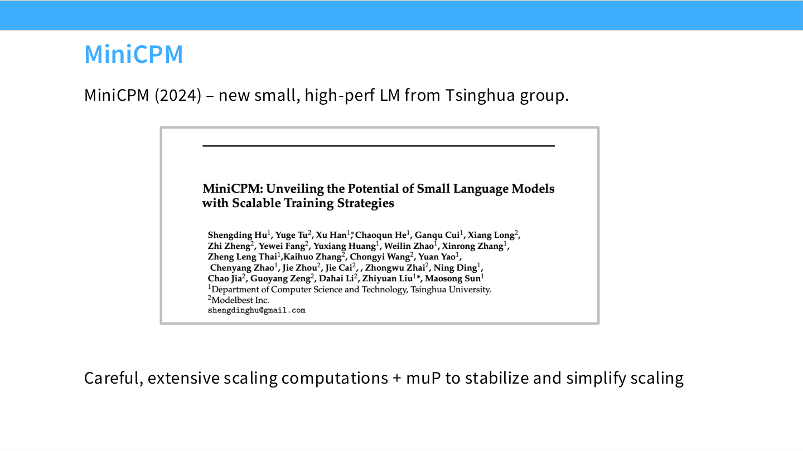

> **结论**: 目标 Loss 越低（模型越强），可以使用的 Batch Size 越大。这与 Kaplan 论文的结论一致。

### 3.4 学习率稳定性验证

下图展示了不同模型规模下的学习率扫描结果：

> **关键观察**:
> - 浅色线代表小模型，深色线代表大模型
> - **最优学习率位置保持不变**（约 $10^{-2}$）
> - 这证明了 μP 的有效性：正确的初始化和每层学习率缩放可以避免反复调参

---

## 4. WSD 学习率调度 (Warm-up Stable Decay)

### 4.1 问题：Cosine 调度的局限

传统的 **Cosine 学习率调度** 有一个问题：不同的数据量目标需要不同的 Cosine 曲线。

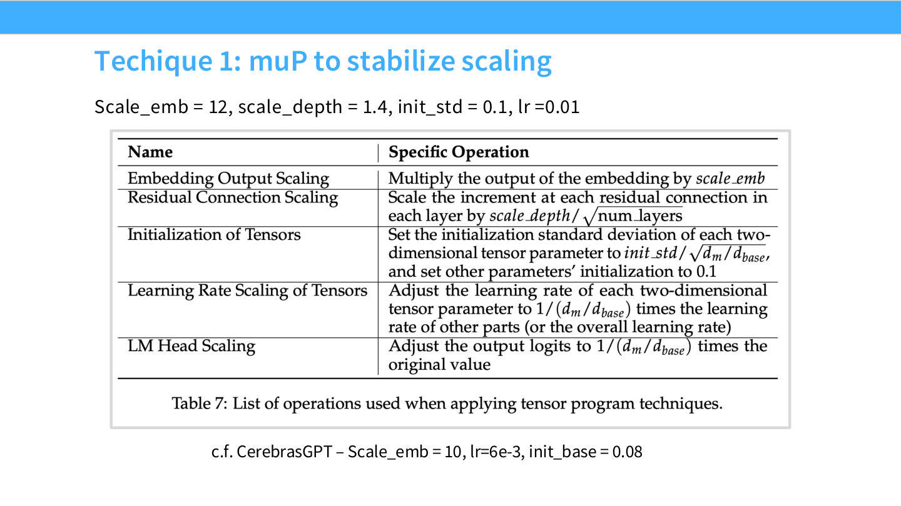

> **核心问题**: 如果我想做 Chinchilla 风格的数据缩放分析，需要训练多个不同数据量的模型。使用 Cosine 时，**无法复用**中间检查点，因为每个数据量目标对应的 Cosine 曲线不同。这导致需要 $O(n^2)$ 次训练。

### 4.2 WSD 的解决方案

**WSD (Warm-up Stable Decay)** 是一种梯形学习率调度：
1. **Warm-up Phase**: 与 Cosine 相同的预热阶段
2. **Stable Phase**: 学习率保持**恒定**（平台期）
3. **Decay Phase**: 快速冷却到最小学习率

> **优势**: Stable Phase 是平的！这意味着你可以在一次训练运行中，通过在不同时间点"回退到 Stable Phase 的某个检查点 + Decay"来模拟不同数据量的训练结果。
>
> **复杂度**: $O(n)$，而非 Cosine 的 $O(n^2)$

### 4.3 WSD vs Cosine 的 Loss 曲线

> **曲线解读**:
> - **黄色 (Cosine)**: 平滑下降
> - **深色 (WSD)**: 在 Stable Phase 平稳下降，进入 Decay Phase 后 **Loss 急剧下降**
> - **结论**: 在每个 Token 数量点上，WSD 的最终性能与 Cosine **相当甚至更好**

**关于 Cooldown 的重要性**: 讲师强调，Decay Phase 是获得大部分 Loss 收益的关键阶段。如果不进行 Cooldown，Loss 会高得多。优化器和学习率设计的核心就是在"保持高学习率以远离初始化点"和"良好衰减以压低 Loss"之间取得平衡。

### 4.4 MiniCPM 的 Chinchilla 复现

借助 WSD，MiniCPM 团队以极低的成本完成了 Chinchilla 分析（Method 1 和 Method 3）：

**惊人发现**: MiniCPM 拟合出的最优 Token/Parameter 比高达 **192:1**，远超 Chinchilla 的 20:1！

> **讲师评价**: 这个数字非常高，我没见过其他人得出过这个结论。但这至少说明，**20:1 只是一个起点**，我们完全可以大幅增加数据量。

---

## 5. 案例研究：DeepSeek LLM

### 5.1 概览

DeepSeek LLM (7B & 67B) 是 2024 年初发布的模型，在当时的开源模型中表现顶尖（匹配 Llama 2 和 Mistral）。

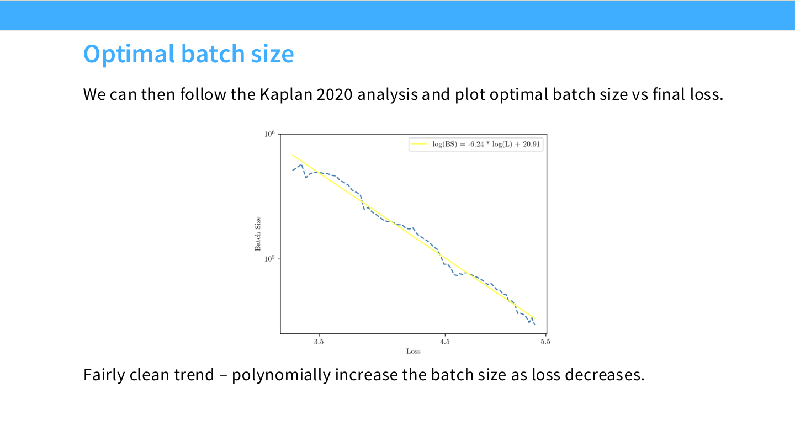

> **讲师评价**: 如果你读过 DeepSeek LLM 的论文，你会知道这些人是**非常严肃的科学家**。他们做了大量仔细的 Scaling 消融实验，这种态度是所有成功进行 Scaling 的团队的共同特点。

### 5.2 DeepSeek 的不同策略：不使用 μP

与 Cerebras-GPT 和 MiniCPM 不同，DeepSeek **不使用 μP**，而是直接通过 Scaling Law 拟合来确定最优 Batch Size 和 Learning Rate。

**方法**:
1. 在两个相对小规模的模型上进行 Batch Size 和 Learning Rate 的网格搜索
2. 记录每个规模下的最优值
3. 在不同 FLOP 规模上重复此过程
4. 拟合 Scaling Law 来外推大模型的最优值

### 5.3 Batch Size 和 Learning Rate 的 Scaling

> **讲师观点**: Batch Size 的 Scaling Law 看起来比较清晰（左图）。Learning Rate 的拟合（右图）"看起来有点可疑"，我甚至觉得画一条水平线可能也说得过去。但他们确实这样做了并取得了成功。
>
> **一个广泛的教训**: Chinchilla 风格的 IsoFLOP 分析通常拟合得非常漂亮，而超参数的 Scaling Law 往往看起来更嘈杂。

### 5.4 DeepSeek 的 WSD 实现

DeepSeek 同样采用了 WSD 调度，但有一点不同：他们使用了**两阶段 Decay**（约 10% + 10%）。

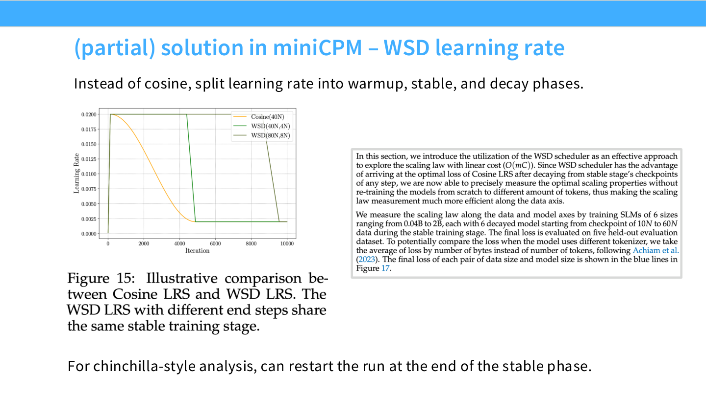

> 研究表明，Decay 阶段占总计算预算的比例（如 20%）并不敏感。

### 5.5 DeepSeek 的 Chinchilla 复现

DeepSeek 从零开始重新进行了 Chinchilla 分析，而不是简单地"Cargo Cult" 20:1 的比例。

> **讲师评价**: 我觉得这非常好。他们本可以直接采用 Chinchilla 的结论，但他们选择自己验证。这种严谨的态度值得学习。

### 5.6 预测验证

最终，DeepSeek 在 7B 和 67B 模型上验证了他们的 Scaling Law 预测：

> **关键点**: 他们能够从 $10^{20}$ FLOP 的小规模实验外推到 $10^{24}$ FLOP 的大规模训练，并**准确预测最终 Loss**。这是 Scaling Law 的核心价值。

---

## 6. 新近模型的 Scaling 研究简述

### 6.1 Llama 3

Llama 3 重新进行了 IsoFLOP 分析，得出的最优比例约为 **39:1**（高于 Chinchilla 的 20:1）。

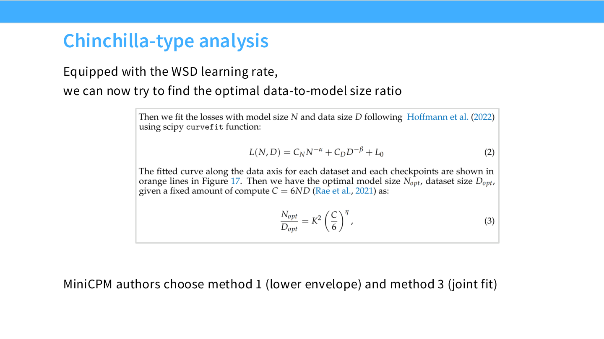

此外，Llama 3 尝试将 Perplexity 与下游任务的准确率关联起来（通过拟合 Sigmoid 曲线）。

### 6.2 Hunyuan Large (MoE)

腾讯的 Hunyuan Large 是一个 MoE 模型。他们针对 MoE 架构重新进行了 Chinchilla 分析，得出的比例约为 **96:1**（Token / Active Parameter）。

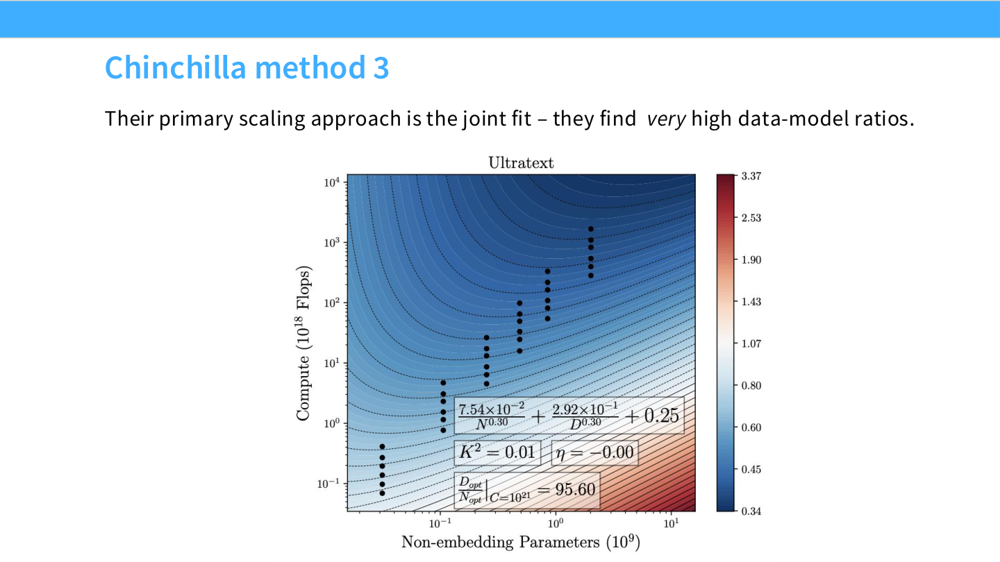

> **备注**: MoE 的比例与 Dense 模型不同，这很正常。

### 6.3 MiniMax-01 (线性注意力)

MiniMax-01 是一个混合架构（Softmax Attention + Linear Attention）。他们的 Scaling 研究旨在证明 Linear Attention 的性能与 Softmax Attention **相当**。

> **评价**: 这种用 Scaling Law 来验证架构选择的做法，在 Mamba 等论文中也很常见，但 MiniMax 是少数在大规模生产模型上这样做的。

### 6.4 案例研究总结

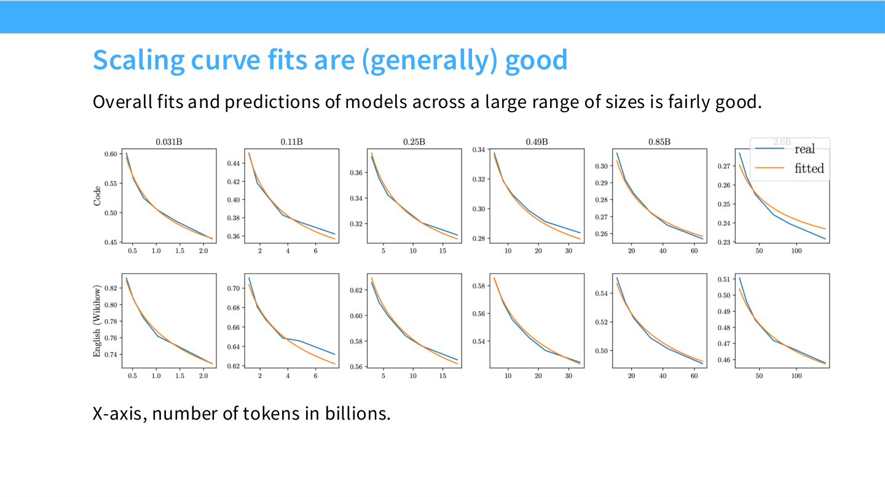

| 模型 | μP | WSD | Chinchilla 复现 | 其他 |
|---|---|---|---|---|
| Cerebras-GPT | ✓ | - | - | 首次公开验证 μP |
| MiniCPM | ✓ | ✓ | ✓ (192:1) | 普及 WSD |
| DeepSeek | ✗ | ✓ | ✓ | 直接拟合 LR/BS Scaling |
| Llama 3 | ? | ? | ✓ (39:1) | Loss → Accuracy 映射 |
| Hunyuan | ? | ? | ✓ (96:1 for MoE) | MoE 特定分析 |
| MiniMax | ? | ? | ✓ (Method 1) | 验证线性注意力 |

---

## 7. μP 的数学推导

### 7.1 核心思想

> **目标**: 随着模型宽度 ($n$) 增加，我们希望某些量保持 $\Theta(1)$ 的阶数（不发散也不消失）。

μP 基于两个**谱条件 (Spectral Conditions)**：

**条件 A1 (激活值稳定性)**: 在初始化时，每个激活值坐标应为 $\Theta(1)$。
$$ \|h^{(l)}\|_2 = \Theta(\sqrt{n_l}) $$
（范数随维度增长，因为坐标之间独立）

**条件 A2 (更新量稳定性)**: 经过一次梯度步进后，激活值的变化应为 $\Theta(1)$。
$$ \|\Delta h^{(l)}\|_2 = \Theta(\sqrt{n_l}) $$

### 7.2 推导初始化规则 (Condition A1)

考虑一个**深度线性网络** (Deep Linear Network)：
$$ h^{(l)} = W^{(l)} h^{(l-1)} $$
无非线性，只为简化推导。

**初始化**: $W^{(l)} \sim \mathcal{N}(0, \sigma_l^2)$

**随机矩阵理论**: 当 $n_l, n_{l-1} \to \infty$ 时，高斯矩阵的算子范数满足：
$$ \|W^{(l)}\|_{op} \approx \sigma_l \cdot (\sqrt{n_l} + \sqrt{n_{l-1}}) $$

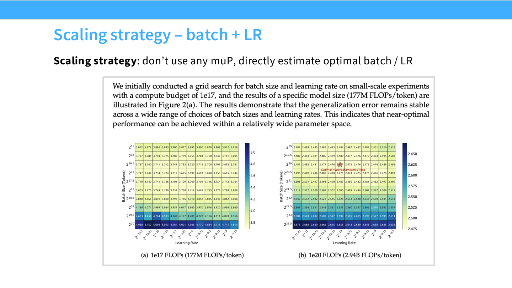

**归纳证明**:
- 假设 $\|h^{(l-1)}\|_2 = \sqrt{n_{l-1}}$
- 选取 $\sigma_l = \frac{1}{\sqrt{n_{l-1}}} \cdot \min\left(1, \sqrt{\frac{n_{l-1}}{n_l}}\right)$
- 代入可得 $\|h^{(l)}\|_2 = \sqrt{n_l}$

**结论**: 初始化标准差应约为 **$1/\sqrt{\text{fan\_in}}$**（与 Kaiming 初始化一致）。

### 7.3 推导学习率规则 (Condition A2)

现在考虑一次梯度更新。对于 SGD：
$$ \Delta W^{(l)} = -\eta \cdot \nabla_W \mathcal{L} = -\eta \cdot \frac{\partial \mathcal{L}}{\partial h^{(l)}} (h^{(l-1)})^T $$

**关键假设**: 如果学习过程是良好的，那么一次梯度步进后 Loss 的变化也应为 $\Theta(1)$。
$$ \Delta \mathcal{L} = \Theta(1) $$

通过链式法则和范数分析，可以推导出：
$$ \eta_{SGD} = \frac{n_l}{n_{l-1}} \quad (\text{fan\_out / fan\_in}) $$

但对于 **Adam** 优化器，由于其对梯度进行归一化，推导结果不同：
$$ \eta_{Adam} = \frac{1}{n_{l-1}} \quad (\text{1 / fan\_in}) $$

### 7.4 μP 与 SP 对比

| | **标准参数化 (SP)** | **μP** |
|---|---|---|
| **初始化** | $1/\sqrt{\text{fan\_in}}$ | $1/\sqrt{\text{fan\_in}}$ (基本相同) |
| **学习率 (SGD)** | 全局常数 | $\text{fan\_out}/\text{fan\_in}$ (基本不变) |
| **学习率 (Adam)** | 全局常数 | $1/\text{fan\_in}$ (**关键区别**) |

> **核心差异**: 对于 Adam，μP 要求**每层学习率按宽度缩放**，这是最大的实际变化。

### 7.5 物理学视角：重正化

> **讲师观点**: 这种"在取极限时保持量级稳定"的思想，与物理学中的**重正化 (Renormalization)** 非常相似。这是一个在深度学习中成功应用物理直觉的有趣案例。

---

## 8. μP 的实证验证 (Lingle 论文)

讲师介绍了一篇独立研究者 Lingle 的预印本：*A Large-Scale Exploration of μ-Transfer*。该论文通过大量消融实验验证了 μP 的鲁棒性。

### 8.1 实验设置

- **架构**: 标准 Transformer，自回归预训练
- **缩放维度**: 仅缩放宽度 (Width)，固定深度
- **目标**: 验证最优学习率是否在不同宽度下保持稳定

### 8.2 μP 是否有效？

**结论**: 是的！从宽度 128 到 2048，最优学习率保持在同一位置。

### 8.3 对激活函数的鲁棒性

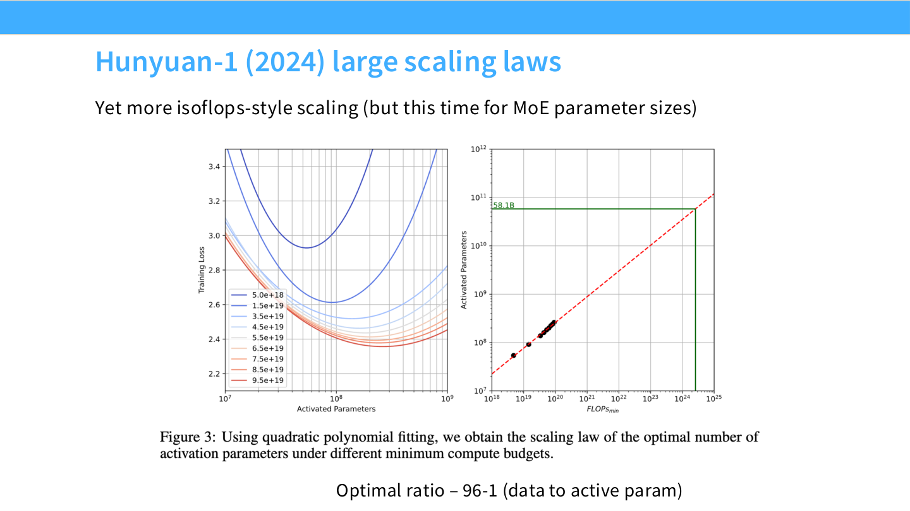

- **SwiGLU**, **Squared ReLU** 和基线 **ReLU** 的最优学习率**相同**
- μP 对非线性类型**鲁棒**

### 8.4 对 Batch Size 的鲁棒性

- Batch Size 变化 4 倍（上下），最优学习率**稳定**
- μP 对 Batch Size 变化**鲁棒**

### 8.5 对初始化变体的鲁棒性

- Query 矩阵初始化为 0（使初始注意力均匀）
- Unembedding 层使用 SP 或 μP 缩放
- 以上变体**不影响**最优学习率

### 8.6 μP 的局限性

**Learnable Gains (RMSNorm 的可学习增益)**:
- 添加可学习增益会**破坏** μP
- 需要移除 Bias/Gain 才能使 μP 正常工作

**非标准优化器 (Lion)**:

- Lion 优化器（符号梯度）会**破坏** μP
- 这是预期的，因为 μP 是为 Adam/SGD 设计的

**强权重衰减 (Weight Decay)**:

- 非常强的权重衰减会导致 μP **失效**
- 这是少数几个显著的失败案例之一

### 8.7 大规模验证 (10B 参数)

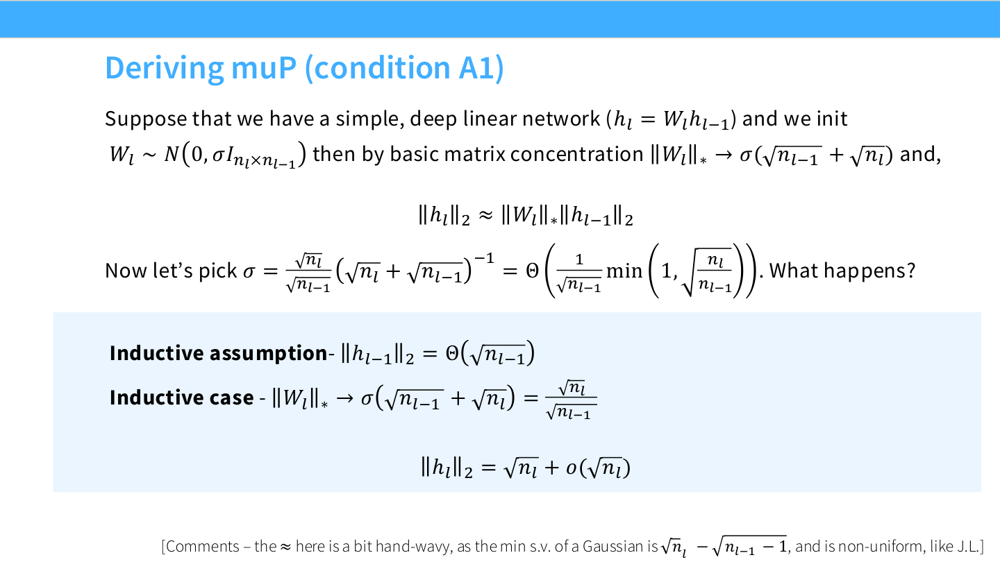

- 在小中规模上进行完整研究
- 选定最优学习率后，直接扩展到 10B 参数
- **学习率保持最优**，这是一个很好的验证

> **备注**: Meta 的 Llama-1 使用了 μP，这也是一个间接验证。但目前 μP 并非行业共识。

---

## 9. 总结与最佳实践

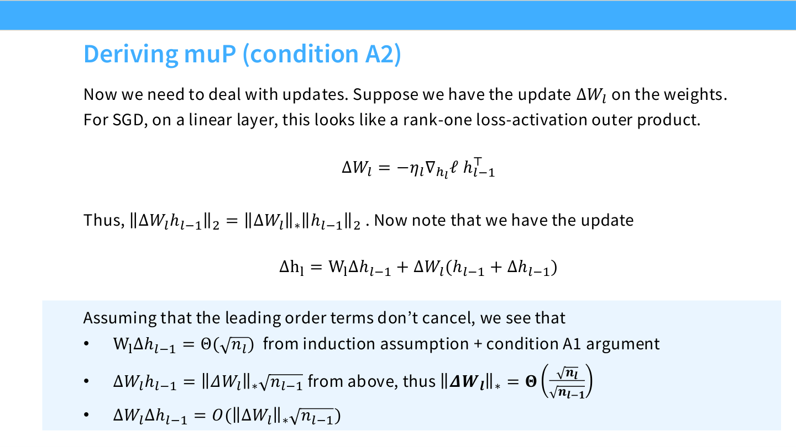

### 9.1 Scaling 实战中的常见策略

1. **超参数选择**:
   - 使用 Scaling Law 拟合 Batch Size 和 Learning Rate (DeepSeek 风格)
   - 或使用 μP 保持超参数跨规模稳定 (Cerebras/MiniCPM 风格)

2. **学习率调度**:
   - 考虑使用 **WSD (Warm-up Stable Decay)** 代替 Cosine
   - WSD 性能相当，但允许以 $O(n)$ 成本进行数据缩放分析

3. **Chinchilla 比例**:
   - **20:1 只是起点**，现代模型通常使用更高的 Token/Parameter 比
   - Llama 3: 39:1, MiniCPM: 192:1, Hunyuan (MoE): 96:1
   - 应根据实际情况进行 IsoFLOP 分析

4. **μP 的使用建议**:
   - 对 Adam 优化器，实现每层学习率缩放 ($1/\text{fan\_in}$)
   - 移除 RMSNorm 的可学习 Gain
   - 避免使用非标准优化器 (如 Lion)

### 9.2 课堂问答精选

**Q: μP 的主要变化是初始化吗？**
> A: 有两个变化：初始化和学习率。但如果你已经在用 Kaiming 初始化 ($1/\sqrt{\text{fan\_in}}$)，初始化已经正确了。**最大的实际变化是每层学习率的缩放**。

**Q: DeepSeek 使用全局学习率，是否意味着他们的更新不是 $\Theta(1)$？**
> A: 是的。如果你看他们的 Scaling Law 拟合图，学习率确实随规模下降。这是为了补偿更大模型产生的更大更新。μP 只是让这种调整变得不必要，但**即使不用 μP，只要你调对了学习率，也能训练好模型**。

**Q: 架构假设是什么？能用于 Transformer 吗？**
> A: 推导是基于深度线性网络的，这是最简化的模型。但有论文讨论了如何将这些论点扩展到非线性、Attention 层和 GLU 等。每个架构组件都需要仔细分析。

---

## 10. 拓展阅读

建议按以下顺序深入学习：
1. **WSD 调度**: MiniCPM 论文相关章节
2. **μP 原理**: Yang et al. "Tensor Programs V: Tuning Large Neural Networks via Zero-Shot Hyperparameter Transfer"
3. **μP 实证**: Lingle "A Large-Scale Exploration of μ-Transfer"
4. **实用指南**: "A Practitioner's Guide to μP" (博客)
