# Lecture 11: 濡備綍鐢ㄥソ Scaling Law (Scaling Case Studies & 渭P)

**涓昏浜?*: CS336 Instructor
**鏍稿績璁**: Scaling Law 鐨勫伐绋嬪疄璺点€佹渚嬬爺绌讹紙Cerebras-GPT, MiniCPM, DeepSeek锛夈€乄SD 瀛︿範鐜囪皟搴︺€佄糚 (Maximal Update Parametrization) 鐨勬暟瀛︽帹瀵间笌瀹炶瘉楠岃瘉銆?

---

## 1. 寮曡█锛氫负浠€涔堥渶瑕?Scaling Law锛?

涓婁竴璁叉垜浠帰璁ㄤ簡 Scaling Law 鐨勭悊璁哄熀纭€锛岀壒鍒槸 Chinchilla 璁烘枃鎻愬嚭鐨勮绠楁渶浼樻瘮渚嬶紙绾?20:1 鐨?Token/Parameter 姣旓級銆傜劧鑰岋紝鍦ㄥ疄闄呭伐绋嬩腑锛屾垜浠潰涓寸潃鏇村鏉傜殑闂锛?

> **鏍稿績鐤戦棶**: Chinchilla 鐨勬柟娉曠湡鐨勬湁鏁堝悧锛熷湪 Log-Log 鍥句笂鎷熷悎鏇茬嚎鐪熺殑鑳芥寚瀵煎ぇ妯″瀷璁粌鍚楋紵

鍏蜂綋鏉ヨ锛屾垜浠渶瑕佸洖绛旓細
1. **IsoFLOP 鍒嗘瀽**鍙潬鍚楋紵鑳藉惁鐪熸鎸囧 Token/Parameter 鐨勬潈琛★紵
2. 鑳藉惁鐢?Scaling Law 鏉ヨ缃?*鏈€浼樺涔犵巼**锛?
3. 搴旇閫夋嫨浠€涔堟牱鐨?*鏋舵瀯鎴栧弬鏁板寲鏂规硶**鏉ュ疄鐜扮ǔ瀹氱殑缂╂斁锛?

### 1.1 鍚?Chinchilla 鏃朵唬鐨勭珵浜夋牸灞€

鑷?Chinchilla 璁烘枃鍙戣〃鍙?ChatGPT 鐖嗗彂浠ユ潵锛屽墠娌垮疄楠屽瀵?Scaling 缁嗚妭鍙樺緱**璁宠帿濡傛繁**銆傝甯堟彁鍒帮紝浠栨浘鍚戝墠娌垮疄楠屽鐨勪汉璇㈤棶 Scaling 绛栫暐锛屽緱鍒扮殑鍥炵瓟鏄細"鎴戜滑缁濆涓嶄細鍛婅瘔浣犱换浣曞叧浜?Scaling 鐨勪簨鎯呫€?

鍥犳锛屾垜浠浆鍚戦偅浜涘叕寮€浜嗚缁?Scaling 鐮旂┒鐨?鍗婄敓浜х骇"妯″瀷锛?
- **Cerebras-GPT** (2023)
- **MiniCPM** (2024, 闈㈠鏅鸿兘)
- **DeepSeek LLM** (2024, 娣卞害姹傜储)

姝ゅ锛岃繕鏈変竴浜涙柊杩戝彂甯冪殑妯″瀷鎻愪緵浜嗛儴鍒?Scaling 淇℃伅锛?
- **Llama 3** (Meta, 2024)
- **Hunyuan Large** (鑵捐, MoE 妯″瀷)
- **MiniMax-01** (娣峰悎绾挎€ф敞鎰忓姏妯″瀷)

> **璁插笀璇勪环**: 鑷充粖涓烘锛孧iniCPM 鍜?DeepSeek 浠嶇劧鏄垜浠嫢鏈夌殑**鏈€璇︾粏鐨勫叕寮€ Scaling 鐮旂┒**銆?

---

## 2. 妗堜緥鐮旂┒锛欳erebras-GPT

### 2.1 姒傝

Cerebras-GPT 鏄竴绯诲垪浠?**111M 鍒?13B** 鍙傛暟鐨勬ā鍨嬶紝浣跨敤 Chinchilla 姣斾緥锛堢害 20:1 Token/Parameter锛夎繘琛岃缁冦€?

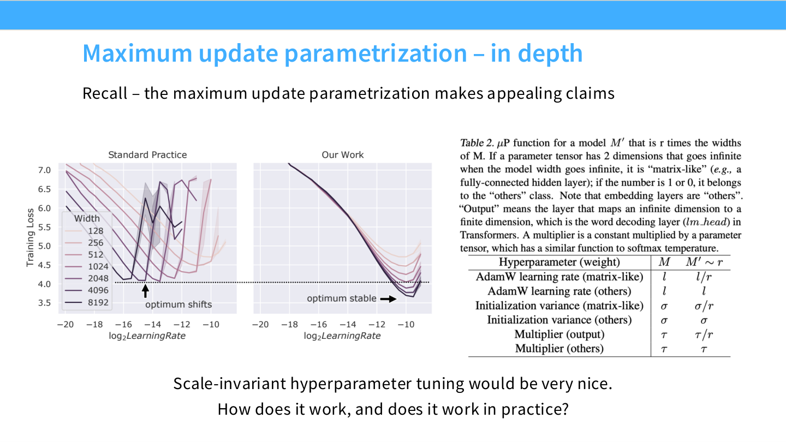

**鏍稿績鍙戠幇**: 浣跨敤**渭P (Maximal Update Parametrization)** 鍙互鏄捐憲鎻愰珮 Scaling 鐨勭ǔ瀹氭€у拰鍙娴嬫€с€?

### 2.2 渭P vs 鏍囧噯鍙傛暟鍖?(SP)

涓嬪浘灞曠ず浜嗕娇鐢ㄦ爣鍑嗗弬鏁板寲 (SP) 鍜?渭P 鐨勬ā鍨嬪湪娴嬭瘯 Loss 涓婄殑瀵规瘮锛?

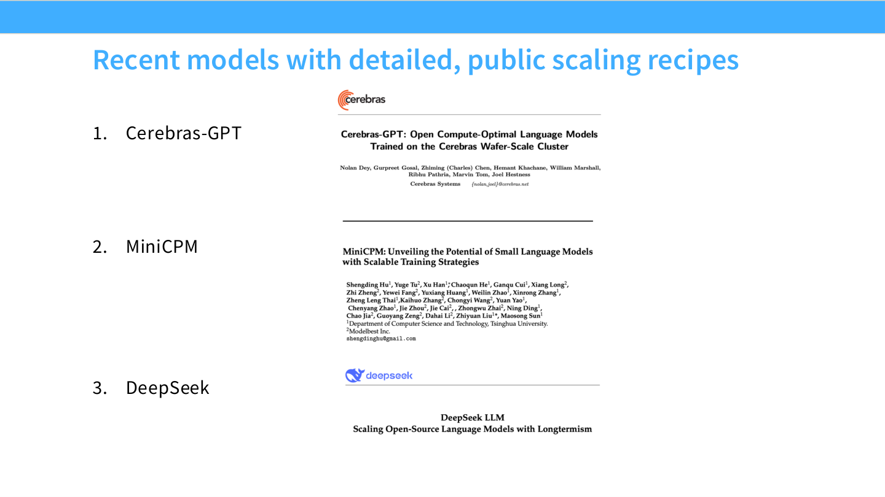

> **鍏抽敭瑙傚療**:
> - **钃濊壊 (SP)**: 鏍囧噯鍙傛暟鍖栦笅锛孡oss 鏇茬嚎涓庨娴嬪€兼湁杈冨ぇ鍋忕锛堟尟鑽★級
> - **姗欒壊 (渭P)**: 渭P 涓嬬殑 Loss 鏇茬嚎鏇存帴杩戞嫙鍚堢殑 Scaling Law 棰勬祴绾?
> - 渭P 鐨勮〃鐜?*涓嶄簹浜庣敋鑷充紭浜?* Pythia 鍜?GPT-J

### 2.3 渭P 鍙傛暟琛?

濡傛灉浣犳兂瀹炵幇 渭P锛孋erebras-GPT 璁烘枃闄勫綍鎻愪緵浜嗕竴涓竻鏅扮殑鍙傛暟瀵圭収琛細

**鏍稿績瑙勫垯** (涓庢爣鍑嗗弬鏁板寲瀵规瘮):
1. **鍒濆鍖?*: 鎵€鏈夐潪 Embedding 灞傜殑鏉冮噸鎸?$1/\text{width}$ 缂╂斁
2. **瀛︿範鐜?*: 姣忓眰鐨勫涔犵巼鎸?$1/\text{width}$ 缂╂斁

### 2.4 灏忚妯¤秴鍙傛暟鎼滅储

Cerebras 鐨勭瓥鐣ユ槸锛?
1. 灏嗘ā鍨嬬缉灏忓埌 **40M** 鍙傛暟鐨勪唬鐞嗘ā鍨?
2. 鍦ㄥ皬瑙勬ā涓婅繘琛?*澶ц寖鍥磋秴鍙傛暟鎼滅储**
3. 鍊熷姪 渭P 淇濇寔瓒呭弬鏁扮ǔ瀹氾紝鐒跺悗鐩存帴 Scale Up

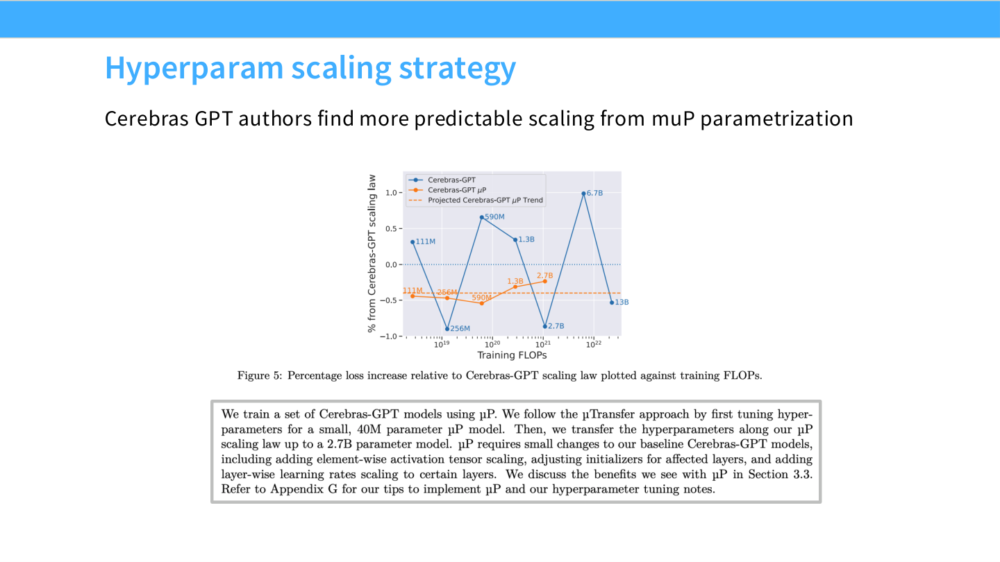

---

## 3. 妗堜緥鐮旂┒锛歁iniCPM

### 3.1 姒傝

MiniCPM 鐨勭洰鏍囨槸璁粌**楂樿川閲忕殑灏忓瀷妯″瀷** (1.2B - 2.4B 鍙傛暟)锛屼絾鎶曞叆澶ч噺璁＄畻杩涜浼樺寲銆?

> **鎬ц兘琛ㄧ幇**: 鍦ㄥ彂甯冩椂锛孧iniCPM 鍦ㄥ叾鍙傛暟閲忕骇鍒笂琛ㄧ幇浼樺紓锛?.2B/2.4B 妯″瀷鍑昏触浜嗗綋鏃跺ぇ澶氭暟 2B 妯″瀷锛岀敋鑷冲尮閰嶄簡璁稿 7B 妯″瀷銆?

### 3.2 MiniCPM 鐨?渭P 瀹炵幇

MiniCPM 鍚屾牱閲囩敤 渭P 鏉ョǔ瀹氳秴鍙傛暟锛?

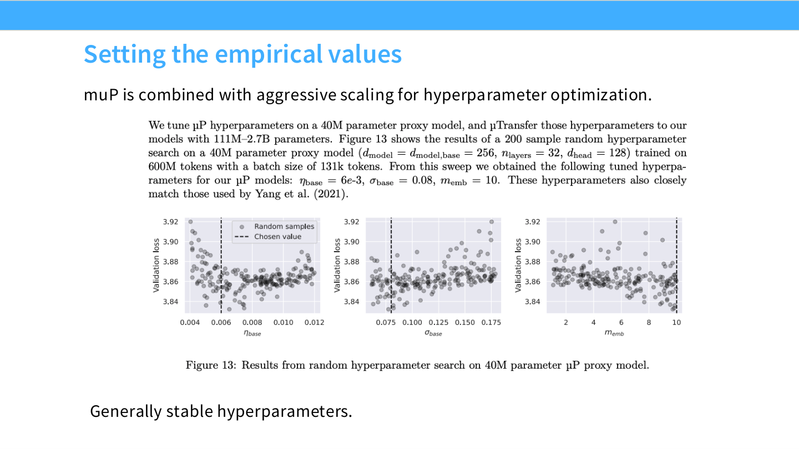

**鍙傛暟璁剧疆**:
- Embedding 灞? 鏅€氱缉鏀?
- 娈嬪樊杩炴帴 (MLP): 鎸?$\sqrt{\text{num\_layers}}$ 缂╂斁
- 鍒濆鍖? $1/\text{base\_width}$ (fan-in)
- 瀛︿範鐜? 鍚屾牱鎸?width 缂╂斁

### 3.3 Critical Batch Size 鍒嗘瀽

涓?Kaplan 璁烘枃涓€鑷达紝MiniCPM 鍥㈤槦鐮旂┒浜?*涓寸晫 Batch Size**锛堟敹鐩婇€掑噺鐐癸級涓庣洰鏍?Loss 鐨勫叧绯伙細

> **缁撹**: 鐩爣 Loss 瓒婁綆锛堟ā鍨嬭秺寮猴級锛屽彲浠ヤ娇鐢ㄧ殑 Batch Size 瓒婂ぇ銆傝繖涓?Kaplan 璁烘枃鐨勭粨璁轰竴鑷淬€?

### 3.4 瀛︿範鐜囩ǔ瀹氭€ч獙璇?

涓嬪浘灞曠ず浜嗕笉鍚屾ā鍨嬭妯′笅鐨勫涔犵巼鎵弿缁撴灉锛?

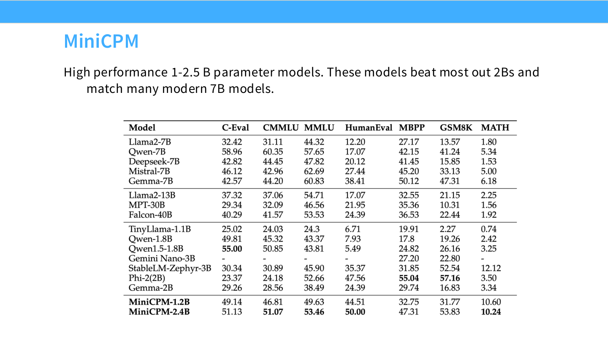

> **鍏抽敭瑙傚療**:
> - 娴呰壊绾夸唬琛ㄥ皬妯″瀷锛屾繁鑹茬嚎浠ｈ〃澶фā鍨?
> - **鏈€浼樺涔犵巼浣嶇疆淇濇寔涓嶅彉**锛堢害 $10^{-2}$锛?
> - 杩欒瘉鏄庝簡 渭P 鐨勬湁鏁堟€э細姝ｇ‘鐨勫垵濮嬪寲鍜屾瘡灞傚涔犵巼缂╂斁鍙互閬垮厤鍙嶅璋冨弬

---

## 4. WSD 瀛︿範鐜囪皟搴?(Warm-up Stable Decay)

### 4.1 闂锛欳osine 璋冨害鐨勫眬闄?

浼犵粺鐨?**Cosine 瀛︿範鐜囪皟搴?* 鏈変竴涓棶棰橈細涓嶅悓鐨勬暟鎹噺鐩爣闇€瑕佷笉鍚岀殑 Cosine 鏇茬嚎銆?

> **鏍稿績闂**: 濡傛灉鎴戞兂鍋?Chinchilla 椋庢牸鐨勬暟鎹缉鏀惧垎鏋愶紝闇€瑕佽缁冨涓笉鍚屾暟鎹噺鐨勬ā鍨嬨€備娇鐢?Cosine 鏃讹紝**鏃犳硶澶嶇敤**涓棿妫€鏌ョ偣锛屽洜涓烘瘡涓暟鎹噺鐩爣瀵瑰簲鐨?Cosine 鏇茬嚎涓嶅悓銆傝繖瀵艰嚧闇€瑕?$O(n^2)$ 娆¤缁冦€?

### 4.2 WSD 鐨勮В鍐虫柟妗?

**WSD (Warm-up Stable Decay)** 鏄竴绉嶆褰㈠涔犵巼璋冨害锛?
1. **Warm-up Phase**: 涓?Cosine 鐩稿悓鐨勯鐑樁娈?
2. **Stable Phase**: 瀛︿範鐜囦繚鎸?*鎭掑畾**锛堝钩鍙版湡锛?
3. **Decay Phase**: 蹇€熷喎鍗村埌鏈€灏忓涔犵巼

> **浼樺娍**: Stable Phase 鏄钩鐨勶紒杩欐剰鍛崇潃浣犲彲浠ュ湪涓€娆¤缁冭繍琛屼腑锛岄€氳繃鍦ㄤ笉鍚屾椂闂寸偣"鍥為€€鍒?Stable Phase 鐨勬煇涓鏌ョ偣 + Decay"鏉ユā鎷熶笉鍚屾暟鎹噺鐨勮缁冪粨鏋溿€?
>
> **澶嶆潅搴?*: $O(n)$锛岃€岄潪 Cosine 鐨?$O(n^2)$

### 4.3 WSD vs Cosine 鐨?Loss 鏇茬嚎

> **鏇茬嚎瑙ｈ**:
> - **榛勮壊 (Cosine)**: 骞虫粦涓嬮檷
> - **娣辫壊 (WSD)**: 鍦?Stable Phase 骞崇ǔ涓嬮檷锛岃繘鍏?Decay Phase 鍚?*Loss 鎬ュ墽涓嬮檷**
> - **缁撹**: 鍦ㄦ瘡涓?Token 鏁伴噺鐐逛笂锛學SD 鐨勬渶缁堟€ц兘涓?Cosine**鐩稿綋鐢氳嚦鏇村ソ**

**鍏充簬 Cooldown 鐨勯噸瑕佹€?*: 璁插笀寮鸿皟锛孌ecay Phase 鏄幏寰楀ぇ閮ㄥ垎 Loss 鏀剁泭鐨勫叧閿樁娈点€傚鏋滀笉杩涜 Cooldown锛孡oss 浼氶珮寰楀銆備紭鍖栧櫒鍜屽涔犵巼璁捐鐨勬牳蹇冨氨鏄湪"淇濇寔楂樺涔犵巼浠ヨ繙绂诲垵濮嬪寲鐐?鍜?鑹ソ琛板噺浠ュ帇浣?Loss"涔嬮棿鍙栧緱骞宠　銆?

### 4.4 MiniCPM 鐨?Chinchilla 澶嶇幇

鍊熷姪 WSD锛孧iniCPM 鍥㈤槦浠ユ瀬浣庣殑鎴愭湰瀹屾垚浜?Chinchilla 鍒嗘瀽锛圡ethod 1 鍜?Method 3锛夛細

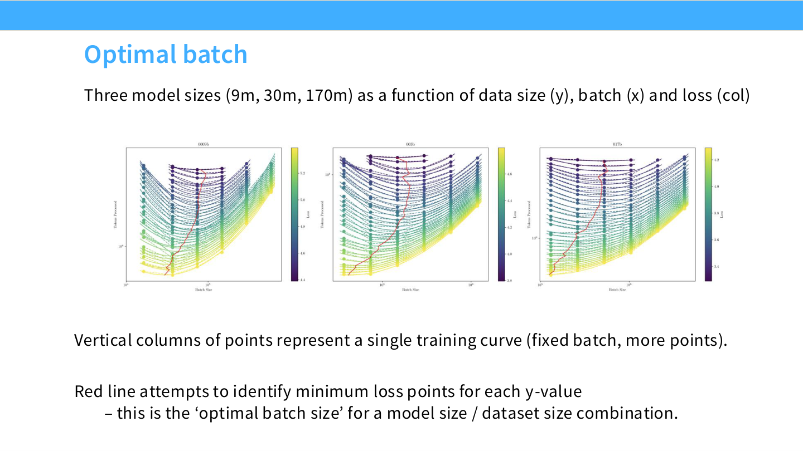

**鎯婁汉鍙戠幇**: MiniCPM 鎷熷悎鍑虹殑鏈€浼?Token/Parameter 姣旈珮杈?*192:1**锛岃繙瓒?Chinchilla 鐨?20:1锛?

> **璁插笀璇勪环**: 杩欎釜鏁板瓧闈炲父楂橈紝鎴戞病瑙佽繃鍏朵粬浜哄緱鍑鸿繃杩欎釜缁撹銆備絾杩欒嚦灏戣鏄庯紝**20:1 鍙槸涓€涓捣鐐?*锛屾垜浠畬鍏ㄥ彲浠ュぇ骞呭鍔犳暟鎹噺銆?

---

## 5. 妗堜緥鐮旂┒锛欴eepSeek LLM

### 5.1 姒傝

DeepSeek LLM (7B & 67B) 鏄?2024 骞村垵鍙戝竷鐨勬ā鍨嬶紝鍦ㄥ綋鏃剁殑寮€婧愭ā鍨嬩腑琛ㄧ幇椤跺皷锛堝尮閰?Llama 2 鍜?Mistral锛夈€?

> **璁插笀璇勪环**: 濡傛灉浣犺杩?DeepSeek LLM 鐨勮鏂囷紝浣犱細鐭ラ亾杩欎簺浜烘槸**闈炲父涓ヨ們鐨勭瀛﹀**銆備粬浠仛浜嗗ぇ閲忎粩缁嗙殑 Scaling 娑堣瀺瀹為獙锛岃繖绉嶆€佸害鏄墍鏈夋垚鍔熻繘琛?Scaling 鐨勫洟闃熺殑鍏卞悓鐗圭偣銆?

### 5.2 DeepSeek 鐨勪笉鍚岀瓥鐣ワ細涓嶄娇鐢?渭P

涓?Cerebras-GPT 鍜?MiniCPM 涓嶅悓锛孌eepSeek **涓嶄娇鐢?渭P**锛岃€屾槸鐩存帴閫氳繃 Scaling Law 鎷熷悎鏉ョ‘瀹氭渶浼?Batch Size 鍜?Learning Rate銆?

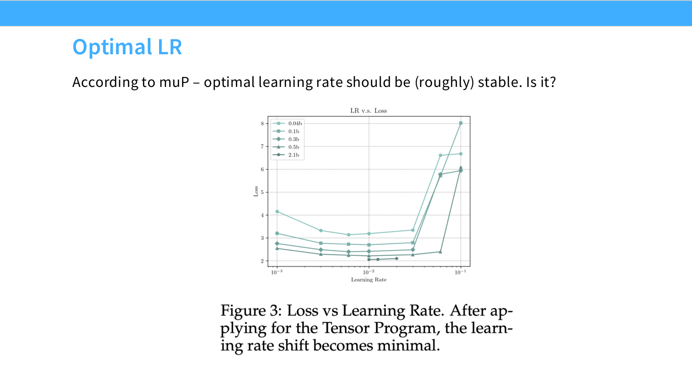

**鏂规硶**:
1. 鍦ㄤ袱涓浉瀵瑰皬瑙勬ā鐨勬ā鍨嬩笂杩涜 Batch Size 鍜?Learning Rate 鐨勭綉鏍兼悳绱?
2. 璁板綍姣忎釜瑙勬ā涓嬬殑鏈€浼樺€?
3. 鍦ㄤ笉鍚?FLOP 瑙勬ā涓婇噸澶嶆杩囩▼
4. 鎷熷悎 Scaling Law 鏉ュ鎺ㄥぇ妯″瀷鐨勬渶浼樺€?

### 5.3 Batch Size 鍜?Learning Rate 鐨?Scaling

> **璁插笀瑙傜偣**: Batch Size 鐨?Scaling Law 鐪嬭捣鏉ユ瘮杈冩竻鏅帮紙宸﹀浘锛夈€侺earning Rate 鐨勬嫙鍚堬紙鍙冲浘锛?鐪嬭捣鏉ユ湁鐐瑰彲鐤?锛屾垜鐢氳嚦瑙夊緱鐢讳竴鏉℃按骞崇嚎鍙兘涔熻寰楄繃鍘汇€備絾浠栦滑纭疄杩欐牱鍋氫簡骞跺彇寰椾簡鎴愬姛銆?
>
> **涓€涓箍娉涚殑鏁欒**: Chinchilla 椋庢牸鐨?IsoFLOP 鍒嗘瀽閫氬父鎷熷悎寰楅潪甯告紓浜紝鑰岃秴鍙傛暟鐨?Scaling Law 寰€寰€鐪嬭捣鏉ユ洿鍢堟潅銆?

### 5.4 DeepSeek 鐨?WSD 瀹炵幇

DeepSeek 鍚屾牱閲囩敤浜?WSD 璋冨害锛屼絾鏈変竴鐐逛笉鍚岋細浠栦滑浣跨敤浜?*涓ら樁娈?Decay**锛堢害 10% + 10%锛夈€?

> 鐮旂┒琛ㄦ槑锛孌ecay 闃舵鍗犳€昏绠楅绠楃殑姣斾緥锛堝 20%锛夊苟涓嶆晱鎰熴€?

### 5.5 DeepSeek 鐨?Chinchilla 澶嶇幇

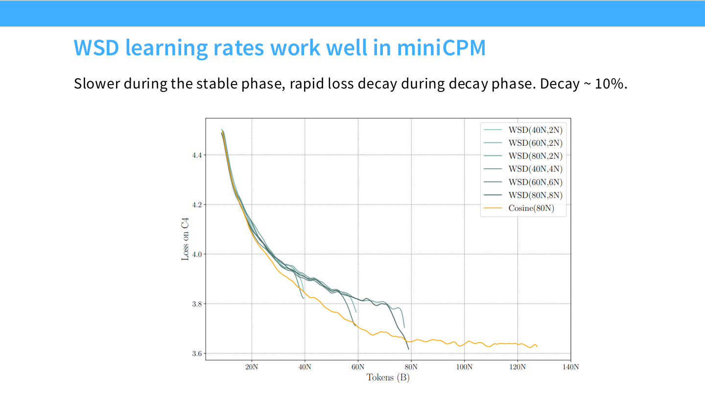

DeepSeek 浠庨浂寮€濮嬮噸鏂拌繘琛屼簡 Chinchilla 鍒嗘瀽锛岃€屼笉鏄畝鍗曞湴"Cargo Cult" 20:1 鐨勬瘮渚嬨€?

> **璁插笀璇勪环**: 鎴戣寰楄繖闈炲父濂姐€備粬浠湰鍙互鐩存帴閲囩敤 Chinchilla 鐨勭粨璁猴紝浣嗕粬浠€夋嫨鑷繁楠岃瘉銆傝繖绉嶄弗璋ㄧ殑鎬佸害鍊煎緱瀛︿範銆?

### 5.6 棰勬祴楠岃瘉

鏈€缁堬紝DeepSeek 鍦?7B 鍜?67B 妯″瀷涓婇獙璇佷簡浠栦滑鐨?Scaling Law 棰勬祴锛?

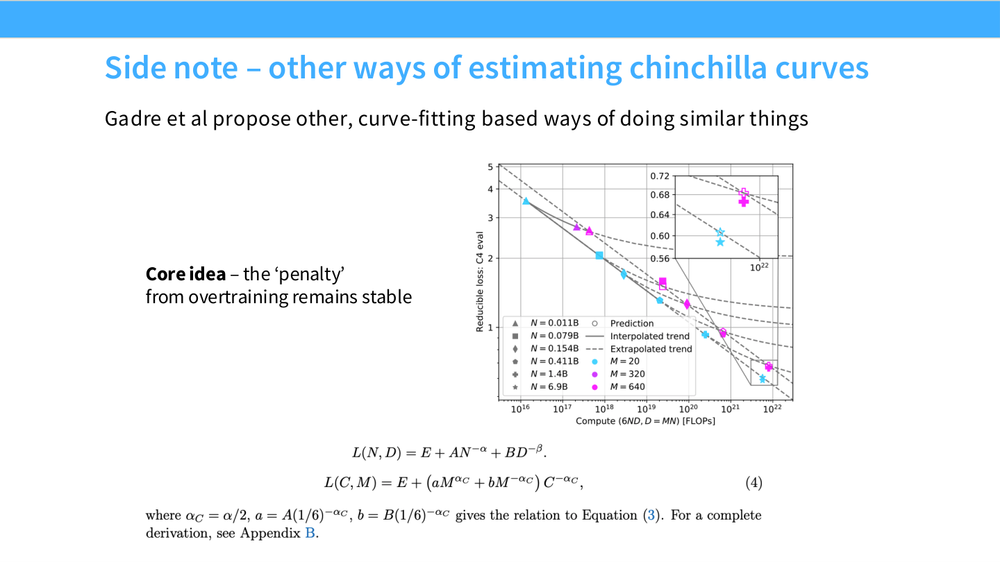

> **鍏抽敭鐐?*: 浠栦滑鑳藉浠?$10^{20}$ FLOP 鐨勫皬瑙勬ā瀹為獙澶栨帹鍒?$10^{24}$ FLOP 鐨勫ぇ瑙勬ā璁粌锛屽苟**鍑嗙‘棰勬祴鏈€缁?Loss**銆傝繖鏄?Scaling Law 鐨勬牳蹇冧环鍊笺€?

---

## 6. 鏂拌繎妯″瀷鐨?Scaling 鐮旂┒绠€杩?

### 6.1 Llama 3

Llama 3 閲嶆柊杩涜浜?IsoFLOP 鍒嗘瀽锛屽緱鍑虹殑鏈€浼樻瘮渚嬬害涓?**39:1**锛堥珮浜?Chinchilla 鐨?20:1锛夈€?

姝ゅ锛孡lama 3 灏濊瘯灏?Perplexity 涓庝笅娓镐换鍔＄殑鍑嗙‘鐜囧叧鑱旇捣鏉ワ紙閫氳繃鎷熷悎 Sigmoid 鏇茬嚎锛夈€?

### 6.2 Hunyuan Large (MoE)

鑵捐鐨?Hunyuan Large 鏄竴涓?MoE 妯″瀷銆備粬浠拡瀵?MoE 鏋舵瀯閲嶆柊杩涜浜?Chinchilla 鍒嗘瀽锛屽緱鍑虹殑姣斾緥绾︿负 **96:1**锛圱oken / Active Parameter锛夈€?

> **澶囨敞**: MoE 鐨勬瘮渚嬩笌 Dense 妯″瀷涓嶅悓锛岃繖寰堟甯搞€?

### 6.3 MiniMax-01 (绾挎€ф敞鎰忓姏)

MiniMax-01 鏄竴涓贩鍚堟灦鏋勶紙Softmax Attention + Linear Attention锛夈€備粬浠殑 Scaling 鐮旂┒鏃ㄥ湪璇佹槑 Linear Attention 鐨勬€ц兘涓?Softmax Attention **鐩稿綋**銆?

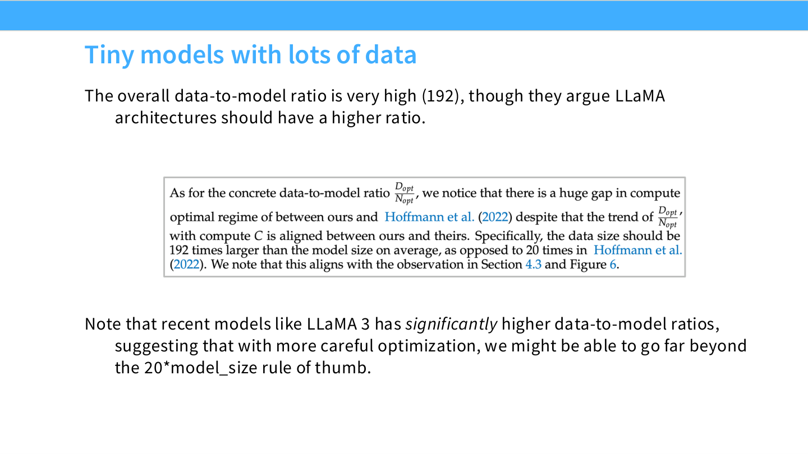

> **璇勪环**: 杩欑鐢?Scaling Law 鏉ラ獙璇佹灦鏋勯€夋嫨鐨勫仛娉曪紝鍦?Mamba 绛夎鏂囦腑涔熷緢甯歌锛屼絾 MiniMax 鏄皯鏁板湪澶ц妯＄敓浜фā鍨嬩笂杩欐牱鍋氱殑銆?

### 6.4 妗堜緥鐮旂┒鎬荤粨

| 妯″瀷 | 渭P | WSD | Chinchilla 澶嶇幇 | 鍏朵粬 |
|---|---|---|---|---|
| Cerebras-GPT | 鉁?| - | - | 棣栨鍏紑楠岃瘉 渭P |
| MiniCPM | 鉁?| 鉁?| 鉁?(192:1) | 鏅強 WSD |
| DeepSeek | 鉁?| 鉁?| 鉁?| 鐩存帴鎷熷悎 LR/BS Scaling |
| Llama 3 | ? | ? | 鉁?(39:1) | Loss 鈫?Accuracy 鏄犲皠 |
| Hunyuan | ? | ? | 鉁?(96:1 for MoE) | MoE 鐗瑰畾鍒嗘瀽 |
| MiniMax | ? | ? | 鉁?(Method 1) | 楠岃瘉绾挎€ф敞鎰忓姏 |

---

## 7. 渭P 鐨勬暟瀛︽帹瀵?

### 7.1 鏍稿績鎬濇兂

> **鐩爣**: 闅忕潃妯″瀷瀹藉害 ($n$) 澧炲姞锛屾垜浠笇鏈涙煇浜涢噺淇濇寔 $\Theta(1)$ 鐨勯樁鏁帮紙涓嶅彂鏁ｄ篃涓嶆秷澶憋級銆?

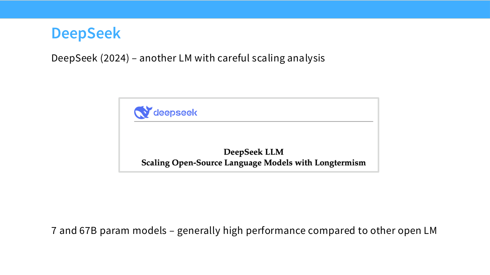

渭P 鍩轰簬涓や釜**璋辨潯浠?(Spectral Conditions)**锛?

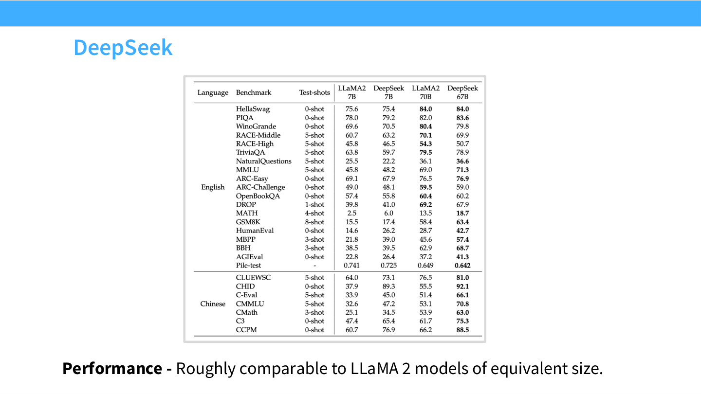

**鏉′欢 A1 (婵€娲诲€肩ǔ瀹氭€?**: 鍦ㄥ垵濮嬪寲鏃讹紝姣忎釜婵€娲诲€煎潗鏍囧簲涓?$\Theta(1)$銆?
$$ \|h^{(l)}\|_2 = \Theta(\sqrt{n_l}) $$
锛堣寖鏁伴殢缁村害澧為暱锛屽洜涓哄潗鏍囦箣闂寸嫭绔嬶級

**鏉′欢 A2 (鏇存柊閲忕ǔ瀹氭€?**: 缁忚繃涓€娆℃搴︽杩涘悗锛屾縺娲诲€肩殑鍙樺寲搴斾负 $\Theta(1)$銆?
$$ \|\Delta h^{(l)}\|_2 = \Theta(\sqrt{n_l}) $$

### 7.2 鎺ㄥ鍒濆鍖栬鍒?(Condition A1)

鑰冭檻涓€涓?*娣卞害绾挎€х綉缁?* (Deep Linear Network)锛?
$$ h^{(l)} = W^{(l)} h^{(l-1)} $$
鏃犻潪绾挎€э紝鍙负绠€鍖栨帹瀵笺€?

**鍒濆鍖?*: $W^{(l)} \sim \mathcal{N}(0, \sigma_l^2)$

**闅忔満鐭╅樀鐞嗚**: 褰?$n_l, n_{l-1} \to \infty$ 鏃讹紝楂樻柉鐭╅樀鐨勭畻瀛愯寖鏁版弧瓒筹細
$$ \|W^{(l)}\|_{op} \approx \sigma_l \cdot (\sqrt{n_l} + \sqrt{n_{l-1}}) $$

**褰掔撼璇佹槑**:
- 鍋囪 $\|h^{(l-1)}\|_2 = \sqrt{n_{l-1}}$
- 閫夊彇 $\sigma_l = \frac{1}{\sqrt{n_{l-1}}} \cdot \min\left(1, \sqrt{\frac{n_{l-1}}{n_l}}\right)$
- 浠ｅ叆鍙緱 $\|h^{(l)}\|_2 = \sqrt{n_l}$

**缁撹**: 鍒濆鍖栨爣鍑嗗樊搴旂害涓?*$1/\sqrt{\text{fan\_in}}$**锛堜笌 Kaiming 鍒濆鍖栦竴鑷达級銆?

### 7.3 鎺ㄥ瀛︿範鐜囪鍒?(Condition A2)

鐜板湪鑰冭檻涓€娆℃搴︽洿鏂般€傚浜?SGD锛?
$$ \Delta W^{(l)} = -\eta \cdot \nabla_W \mathcal{L} = -\eta \cdot \frac{\partial \mathcal{L}}{\partial h^{(l)}} (h^{(l-1)})^T $$

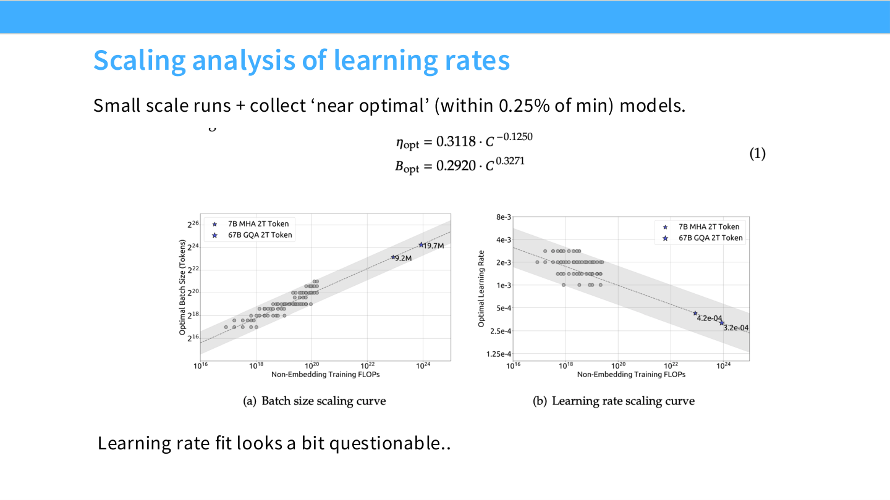

**鍏抽敭鍋囪**: 濡傛灉瀛︿範杩囩▼鏄壇濂界殑锛岄偅涔堜竴娆℃搴︽杩涘悗 Loss 鐨勫彉鍖栦篃搴斾负 $\Theta(1)$銆?
$$ \Delta \mathcal{L} = \Theta(1) $$

閫氳繃閾惧紡娉曞垯鍜岃寖鏁板垎鏋愶紝鍙互鎺ㄥ鍑猴細
$$ \eta_{SGD} = \frac{n_l}{n_{l-1}} \quad (\text{fan\_out / fan\_in}) $$

浣嗗浜?**Adam** 浼樺寲鍣紝鐢变簬鍏跺姊害杩涜褰掍竴鍖栵紝鎺ㄥ缁撴灉涓嶅悓锛?
$$ \eta_{Adam} = \frac{1}{n_{l-1}} \quad (\text{1 / fan\_in}) $$

### 7.4 渭P 涓?SP 瀵规瘮

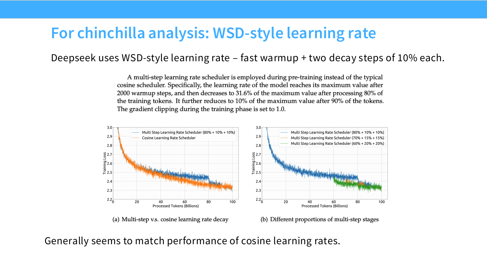

| | **鏍囧噯鍙傛暟鍖?(SP)**|**渭P** |
|---|---|---|
| **鍒濆鍖?* | $1/\sqrt{\text{fan\_in}}$ | $1/\sqrt{\text{fan\_in}}$ (鍩烘湰鐩稿悓) |
| **瀛︿範鐜?(SGD)** | 鍏ㄥ眬甯告暟 | $\text{fan\_out}/\text{fan\_in}$ (鍩烘湰涓嶅彉) |
| **瀛︿範鐜?(Adam)**| 鍏ㄥ眬甯告暟 | $1/\text{fan\_in}$ (**鍏抽敭鍖哄埆**) |

> **鏍稿績宸紓**: 瀵逛簬 Adam锛屛糚 瑕佹眰**姣忓眰瀛︿範鐜囨寜瀹藉害缂╂斁**锛岃繖鏄渶澶х殑瀹為檯鍙樺寲銆?

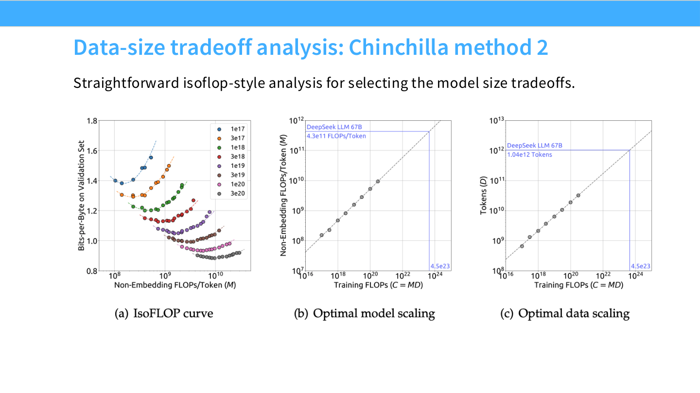

### 7.5 鐗╃悊瀛﹁瑙掞細閲嶆鍖?

> **璁插笀瑙傜偣**: 杩欑"鍦ㄥ彇鏋侀檺鏃朵繚鎸侀噺绾хǔ瀹?鐨勬€濇兂锛屼笌鐗╃悊瀛︿腑鐨?*閲嶆鍖?(Renormalization)** 闈炲父鐩镐技銆傝繖鏄竴涓湪娣卞害瀛︿範涓垚鍔熷簲鐢ㄧ墿鐞嗙洿瑙夌殑鏈夎叮妗堜緥銆?

---

## 8. 渭P 鐨勫疄璇侀獙璇?(Lingle 璁烘枃)

璁插笀浠嬬粛浜嗕竴绡囩嫭绔嬬爺绌惰€?Lingle 鐨勯鍗版湰锛?A Large-Scale Exploration of 渭-Transfer*銆傝璁烘枃閫氳繃澶ч噺娑堣瀺瀹為獙楠岃瘉浜?渭P 鐨勯瞾妫掓€с€?

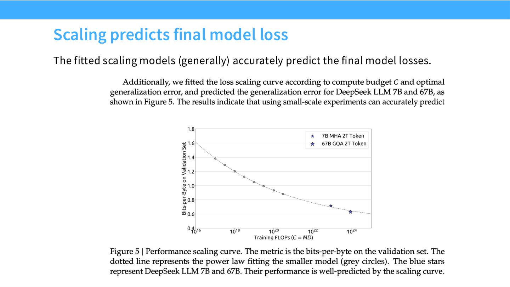

### 8.1 瀹為獙璁剧疆

- **鏋舵瀯**: 鏍囧噯 Transformer锛岃嚜鍥炲綊棰勮缁?
- **缂╂斁缁村害**: 浠呯缉鏀惧搴?(Width)锛屽浐瀹氭繁搴?
- **鐩爣**: 楠岃瘉鏈€浼樺涔犵巼鏄惁鍦ㄤ笉鍚屽搴︿笅淇濇寔绋冲畾

### 8.2 渭P 鏄惁鏈夋晥锛?

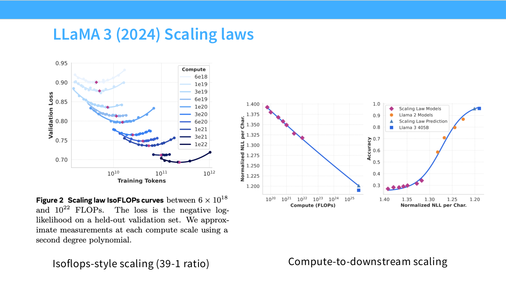

**缁撹**: 鏄殑锛佷粠瀹藉害 128 鍒?2048锛屾渶浼樺涔犵巼淇濇寔鍦ㄥ悓涓€浣嶇疆銆?

### 8.3 瀵规縺娲诲嚱鏁扮殑椴佹鎬?

- **SwiGLU**,**Squared ReLU**鍜屽熀绾?*ReLU**鐨勬渶浼樺涔犵巼**鐩稿悓**
- 渭P 瀵归潪绾挎€х被鍨?*椴佹**

### 8.4 瀵?Batch Size 鐨勯瞾妫掓€?

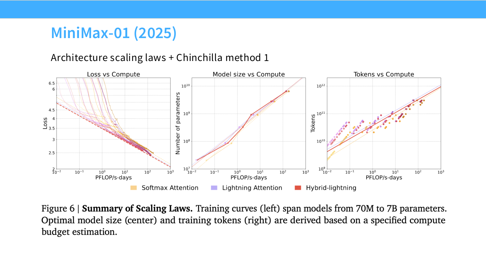

- Batch Size 鍙樺寲 4 鍊嶏紙涓婁笅锛夛紝鏈€浼樺涔犵巼**绋冲畾**
- 渭P 瀵?Batch Size 鍙樺寲**椴佹**

### 8.5 瀵瑰垵濮嬪寲鍙樹綋鐨勯瞾妫掓€?

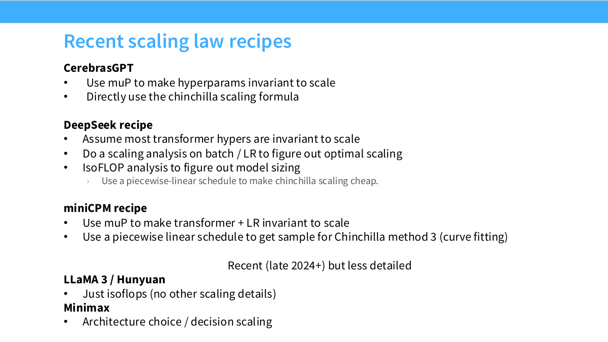

- Query 鐭╅樀鍒濆鍖栦负 0锛堜娇鍒濆娉ㄦ剰鍔涘潎鍖€锛?
- Unembedding 灞備娇鐢?SP 鎴?渭P 缂╂斁
- 浠ヤ笂鍙樹綋**涓嶅奖鍝?*鏈€浼樺涔犵巼

### 8.6 渭P 鐨勫眬闄愭€?

**Learnable Gains (RMSNorm 鐨勫彲瀛︿範澧炵泭)**:
- 娣诲姞鍙涔犲鐩婁細**鐮村潖** 渭P
- 闇€瑕佺Щ闄?Bias/Gain 鎵嶈兘浣?渭P 姝ｅ父宸ヤ綔

**闈炴爣鍑嗕紭鍖栧櫒 (Lion)**:

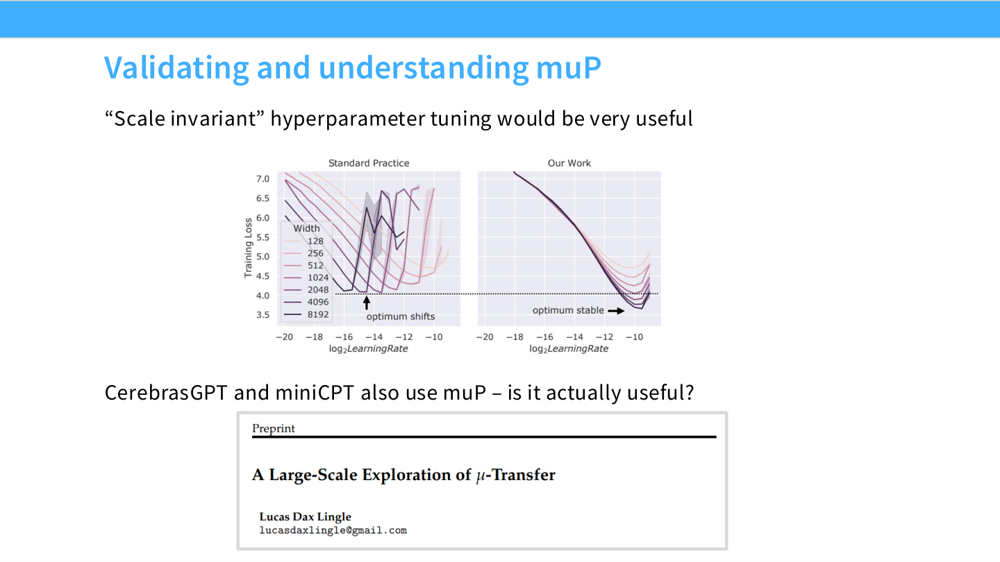

- Lion 浼樺寲鍣紙绗﹀彿姊害锛変細**鐮村潖** 渭P
- 杩欐槸棰勬湡鐨勶紝鍥犱负 渭P 鏄负 Adam/SGD 璁捐鐨?

**寮烘潈閲嶈“鍑?(Weight Decay)**:

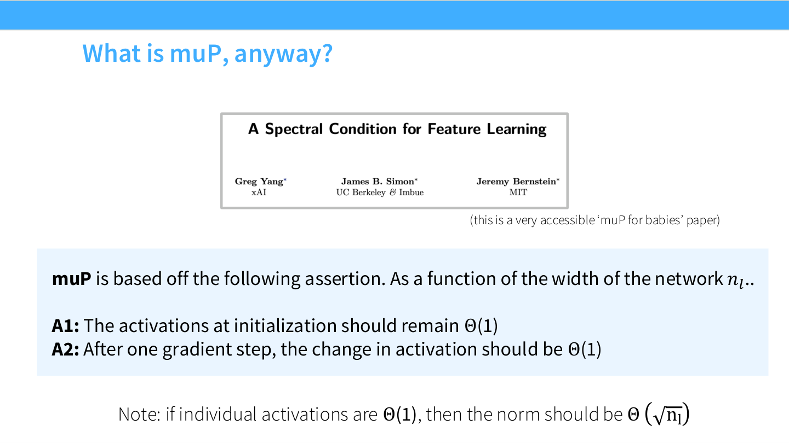

- 闈炲父寮虹殑鏉冮噸琛板噺浼氬鑷?渭P **澶辨晥**
- 杩欐槸灏戞暟鍑犱釜鏄捐憲鐨勫け璐ユ渚嬩箣涓€

### 8.7 澶ц妯￠獙璇?(10B 鍙傛暟)

- 鍦ㄥ皬涓妯′笂杩涜瀹屾暣鐮旂┒
- 閫夊畾鏈€浼樺涔犵巼鍚庯紝鐩存帴鎵╁睍鍒?10B 鍙傛暟
- **瀛︿範鐜囦繚鎸佹渶浼?*锛岃繖鏄竴涓緢濂界殑楠岃瘉

> **澶囨敞**: Meta 鐨?Llama-1 浣跨敤浜?渭P锛岃繖涔熸槸涓€涓棿鎺ラ獙璇併€備絾鐩墠 渭P 骞堕潪琛屼笟鍏辫瘑銆?

---

## 9. 鎬荤粨涓庢渶浣冲疄璺?

### 9.1 Scaling 瀹炴垬涓殑甯歌绛栫暐

1. **瓒呭弬鏁伴€夋嫨**:
   - 浣跨敤 Scaling Law 鎷熷悎 Batch Size 鍜?Learning Rate (DeepSeek 椋庢牸)
   - 鎴栦娇鐢?渭P 淇濇寔瓒呭弬鏁拌法瑙勬ā绋冲畾 (Cerebras/MiniCPM 椋庢牸)

2. **瀛︿範鐜囪皟搴?*:
   - 鑰冭檻浣跨敤 **WSD (Warm-up Stable Decay)** 浠ｆ浛 Cosine
   - WSD 鎬ц兘鐩稿綋锛屼絾鍏佽浠?$O(n)$ 鎴愭湰杩涜鏁版嵁缂╂斁鍒嗘瀽

3. **Chinchilla 姣斾緥**:
   - **20:1 鍙槸璧风偣**锛岀幇浠ｆā鍨嬮€氬父浣跨敤鏇撮珮鐨?Token/Parameter 姣?
   - Llama 3: 39:1, MiniCPM: 192:1, Hunyuan (MoE): 96:1
   - 搴旀牴鎹疄闄呮儏鍐佃繘琛?IsoFLOP 鍒嗘瀽

4. **渭P 鐨勪娇鐢ㄥ缓璁?*:
   - 瀵?Adam 浼樺寲鍣紝瀹炵幇姣忓眰瀛︿範鐜囩缉鏀?($1/\text{fan\_in}$)
   - 绉婚櫎 RMSNorm 鐨勫彲瀛︿範 Gain
   - 閬垮厤浣跨敤闈炴爣鍑嗕紭鍖栧櫒 (濡?Lion)

### 9.2 璇惧爞闂瓟绮鹃€?

**Q: 渭P 鐨勪富瑕佸彉鍖栨槸鍒濆鍖栧悧锛?*
> A: 鏈変袱涓彉鍖栵細鍒濆鍖栧拰瀛︿範鐜囥€備絾濡傛灉浣犲凡缁忓湪鐢?Kaiming 鍒濆鍖?($1/\sqrt{\text{fan\_in}}$)锛屽垵濮嬪寲宸茬粡姝ｇ‘浜嗐€?*鏈€澶х殑瀹為檯鍙樺寲鏄瘡灞傚涔犵巼鐨勭缉鏀?*銆?

**Q: DeepSeek 浣跨敤鍏ㄥ眬瀛︿範鐜囷紝鏄惁鎰忓懗鐫€浠栦滑鐨勬洿鏂颁笉鏄?$\Theta(1)$锛?*
> A: 鏄殑銆傚鏋滀綘鐪嬩粬浠殑 Scaling Law 鎷熷悎鍥撅紝瀛︿範鐜囩‘瀹為殢瑙勬ā涓嬮檷銆傝繖鏄负浜嗚ˉ鍋挎洿澶фā鍨嬩骇鐢熺殑鏇村ぇ鏇存柊銆偽糚 鍙槸璁╄繖绉嶈皟鏁村彉寰椾笉蹇呰锛屼絾**鍗充娇涓嶇敤 渭P锛屽彧瑕佷綘璋冨浜嗗涔犵巼锛屼篃鑳借缁冨ソ妯″瀷**銆?

**Q: 鏋舵瀯鍋囪鏄粈涔堬紵鑳界敤浜?Transformer 鍚楋紵**
> A: 鎺ㄥ鏄熀浜庢繁搴︾嚎鎬х綉缁滅殑锛岃繖鏄渶绠€鍖栫殑妯″瀷銆備絾鏈夎鏂囪璁轰簡濡備綍灏嗚繖浜涜鐐规墿灞曞埌闈炵嚎鎬с€丄ttention 灞傚拰 GLU 绛夈€傛瘡涓灦鏋勭粍浠堕兘闇€瑕佷粩缁嗗垎鏋愩€?

---

## 10. 鎷撳睍闃呰

寤鸿鎸変互涓嬮『搴忔繁鍏ュ涔狅細
1. **WSD 璋冨害**: MiniCPM 璁烘枃鐩稿叧绔犺妭
2. **渭P 鍘熺悊**: Yang et al. "Tensor Programs V: Tuning Large Neural Networks via Zero-Shot Hyperparameter Transfer"
3. **渭P 瀹炶瘉**: Lingle "A Large-Scale Exploration of 渭-Transfer"
4. **瀹炵敤鎸囧崡**: "A Practitioner's Guide to 渭P" (鍗氬)

