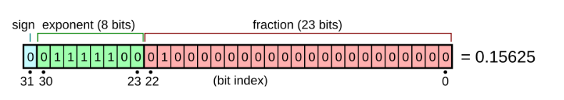
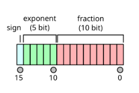
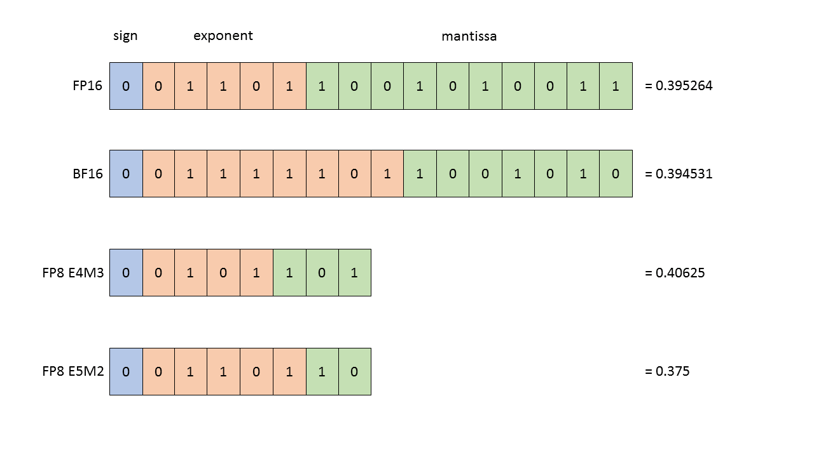
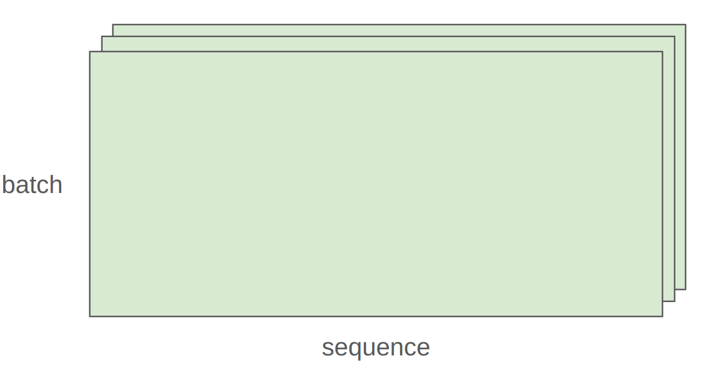

# CS336 Pytorch手把手搭建LLM - 讲座2笔记

## 概览:从理论到实践,从资源到代码

在上一讲中,我们探讨了从零开始构建语言模型的意义和动机,并介绍了分词(Tokenization)的概念. 本次讲座的核心目标是**动手搭建一个模型**,我们将深入PyTorch的核心组件,包括张量(Tensors)、模型(Models)、优化器(Optimizers)和训练循环(Training Loop).

本次课程的独特之处在于,我们将始终贯穿着**效率**的视角,特别是如何精确地核算我们所使用的计算资源——**内存(Memory)****和****算力(Compute)**.

### 核心思维:餐巾纸算术 (Napkin Math)

在构建大规模模型时,一个核心技能是在动手之前进行快速的“餐巾纸算术”,以估算资源消耗. 这不仅仅是学术训练,它直接关系到真金白银的成本.

例如,回答这样一个问题:“在1024张H100上,用15万亿(15T)个token训练一个700亿(70B)参数的稠密Transformer模型需要多长时间？”

其估算逻辑如下:

1. **计算总浮点运算次数 (FLOPS)**: 训练一个Transformer模型所需的总计算量,有一个广为接受的经验法则,即 `6 * 模型参数量 * 训练Token数`. 关于这个“6”是怎么来的,我们将在这节课中揭晓.
2. **计算硬件的总算力**:

   - 查询H100的理论峰值算力.
   - 乘以一个关键系数——**MFU (模型FLOPS利用率)**. 这是一个衡量你的代码实际利用硬件理论性能的效率指标,通常设为50%(0.5)就算不错的水平.
   - 再乘以GPU数量(1024)和每天的秒数.

3. **计算所需天数**: `总FLOPS / 每天可完成的FLOPS`. 通过这个简单的计算,我们可以得出大约需要144天.

这种估算能力,能让你在项目初期就对成本和周期有清晰的认知,是专业工程师的必备素养.

### Q: 使用AdamW,在H100上训练的最大模型是多大,如果不采取任何的优化手段

A:H100有100GB的HBM,参数,梯度和优化器的每个参数需要16Byte,参数量=总显存量/参数所需字节数

80*1024*1024/16≈40B.这个估算非常粗略,因为没考虑激活值,激活值取决于Batchsize和Sequence Length

> 这是绝大多数人都不习惯做的事情,大多数人就是训练一个模型,然后就看到结果了. 但记住,效率是关键

## 一、 内存核算 (Memory Accounting)

深度学习中的一切——参数、梯度、优化器状态、数据、激活值——都存储在一种叫做[张量 (Tensors)](./Lecture2-PyTorch-Tensors.md)的数据结构中. 因此,理解内存占用的第一步,就是理解一个张量占多少内存.

### 1.1 核心构建块:张量与浮点数

张量的内存占用由两个因素决定:元素的数量和每个元素的数据类型. 在深度学习中,最核心的数据类型是[浮点数 (Floating-Point Numbers)](./Lecture2-Floating-Point-Representations.md). 不同的浮点数格式在精度和内存占用上有所不同,直接影响模型的训练稳定性和效率.

```python
import torch
import torch.nn as nn
import math

# --- 1. 常规创建方法 ---

# 从 Python 列表直接创建
tensor_from_data = torch.tensor([[1., 2.], [3., 4.]])

# 创建指定形状的全0张量
zeros_tensor = torch.zeros(3, 4)

# 创建指定形状的、服从标准正态分布的随机张量
randn_tensor = torch.randn(3, 4)

# 创建一个未初始化的张量 
empty_tensor = torch.empty(3, 4)


# --- 2. 特殊初始化方法 (通常在 nn.Module 内部对参数使用) ---

# 准备一个线性层的权重张量用于演示
weight = torch.empty(128, 512)

# 方法一:Xavier (Glorot) 初始化 
# PyTorch 提供了两种实现:
# a) 均匀分布版本
nn.init.xavier_uniform_(weight)
# b) 正态分布版本
nn.init.xavier_normal_(weight)

# 方法二:截断正态分布 (Truncated Normal) 初始化 
# 从正态分布 N(0, 0.02^2) 中采样,但丢弃所有在 [-0.04, 0.04] 之外的值
nn.init.trunc_normal_(weight, std=0.02, a=-0.04, b=0.04)

# 方法三:手动实现讲座中描述的方差缩放原则 
# 这有助于深刻理解其背后原理
input_features = 512
manual_scaled_weight = torch.randn(128, input_features) / math.sqrt(input_features)
```

例如,一个`torch.float32`类型的 `4x8` 矩阵,包含32个元素. 每个`float32`元素占用4个字节(32位),因此总内存为 `32 * 4 = 128` 字节. 对于真实的大模型,比如GPT-3中的一个FFN(前馈网络)权重矩阵,其尺寸可能达到 `2048 x 8192`,仅这一个矩阵就需要2.3GB的`float32`内存.

#### Float32 全精度数据格式

当然这个全精度的表达也得分人,如果你和搞科学计算的人交流他们会笑话你,因为他们会使用float64,甚至更高. 但是如果你和搞机器学习的人这么说,那他会表示:我不能同意更多

> 是的,深度学习就是这么不拘小节(sloppy like that)



#### Float16 半精度数据格式



能减少一半的内存用量,知识动态范围不太理想

如果你想用fp16表示1e-8的时候,它会变成0,因此float16不适合表示非常小的数字,也不适合表示非常大的数字

```python
import torch

# --- 示例1: 极小数字导致的下溢 (Underflow) ---
# 讲座中提到,像 1e-8 这样的数在 float16 中会因下溢归零 [cite: 67]. 
small_number = 1e-8
tensor_fp16_small = torch.tensor(small_number, dtype=torch.float16)
# 结果: tensor(0., dtype=torch.float16) --> 值因下溢而丢失


# --- 示例2: 极大数字导致的溢出 (Overflow) ---
# float16能表示的最大数约为 65504,更大的数会溢出为无穷大. 
large_number = 70000.0
tensor_fp16_large = torch.tensor(large_number, dtype=torch.float16)
# 结果: tensor(inf, dtype=torch.float16) --> 值因溢出变成无穷大


# --- 对比: Bfloat16 的表现 ---
# 作为对比,bfloat16 拥有更大的动态范围,可以正确处理这些数值 [cite: 72, 74]. 
tensor_bf16_small = torch.tensor(small_number, dtype=torch.bfloat16)
# 结果: tensor(9.9141e-09, dtype=torch.bfloat16) --> 成功表示,未归零
```

#### BFloat16

在深度学习中我们实际上更看重动态范围而不是小数部分的精度,因此2018年提出了BF16,给指数部分分配更多的位置,它具有FP16的内存占用量,却有FP32的动态范围. 这也是用的最多的,但是问题在于对于储存优化器状态和参数,仍然需要FP32


#### BF8

2022年Nvidia开发了它

[https://docs.nvidia.com/deeplearning/transformer-engine/user-guide/examples/fp8_primer.html](https://docs.nvidia.com/deeplearning/transformer-engine/user-guide/examples/fp8_primer.html)

[FP8 FORMATS FOR DEEP LEARNING](https://arxiv.org/pdf/2209.05433)




通常情况下,训练的时候会用FP32,但它需要更多的内存

用FP8或者BF16可能会出现一些不稳定的情况(总之你不会想用FP16的)

可以将BF16看作是临时性的东西,取出参数转化为BF16然后继续向前运行,但哪些需要长时间累积的东西希望有更高的精度

[详解混合精度训练](./Lecture2-%E6%B7%B7%E5%90%88%E7%B2%BE%E5%BA%A6%E8%AE%AD%E7%BB%83.md)

### 1.2 硬件上的内存:CPU与GPU

默认情况下,PyTorch的张量创建在CPU的内存中. 为了利用GPU进行高速并行计算,你必须显式地将数据从CPU内存转移到GPU的高带宽内存(HBM)中.

```python
# 数据从CPU转移到GPU
x_cpu = torch.randn(32, 32)
x_gpu = x_cpu.to('cuda')

# 直接在GPU上创建
y_gpu = torch.randn(32, 32, device='cuda')
```

这个数据转移过程本身是有开销的. 在编写代码时,必须时刻清楚你的每个张量“居住”在哪里,这是性能优化的关键.

### 1.3 Tensor在GPU上是什么

张量是一个数学对象. 在内存中Tensor实际上看起来像是一个长数组,Tensor本身拥有的是元数据(Meta Data),可以理解为实际数字所在的位置坐标,是两个数字(Stride0,Stride1)


```python
x = torch.tensor([
    [0., 1, 2, 3],
    [4, 5, 6, 7],
    [8, 9, 10, 11],
    [12, 13, 14, 15],
])
text("To go to the next row (dim 0), skip 4 elements in storage.")
assert x.stride(0) == 4
text("To go to the next column (dim 1), skip 1 element in storage.")
assert x.stride(1) == 1
text("To find an element:")
r, c = 1, 2
index = r * x.stride(0) + c * x.stride(1)  # @inspect index
assert index == 6
```

因此,可以让多个张量共享同一块存储空间,这非常有用,不需要到处去复制了

#### **不连续的Tensor**

一个“不连续的”(non-contiguous)Tensor指的是,**其元素在内存中的物理存储顺序,与按其维度(例如,逐行)进行逻辑遍历的顺序不一致**. 

为了理解这一点,我们需要知道 PyTorch 张量的一个核心设计:

一个张量对象包含两部分:一部分是描述其形状和步长(stride)的“元数据”,另一部分是实际存放所有元素的一维连续“存储空间”(Storage). 

- **连续的 (Contiguous) Tensor**: 当你按行遍历这个张量时,你在内存中也是在连续地移动. 讲座中将其比喻为“像幻灯片一样在存储空间中滑动”(like a just slide going through the this array in your storage) 1. 
- **不连续的 (Non-contiguous) Tensor**: 当你按行遍历这个张量时,为了找到下一个元素,程序需要在内存中“跳跃”. 讲座中将其形容为“在内存中跳来跳去”(skipping around) 2. 

### 一个具体的例子

最常见的产生不连续 Tensor 的操作就是

**转置(transpose)** 3

假设我们有一个 2x3 的连续张量 `x`:

```python
x = torch.tensor([[1, 2, 3], 
                  [4, 5, 6]])

```

它在内存中的存储是连续的,就是一个一维数组:`[1, 2, 3, 4, 5, 6]`. 

现在,我们对它进行转置,得到 3x2 的张量 `y`:

```Python
y = x.T 
# y 的内容是:
# tensor([[1, 4],
#         [2, 5],
#         [3, 6]])

```

**关键点**:`y` 和 `x` 共享同一个底层存储空间 `[1, 2, 3, 4, 5, 6]` 4. 

`y` 只是改变了元数据(形状和步长)来以不同的方式“看待”这块内存. 

现在 `y` 就是一个**不连续的 Tensor**. 因为:

- 当你尝试按行遍历 `y` 时,你期望的顺序是 `1, 4, 2, 5, 3, 6`. 
- 但这些数字在底层内存中的实际位置是 `1, (跳过2,3), 4, (跳过5,6)` 这样跳跃式的. 程序无法在内存中“连续滑动”来读取 `y` 的第一行. 

为什么这很重要？？

某些 PyTorch 操作,特别是`.view()`,要求张量必须是内存连续的 5. 如果你试图在一个不连续的张量(如上面的`y`)上调用 `.view()`,将会报错. 

**解决方案**:如果你需要对一个不连续的张量执行这类操作,你必须先调用 `.contiguous()` 方法 6. 

```Python
# y.view(6)  # 这会报错
y_contiguous = y.contiguous() # 这会创建一个新的、内存连续的拷贝
y_contiguous.view(6) # 现在可以正常工作了

```

`.contiguous()` 会重新分配一块内存,并将数据按照连续的顺序拷贝过去,从而生成一个全新的、连续的张量 7

## 二、 算力核算 (Compute Accounting)

### 2.1 基础运算与矩阵乘法 (MatMul)

张量运算构成了模型计算的核心. 虽然有各种逐元素操作(如`add`, `sin`),但深度学习中算力消耗的绝对大头是**矩阵乘法 (Matrix Multiplication, MatMul)**.

一个尺寸为 `(B, D)` 的矩阵与一个 `(D, K)` 的矩阵相乘,得到一个 `(B, K)` 的矩阵. 其所需的浮点运算次数 (FLOPS) 为:

`FLOPS = 2 * B * D * K`

这里的“2”代表了每次乘法和加法运算. 这个公式是进行算力估算的基础. 在语言模型中,操作通常是批处理的,例如一个张量的维度可能是 `(Batch, Sequence, Hidden)`,PyTorch能够优雅地处理这种批处理的矩阵乘法.

通常在做机器学习应用时,我们希望所有任务都在一个批次(batch)中完成. 在语言模型中,对于批次中的每个样本和序列,你都会想做点什么. 

而一般来说,计算过程中不会只有一个矩阵,而是会有一个张量. 通常维度是 batch,sequence... 等等想要处理的内容



```python
x = torch.ones(4, 8, 16, 32)
w = torch.ones(32, 2)
y = x @ w
assert y.size() == torch.Size([4, 8, 16, 2])
```

当拿到这个四维张量x和这个矩阵w时,实际上对于每个样本,每个batch,每个token,都在进行这两个乘法运算(意思是运行的最小单元就是 长度为32的一个元素乘上w这个矩阵)

### 2.2 模型FLOPS利用率 (MFU)

我们如何衡量代码的计算效率？**MFU (Model FLOPs Utilization)** 是一个关键指标.

`MFU = 实际达到的FLOPS每秒 / 硬件理论峰值FLOPS每秒`

- **实际达到的FLOPS每秒** = `模型一次前向+反向传播的理论计算量 / 实际耗时`
- **硬件理论峰值FLOPS每秒** = 从NVIDIA等厂商的规格表中查到的理论值(注意数据类型,如BF16或FP8).

通常,MFU能达到50%以上就被认为是比较高效的. 如果MFU过低(如低于10%),说明你的模型或代码没有充分利用硬件的矩阵运算能力,可能存在数据加载瓶颈、或者大量小型运算等问题.

### 2.3 `einops`:更优雅的张量操作

在处理高维张量时,使用索引(如`-1`, `-2`)来进行维度转换(如`transpose`)和矩阵乘法,非常容易出错且难以阅读. `einops`(爱因斯坦求和约定操作)库提供了一种更直观、更不易出错的方案. 它通过为维度命名的字符串来描述张量操作.

- **命名维度 (Named Dimensions)**:不再使用数字索引(如 dim=0, dim=-1),而是给每个维度一个有意义的名字(如 batch, seq, hidden). 
- **模式匹配 (Pattern Matching)**:通过输入和输出模式来描述张量形状的变化,非常直观. 

例如,要将两个形状为 `(batch, sequence, hidden)` 的张量进行内积,传统方法可能是:

`result = torch.matmul(x, y.transpose(-2, -1))`

使用 `einops`,代码变得清晰可读:

```python
from einops import rearrange, reduce, einsum

# b代表batch, s1/s2代表sequence, h代表hidden
# 'h'在输出中消失,意味着它被求和了
result = einsum(x, y, 'b s1 h, b s2 h -> b s1 s2')
```

虽然不是必须,但熟练使用`einops`可以极大提升代码的可读性和健壮性.

- **jaxtyping_basics (Jaxtyping 辅助说明)**

jaxtyping 是一个类型提示库,它允许你在 Python 类型注解中为张量维度添加名称. 这本身不执行任何操作,但它作为**文档**,能让你一眼看出张量的每个维度代表什么,与 einops 的命名维度理念相辅相成. 

Generated python

```python
import torch
from jaxtyping import Float # 需要安装 jaxtyping

# 旧方式:只看形状,不知道每个维度代表什么
x = torch.ones(2, 2, 1, 3)  # batch seq heads hidden
print(f"旧方式 x.shape: {x.shape}")

# 新方式 (Jaxtyping):在类型注解中命名维度,作为文档
x: Float[torch.Tensor, "batch seq heads hidden"] = torch.ones(2, 2, 1, 3)
print(f"Jaxtyping x.shape: {x.shape}")
```

**解释:** 虽然 jaxtyping 不会强制检查维度名称是否正确,但它极大地提高了代码的可读性和可维护性. 当你看 x 的定义时,你就知道 2 是 batch 大小,下一个 2 是 seq 长度,1 是 heads 数量,3 是 hidden 特征维度. 

### 2.4 NVIDIA计算卡与算力

训练 GPT-3 (2020) 消耗了 3.14e23 FLOPs.  [https://lambdalabs.com/blog/demystifying-gpt-3](https://www.google.com/url?sa=E&q=https://lambdalabs.com/blog/demystifying-gpt-3)  
训练 GPT-4 (2023) 预计将消耗 2e25 FLOPs.  [https://patmcguinness.substack.com/p/gpt-4-details-revealed](https://www.google.com/url?sa=E&q=https://patmcguinness.substack.com/p/gpt-4-details-revealed)


> **NVIDIA能够针对2:4稀疏化的矩阵提高一倍的算力,但在标准训练流程中,网络不会自然地产生这种特定的结构化稀疏矩阵**. 为了利用硬件(如NVIDIA Tensor Core)对这种稀疏性的加速能力,你需要**主动地采用结构化剪枝或稀疏性感知训练**等高级技术,来将模型的权重**塑造成**符合 2:4 这种特定模式的稀疏矩阵. 但这很难弄

## 三、 梯度、优化器与完整训练

在精确核算了模型前向传播的内存与算力后,我们现在进入训练过程的核心:如何根据误差更新模型的参数. 这涉及到梯度计算的成本、参数的巧妙初始化、优化器的选择及其内存开销,最终将所有部件组装成一个完整的训练流程. 

### 3.1 梯度计算的成本:著名的“6N”法则

我们已经知道前向传播的计算成本,那么反向传播呢？为了搞清楚这个问题,我们使用`lecture_02.py`中一个简单的**两层线性网络**作为案例来分析. 

线性模型本质上是一种映射,所以没啥复杂操作

模型计算流程如下: `x --w1--> h1 --w2--> h2 -> loss`

```python
if torch.cuda.is_available():
    B = 16384  # Number of points
    D = 32768  # Dimension
    K = 8192   # Number of outputs
else:
    B = 1024
    D = 256
    K = 64
device = get_device()
x = torch.ones(B, D, device=device)
w = torch.randn(D, K, device=device)
y = x @ w
```

> get_device()是怎么实现的？
> 
> ```python
> def get_device(index: int = 0) -> torch.device:
>     """Try to use the GPU if possible, otherwise, use CPU."""
>     if torch.cuda.is_available():
>         return torch.device(f"cuda:{index}")
>     else:
>         return torch.device("cpu")
> ```

- **前向传播的计算量 (Forward Pass FLOPs):**

  前向传播包含两次矩阵乘法,其计算量为:

  `num_forward_flops = (2 * B * D * D) + (2 * B * D * K)`

  如果我们把模型的总参数量 `P` 近似为 `D*D + D*K`,并将批量大小 `B` 视作这里的“Token数” `N`,那么 `Forward_FLOPs ≈ 2 * N * P`. 这与我们之前的结论一致. 

- **反向传播的计算量 (Backward Pass FLOPs):**

  通过对链式法则的分析,可以得出结论:计算所有梯度(如 `w1.grad`, `w2.grad`)所需的总计算量大约是前向传播的两倍. 


这个结论可以推广:对于一个典型的稠密线性层或Transformer层,**反向传播所需的计算量大约是前向传播的两倍**. 这就引出了我们进行宏观训练成本估算时最重要的经验法则——[梯度与反向传播的计算成本 (6N法则)](./Lecture2-Gradients-and-Backward-Pass.md). 其核心思想是,对于一个拥有 `P` 个参数的模型,在 `N` 个Token上进行一次完整训练(前向+反向)的总计算量可以估算为:

- **前向传播 (Forward Pass)**: `2 * N * P` FLOPs
- **反向传播 (Backward Pass)**: `4 * N * P` FLOPs
- **总计**: `6 * N * P` FLOPs

这个 `6` 就是我们在讲座开头进行“餐巾纸算术”时使用的神秘系数. 

### 3.2 参数初始化

模型参数的初始值对训练的成败至关重要. 如果天真地使用标准正态分布来初始化所有权重,激活值的方差会逐层累积,导致训练极其不稳定. 一个简单而极其有效的策略是**Xavier/He初始化**,即在初始化时将权重除以其输入维度的平方根. 

[Understanding the difficulty of training deep feedforward neural networks  ](https://proceedings.mlr.press/v9/glorot10a/glorot10a.pdf)

By Xavier Glorot && Yoshua Bengio

```python
# lecture_02.py 中的正确初始化方式
input_dim = 16384
output_dim = 32

# 一个简单的缩放操作,却是Xavier/He初始化的精髓
w = nn.Parameter(torch.randn(input_dim, output_dim) / math.sqrt(input_dim))

# 实践中,为了更安全,还会使用截断正态分布防止极端值出现
w = nn.Parameter(nn.init.trunc_normal_(torch.empty(input_dim, output_dim), std=1/np.sqrt(input_dim), a=-3, b=3))
```

这种看似微小的调整,是保证现代深度网络能够成功训练的基石之一. 

### 3.3 一个完整的模型案例:`Cruncher`

为了让讨论更具体,我们来完整地看一下`lecture_02.py`中定义的自定义模型 `Cruncher`. 这是一个由若干个我们自己实现的`Linear`层堆叠而成的深度线性网络. 

```python
# lecture_02.py 中的模型定义
import torch.nn as nn
import math
import numpy as np

class Linear(nn.Module):
    """一个简单的、正确初始化的线性层"""
    def __init__(self, input_dim: int, output_dim: int):
        super().__init__()
        # 采用He初始化思想
        self.weight = nn.Parameter(torch.randn(input_dim, output_dim) / np.sqrt(input_dim))
    
    def forward(self, x: torch.Tensor) -> torch.Tensor:
        return x @ self.weight

class Cruncher(nn.Module):
    """一个由多个线性层构成的深度线性模型"""
    def __init__(self, dim: int, num_layers: int):
        super().__init__()
        self.layers = nn.ModuleList([
            Linear(dim, dim)
            for i in range(num_layers)
        ])
        self.final = Linear(dim, 1) # 输出头
    
    def forward(self, x: torch.Tensor) -> torch.Tensor:
        for layer in self.layers:
            x = layer(x)
        x = self.final(x)
        return x.squeeze(-1) # 从 (B, 1) 变为 (B)
```

### 3.4 优化器与内存开销

[优化器 (Optimizers)](./Lecture2-Optimizers.md) 负责根据梯度更新参数. 为理解其工作原理和开销,我们直接看`lecture_02.py`中实现的`AdaGrad`. 它的更新规则依赖于累积至今所有梯度的平方和. 

```python
# lecture_02.py 中的 AdaGrad 实现
class AdaGrad(torch.optim.Optimizer):
    def __init__(self, params: Iterable[nn.Parameter], lr: float = 0.01):
        super(AdaGrad, self).__init__(params, dict(lr=lr))

    def step(self):
        for group in self.param_groups:
            lr = group["lr"]
            for p in group["params"]:
                if p.grad is None:
                    continue
                grad = p.grad.data
                state = self.state[p] # 获取该参数独有的状态字典

                # 状态初始化:如果第一次遇到该参数,为其创建一个g2状态张量
                if "g2" not in state:
                    state["g2"] = torch.zeros_like(grad)
                
                # 更新状态:累积梯度的平方
                g2 = state["g2"]
                g2 += torch.square(grad)
                state["g2"] = g2
                
                # 更新参数:根据AdaGrad规则进行更新
                p.data -= lr * grad / torch.sqrt(g2 + 1e-5)
```

从实现中我们清晰地看到,`AdaGrad`需要为每个参数额外存储一个与参数本身同样大小的`g2`张量. 更复杂的Adam则需要存储两个这样的张量,导致更大的内存开销. 

### 3.5 完整的资源占用分析:`Cruncher`案例研究

现在,我们可以对`Cruncher(dim=D, num_layers=num_layers)`模型使用`AdaGrad`进行训练时,做一个完全基于代码的、精确的资源占用分析. 

**内存占用 (Memory):**

`lecture_02.py`中对一个训练步骤的内存分析如下(假设批量为B,使用FP32):

```python
# Parameters
num_parameters = (D * D * num_layers) + D
# Activations
num_activations = B * D * num_layers
# Gradients
num_gradients = num_parameters
# Optimizer states (for AdaGrad)
num_optimizer_states = num_parameters

# Total memory in bytes (FP32 = 4 bytes)
total_memory = 4 * (num_parameters + num_activations + num_gradients + num_optimizer_states)
```

这个计算完美地展示了总内存的四个主要组成部分. 

**计算占用 (Compute):**

根据`6N`法则,`lecture_02.py`中对一次完整训练步骤的总计算量估算如下:

```python
# FLOPs for one step (B: batch size, num_parameters: model size)
flops = 6 * B * num_parameters
```

这个具体的案例分析展示了如何将抽象的法则应用到实际代码上,进行精确的资源估算. 

### 3.6 训练循环、检查点与混合精度

将所有组件协同起来,就构成了我们的训练体系. 

- **训练循环 (Training Loop)**: `lecture_02.py`中提供了一个最基础的训练循环框架:

  ```python
  model = Cruncher(dim=D, num_layers=0).to(get_device())
  optimizer = SGD(model.parameters(), lr=0.01)
  
  for t in range(num_train_steps):
      # 1. Get data
      x, y = get_batch(B=B)
      # 2. Forward (compute loss)
      pred_y = model(x)
      loss = F.mse_loss(pred_y, y)
      # 3. Backward (compute gradients)
      loss.backward()
      # 4. Update parameters
      optimizer.step()
      # 5. Zero out gradients for the next iteration
      optimizer.zero_grad(set_to_none=True)
  ```

- **训练检查点 (Checkpointing)**: 大模型训练耗时漫长,必须定期保存状态. 一个完整的检查点**必须包含模型权重和优化器状态**. 

  ```python
  # lecture_02.py 中的 checkpointing 示例
  checkpoint = {
      "model": model.state_dict(),
      "optimizer": optimizer.state_dict(),
  }
  torch.save(checkpoint, "model_checkpoint.pt")
  
  # To load
  loaded_checkpoint = torch.load("model_checkpoint.pt")
  model.load_state_dict(loaded_checkpoint["model"])
  optimizer.load_state_dict(loaded_checkpoint["optimizer"])
  ```

- [详解混合精度训练](./Lecture2-Mixed-Precision-Training.md)**:** 为了在追求速度和保证稳定性之间取得平衡,现代大模型训练几乎无一例外地采用混合精度策略. 其核心思想是:在计算密集的前向和反向传播中,使用 `BF16` 这样的低精度格式;但在存储和更新模型的“主权重”以及优化器状态时,则使用更稳定的 `FP32`. PyTorch通过 `torch.cuda.amp` 等工具,可以帮助我们优雅地自动管理这个过程. 

## 总结

本次讲座从最基础的张量出发,系统地介绍了如何对模型训练的内存和计算资源进行量化分析. 我们不仅学习了PyTorch的具体操作,更重要的是,通过对`Cruncher`模型的代码级分析,建立了一种“资源会计”的思维模式. 我们推导出了关键的“6N”法则,并最终能够对一个完整的训练过程进行全面的资源审计. 掌握了这些“餐巾纸算术”的技巧,你将能更自信、更专业地驾驭和设计大规模语言模型. 在即将到来的作业1中,你将有机会亲手为Transformer模型应用今天学到的所有核心概念. 