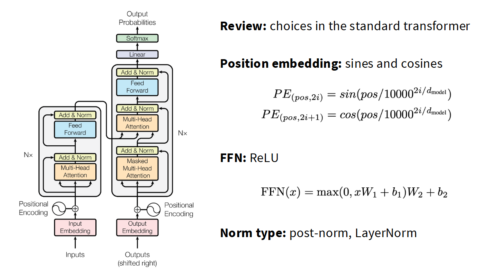
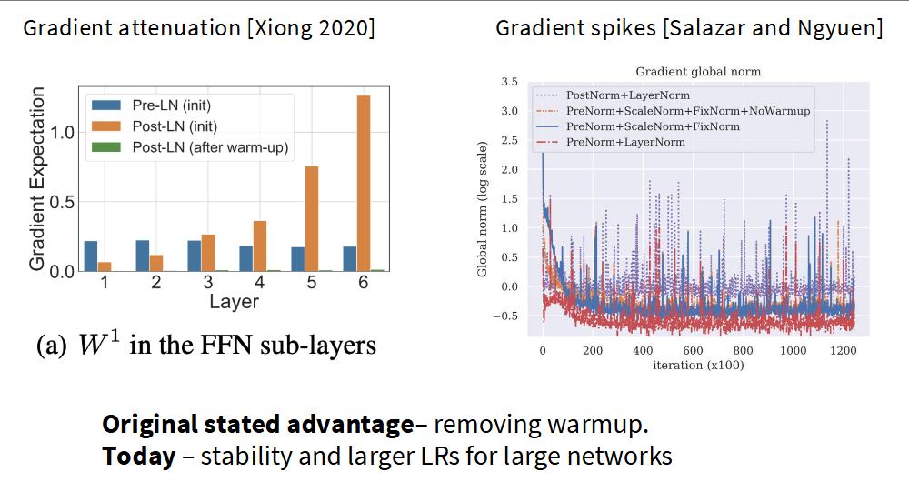
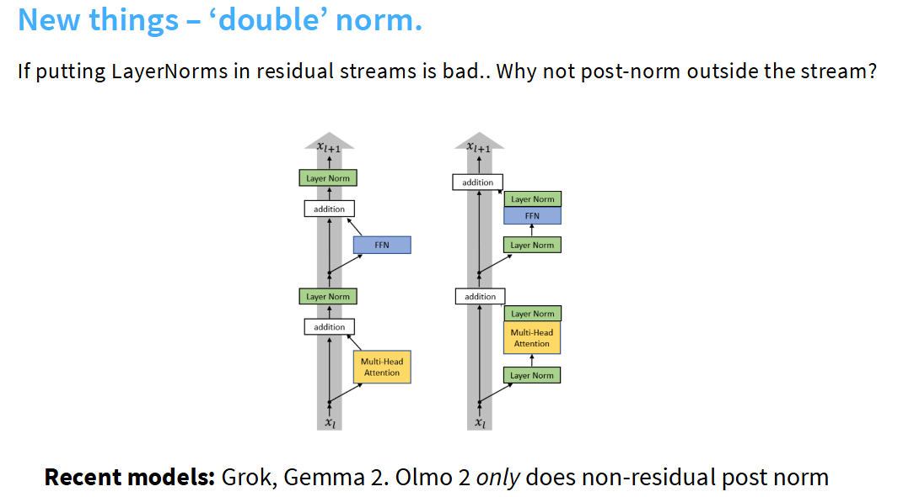
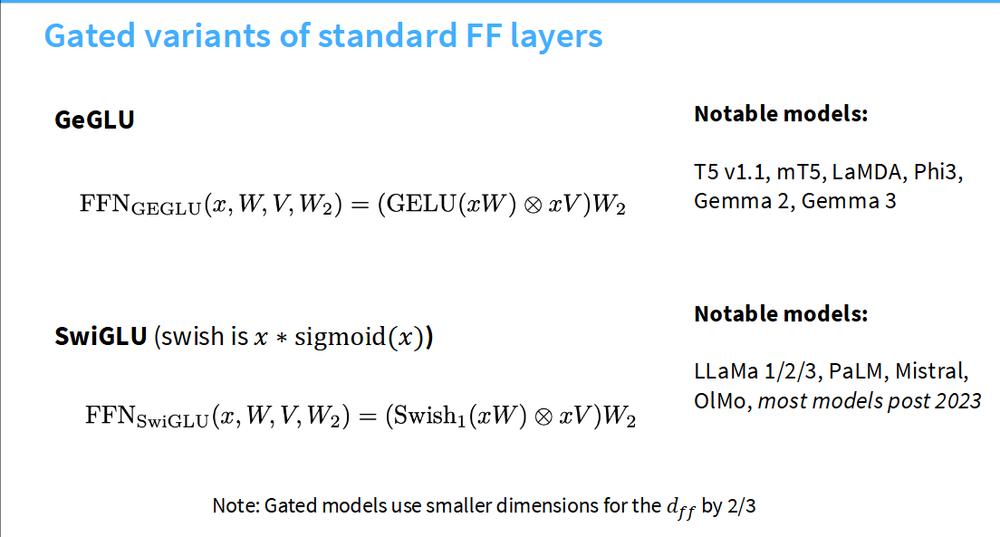
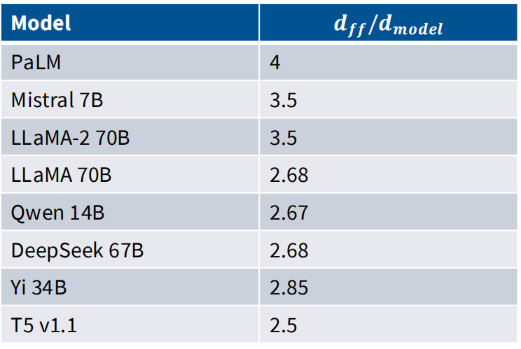
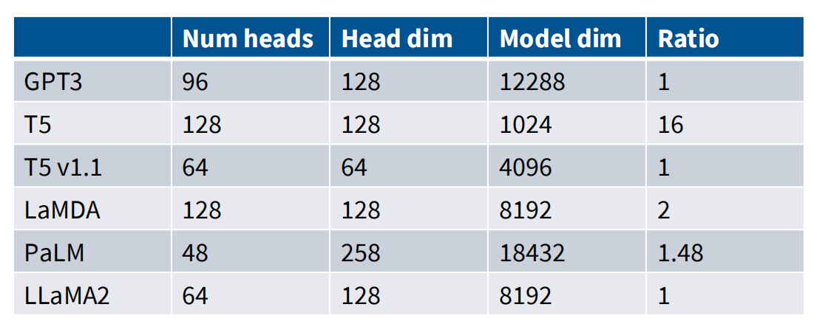
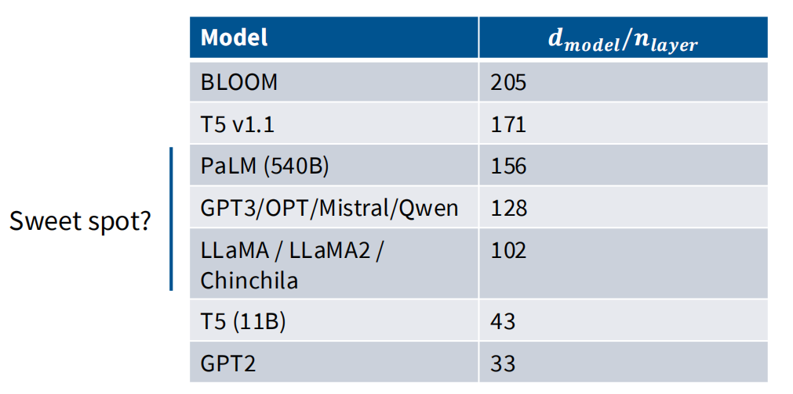

# CS336  关于语言模型架构与训练的一切 - 讲座3笔记

本讲座将深入探讨Transformer架构的演进细节和训练中的超参数选择,这些细节往往在其他课程中被略过. 我们将从一个更偏向数据驱动的视角,通过分析过去几年中发布的大量大型语言模型(LLM),来理解哪些架构选择是至关重要的,哪些已经成为共识.

本次讲座的主题是:**最好的学习方式是亲身实践,而第二好的方式是从他人的经验中学习.**

> 这节课老师语速快的可怕,信息密度大得惊人,一次性消化很困难,建议多听几遍,预习,正式学习,复习都要用起来

## 1. Transformer 架构回顾:从经典到现代

### 原始 Transformer

我们以经典的 `Transformer`架构为起点,它包括了大家熟知的几个部分:

- **位置编码 (Positional Encoding)**: 使用正弦和余弦函数.
- **核心块**: 每个块包含一个多头自注意力(Multi-Head Self-Attention)层和一个前馈网络(Feed-Forward Network, FFN).
- **残差连接与规范化**: 在每个子层(注意力、FFN)之后进行加法(Add)和层规范化(Norm),这被称为**Post-Norm**.
- **输出层**: 最后通过一个线性层和Softmax函数得到概率分布.



### 现代 Transformer 变体

然而,你在课程作业中实现的并非原始版本,而是一个更现代的变体. 主要区别在于:

- **规范化层前置 (Pre-Norm)**: [Normalization Strategies in Transformers](./Lecture3-Normalization-Strategies.md) 是现代架构的基石之一. 规范化层(LayerNorm)被移到了注意力层和FFN层**之前**.
- **旋转位置编码 (RoPE)**: 我们使用 [Rotary Position Embeddings (RoPE)](./Lecture3-Rotary-Position-Embeddings.md),这是一种更先进的位置编码方法.
- **门控激活单元 (GLU)**: 前馈网络层(FFN)使用 [Gated Activations (GLU)](./Lecture3-Gated-Activations.md),特别是SwiGLU,而不是标准的ReLU.
- **无偏置项**: 线性层和规范化层中通常省略了偏置(bias)项.


这些改变并非随意为之,它们是过去数年里,从大量模型(如Llama系列、PaLM、GPT系列等)的实践中演化出的共识.

| 模型名称 (Model Name)        | 年份 (# Year) | 规范化 (Norm) | 并行层 (Parallel Layer) | Pre-norm | 位置编码 (Position Embedding) | 激活函数 (Activations) | 稳定性技巧 (Stability Tricks)     |
| :--------------------------- | :------------ | :------------ | :---------------------- | :------- | :---------------------------- | :--------------------- | :-------------------------------- |
| Original transformer         | 2017          | LayerNorm     | Serial                  | ☐        | Sine                          | ReLU                   |                                   |
| GPT                          | 2018          | LayerNorm     | Serial                  | ☐        | Absolute                      | GeLU                   |                                   |
| T5 (11B)                     | 2019          | RMSNorm       | Serial                  | ☑       | Relative                      | ReLU                   |                                   |
| GPT2                         | 2019          | LayerNorm     | Serial                  | ☑       | Absolute                      | GeLU                   |                                   |
| T5 (XXL 11B) v1.1            | 2020          | RMSNorm       | Serial                  | ☑       | Relative                      | GeGLU                  |                                   |
| mT5                          | 2020          | RMSNorm       | Serial                  | ☑       | Relative                      | GeGLU                  |                                   |
| GPT3 (175B)                  | 2020          | LayerNorm     | Serial                  | ☑       | Absolute                      | GeLU                   |                                   |
| GPTJ                         | 2021          | LayerNorm     | Parallel                | ☑       | RoPE                          | GeLU                   |                                   |
| LaMDA                        | 2021          |               |                         | ☑       | Relative                      | GeGLU                  |                                   |
| Anthropic LM (not claude)    | 2021          |               |                         | ☑       |                               |                        |                                   |
| Gopher (280B)                | 2021          | RMSNorm       | Serial                  | ☑       | Relative                      | ReLU                   |                                   |
| GPT-NeoX                     | 2022          | LayerNorm     | Parallel                | ☑       | RoPE                          | GeLU                   |                                   |
| BLOOM (175B)                 | 2022          | LayerNorm     | Serial                  | ☑       | AliBi                         | GeLU                   |                                   |
| OPT (175B)                   | 2022          | LayerNorm     | Serial                  | ☑       | Absolute                      | ReLU                   |                                   |
| PaLM (540B)                  | 2022          | RMSNorm       | Parallel                | ☑       | RoPE                          | SwiGLU                 | Z-loss                            |
| Chinchilla                   | 2022          | RMSNorm       | Serial                  | ☑       | Relative                      | ReLU                   |                                   |
| Mistral (7B)                 | 2023          | RMSNorm       | Serial                  | ☑       | RoPE                          | SwiGLU                 |                                   |
| LLaMA2 (70B)                 | 2023          | RMSNorm       | Serial                  | ☑       | RoPE                          | SwiGLU                 |                                   |
| LLaMA (65B)                  | 2023          | RMSNorm       | Serial                  | ☑       | RoPE                          | SwiGLU                 |                                   |
| GPT4                         | 2023          |               |                         | ☐        |                               |                        |                                   |
| Olmo 2                       | 2024          | RMSNorm       | Serial                  | ☐        | RoPE                          | SwiGLU                 | Z-loss, QK-norm                   |
| Gemma 2 (27B)                | 2024          | RMSNorm       | Serial                  | ☐        | RoPE                          | GeGLU                  | Logit soft capping, Pre+post norm |
| Nemotron-4 (340B)            | 2024          | LayerNorm     | Serial                  | ☑       | RoPE                          | SqRelu                 |                                   |
| Qwen 2 (72b) - same for 2.5  | 2024          | RMSNorm       | Serial                  | ☑       | RoPE                          | SwiGLU                 |                                   |
| Falcon 2 11B                 | 2024          | LayerNorm     | Parallel                | ☑       | RoPE                          | GeLU                   | Z-loss                            |
| Phi3 (small) - same for phi4 | 2024          | RMSNorm       | Serial                  | ☑       | RoPE                          | GeGLU                  |                                   |
| Llama 3 (70B)                | 2024          | RMSNorm       | Serial                  | ☑       | RoPE                          | SwiGLU                 |                                   |
| Reka Flash                   | 2024          | RMSNorm       | Serial                  | ☑       | RoPE                          | SwiGLU                 |                                   |
| Command R+                   | 2024          | LayerNorm     | Parallel                | ☑       | RoPE                          | SwiGLU                 |                                   |
| OLMO                         | 2024          | RMSNorm       | Serial                  | ☑       | RoPE                          | SwiGLU                 |                                   |
| Qwen (14B)                   | 2024          | RMSNorm       | Serial                  | ☑       | RoPE                          | SwiGLU                 |                                   |
| DeepSeek (67B)               | 2024          | RMSNorm       | Serial                  | ☑       | RoPE                          | SwiGLU                 |                                   |
| Yi (34B)                     | 2024          | RMSNorm       | Serial                  | ☑       | RoPE                          | SwiGLU                 |                                   |
| Mixtral of Experts           | 2024          |               |                         | ☐        |                               |                        |                                   |
| Command A                    | 2025          | LayerNorm     | Parallel                | ☐        | Hybrid (RoPE+NoPE)            | SwiGLU                 |                                   |
| Gemma 3                      | 2025          | RMSNorm       | Serial                  | ☐        | RoPE                          | GeGLU                  | Pre+post norm, QK-norm            |
| SmolLM2 (1.7B)               | 2025          | RMSNorm       | Serial                  | ☐        | RoPE                          | SwiGLU                 |                                   |

[主流大模型演进历程](%E4%B8%BB%E6%B5%81%E5%A4%A7%E6%A8%A1%E5%9E%8B%E6%BC%94%E8%BF%9B%E5%8E%86%E7%A8%8B.md)

## 2. 核心架构变体分析

### 规范化:位置与类型

现代Transformer架构在规范化上有两大共识:

1. **位置 (********`Pre-Norm`****Pre-Norm****Pre-Norm****Pre-Norm****Pre-Norm****Pre-Norm****Pre-Norm****Pre-Norm****Pre-Norm****Pre-Norm****Pre-Norm****Pre-Norm****Pre-Norm****Pre-Norm****Pre-Norm****Pre-Norm** ): 几乎所有现代模型都采用 `Pre-Norm`结构,即将规范化层放在残差连接的主路径之外、每个子模块(注意力/FFN)的输入端. 这极大地增强了训练的稳定性,缓解了梯度消失或爆炸问题,使得训练更深的网络成为可能.

   使用 `Pre-Norm`这是在最开始就成为业界共识的事情,但是原始的Transformer模型却采用了 `Post-Norm`

   很早的时候研究者们就发现,将归一化模块前置到非残差模块前端(例如FFN,MHA)能在多项指标上表现更优.


学界也对这些优势做了许多解释

- **跨层梯度衰减**:预归一化能使梯度幅值保持稳定,而未经预热的后归一化则会出现梯度爆炸

但目前的主流解释是. 预归一化本身就是更稳定的训练架构,因此现在它主要作为稳定训练的手段. 如下图右图,后归一化中梯度范数的峰值出现更频繁.



这就引入了一个巨大的创新点:

- 为什么规范化层不能放在前馈网络之后呢？Omo2采用
- 为什么不能前后都放一个归一化呢？Grok&Gemma2采用了这个方案
- 为什么不能多放几个呢？



但最近有一些创新方案,在后面会详述

2. **类型 (********`RMSNorm`****RMSNorm****RMSNorm****RMSNorm****RMSNorm****RMSNorm****RMSNorm****RMSNorm****RMSNorm****RMSNorm****RMSNorm****RMSNorm****RMSNorm****RMSNorm****RMSNorm****RMSNorm** ): 许多模型已从 `LayerNorm`转向 `RMSNorm`. `RMSNorm`简化了计算(不计算均值),减少了参数和内存移动,从而在保持模型性能的同时提升了训练速度.

   - LayerNorm代表模型: GPT1/2/3,OPT,GPT-J,BLOOM

     $$
     y = \frac{x - \mathbb{E}[x]}{\sqrt{\text{Var}[x] + \epsilon}} \cdot \gamma + \beta  \quad(LayerNorm 公式)
     $$

   - RMSNorm代表模型: Llama系列,PaLM,Chinchilla,T5

     $$
     y = \frac{x}{\sqrt{||x||_2^2 + \epsilon}} \cdot \gamma \quad (RMSNorm 公式)
     $$


但是两种Norm差别不大,是为了简化模型才用的RMSNorm,而且RMSNorm速度更快,因为省略了均值计算,而且减少了bias参数量,从而减少参数数量

> 在cs224中老师讲过,训练模型的时候唯一重要的是矩阵乘法,其他的无需关心. 这个观点确实有合理性,至于更详细的分析 在ivanov的2021年论文《Data Movement Is All You Need: A Case Study on Optimizing Transformers》详细分析了Transformer模型中不同运算的占比情况.(老师口误成2023年,而且论文名字也不记得,我想应该是这一篇)

大致的分析如下


矩阵乘法类运算占比高达99.8%,似乎节省0.17%的Norm运算毫无意义. 但现代LLM结构中,不光关注浮点操作. 因此浮点操作固然重要,但并非唯一考量,内存移动优化同样重要. 实际上Norm操作占用了25%的运行时间,因为Norm操作会带来巨大的内存搬运开销. 性能不能光考虑浮点计算能力,还要考虑内存访问效率


图中是一些主要研究,其中Naron团队在2020年的消融实验很有代表性. 可以看到 RMS Norm每秒处理的迭代次数相比标准Transformer ,从3.5/s达到了3.68/s. 虽然提升幅度不大,但这是零成本得到的,最重要的是最终的损失函数比Transformer低,可以说实现了运行效率的提升.


这两个选择的背后,是业界对**训练稳定性**和系统效率(尤其是内存带宽)的深刻理解.

> **[深度解析]** 关于 `Pre-Norm`为何优于 `Post-Norm`,`RMSNorm`相比 `LayerNorm`的效率优势,以及最新的“双重规范化”趋势,请参阅 [Normalization Strategies in Transformers](./Lecture3-Normalization-Strategies.md).

> **[深度解析]** 为什么将层归一化(Layer Normalization, LN)放在残差连接内部(即 Pre-Norm)通常是更好的选择 [为什么这样做是对的？](Lecture3-Where-to-put-Norm-and-why.md)

在FFN中 ,也采用了类似的思想 直接去掉了 bias项

$$
\text{FFN}(x) = \max(0, xW_1 + b_1)W_2 + b_2 \quad(Original \quad Transformer)
$$

$$
\text{FFN}(x) = \sigma(xW_1)W_2 \quad(Most \quad Implementations)
$$

这同样增加了训练的稳定性,但老师都没完全理解为什么偏置项会损害训练的稳定性

总结:👇

> - 基本上所有人都使用 Pre-Norm (前置归一化).

> - **直觉:** 保留残差连接的优点.
> - **观察:** 更平滑的梯度传播,更少的尖峰.
> - **补充:** 有些人会在残差流之外添加第二个归一化层(但不是 Post-Norm).

**大多数人使用 RMSNorm**.

> - **实践中:** 效果与 LayerNorm (层归一化) 一样好.
> - **优点:** 参数更少,节省了实际运行时间(wallclock time).
> - **趋势:** 人们通常会去掉偏置项(bias terms),因为计算/参数的权衡并不理想.
> - Llama,Cohere,Command R都依然采用传统的LN,原因不明

### 激活函数:门控机制的胜利

激活函数的选择也经历了演变.

- **早期模型**: 使用**ReLU**(如原始Transformer, T5) 或**GeLU** (如GPT系列).
- **现代模型**: 绝大多数模型,特别是2023年之后发布的,都转向了**门控线性单元(Gated Linear Units, GLU)的变体,如SwiGLU**(Llama, PaLM) 和**GeGLU** (T5-v1.1, Gemma).




其中,V这个参数矩阵通常按照w的2/3来设置,这没有什么数学解释,只是工程实践. (后面会再详细解释)

实验反复证明,门控激活能持续带来性能提升. 门控机制通过一个与输入相关的“门”来动态控制信息流,赋予了网络更强的表达能力.

但是GPT3就是一个不使用GLU就性能很好的一个例子,还有Nemotron340b(Squared ReLU)和Falcon2-11b(RELU)

> **[深度解析]** 门控机制是什么？为什么它比简单的非线性函数更有效？请参阅 [Gated Activations (GLU)](./Lecture3-Gated-Activations.md).

### 位置编码:RoPE 的主导地位

位置编码是让模型理解序列顺序的关键.

- **早期方法**: 包括加性的**绝对位置编码**(GPT-1/2/3)或基于**正弦/余弦**的编码(原始Transformer). 而GoPher,T5等模型采用了多种相对位置嵌入方法
- **现代标准**:**旋转位置编码 (RoPE)** 已成为绝对的主流. 它的核心思想是通过旋转操作将相对位置信息融入到查询(Query)和键(Key)向量中,理论上更优雅且在长序列上表现更佳.  这是GPT-J最早使用的,也是开源社区的贡献 @苏剑林

> **[深度解析]** RoPE如何通过旋转实现相对位置编码？其背后的数学原理和实现细节是怎样的？请参阅 [Rotary Position Embeddings (RoPE)](./Lecture3-Rotary-Position-Embeddings.md).

### 串行 vs. 并行层

标准的Transformer块是**串行**的:输入先经过注意力层,其输出再经过FFN层.

- **并行层**: 一些模型(如GPT-J, PaLM)尝试过**并行**结构,即让注意力和FFN层同时处理相同的输入,然后将它们的输出相加.

  - **优势**: 理论上可以融合矩阵乘法,提升计算并行度,从而加速训练.
  - **现状**: 尽管有此优势,但目前大多数模型仍采用串行结构,这可能意味着串行结构在表达能力上更具优势.


## 3. 超参数选择:不成文的规则

在训练LLM时,许多超参数的选择实际上遵循着惊人的共识.

《Scaling Laws for Neural Language Models》以Scaling Laws出名,但它hyper parameters部分一样很有意义

[https://arxiv.org/abs/2001.08361](https://arxiv.org/abs/2001.08361)

> 这一节真的解决了我很多的问题,在看一大堆模型的技术报告的时候似乎并没有人会把自己怎么选的超参数说出来,因此原来一直有疑问
> 
> 1. 模型大小是怎么确定的,在什么时候确定
> 2. 超参数是怎么确定的,有没有理论推导最优值(异想天开了属于是)或者工程经验值.对于那么大 500B以上的模型,超参数是哪个阶段就确定下来的

> 各种模型在训练的时候真正需要调整的超参数并不多,业界是有一些经验准则被大家广泛遵守的


**常见的问题是**:

- **前馈网络维度比例 (***`d_ff / d_model`* *d_ff / d_model* *d_ff / d_model* *d_ff / d_model* *d_ff / d_model* *d_ff / d_model* *d_ff / d_model* *d_ff / d_model* *d_ff / d_model* *d_ff / d_model* *d_ff / d_model* *d_ff / d_model* *d_ff / d_model* ):

  - 对于使用ReLU/GeLU的模型,一个经典的“经验法则”是 `d_ff = 4 * d_model`. 但这并非什么金科玉律
  - 对于使用GLU变体的模型,为了保持参数量相近,这个比例通常调整为 `d_ff ≈ (8/3) * d_model ≈ 2.67 * d_model`.
  - **例外**: T5模型曾大胆地使用了高达64倍的比例($d_{ff}=65536,d_{model}=1024$),但其后续版本T5-v1.1又回归到了使用更标准的GELU系数,2.5倍,这暗示了超大比例可能并非最优.




````
Jared Kaplan的论文中有一个关键图表
````


比例在1-10的时候 都是接近最优效果的

- **注意力头数&模型维度**

  理论上头数是越多越好,但实际上并非如此,其实甚至不是理论上,是直觉上如此(但这个直觉可能来自于scaling law即参数越多越好)




大多数模型都在1,T5又是唯一显眼包,这个团队似乎特别喜欢大


- **模型宽高比 (**`d_model / n_layer` ):

  - 这个比例衡量了模型的“宽度”(隐藏层维度)与“深度”(层数).
  - 大多数成功的模型似乎都找到了一个“甜蜜点”,该值大约在**100到200**之间. 例如,GPT-3、OPT、Mistral等模型的宽高比都在128左右.




- 这个选择也受到系统并行化策略的影响:极深的模型有利于流水线并行,而极宽的模型有利于张量并行.


横坐标代表模型大小,纵坐标代表损失差异的百分比变化.

左侧Kaplan的研究表明,对于给定总参数量的模型(如50M至1.5B),其性能(以损失百分比变化衡量)存在一个由隐藏维度与层数之比(“Aspect Ratio”即 $d_{model} / n_{layer}$)决定的最佳区间,呈现U形曲线,意味着模型宽度和深度之间存在一个平衡点,且在此最佳比率附近多种架构形状都能达到相似的良好性能.

右侧Tay的研究进一步揭示,在固定计算量(FLOPs)的限制下,无论是增加模型的隐藏维度($d_{model}$)还是增加层数($n_{layer}$),都通常伴随着总参数量的增加以及性能的提升(负对数困惑度降低,SuperGLUE准确率提高),共同强调了在设计高效且高性能Transformer模型时,平衡宽度与深度以及适度扩展模型规模的重要性.

- **词汇表大小 (Vocabulary Size)**:

  - **单语模型**: 通常在3万到5万之间(如GPT-2/3, LLaMA).
  - **多语/生产系统**: 趋向于更大的词汇表,通常在10万到25万之间(如mT5, PaLM, GPT-4, Command A). 这是为了更好地支持多语言、特殊符号和代码等.

- **正则化 (Regularization)**:

  - **Dropout**: 在早期的模型中很常见,但在现代LLM的**预训练**阶段已基本弃用. 因为预训练数据量巨大,模型通常只过一遍数据,过拟合风险很低.
  - **权重衰减 (Weight Decay)**: 仍然被广泛使用,但其作用很奇特. 它主要不是为了防止过拟合(尽管它是为了防止过拟合设计的),而是通过与学习率调度(特别是cosine schedule)的复杂相互作用,来改善训练末期的优化动态,从而获得更低的训练损失.


## 4. 推理效率与高级注意力机制

### GQA/MQA/MLA:为高效推理而设计

虽然它们在训练阶段影响不大,但是在推理阶段是很重要的

在模型训练时,我们可以并行处理整个批次,算力利用率高. 但在自回归生成(推理)时,模型必须逐个token生成,这导致了所谓的“KV缓存”瓶颈,即读写巨大的Key和Value缓存成为性能瓶颈,内存带宽而非计算能力成为限制因素.

- **多查询注意力 (MQA)**和**分组查询注意力 (GQA)** 正是为此而生. 它们通过让多个查询头(Query heads)共享同一组或几组键/值头(Key/Value heads),极大地减小了KV缓存的大小,从而显著提升了推理速度和吞吐量. 

> 他真的只用了5分钟就讲完了 MQA和GQA 让人觉得这东西好简单啊 但是实际上并不是,果然是误闯天家了

> **[深度解析]** 为何推理时的计算模式与训练时完全不同？KV缓存瓶颈是如何产生的？MQA/GQA又是如何从根本上解决这个问题的？请参阅 [Grouped-Query & Multi-Query Attention (GQA/MQA)](./Lecture3-GQA-MQA-MLA.md).   实际上课上并没有MLA,但是作为2025年下半年的这类文章MLA还是必不可少的,甚至NSA MoBA也不能少

### **稀疏与滑动窗口注意力**

为了处理更长的上下文,研究人员提出了多种方法来避免计算完整的(二次复杂度的)注意力矩阵.

- **滑动窗口注意力 (Sliding Window Attention)**: 每个token只关注其邻近的一个窗口内的其他token.
- **稀疏注意力 (Sparse Attention)**: 设计更复杂的、非局部的注意力模式,如跨步(strided)或固定(fixed)模式.
- **现代混合策略**: 最新的长上下文模型(如Llama 4, Command A)采用了一种巧妙的混合策略:大部分层使用带RoPE的滑动窗口注意力来处理局部信息,同时每隔几层插入一个**不带位置编码的全局注意力层**来整合长距离信息. 这种设计兼顾了效率和长程依赖的建模能力.

### **训练稳定性技巧**

随着模型规模的增大,训练稳定性变得至关重要. 不稳定的训练表现为损失函数突然出现尖峰(spikes).

理论上训练的每一个环节都有可能出问题,这听起来像是我们控制专业的内容(控制专业就是研究系统稳定性的学科 Make Automatic Great Again,MAGA!),但控制专业依赖于精确的数学描述而且对于非线性也没有好的解决办法,so 根本用不上,悲(


### 问题的根源:Softmax 的数值不稳定性

无论是模型最后的输出层,还是 Transformer 内部的注意力机制,都严重依赖于 Softmax 函数.Softmax 的计算涉及到指数运算 `e^x`.当 `x`(即模型的 logits)变得非常大时,`e^x` 的结果会迅速增长,很容易超出计算机浮点数(如 bfloat16 或 fp16)所能表示的最大范围,导致**上溢 (Overflow)**,结果变为无穷大 (`inf`).

$softmax(x_i) = \frac{e^{x_i}}{\sum_{j} e^{x_j}}$

如果分母中的任何一项 `e^x_j` 变成了 `inf`,整个分母就是 `inf`,最终的计算结果会变成 `inf / inf`,即 `NaN` (Not a Number),这会导致模型的训练梯度崩溃,训练过程完全中断.

这个问题的核心是**logits 的数值过大**.z-loss 和 QK-Norm 就是从不同角度来约束 logits 大小的两种关键技术.

### 4.1. Z-Loss:稳定输出层的 Softmax

`z-loss` 主要应用于模型**最后的输出层**,用于预测下一个 token 的概率分布.

#### a. 理解图中的数学原理

- **Softmax 计算回顾 (左侧公式框):**


- 模型对词汇表中的每个词都输出一个分数,称为 logit,记为 $U(x)$.
- 一个词 $r$ 的概率 $P(x)$ 是通过将其 logit $U_r(x)$ 取指数,然后除以所有词的 logit 取指数后的总和来计算的.这个总和就是**配分函数 (Partition Function)** $Z(x)$.
- $Z(x) = \sum_{r'=1}^{|V|} e^{U_{r'}(x)}$
- 在计算损失时,我们通常使用对数概率 `log(P(x))`,它可以简化为:`log(P(x)) = U_r(x) - log(Z(x))`.
- **Z-Loss 的引入 (右侧公式框 & PaLM 引用):**

  - `Z(x)` 是所有 logits 指数和,所以当 logits 的值变得很大时,`Z(x)` 也会变得非常大,导致 `log(Z(x))` 也很大,这正是数值不稳定的根源.
  - **Z-Loss 的核心思想**:在主损失函数(通常是交叉熵损失,即 `-log(P(x))`)之外,额外增加一个**辅助损失项**,这个损失项专门用来惩罚 `log(Z(x))` 过大的情况.
  - 如 PaLM 的实现所示,这个辅助损失就是:$z\_loss = \lambda \cdot \log^2(Z(x))$

    - 其中 $\lambda$ 是一个很小的超参数(例如图中的 `10^-4`).
    - 这个损失项的目标是让 `log^2(Z(x))` 尽可能小,也就是**迫使****`log(Z(x))`****log(Z(x))****log(Z(x))****log(Z(x))****log(Z(x))****log(Z(x))****log(Z(x))****log(Z(x))****log(Z(x))****log(Z(x))****趋近于 0**.

  - 当 `log(Z(x))` 趋近于 0 时,意味着 `Z(x)` 趋近于 1.要让所有 logits 的指数和接近 1,模型就不能产生绝对值过大的 logits.


#### b. 工作机制总结

Z-Loss 就像一个**正则化器**.在训练过程中,如果模型试图通过产生非常大的 logits 来“作弊”(例如,对正确答案给出极高的分数,对错误答案给出极低的分数),这个辅助损失项就会变得很大,从而增加总的损失值.优化器为了最小化总损失,就不得不将 logits 的整体幅度控制在一个合理的、数值稳定的范围内.

**简单来说:Z-Loss 通过在最终的损失函数中增加一个惩罚项,间接抑制了输出层 logits 的过度增长,从而保证了 Softmax 计算的稳定性.**

### 4.2 QK-Norm:稳定注意力机制的 Softmax

Z-Loss 解决了输出层的问题,但 Transformer 内部的每一个自注意力层也存在同样的问题.注意力分数本身就是一种 logits,它们在输入到 Softmax 之前也可能变得非常大.

#### a. 注意力机制中的问题

- 注意力分数的计算公式为:$AttentionScores = \frac{QK^T}{\sqrt{d_k}}$
- 这里的 $QK^T$ 是查询向量 (Q) 和键向量 (K) 的点积.如果 Q 和 K 向量中的数值幅度很大,它们的点积结果也会非常大.
- 这些大的点积结果(即注意力 logits)在输入到 Softmax 时,同样会面临**数值上溢**和**NaN** 的风险.
- 此外,过大的 logits 还会导致**梯度饱和**问题:Softmax 的输出会趋向于一个 one-hot 向量(例如 `[0, 0, 1, 0, ...]`),此时梯度会变得非常小,导致模型在这些位置停止学习.

#### b. QK-Norm 的解决方案


QK-Norm 是一种更**直接**的干预方法.它不是在损失函数上做文章,而是在注意力计算的**前向传播过程中直接对 Q 和 K 进行规范化**.

- **机制:**在计算 $QK^T$**之前**,分别对 Q 矩阵和 K 矩阵应用**层归一化 (Layer Normalization)**.

  ```python
  
  # 伪代码
  
  query_states = self.q_proj(hidden_states)
  
  key_states = self.k_proj(hidden_states)
  
  
  
  # 应用 QK-Norm
  
  query_states = self.q_layer_norm(query_states)
  
  key_states = self.k_layer_norm(key_states)
  
  
  
  # 然后再计算点积
  
  attention_scores = torch.matmul(query_states, key_states.transpose(-1, -2))
  
  ```

- **效果:** 层归一化会强制 Q 和 K 向量的均值为0,方差为1.这有效地限制了向量中元素的数值范围.经过归一化后,两个向量的点积结果(即注意力 logits)的幅度也会被严格地控制在一个很小的、稳定的范围内.

### 3. Logit Soft-capping:稳定输出层的直接方法

`Logit soft-capping` 直接作用于模型**最终输出的 logits**,在它们被送入 Softmax 函数之前,通过一种平滑的方式限制其最大值.

#### a. 核心问题(再次强调)

- **数值上溢 (Overflow):** 当 logits 过大(例如 > 88 in fp32, > 19 in bfloat16),`exp(logits)` 会变成无穷大 (`inf`),导致 `inf / inf = NaN`.
- **梯度饱和 (Gradient Saturation):** 当 logits 之间的差距过大,Softmax 的输出会趋近于一个 one-hot 向量(例如 `[0, 0, 1, 0, ...]`).在这种情况下,损失函数对 logits 的梯度会变得非常小(接近于0),使得模型在这些位置几乎无法学习,训练停滞.

#### b. Logit Soft-capping 的解决方案

它的核心思想是:**与其在损失函数里间接惩罚大 logits(如 Z-Loss),不如在计算 Softmax 之前直接把 logits “压”到一个合理的范围内.**

- **机制:** 它通过一个非线性函数来变换 logits,这个函数需要满足两个关键条件:

  1. 当输入值较小时,其输出约等于输入值本身(保持原有信息).
  2. 当输入值变得非常大时,其输出会平滑地趋近于一个上限(实现“封顶”).

- **最常用的函数:双曲正切函数****`tanh`****tanh****tanh**

  - `tanh(x)` 的特性完美地满足了上述需求:

    - 当 `x` 接近 0 时,`tanh(x) ≈ x`.
    - `tanh(x)` 的输出值域被严格限制在 `[-1, 1]` 之间.

  - 为了让这个“上限”可以被灵活控制,通常会引入一个可调的超参数 `C`(capping constant,例如 C=15 或 C=30).
  - 最终的变换公式为:

    `capped_logits = C * tanh(logits / C)`


- **这个公式如何工作？**

  - `logits / C`:首先将原始 logits 缩小,这决定了 `tanh` 函数的“激活”区域.
  - `tanh(...)`:将缩小后的 logits “压”到 `[-1, 1]` 的范围内.
  - `C * ...`:最后再将结果放大回 `[-C, C]` 的范围,这样 logits 仍然能保持一个合理的动态范围,而不是被压缩到 `[-1, 1]`.


#### c. 为什么是“Soft” Capping 而不是“Hard” Clipping？

- **Hard Clipping** 指的是直接用 `clip(logits, min=-C, max=C)` 这样的操作.当一个 logit 的值超过 `C` 时,它会被粗暴地设为 `C`.这种做法的缺点是,在 `C` 这个点上,梯度会突然变为0.模型将无法收到任何信号来告诉它“这个 logit 太大了,需要减小”.
- **Soft Capping** (`tanh`) 是一个处处可导的平滑函数.即使一个 logit 变得非常大,其变换后的梯度虽然会变小,但永远不会是0.模型仍然能接收到微弱但持续的信号来抑制这个 logit 的增长,这使得训练过程更加稳定.

#### d. 伪代码实现

```python
# 计算原始 logits
logits = final_linear_layer(hidden_states)
# 定义 capping 常数
C = 15.0 # 一个典型的超参数值
# 应用 logit soft-capping
capped_logits = C * torch.tanh(logits / C)
# 使用被“封顶”后的 logits 计算损失
loss = cross_entropy_loss(capped_logits, labels)
```

### 三种方法的最终对比

现在我们可以将 Logit Soft-capping 加入之前的对比表格中,得到一个完整的画面.

| 特性         | Z-Loss                               | QK-Norm                                   | Logit Soft-capping                          |
| ------------ | ------------------------------------ | ----------------------------------------- | ------------------------------------------- |
| **作用位置**| 模型**最终的输出层**| Transformer 内部的**每个注意力层**| 模型**最终的输出层**                        |
| **作用对象** | 输出 logits(通过配分函数Z)           | 注意力 logits(通过Q和K向量)               | 输出 logits                                 |
| **实现机制**|**间接**:添加辅助损失项,作为正则化器 |**直接**:在前向传播中对Q和K向量进行归一化 |**直接**:在前向传播中对logits应用非线性变换 |
| **解决问题** | 输出层的数值上溢 (Overflow) 和 `NaN` | 注意力层的数值上溢、`NaN` 和梯度饱和      | 输出层的数值上溢、`NaN` 和梯度饱和          |

**结论:**

- **Z-Loss**和**Logit Soft-capping**是解决**同一问题(输出层稳定性)的两种不同途径**.Z-Loss 是一种“软约束”(通过损失函数引导),而 Soft-capping 是一种“硬约束”(直接在前向传播中限制).
- **QK-Norm** 则专注于解决模型内部(注意力层)的稳定性问题.
- 一个鲁棒的、训练稳定的大型语言模型,通常会组合使用这些技术.例如,同时使用 **QK-Norm**来稳定内部注意力,并使用**Z-Loss**或**Logit Soft-capping** 来稳定最终的输出层.