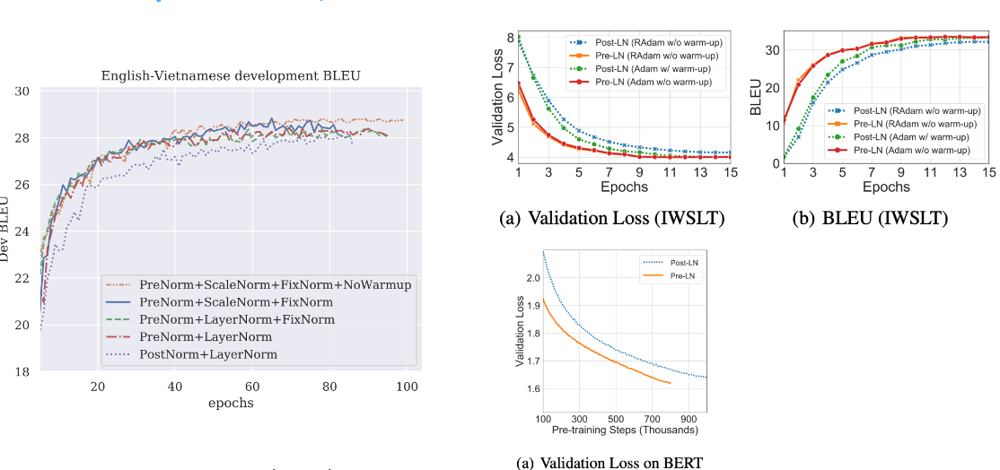
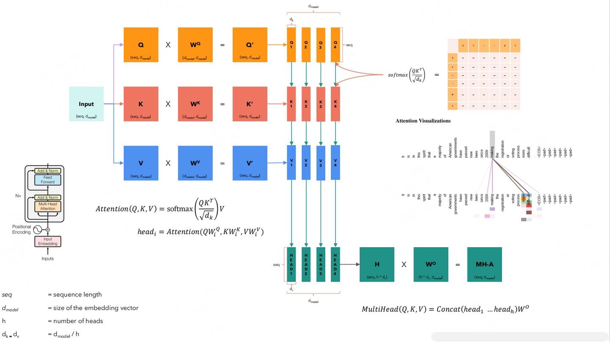
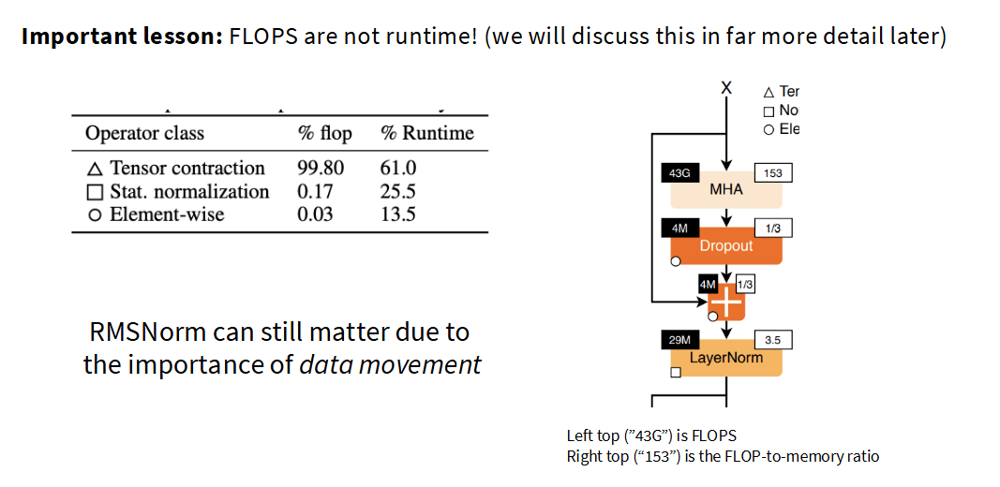

# 精英笔记:Transformer中的规范化策略

规范化(Normalization)是成功训练深度神经网络的关键技术之一,在Transformer架构中尤其如此. 它的演进体现了社区对训练稳定性、梯度传播和系统硬件效率的持续探索. 本笔记将深入探讨两个核心转变:从Post-Norm到Pre-Norm,以及从LayerNorm到RMSNorm. 

### 1. Pre-Norm vs. Post-Norm:稳定性的基石

规范化层在Transformer块中的位置对训练动态有根本性的影响. 

- **Post-Norm (原始方案)**
  在原始Transformer论文中,层规范化(LayerNorm)位于每个子模块(自注意力或FFN)的输出端,在与残差连接相加**之后**. 
  
  - **问题**: 这种结构将LayerNorm置于残差连接的主路径上. 随着网络层数加深,梯度在反向传播时会经过多个LayerNorm层,容易导致梯度消失或爆炸,使得训练非常不稳定. 为了使其收敛,通常需要一个精心设计的**学习率预热(warm-up)**阶段,在训练初期使用非常小的学习率,然后逐渐增大. 

- **Pre-Norm (现代标准)**
  后续研究发现,将LayerNorm移动到子模块的**输入端**,即在残差连接的主路径之外,可以显著改善训练动态. 
  - **优势**:
    1.  **稳定的梯度流**: 残差路径上没有任何操作,形成了一个从输出到输入的“高速公路”,梯度可以无阻碍地传播. 这使得训练非常深的网络(数百层)成为可能,且对学习率不再那么敏感,甚至可以省去warm-up阶段. 
    2.  **抑制梯度尖峰**: 经验表明,Pre-Norm结构能有效减少训练过程中梯度范数的剧烈波动(尖峰),使训练过程更加平滑. 如下图所示,Pre-Norm(蓝色/绿色曲线)的梯度范数远比Post-Norm(红色曲线)平稳. 
    

几乎所有现代大型语言模型都采用了Pre-Norm架构,它被认为是训练深度Transformer模型的“铁律”. 

### 2. LayerNorm vs. RMSNorm:效率的追求

在确定了Pre-Norm的位置后,社区进一步优化了规范化本身的计算. 

- **LayerNorm (层规范化)**
  其计算公式为:
  `y = (x - E[x]) / sqrt(Var[x] + ε) * γ + β`
  它执行两个主要操作:
  1.  **标准化**: 将输入`x`的均值变为0,方差变为1. 
  2.  **仿射变换**: 通过可学习的参数`γ`(增益)和`β`(偏置)对标准化后的结果进行缩放和平移. 

- **RMSNorm (均方根层规范化)**
  RMSNorm简化了LayerNorm,其计算公式为:
  `y = x / sqrt(RMS(x) + ε) * γ`,其中 `RMS(x) = mean(x^2)`
  它只进行重新缩放,而**移除了均值中心化(`E[x]`)和偏置项(`β`)**. 
  - **优势**:
    1.  **计算效率**: 省去了计算均值的操作. 虽然这在总FLOPs中占比极小,但其真正优势在于**减少了内存带宽压力**. 
    2.  **更少的参数**: 移除了偏置参数`β`. 

### 3. 深入理解:为何RMSNorm更快？FLOPS vs. 内存移动

一个常见的误解是,模型训练的瓶颈完全在于浮点运算(FLOPs). 然而,在现代GPU上,**内存数据的移动往往比计算本身更耗时**. 

上图是一项对Transformer模型运行时的分析:
- **FLOPs视角**: 矩阵乘法(Tensor contraction)占据了99.8%的计算量,而规范化操作仅占0.17%. 
- **Runtime视角**: 规范化操作却消耗了**25.5%的运行时长**！

这是因为,像LayerNorm这样的操作具有很低的**算术强度**(Arithmetic Intensity),即每次从内存中读取数据后,对其进行的计算量很少. GPU的大部分时间都花在了等待数据从内存加载到计算单元上. 

RMSNorm通过简化计算和减少参数,降低了内存访问的需求,从而显著缩短了这部分操作的实际运行时间. 考虑到现代LLM每秒钟要执行无数次规范化操作,这种看似微小的优化累积起来便能带来可观的训练速度提升(通常在5%左右),并且实验证明其模型性能与LayerNorm相当. 因此,`RMSNorm`已成为Llama系列、PaLM等众多现代模型的首选. 

### 4. 新趋势:双重规范化 (Double Norm)

最近,一些模型如Grok和Gemma 2开始探索一种“双重规范化”的变体,即在Pre-Norm的基础上,在FFN和注意力模块之后(但在与主残差流相加之前)再增加一个规范化层. 这可以看作是在追求极致训练稳定性道路上的又一次尝试. 