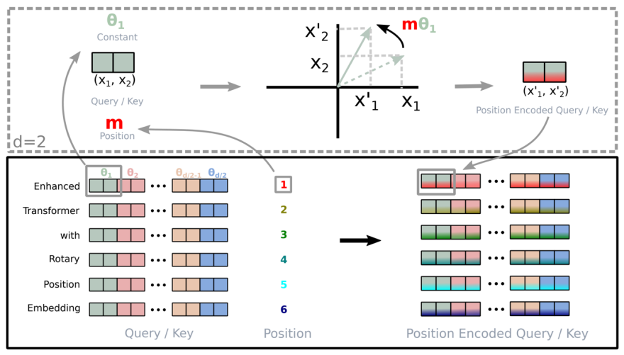

# 精英笔记:旋转位置编码 (RoPE)

在Transformer模型中,让模型理解单词的顺序和相对位置是至关重要的. **旋转位置编码**(Rotary Position Embeddings, RoPE)是当前解决此问题的最先进、最主流的方法. 它通过一种优雅的数学方式,将相对位置信息编码到自注意力机制中.

> RoPE的核心:向量之间的点积只和夹角有关,因此在做任何变换的时候保证相对位置不变即可在不丢失语义的情况下

### 1. 目标:真正的相对位置编码

自注意力的核心是计算查询(Query)和键(Key)向量之间的点积,以得到注意力分数. 一个理想的位置编码方案应该使得这个点积只依赖于两个词的**内容**和它们的**相对位置**,而与它们的**绝对位置**无关.

用数学语言来说,给定两个词`x`和`y`,它们的绝对位置分别为`i`和`j`,我们希望它们的位置编码函数`f`满足:

`<f(x, i), f(y, j)> = g(x, y, i - j)`

其中 `<,>` 代表点积,`g` 是某个只依赖于相对位置`i - j`的函数.

换成LLM领域的语言说就是

$⟨f_q(\boldsymbol{q}_m,m),f_k(\boldsymbol{k}_n,n)⟩=g(\boldsymbol{q}_m,\boldsymbol{k}_n,m−n)\langle f_q(\boldsymbol{q}_m,m),f_k(\boldsymbol{k}_n,n)\rangle=g(\boldsymbol{q}_m,\boldsymbol{k}_n,m-n)$

其中 $\boldsymbol{k}_n$是在位置 m的query向量,$\boldsymbol{k}_n$是在位置 n 的key向量,$f_q$ 和 $f_k$ 是分别针对这query和key向量的操作函数.

我们的任务就是要找到一组 $f_q,f_k$和 g,使得上式成立

早期的位置编码方法**无法**完美实现这一点:

- **加性绝对位置编码 (GPT系列)**: `f(x, i) = token_embedding(x) + pos_embedding(i)`. 点积展开后会包含与绝对位置`i`和`j`相关的交叉项,泄露了绝对位置信息.
- **正弦/余弦位置编码 (原始Transformer)**: 同样是加性嵌入,存在类似问题.

> Q: 为什么加性位置编码会泄露信息呢？
> 
> A: 因为在计算注意力分数时,对加性位置编码的线性分解,会暴露出与绝对位置 i 和 j 相关的独立项.
> 
> 具体来说:
> 
> - 输入:  $h_i = TokenEmb(i) + PosEmb(i) $
> - 点积: $Score(i, j) = <h_i * W_Q, h_j * W_K> $
> - 展开这个点积会包含一个纯粹由绝对位置向量构成的项:$<PosEmb(i) * W_Q, PosEmb(j) * W_K>$

> 在这个计算中,PosEmb(i) 和 PosEmb(j) 作为独立的向量直接参与运算.

> 没有任何数学结构强制它们的结果只与相对位置 i-j 有关.因此,模型可以直接获取并利用 i 和 j 的绝对位置信息,导致了信息泄露.

> $h_i$代表在位置 i 处,合并了词元内容和位置信息后的最终输入向量.
> 
> i, j: 代表序列中的绝对位置索引.例如,句子中第一个词的 i 是0,第五个词的 i 是4.
> 
> TokenEmb(i): 代表在位置 i 的那个词元(token)本身的内容或语义的嵌入向量.
> 
> PosEmb(i): 代表位置索引 i 本身的嵌入向量,它只编码位置信息,与该位置上是什么词元无关.
> 
> Score(i, j): 代表位置 i 的词元对位置 j 的词元的注意力分数.这个分数决定了在生成位置 i 的新表示时,应该对位置 j 的信息赋予多大的权重.

> $W_Q, W_K$:代表模型在自注意力层中需要学习的两个权重矩阵.它们分别用于将输入向量 h 转换成更适合进行匹配计算的查询向量 (Query) 和键向量 (Key).

> < >: 代表向量点积(Dot Product)运算.

### 2. 核心思想:用旋转编码位置

RoPE的突破性思想源于一个简单的几何事实:**两个向量的点积在它们被同时旋转相同角度后保持不变**. RoPE巧妙地利用了这一点.

它不把位置信息作为加性向量,而是将位置信息视为一个**旋转操作**.

- 对于位于位置 `m` 的词 `x`,其最终的向量 `f(x, m)` 是通过将词嵌入向量 `x` **旋转**一个角度 `m * θ` 得到的.
- 对于位于位置 `n` 的词 `y`,其最终的向量 `f(y, n)` 是通过将词嵌入向量 `y` **旋转**一个角度 `n * θ` 得到的.

当计算它们的注意力分数时,实际上是计算旋转后的向量的点积. 由于点积的旋转不变性,这个分数只依赖于两个向量之间的**相对旋转角度**,即 `(m * θ) - (n * θ) = (m - n) * θ`. 这样,注意力分数就只依赖于相对位置 `m - n` 了.


上图直观地展示了这个过程:无论"we"和"know"在句子中的绝对位置如何变化,只要它们的相对距离保持不变,它们对应的旋转后向量之间的夹角就保持不变,从而点积(注意力分数)也保持稳定.

如果单词(token)在句子序列中的相对位置变化了,那么它们的注意力分数也会随之变化,反之则不变,真正做到了注意力分数只与m-n有关,即m-n计算出的那个夹角

### 3. 高维空间的实现

在二维空间中,旋转是唯一的. 但在高维的词嵌入空间中(例如`d_model = 4096`),旋转的定义很复杂. RoPE采用了一种非常简洁但有效的简化策略:

1. **分组**: 将`d`维的向量两两一组,看作`d/2`个二维平面(或复数). 高维的“旋转”(叫变换)矩阵有多个小旋转矩阵组成
2. **独立旋转**: 在每个二维平面上独立地进行旋转.
3. **不同频率**: 为每个二维平面分配一个不同的旋转“基频” `θ_k`. 这些频率通常被设计成从高频到低频排列(`θ_k = 10000^(-2k/d)`),与原始Transformer的正弦编码类似. 这使得模型既能通过quick rotate捕捉到近距离的精细位置关系(高频),也能通过slow rotate捕捉到远距离的粗略位置关系(低频). (以及通过不quick 也不 slow的信息捕捉不那么远的频率不高不低的临近信息)

### 4. 数学与代码实现

在数学上,对一个二维向量 `(x1, x2)` 进行角度 `mθ` 的旋转,等价于左乘一个2x2的旋转矩阵. 对于`d`维向量,这个操作等价于左乘一个块对角矩阵,其中每个对角块都是一个2x2的旋转矩阵.



$f_{{q,k}}(\boldsymbol{x}_m, m) = \boldsymbol{R}_{\theta, m}^d \boldsymbol{W}_{{q,k}} \boldsymbol{x}_m$

$$
\boldsymbol{R}_{\Theta, m}^d = \begin{pmatrix}
 \cos m\theta_1 & -\sin m\theta_1 & 0 & 0 & \cdots & 0 & 0 \\
 \sin m\theta_1 & \cos m\theta_1 & 0 & 0 & \cdots & 0 & 0 \\
 0 & 0 & \cos m\theta_2 & -\sin m\theta_2 & \cdots & 0 & 0 \\
 0 & 0 & \sin m\theta_2 & \cos m\theta_2 & \cdots & 0 & 0 \\
 \vdots & \vdots & \vdots & \vdots & \ddots & \vdots & \vdots \\
 0 & 0 & 0 & 0 & \cdots & \cos m\theta_{d/2} & -\sin m\theta_{d/2} \\
 0 & 0 & 0 & 0 & \cdots & \sin m\theta_{d/2} & \cos m\theta_{d/2}
 \end{pmatrix} 
$$

$f_{{q,k}}(\boldsymbol{x}_m, m)$就是计算出的注意力分数,$W_{q,k}x_m$是注意力权重*嵌入词向量,$\boldsymbol{R}_{\Theta, m}^d$是旋转的矩阵(变换矩阵)

#### 4.1 高效实现

上面这个矩阵在高维时相当稀疏,因此工程实现中常用下面这个

$$
R_m q =
\begin{pmatrix}
q_0 \\
q_1 \\
q_2 \\
q_3 \\
q_4 \\
\vdots \\
q_{d-2} \\
q_{d-1}
\end{pmatrix}
\otimes
\begin{pmatrix}
\cos m\theta_0 \\
\cos m\theta_0 \\
\cos m\theta_1 \\
\cos m\theta_1 \\
\vdots \\
\cos m\theta_{d/2-1} \\
\cos m\theta_{d/2-1}
\end{pmatrix}
+
\begin{pmatrix}
-q_1 \\
q_0 \\
-q_3 \\
\vdots \\
-q_{d-1} \\
q_{d-2}
\end{pmatrix}
\otimes
\begin{pmatrix}
\sin m\theta_0 \\
\sin m\theta_0 \\
\sin m\theta_1 \\
\sin m\theta_1 \\
\sin m\theta_1 \\
\vdots \\
\sin m\theta_{d/2-1} \\
\sin m\theta_{d/2-1}
\end{pmatrix}
$$

在实践中,RoPE**并非在输入层一次性完成,而是在每个Transformer层的自注意力模块内部动态应用**.

- 当计算注意力时,模型会先生成常规的Q和K向量.
- 然后,根据每个token的位置,实时计算出对应的旋转矩阵(或等效的乘法因子).
- 将这个旋转操作分别应用到Q和K向量上,得到旋转后的$Q_{rot}$和$K_{rot}$.
- 最后,使用$Q_{rot}$和$K_{rot}$来计算注意力分数 $softmax(Q_{rot} * K_{rot}^T / sqrt(d_k))$.

#### 4.2 代码实现

Llama的实现中 在每层计算注意力分数前都给kq向量加上了位置信息

> 相信读到这里已经满脑袋❓了 我也这样 有几个问题
> 
> 1. 为什么每一层都要加？不加行不行
> 
> - **防止位置信息衰减和混合:** Transformer 的每一层,包括自注意力机制和前馈网络,都会对输入的向量进行复杂的线性变换和非线性激活.这个过程本质上是在混合和抽象信息.如果只在输入层添加一次位置信息,随着层数加深,这些原始的位置信息会不断被新的语义特征所稀释、混合,最终变得模糊不清,难以被深层网络有效利用.这就像信息在多轮传递后,原始的细节会逐渐丢失.
> - **保持位置敏感性贯穿始终:**RoPE 编码的是**相对位置**信息.在模型学习不同抽象层次的特征时(例如,浅层关注局部语法,深层关注全局语义),每一层都需要持续地感知这种相对位置关系.在每一层重新应用 RoPE,能够确保无论当前层学习到何种复杂的特征,Query 和 Key 向量在计算注意力分数时都始终包含清晰、准确的相对位置上下文.
> 
> 2. 加了之后为什么不会损失语义信息？
> 
> RoPE 不会损失语义信息,反而是在语义信息的基础上**叠加和增强**了位置信息.这得益于其数学本质是一种**旋转变换**:
> 
> - **保留向量长度和相对角度:**RoPE 的核心是利用向量的旋转操作.旋转是一种**正交变换**,它不会改变向量的模长(长度),也不会改变两个向量之间的相对角度(如果它们都以相同的方式或基于位置差异的方式旋转).向量的模长和相对角度在语义表示中至关重要,它们通常编码了词的重要性或与其他词的相似度.
> - **点积的相对位置特性:**你笔记中提到“RoPE的核心:向量之间的点积只和夹角有关,因此在做任何变换的时候保证相对位置不变即可在不丢失语义的情况下”. RoPE 巧妙地设计了旋转角度,使得旋转后的 Query ($Q'$) 和 Key ($K'$) 向量的点积 $Q' \cdot K'$ 能够自然地表达为原始语义相似度与它们**相对位置**的函数.这意味着模型在评估两个词的关联程度时,能够同时考虑它们的语义内容和它们之间的相对距离,而不是单纯地改变词的含义.
> - **信息增量而非替换:** RoPE 并非“修改”或“替换”了词的原始语义嵌入,而是在其之上增加了位置维度上的“上下文”.它让模型能够更精细地理解词与词之间的关系,特别是在有顺序和距离约束的自然语言中.
> 
> 3. 加一次不行吗？位置信息随着层数增加会衰减吗？
> 
> 加一次是**不够的**.是的,位置信息会随着层数增加而**衰减**.
> 
> - **加一次的局限性:** 如果只在输入层添加一次位置编码(无论是加性还是 RoPE),深层的注意力机制将难以有效利用这些信息.每一层都在对特征进行提取和组合,原始的位置信息会被逐渐“洗掉”或“模糊化”.
> - **信息衰减机制:** 自注意力层会将所有 token 的信息进行加权平均,前馈网络层则进行非线性变换.这些操作都会导致信息不断混合,使得最初注入的、相对离散的位置信号在多层传播后变得稀薄.这就像你往一杯清水里滴了一滴墨水(位置信息),然后不断地搅拌(多层变换),这滴墨水的痕迹会越来越淡,最终与清水完全融合,难以分辨.
> - **持续增强的必要性:** 因此,在每一层都重新应用 RoPE,就像在每一层都重新“滴入”了位置信息的墨水,确保了在每个抽象层面上,模型都能获取到最新、最准确的相对位置上下文,从而指导注意力机制更准确地建立词之间的关联.


```python
# --- 1. 传统的注意力机制的前置操作 (Usual attention stuff) ---
# 将隐藏状态投影为 Query, Key, Value 状态
query_states = self.q_proj(hidden_states) # 得到 Query 向量
key_states = self.k_proj(hidden_states)   # 得到 Key 向量
value_states = self.v_proj(hidden_states) # 得到 Value 向量

# Flash attention 要求输入数据的形状为 [batch_size x seq_length x head_dim x hidden_dim]
# 因此需要调整形状以保持原始维度,通常会重塑并转置,以适应多头注意力的计算
# bsz: batch_size, q_len: query_length, num_heads: 注意力头数量, head_dim: 每个头的维度
query_states = query_states.view(bsz, q_len, self.num_heads, self.head_dim).transpose(1, 2)
key_states = key_states.view(bsz, q_len, self.num_key_value_heads, self.head_dim).transpose(1, 2)
value_states = value_states.view(bsz, q_len, self.num_key_value_heads, self.head_dim).transpose(1, 2)


# --- 2. 获取 RoPE 旋转矩阵的余弦和正弦分量  ---
# self.rotary_emb 负责生成旋转位置编码的 cos 和 sin 分量.
# position_ids: 通常是序列中每个token的绝对位置索引,用于计算不同位置的旋转角度.
# 这些 cos/sin 分量将用于后续旋转 Q 和 K 向量.
cos, sin = self.rotary_emb(value_states, position_ids) # 注意这里第一个参数是value_states,但实际生成cos/sin是基于位置ID的.


# --- 3. 对 Query 和 Key 输入进行旋转位置编码 (Multiply query/key inputs) ---
# apply_rotary_pos_emb 函数将上面生成的 cos 和 sin 分量应用到 Query 和 Key 向量上.
# 这通过元素的乘法和加法实现向量的旋转,从而在嵌入中引入位置信息.
# Value 向量通常不直接应用 RoPE,因为 RoPE 主要影响 QK 相似度计算.
query_states, key_states = apply_rotary_pos_emb(query_states, key_states, cos, sin)


# --- 后续:与传统多头自注意力机制相同 ---
# 在 RoPE 应用之后,后续的注意力计算(如 QK^T / sqrt(d_k) -> softmax -> * V)
# 就和普通的自注意力机制一样了.
# 核心强调:RoPE 在计算注意力分数前对 Q 和 K 进行了处理.
```

这种在注意力计算时即时应用的“侵入式”方法,是保证相对位置编码有效性的关键. RoPE因其理论的优雅性和在长序列建模上的卓越表现,已成为现代LLM架构的黄金标准.


- [ROPE的不同实现:llama&palm](https://zhuanlan.zhihu.com/p/627536105)
- [基于Decoder的LLM为何需要位置编码？](https://www.zhihu.com/question/640465759/answer/3411037696)
- [手撕LLM-NTK RoPE](https://zhuanlan.zhihu.com/p/702964625)
- [[LLM理论系列] RoPE 方法](https://zhuanlan.zhihu.com/p/20052942525)
- [十分钟读懂旋转编码(RoPE)](https://zhuanlan.zhihu.com/p/647109286)
- [从Sinusoidal到RoPE(一)](https://zhuanlan.zhihu.com/p/712276260)
- [基于Decoder的LLM为何需要位置编码？](https://kexue.fm/archives/10347)
- [长文本外推——详解RoPE的功过是非](https://zhuanlan.zhihu.com/p/14369935885)
- [[通俗易读]无痛理解旋转位置编码RoPE](https://zhuanlan.zhihu.com/p/8306958113)
- [位置编码之路](https://zhuanlan.zhihu.com/p/1894384438206505105)
- [理解位置编码是怎么设计出来的](https://zhuanlan.zhihu.com/p/684072868)