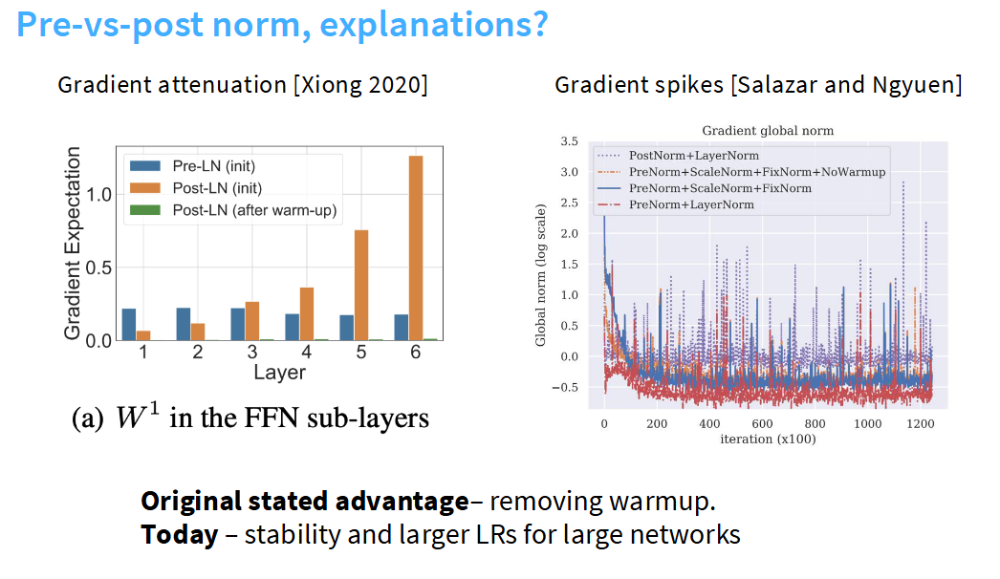

### **[深度解析]** 为什么将层归一化(Layer Normalization, LN)放在残差连接内部(即 Pre-Norm)通常是更好的选择  

并没有数学解释,但可以从直观角度解释这个问题. 因为残差连接提供了恒等映射(identity connection),从模型网络的最顶等贯穿到最底层,在训练深度网络时,这种结构使梯度传播变得非常顺畅(为什么？). 因此学界对LSTM以及其他状态空间模型都存在梯度反向传播困难的问题,但恒等连接完全不存在这类问题. 如果在其中插入归一化层,就可能破坏这种梯度传播特性,如图

图中的两个实验结果为这一观点提供了有力的数据支持:

### 1. 梯度衰减/爆炸问题 (左图)

左图展示了在网络初始化时,不同层级的梯度期望值. 

- **后置归一化 (Post-LN, 橙色柱)**:在这种结构中,归一化层位于残差连接之后. 我们可以看到,随着网络层数的增加(从第1层到第6层),梯度的期望值急剧增大. 这意味着在网络的深层,梯度会变得非常大,这可能导致**梯度爆炸**,使训练过程非常不稳定. 
- **前置归一化 (Pre-LN, 蓝色柱)**:在这种结构中,归一化层位于残差连接内部,即在进入子层(如前馈网络或自注意力层)之前. 图中显示,其梯度期望值在所有层中都保持在一个相对稳定且大小适中的范围内. 这有效避免了梯度随着网络深度增加而急剧变化的风险. 
- **后置归一化+预热 (Post-LN after warm-up, 绿色柱)**:为了解决Post-LN的梯度爆炸问题,通常需要配合使用学习率预热(warm-up)策略. 然而,如图所示,经过预热后,梯度又变得极小,接近于零,这又可能导致**梯度消失**,使得网络难以有效训练. 

**结论**:Pre-LN的结构从根本上解决了梯度在深度网络中传播时的不稳定性问题,而Post-LN则不得不在梯度爆炸和梯度消失之间进行权衡,并且严重依赖学习率预热等技巧. 

### 2. 训练过程中的梯度尖峰 (右图)

右图展示了在训练过程中全局梯度的范数(可以理解为梯度的总体大小)如何随迭代次数变化. 

- **PostNorm+LayerNorm (点状虚线)**:这条线代表了Post-LN的训练过程. 我们可以清晰地看到,其梯度范数存在大量**剧烈的、频繁的尖峰 (spikes)**. 每一次尖峰都代表一次训练的不稳定,梯度突然变得极大,可能导致模型学到的知识被破坏,需要更多时间来恢复. 
- **PreNorm 的变体 (其他三条实线/虚线)**:所有采用Pre-LN的变体,其梯度范数曲线都**非常平滑且值更低**. 这表明整个训练过程更加稳定、可预测. 

**结论**:Pre-LN能够带来更平稳的训练动态,避免了Post-LN中常见的梯度尖峰,从而提高了训练的稳定性和效率. 

### 总结

结合图示和您的理解,我们可以得出以下结论:

- **破坏恒等路径**:Post-LN(后置归一化)通过在主干道上进行归一化,干扰了残差连接所创造的平滑梯度流,导致梯度随着网络加深而急剧变化(梯度爆炸或消失). 
- **提升训练稳定性**:Pre-LN(前置归一化)将归一化操作移入残差分支,保护了主干道的恒等映射特性. 这带来了两个关键优势:

  - **稳定的梯度传播**:避免了梯度随深度增加而爆炸或消失的问题(如左图所示). 
  - **平滑的训练过程**:减少了训练中的梯度尖峰,使训练更加稳定(如右图所示). 

因此,正如图片下方文字所总结的,Pre-LN最初的优势是**不再需要学习率预热**,而如今它被广泛采用,更是因为它能**提升大型深度网络的训练稳定性,并允许使用更大的学习率**,从而加快模型收敛. 