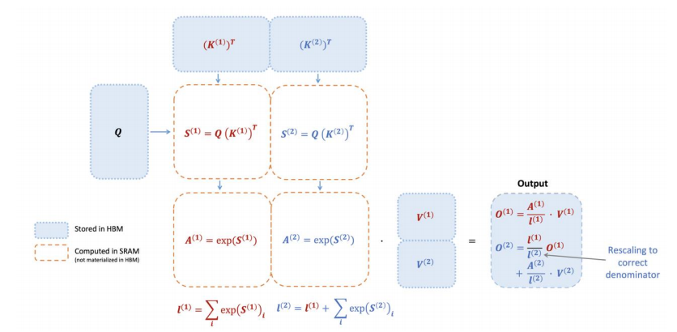

### FlashAttention 计算流程与数学原理深度解析

这张图完整地展示了FlashAttention在前向传播中的核心计算流程. 它通过**平铺 (Tiling)**,**算子融合 (Operator Fusion)**和**在线Softmax (Online Softmax)** 等技巧的精妙结合, 实现了对注意力计算的极致优化.

> FlashAttention前向传播计算流程图. 它展示了如何通过分块处理和在线更新, 避免物化完整的N x N注意力矩阵.

#### 1. 宏观策略: 平铺与内存分层

首先, 图中的框线和颜色定义了整个算法的内存操作策略:

- **蓝色实线框 (Stored in HBM):**代表数据**存储在**HBM中. 这包括最初的输入矩阵 $Q$, $K$, $V$ 以及最终的输出 $Output$.
- **橙色虚线框 (Computed in SRAM, not materialized in HBM):**代表数据是在**极速的**SRAM (即共享内存) 中被计算和暂存的.**最关键的是这些中间结果从未被写回到慢速的全局内存中**.

整个算法基于**平铺 (Tiling)**策略: 将大的 $Q$, $K$, $V$ 矩阵分解为小的**Tiles**, 然后逐个Tile地进行处理, 将计算的主战场从HBM转移到SRAM.

#### 2. 核心技巧一: Block 1 的融合计算

让我们跟随**第一个块 (Block 1)** 的计算流程, 看看FlashAttention如何将多个操作“融合”在一起.

**加载 (Load):**
一个 $Q$ 的Tile, $K$ 矩阵的第一个Tile $(K^{(1)})^T$, 以及 $V$ 矩阵的第一个Tile $V^{(1)}$, 分别从HBM加载到SRAM中.

**融合计算 (Fused Computation in SRAM):**

**计算注意力分数 (Attention Scores):**
在SRAM内部, 计算第一个分数块.
$$
S^{(1)} = Q (K^{(1)})^T
$$

**计算局部统计量:**
为了进行Softmax并保持数值稳定, 需要计算**局部的**最大值 $m^{(1)}$ 和**局部的**指数和 $l^{(1)}$.
$$
m^{(1)}_i = \max_j(S^{(1)}_{ij})
$$

$$
l^{(1)}_i = \sum_j \exp(S^{(1)}_{ij} - m^{(1)}_i)
$$

**计算局部输出:**
基于局部统计量, 计算第一个块的临时输出 $O^{(1)}$.
$$
P^{(1)}_{ij} = \frac{\exp(S^{(1)}_{ij} - m^{(1)}_i)}{l^{(1)}_i}
$$

$$
O^{(1)} = P^{(1)} V^{(1)}
$$

**关键点:**从 $S^{(1)}$ 的计算到 $O^{(1)}$ 的产出, 整个链条上的所有中间结果($S^{(1)}$, $m^{(1)}$, $l^{(1)}$, $P^{(1)}$)都发生在极速的SRAM内部, 形成了一个巨大的**融合算子 (Fused Kernel)**. $N \times N$ 规模的中间矩阵从未被“物化”到缓慢的全局内存中, 从而**彻底消除了标准注意力机制中最大的内存读写瓶颈**.

#### 3. 核心技巧二: Block 2 与在线Softmax的数学魔法

现在, 进入**第二个块 (Block 2)** 的计算. 此时, 第一个块计算出的 $O^{(1)}$, $m^{(1)}$ 和 $l^{(1)}$ 仍然保存在SRAM的寄存器中.

**加载:**
$K$的第二个Tile, $(K^{(2)})^T$, 和 $V$的第二个Tile, $V^{(2)}$, 被加载到SRAM.

**计算新块的统计量:**
像第一步一样, 在SRAM中计算出新块的 $S^{(2)}$ 及其局部的最大值 $m^{(2)}$ 和指数和 $l^{(2)}_{\text{temp}}$.
$$
S^{(2)} = Q (K^{(2)})^T
$$

$$
m^{(2)}_i = \max_j(S^{(2)}_{ij})
$$

$$
l^{(2)}_{\text{temp}, i} = \sum_j \exp(S^{(2)}_{ij} - m^{(2)}_i)
$$

**更新与修正 (Update & Rescale):**
这是整张图最核心的数学部分, 即**在线Softmax**的更新步骤.

**更新全局最大值:**
结合旧的全局最大值和新块的局部最大值, 得到新的全局最大值.
$$
m^{(\text{new})}_i = \max(m^{(1)}_i, m^{(2)}_i)
$$

**更新全局归一化因子:**
这是关键的修正步骤. 旧的归一化因子 $l^{(1)}$ 和新块的因子 $l^{(2)}_{\text{temp}}$ 都需要根据新的全局最大值 $m^{(\text{new})}$ 进行重新缩放, 然后相加.
$$
l^{(\text{new})}_i = l^{(1)}_i \cdot \exp(m^{(1)}_i - m^{(\text{new})}_i) + l^{(2)}_{\text{temp}, i} \cdot \exp(m^{(2)}_i - m^{(\text{new})}_i)
$$

**更新全局输出:**
旧的输出 $O^{(1)}$ 也需要被重新缩放, 然后与新块的贡献相加.
$$
O^{(\text{new})}_i = \frac{l^{(1)}_i \cdot \exp(m^{(1)}_i - m^{(\text{new})}_i)}{l^{(\text{new})}_i} \cdot O^{(1)}_i + \frac{\exp(m^{(2)}_i - m^{(\text{new})}_i)}{l^{(\text{new})}_i} \cdot (P^{(2)}V^{(2)})_i
$$
这里的 $P^{(2)}V^{(2)}$ 是新块的加权值. 这个公式的本质是, 将所有部分都统一到由 $m^{(\text{new})}$ 定义的同一个数值空间下进行正确的加权平均. 图中右下角的 "Rescaling to correct denominator" 正是指这个过程.

#### 4. 未在图中但至关重要的技巧: 重计算

这张图只展示了前向传播. 在反向传播时, 标准算法需要存储前向传播时计算出的 $N \times N$ 注意力矩阵. 为了避免这个新的内存瓶颈, FlashAttention采用了**重计算 (Recomputation)**: 它在前向传播时不保存这个大矩阵, 在反向传播需要它时, 再从SRAM中保存的Q, K, V的Tiles和最终的归一化统计量**重新计算**出来. 这是典型的“以计算换内存”策略.

#### 总结: 集大成的优化艺术

这张图清晰地展示了FlashAttention如何成为优化技巧的“集大成者”:

- **平铺 (Tiling)**是整个算法的**框架**, 它将问题分解, 使得在片上内存中进行计算成为可能.
- **算子融合**与**避免物化**是其在每个Tile内部的**核心执行策略**, 它消除了最大的内存读写开销.
- **在线Softmax**是解锁这一切的**算法钥匙**, 其精确的数学更新公式使得一个全局依赖的操作能够在Tiling框架下被正确地、高效地计算.
- **重计算**则是其在反向传播中的**内存保障**, 确保了端到端的内存高效性.

通过这套组合拳, FlashAttention将一个原本受限于内存带宽(Memory-Bound)的问题, 转化为了一个受限于计算能力(Compute-Bound)的问题, 从而能够充分释放现代GPU强大的算力.