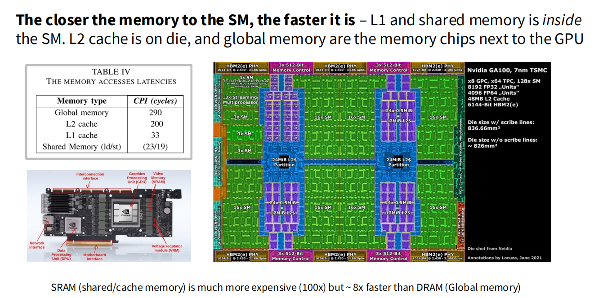

### 1. 核心思想: 距离决定速度

GPU内存层级结构的核心原则非常直观: **数据存储离计算单元 (流式多处理器, SM) 越近, 访问速度就越快, 但容量也越小, 成本越高.** 这种结构是对速度、容量和成本三者之间权衡的结果. 编写高性能的GPU代码, 本质上就是一场精心策划的数据搬运游戏, 目的是让SM在绝大多数时间内都能从最快的内存层级中获取数据, 避免因等待慢速内存而陷入“饥饿”状态.

> 图1: A100 GPU的物理布局图 (右侧) 和不同内存类型的访问延迟 (左侧). 物理上的邻近性直接转化为访问速度的巨大差异.

### 2. 内存层级详解

我们可以将GPU的内存划分为以下几个主要层级, 从最快到最慢排列:

#### a. 寄存器 (Registers)

- **位置**: 直接位于SM的计算核心内部.
- **速度**: 最快的内存, 访问延迟几乎可以忽略不计 (约1个时钟周期).
- **容量**: 非常有限, 每个SM有固定数量的寄存器 (例如A100每个SM有65536个32位寄存器), 这些寄存器被该SM上所有活跃的线程共享.
- **编程模型**: 每个线程拥有自己私有的寄存器. 编译器会自动将函数的局部变量、计算的中间结果等分配到寄存器中.
- **核心作用**: 为单个线程提供超高速的临时数据存储.

#### b. L1缓存 / 共享内存 (L1 Cache / Shared Memory)

- **位置**: 位于每个SM内部.
- **物理介质**: 它们在物理上通常是同一块SRAM (静态随机存取存储器). SRAM速度极快但成本高昂.
- **速度**: 非常快, 延迟远低于L2和全局内存 (例如A100上约20-30个时钟周期).
- **容量**: 有限, 每个SM的SRAM大小固定 (例如A100上每个SM有192KB). 这块SRAM可以在kernel启动时配置为不同比例的L1缓存和共享内存.
- **编程模型**:
    - **L1缓存**: 对程序员透明, 硬件自动管理, 用于缓存对本地内存和全局内存的访问.
    - **共享内存**: 由程序员显式控制. 它是**每个线程块 (Block) 内所有线程共享**的读写空间. 这是实现线程块内高效协作和数据重用的关键.
- **核心作用**: 共享内存是**平铺 (Tiling)**等高级优化技巧的基石. 通过将需要重复访问的数据从慢速的全局内存一次性加载到共享内存中, 线程块内的所有线程就可以从这个快速的“本地仓库”中反复读取数据, 从而极大地减少了对全局内存的访问次数.

#### c. L2缓存 (L2 Cache)

- **位置**: 位于GPU芯片上, 但在所有SM之外, 由所有SM共享.
- **速度**: 比L1/共享内存慢, 但比全局内存快得多 (例如A100上约200个时钟周期).
- **容量**: 比L1/共享内存大得多 (例如A100有40MB的L2缓存).
- **编程模型**: 对程序员完全透明, 硬件自动管理, 作为最后一级片上缓存, 服务于所有SM对全局内存的访问.
- **核心作用**: 缓解所有SM访问全局内存的压力, 捕捉SM之间的数据局部性.

#### d. 全局内存 (Global Memory)

- **位置**: 位于独立的DRAM (动态随机存取存储器) 芯片上, 在GPU芯片之外, 通过高带宽内存 (HBM) 接口与GPU核心连接.
- **速度**: 最慢的内存层级, 访问延迟最高 (例如A100上约300+个时钟周期).
- **容量**: 最大, 现代GPU通常配备几十GB的全局内存 (例如A100有40GB或80GB).
- **编程模型**: 所有线程块中的所有线程都可以读写全局内存. 它是主机 (CPU) 与设备 (GPU) 之间数据交换的主要场所.
- **核心作用**: 存储模型的权重、输入数据、输出结果等大规模数据. 它是性能优化的主要“敌人”, 我们的目标就是尽可能减少对它的访问.

### 3. 带宽与延迟: 两个维度的考量

- **延迟 (Latency)**: 指从发出内存请求到接收到第一个数据字节所需的时间. 如上文所述, 不同层级间的延迟差异是数量级的.
- **带宽 (Bandwidth)**: 指单位时间内可以传输的数据量.

| 内存类型 | 典型延迟 (时钟周期) | 典型带宽 (TB/s) |
| :--- | :--- | :--- |
| 寄存器/L1/共享内存 | ~20-30 | > 19 |
| L2缓存 | ~200 | ~2-5 |
| 全局内存 (HBM) | > 300 | ~1.5 |

从表中可以看出, 不仅延迟差异巨大, 带宽也同样如此. 片上内存 (On-chip memory) 的带宽远高于片外 (Off-chip) 的全局内存. 这进一步强调了将计算尽可能地限制在SM内部的重要性.

### 4. 总结与启示

理解GPU内存层级结构对于性能优化至关重要. 它告诉我们:

1.  **数据局部性是王道**: 算法应该被设计成能最大化利用数据局部性, 即一旦一个数据被加载到快速内存中, 就应该尽可能多地使用它.
2.  **避免全局内存访问**: 每一次对全局内存的访问都是一次昂贵的操作. 优化的核心目标就是用对快速内存的多次访问来替代对全局内存的访问.
3.  **共享内存是你的好朋友**: 共享内存是程序员可以直接控制的、实现高性能的关键工具. 善用共享内存进行线程块内的数据共享和重排, 是**平铺 (Tiling)**和许多其他高级优化技巧的基础.
4.  **层次化思考**: 在设计或分析一个GPU kernel时, 应该时刻在脑中保持这张内存层级图, 思考数据在不同层级之间是如何流动的, 瓶颈最有可能出现在哪里.