# 第五讲 详解GPU架构, 性能优化

> 虽然大多数人最后不会成为CUDA工程师去专门针对GPU开发某些东西, 但是类似flashattention, 线程调度这些infra知识在2025年DeepSekk-R1之后被大家广泛关注, 因此进行一定程度的了解和实操是必要的, 因此推荐几个非常棒的资源 [GPU学习资源](./Lecture5-GPU学习资源.md)

今天我们来谈谈**GPU**. GPU是驱动我们语言模型运行的核心部件, 所以正确地理解它至关重要. 如果你没有真正研究过驱动模型运行的硬件, 它们可能看起来相当神秘. 所以我今天的目标是尝试让CUDA和GPU不再那么神秘.

### 课程大纲与目标

我想揭开神秘面纱的一件事是: GPU为什么会变慢? 它们会以非常神秘的方式变慢. 在讲座的后半部分, 我会尝试讲解下面这张图. 当你增加矩阵乘法的大小时, 你可能会预期它会变慢或变快, 或者其他什么. 但你会看到这些非常难以预测的波浪状模式. 你可能会想, 为什么我的GPU在某些数字的特定倍数下速度快, 而在其他数字下就慢呢? 这非常神秘, 我们将尝试理解这一点.

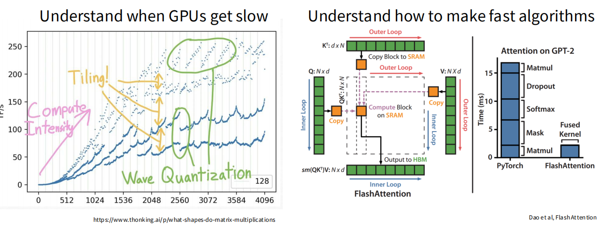

> 图1: 矩阵乘法性能表现出复杂的波浪形态, 这与硬件的底层工作方式有关.

另一件事是, 我们希望了解如何设计出快速的算法. 我想你们几乎所有人都听说过 **[FlashAttention详解](./Lecture5-Flash-Attention-Explained.md)**. 它通过在Transformer内部非常巧妙地计算注意力操作, 使得处理更长的上下文成为可能. 所以, 也许你也想提出像Flash Attention那样的新算法或新实现. 我们需要理解哪些原语和组件才能做到这一点呢?

所以, 这就是今天的两个学习目标. 首先, 在讲座结束时, 你应该对GPU感到相当自在了, 对它们的工作方式有一个大致的了解. 其次, 你应该能自如地加速算法的某些部分. 当你设计一个新的架构时, 希望你能感觉可以尝试用CUDA来加速它.

因为硬件不一定是我工作的领域, 我要特别感谢一些资源, 尤其是Horace He的博客, 上面有很多有趣的GPU知识点. 比如, 为什么填充了零的矩阵乘法比没有填充零的要快? 你可以通过他的博客学到这些. 此外, 我还借鉴了Kuda Mode小组和Google出品的TPU书籍等其他资源.

今天的讲座将分为三个部分:

1. **深入GPU**: 它们如何工作以及重要的组成部分. 以及浅显地讲讲TPU
2. **理解GPU性能**: 什么让GPU快, 什么让它慢.
3. **融会贯通**: 剖析 **[FlashAttention详解](./Lecture5-Flash-Attention-Explained.md)**, 看看所有知识点如何结合在一起.

本节课, 我们将聚焦于硬件堆栈的非并行部分. 

### 性能的舞台: 计算能力推动进步

我们知道, 拥有更多的计算能力对于训练大型语言模型非常有帮助. 这是一个预训练的缩放法则图表, 但你也可以用一个推理的缩放图来替换它. 人们普遍认为, 你拥有的计算能力越多, 你可以在数据上做的处理就越多, 你可以消化更多数据, 训练更大的模型. 所有这些都会带来性能的提升.

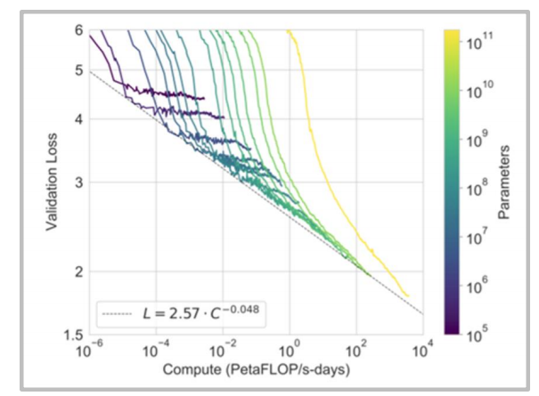

> 图2: Kaplan等人提出的神经缩放法则, 显示了计算量 (PetaFLOP/s-days) 与模型性能 (验证损失) 之间的可预测关系.

所以你可能会想, 深度学习固然重要, 但真正驱动性能的是更快的硬件、更好的利用率和改进的并行化. 这就为我们理解硬件的重要性设定了舞台.

### 计算能力的演进: 从登纳德缩放到并行缩放

一旦你开始思考计算能力的缩放, 你会问, 我们如何获得计算能力的缩放?

在半导体缩放的早期, 如果你思考CPU如何变得更快, 它们遵循一种叫做**登纳德缩放 (Dennard Scaling)**的定律. 随着摩尔定律, 芯片上的晶体管数量每年翻倍. 这种翻倍导致了登纳德缩放, 即越来越小的晶体管可以用越来越低的功率在越来越快的时钟速度下驱动, 这反过来又给你带来更多的性能.


> 图3: Hennessy和Patterson展示的处理器数据显示, 单线程性能在2000年代后趋于平缓, 标志着登纳德缩放的结束.

然而, 从1980年代到2000年代, 这种方式逐渐达到了极限. 你可以在这张图表中看到, 单线程性能 (蓝色点) 基本上开始趋于平缓. 当然, 晶体管的数量并没有真正开始下降, 芯片的晶体管密度越来越高, 但这对提升单线程的吞吐量没有帮助. 这意味着我们不能仅仅在绝对意义上让计算变得更快, 我们必须用**并行缩放** (Parallel Scaling)来弥补.

因此, 深度学习和神经网络的缩放故事, 就是从单线程缩放 (在绝对意义上更快地完成计算) 转向并行缩放 (同时计算大量工作负载). 这是Bill Dally主题演讲中我最喜欢的计算缩放图之一, 它展示了每秒整数操作数的超指数级增长, 从早期的K20 GPU到H100 GPU. 这是一条非常惊人的曲线.

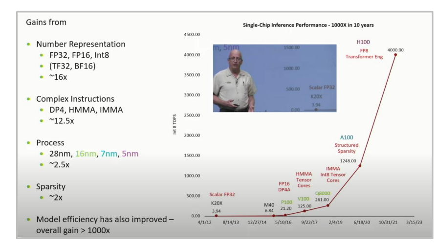

> 图4: Bill Dally在HotChips主题演讲中展示的图表, 显示了并行缩放带来的巨大性能飞跃.

所以, 我们必须真正理解如何利用这条曲线, 才能真正从我们的语言模型中获得最大收益.

### GPU与CPU的核心区别

**CPU** 为少数快速线程进行优化, 而**GPU**为海量线程进行优化.

为了支持CPU的执行模型 (有很多分支和条件控制逻辑), 你需要大的**控制单元 (Control Unit)**和**缓存 (Cache)**. 而GPU则将更多的芯片面积用于海量的微型计算单元, 也就是**算术逻辑单元 (ALU)**, 而用于控制和缓存的部分则少得多.

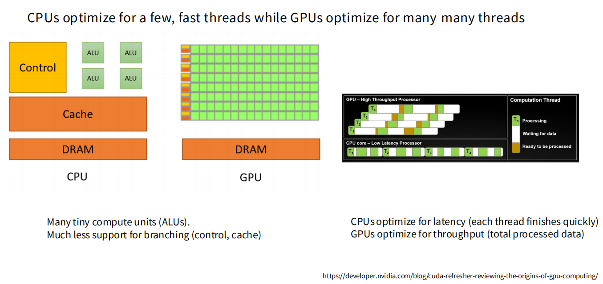

> 图5: CPU将大量芯片面积用于控制和缓存, 而GPU则用于大量的ALU.

从设计目标来看, 它们为截然不同的目标而设计.

- **CPU优化延迟 (Latency)**: 尽快完成单个任务.
- **GPU优化吞吐量 (Throughput)**: 尽快完成所有任务的总和.

在GPU中, 线程可以非常轻量地进入休眠和被唤醒. 最终, 你会比CPU更早地完成所有的工作负载 (T1到T4), 尽管单个任务的延迟可能更高.

### GPU剖析 Part 1: 执行单元

GPU有一个相当不同的内部结构. 其核心概念是**流式多处理器 (Streaming Multiprocessor, SM)**. 你可以把SM看作一个原子单元(Atom Unit). 当你在像Triton这样的环境中编程时, 操作将在SM的层面上进行.

在每个SM内部, 包含许多**流式处理器 (Streaming Processor, SP)**. 一个流式处理器将执行大量的并行线程.

一种思考方式是, SM拥有一套控制逻辑, 它可以决定执行什么, 比如进行分支. SP则负责接收相同的指令, 并将其应用于许多不同的数据片段.

SM是控制的最小单元, SP可以单独进行大量计算


> 图6: 一个完整的GA100 (A100 GPU的核心) 包含128个SM. 每个SM内部又有许多执行单元, 如FP32核、张量核(Tensor Core)等.

一个A100 GPU拥有128个SM, 这远多于大多数CPU的核心数, 并且每个SM都将拥有大量的SP和专门的矩阵乘法单元.

### GPU剖析 Part 2: 内存

在GPU中, 计算固然重要, 但**内存**可以说更为关键, 并且在未来会越来越重要.

要理解内存, 你必须了解GPU和芯片的物理布局, 因为在如此高的运行速度下, 内存的**物理邻近性** (physical proximity)变得至关重要.


> 图7: A100 GPU的物理布局图 (右侧) 和不同内存类型的访问延迟 (左侧). 越靠近SM的内存速度越快.

这引出了 **[GPU内存层级结构](./Lecture5-GPU-Memory-Hierarchy.md)** 的概念. 简而言之, 内存离SM越近, 速度就越快.

- **L1缓存和共享内存 (Shared Memory)**: 位于SM内部, 速度最快 (约20-30个时钟周期).
- **L2缓存**: 位于芯片上, 紧邻SM, 速度次之 (约200个周期).
- **全局内存 (Global Memory, 通常是DRAM/HBM)**: 位于GPU芯片外部, 通过HBM (高带宽内存) 连接器相连, 速度最慢 (约300个周期).

这个数量级的速度差异会严重影响性能. 如果你的计算需要频繁访问全局内存, SM可能大部分时间都在等待数据而处于空闲状态. 因此, 思考内存问题, 在某种程度上就是思考GPU如何工作的关键.

### GPU的执行与内存模型

在为GPU编写高性能代码时, 你必须思考其**执行模型**和**内存模型**.

#### 执行模型

**[GPU执行模型: 线程、线程束与线程块](./Lecture5-GPU-Execution-Model.md)** 是核心. 它有三个层次的粒度需要你思考:

- **线程 (Thread)**: 执行工作的最小单位.
- **线程块 (Block)**: 一组线程, 每一个线程块会被分配到一个SM上执行.
- **线程束 (Warp)**: 线程块内的线程会以32个为一组, 称作一个线程束, 一同执行.


> 图8: 一个CUDA程序被划分为多个线程块 (Blocks), 每个块被分配到一个SM上. 在SM内部, 块被进一步划分为线程束 (Warps), 由Warp调度器执行.

CUDA编程模型映射到GPU硬件上执行的过程可以理解为一个自顶向下的任务划分和分发流程:

**1. 程序到线程块 (Program to Blocks)**

* **CUDA程序 (CUDA Program):** 首先, 一个待处理的大规模并行任务, 也就是您的CUDA程序(或称为Kernel), 会被逻辑上划分为一个网格(Grid)的**线程块 (Blocks)**.  图中展示了这个程序被分成了从Block 0到Block 4095等成千上万个线程块. 
* **分配至SM:** 这些线程块是独立的执行单元, 会被分配到GPU的**流式多处理器 (Streaming Multiprocessor, SM)** 上执行.  SM是GPU的核心计算单元, 相当于CPU的核心.  如图中箭头所示, Block 0和Block 4095分别被指派给了一个SM. 一个SM可以同时处理多个线程块. 

**2. 线程块到线程束 (Block to Warps)**

* **线程块的构成:** 每个线程块内部包含了若干个**线程 (Threads)**. 图中标注了此应用中每个线程块使用256个线程. 
* **划分为Warp:** 在SM内部, 线程块中的线程会被进一步划分为被称为**线程束 (Warps)** 的小组.  一个Warp固定包含32个连续的线程.  因此, 一个拥有256个线程的线程块会被分成 256 / 32 = 8个Warp(即图中的Warp 0 到 Warp 7). 

**3. 线程束的执行 (Warp Execution)**

* **Warp调度器:** SM内部有多个**Warp调度器 (Warp Schedulers)**, 图中显示了4个.  这些调度器负责决定在每个时钟周期执行哪个Warp的指令. 
* **SIMT架构:** GPU采用的是一种称为**单指令多线程 (Single Instruction, Multiple Thread, SIMT)** 的执行模式.  这意味着在一个Warp中的32个线程会同时执行相同的指令, 但每个线程都在处理不同的数据.  如图所示, Warp 1的第10条指令被调度执行, 其内部的32个线程(由INT32和FP32单元代表)都在执行这条指令. 
* **延迟隐藏:** Warp调度器可以非常快速地在不同的Warp之间切换.  当一个Warp因为等待数据加载等原因而停顿时, 调度器会立刻切换到另一个准备就绪的Warp去执行, 从而确保计算单元始终保持忙碌, 有效地隐藏了内存访问延迟. 

关键点是: **跨越线程块的信息传递需要通过缓慢的全局内存来读写.** 因此, 理想的程序应该让一个线程块处理一小块数据, 将其加载到快速的共享内存中, 完成所有计算后再写回.

#### **内存模型**


> 图9: GPU内存模型示意图

**第一层:线程私有内存 (Thread-Private)**
每个线程拥有自己的**寄存器 (Register)**和**本地内存 (Local Memory)**, 但是跨块的信息需要写入全局内存. 这是金字塔的顶端, 速度最快, 但容量最小, 仅限单个线程访问. 

* **寄存器 (Registers):** 位于SM芯片上的最快内存. 每个线程拥有自己的一组私有寄存器. 变量只要有可能, 就会被编译器优先放入寄存器. 一旦线程结束, 寄存器的内容就消失了. 
* **本地内存 (Local Memory):** 名字有一定误导性, 它**物理上位于全局内存 (DRAM) 中**, 因此速度很慢. 它对每个线程来说是私有的. 当寄存器不足(称为“寄存器溢出”), 或者需要存储一些无法放入寄存器的复杂数据结构时, 编译器会自动使用本地内存. 它的存在是为了保证程序的正确性, 但我们应尽量避免使用它. 

**第二层:线程块共享内存 (Block-Shared)**
同一个线程块内的所有线程共享该块的**共享内存 (Shared Memory)**. 这是实现高性能的关键层次, 是连接线程和全局内存的重要桥梁. 

* **共享内存 (Shared Memory):** 位于SM芯片上, 访问速度极快, 几乎和寄存器一样快. 它被**同一个线程块内的所有线程共享**, 是实现块内线程高效通信和数据交换的核心. 其生命周期与线程块相同, 当线程块执行完毕, 其内容就会失效. 

**第三层:全局共享内存 (Grid-Shared)**
所有线程都可以访问**全局内存 (Global Memory)**. 
这是金字塔的基座, 容量最大, 但速度最慢, 是所有内存层级的基础. 

* **全局内存 (Global Memory):** 这是GPU容量最大(通常为GB级别)的内存, 物理上位于显卡DRAM. **网格(Grid)中的所有线程以及CPU都可以读写它**. 它是CPU和GPU之间传递数据、存储大规模数据集以及**实现跨线程块通信的唯一途径**. 虽然它有L1和L2缓存来缓解延迟, 但其访问速度远慢于共享内存和寄存器. 
* **常量内存 (Constant Memory) & 纹理内存 (Texture Memory):** 它们也是全局内存的一部分, 但经过特殊优化. 常量内存有缓存, 非常适合“一个Warp中的所有线程同时读取同一地址”的广播式访问. 纹理内存则为图形学和具有空间局部性的数据读取做了优化. 

### **核心思想与优化策略 (关键点优化)**

可以将其总结为**最大化本地计算, 最小化全局通信**的原则. 

理想的高性能CUDA程序设计模式(常被称为“Tiling”或“分块”策略)正是基于这个内存金字塔模型:

1. **分工合作:** 将一个大的计算任务(存储在全局内存中)划分为多个小的数据块. 
2. **数据搬运:** 每个线程块 (Block) 负责一小块数据. 块内的线程们合作, 高效地将它们负责的数据块从**慢速的全局内存**一次性加载到**极速的共享内存**中. 
3. **闭门计算:** 数据加载到共享内存后, 块内所有线程就可以在几乎没有延迟的情况下, 对共享内存中的数据进行频繁的读写和计算, 完成所有需要的数据交换和处理, 而无需再访问缓慢的全局内存. 
4. **结果回传:** 当所有计算完成后, 线程们再次合作, 将最终的计算结果从共享内存一次性写回到全局内存. 

通过这种方式, 程序将绝大多数的内存访问都限制在了SM内部的快速共享内存上, 极大地减少了对慢速全局内存的访问次数, 从而掩盖了内存延迟, 实现了性能的大幅提升. 

### GPU模型的优势

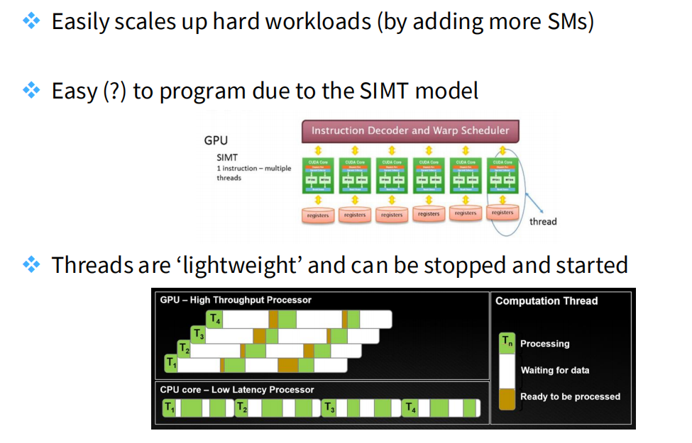

- **易于扩展**: 通过增加更多的SM, 可以轻松扩展以处理繁重的工作负载.
- **易于编程 (?)**: 由于**SIMT** (单指令多线程)模型, 编程相对容易. 每个线程束中的所有线程执行相同的指令, 只是处理不同的数据.
- **线程轻量级**: 线程可以被非常快速地停止和启动, 这使得GPU能够高效地隐藏延迟, 保持高利用率.

### TPU浅析

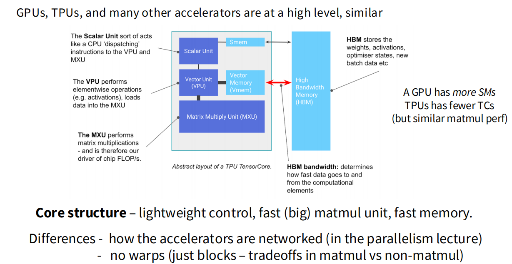

> 图10: Google的TPU模型架构

这张图通过展示一个TPU的**张量核心**(TensorCore, TC)的抽象布局, 揭示了现代AI加速器(包括GPU)的共同设计哲学:**轻量级的控制单元 + 巨大而快速的矩阵计算单元 + 高速的内存层次结构**. 

我们可以把图中的TensorCore理解为与GPU的**流式多处理器**(Streaming Multiprocessor, SM)相对应的基本计算单元, 它们各自都是独立运作的处理单元, 可以处理数据. 

**Tensor Core (TC) 内部结构解析**

1. **标量单元 (Scalar Unit):**

   * **作用:** 相当于一个微型CPU或**控制大脑**, 本质上是一个控制单元. 它负责执行常规的、串行的指令, 并向向量单元和矩阵单元“分发”任务. 
   * **类比GPU:** 类似于SM中负责指令调度和控制逻辑的部分. 
2. **向量单元 (Vector Unit, VPU):**

   * **作用:** 专门处理**逐元素**(element-wise)的向量运算. 例如, 对一个向量的所有元素应用ReLU激活函数、进行加法或乘法等. 它也负责将数据加载到矩阵单元中. 
   * **类比GPU:** 类似于SM中的CUDA核心, 可以执行大量的并行浮点和整数运算, 但TPU将其功能进一步明确化. 
3. **矩阵乘法单元 (Matrix Multiply Unit, MXU):**

   * **作用:** 这是TPU的**心脏和马力来源**. 它是一块巨大且高度优化的硬件, 专门用于执行大规模的矩阵乘法运算. 深度学习中的绝大部分计算(如卷积、全连接层)最终都可以归结为矩阵乘法, 因此MXU是芯片浮点运算性能(FLOP/s)的主要贡献者. 
   * **类比GPU:** 对应于现代NVIDIA GPU中的**Tensor Core**. V100及之后架构的GPU也加入了类似的专用硬件来极大地加速矩阵运算. 

#### **内存层次结构**

* **片上高速内存 (Smem/Vmem):**
  * **作用:** 位于TensorCore内部, 访问速度极快. 类似于GPU的**共享内存**(Shared Memory)和寄存器, 用于暂存需要被频繁访问的中间数据, 避免访问慢速的外部内存. 
* **高带宽内存 (High Bandwidth Memory, HBM):**
  * **作用:** 位于芯片外部, 是**全局内存**. 它容量巨大, 用于存储模型的权重、激活值、优化器状态等所有数据. 虽然速度远快于普通DRAM, 但相比片上内存仍然慢得多. 
  * **瓶颈:** **HBM带宽**决定了数据从外部“喂”给计算单元的速度, 是决定整体性能的关键瓶颈之一, 这与GPU面临的挑战完全相同. 

### **GPU与TPU的核心异同**

#### **相似之处 (Core structure is very much the same):**

* **设计理念相同:** 两者都采用“多个计算核心(SM/TC)并行工作”的模式. 
* **核心功能相似:** 每个计算核心内部都有控制逻辑、通用计算单元和**为矩阵乘法高度优化的专用硬件**. 
* **内存模型相似:** 都采用了“少量极速片上内存 + 大量高速片外内存”的分层内存架构. 

#### **不同之处 (Differences):**

1. **通用性 vs. 专用性:**

   * **GPU:** 更通用. 它的SM和**Warp**执行模型被设计用来处理各种并行任务, 如图形渲染、科学计算等. 
   * **TPU:** 更专用. 它**没有Warp的概念**, 执行模型更简单, 整个架构被极致地优化用于执行矩阵乘法. 这使得它在处理非矩阵运算的任务时效率较低. 这是一种“用通用性换取极致专用性能”的权衡. 
2. **规模和网络:**

   * 一个GPU通常拥有**更多**的SM, 而一个TPU芯片的TC数量相对**较少**, 但每个TC的矩阵计算能力极强, 因此整体矩阵性能可以与GPU媲美. 
   * 它们将多个加速器连接在一起的方式(网络拓扑)也有所不同, 这会影响大规模分布式训练的效率. 

**总而言之, 这张图告诉我们, 为了应对深度学习中以矩阵乘法为主的计算需求, 不同的硬件厂商殊途同归, 都走向了“专用硬件加速”的道路. 理解了GPU的SM和内存模型, 就很容易理解TPU的核心工作原理, 反之亦然. **

### 计算与内存的赛跑:性能瓶颈的根源

在深入探讨具体的优化技巧之前, 我们必须先理解一个支配现代高性能计算的宏观趋势, 这也是我们所有优化工作的根本原因. 


> 图: Compute scaling is faster than memory scaling (计算能力的扩展速度远快于内存)

这张图清晰地揭示了一个残酷的现实:**硬件算力(HW FLOPS, 黑线)的增长速度, 远远超过了内存带宽(DRAM BW, 绿线)和互联带宽(Interconnect BW, 蓝线)的增长速度. **

#### **图表解读**

这张图的Y轴是对数坐标, 这意味着图中的直线实际上代表着指数级增长. 

1. **硬件算力 (黑色线):** 在过去的20多年里, 算力增长了惊人的**60,000倍**. 这得益于更多的晶体管和专门的硬件(如Tensor Cores). 
2. **内存带宽 (绿色线):** 在同样的时间里, 内存带宽只增长了约**100倍**. 尽管从GDDR发展到HBM已经是巨大的进步, 但与算力的增长相比, 完全不在一个量级. 
3. **互联带宽 (蓝色线):** 这是三条线中最平缓的, 增长得最慢, 大约只有**30倍**. 

#### **内存墙”问题**

这个巨大的性能鸿沟就是所谓的 **内存墙(Memory Wall)”** 问题. 它意味着:

* **瓶颈的转移:** 在早期, 程序的瓶颈可能是**计算密集型 (Compute-Bound)**. 但现在, 绝大多数高性能计算任务都变成了**内存密集型 (Memory-Bound)**. 
* **计算单元的“饥饿”:** 我们的GPU拥有海量的计算单元, 但如果数据不能及时地从内存中送达, 这些计算单元就只能闲置等待, 造成巨大的性能浪费. 正如图片下方的结论所说:**FLOPs scale faster than memory – it's hard to keep our compute units fed with data!**”(算力比内存增长得快——我们很难让计算单元一直有数据可算！)

这个根本性的矛盾解释了为什么我们之后讨论的所有优化技巧——无论是算子融合、重计算还是平铺——其核心目标都是**想尽一切办法减少对慢速全局内存的访问, 最大化计算单元的利用率**. 

### 让机器学习工作负载在GPU上跑得更快

现在你们都是GPU专家了. 我们来谈谈如何让机器学习工作负载在GPU上跑得飞快.

核心问题是: **我们如何避免受限于内存?**

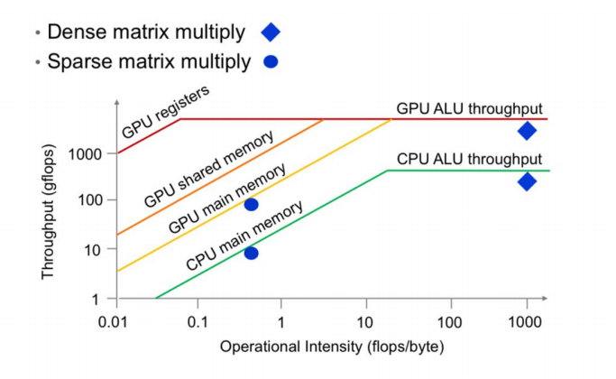

> 图11: 屋顶线模型展示了性能 (吞吐量) 如何受到计算强度和内存带宽的限制.

这张图是**屋顶线模型 (Roofline Model)**, 它描绘了性能的两个区域:

- **受内存限制 (Memory-bound)**: 在图的左侧斜坡部分, 性能的瓶颈是内存带宽, 即使有再多的计算能力也无法发挥.
- **受计算限制 (Compute-bound)**: 在图的右侧平顶部分, 我们已经充分利用了计算单元, 性能达到了硬件的理论峰值.

我们的目标是让我们的算法处于右侧区域. 以下是一些实现这一目标的技巧.

#### 技巧1: 控制流分歧 (非内存问题)

这是我们要讨论的唯一一个非内存瓶颈, 但它对于理解GPU的执行模型至关重要. 

正如前面所说, GPU在**SIMT** (单指令多线程)模型下运行. 这个模型的铁律是:**在一个线程束(Warp)中, 所有32个线程在任何一个时钟周期都必须执行完全相同的指令. **

那么, 当代码中出现`if-else`这样的条件分支, 而一个线程束内的线程根据各自的数据得出了不同的判断结果时, 会发生什么呢？这就是**控制流分歧 (Control Divergence)**. 

**分歧是如何执行的？**

假设一个Warp中的32个线程遇到了以下代码:

```c++
if (condition) {
    // A代码块
} else {
    // B代码块
}
```

* **第1步:评估条件. ** 所有32个线程都评估`condition`. 假设前16个线程结果为`true`, 后16个为`false`. 
* **第2步:执行A代码块. ** GPU会先执行`if`分支. 那16个`true`的线程会执行A代码块中的指令. 此时, 另外16个`false`的线程并不会去做别的事情, 它们会被**屏蔽**(masked out)或进入“休眠”状态, 空闲地等待. 
* **第3步:执行B代码块. ** 当A代码块执行完毕后, 角色反转. 之前执行任务的16个线程现在进入休眠, 而之前休眠的16个线程被唤醒, 开始执行`else`分支中的B代码块. 


> 图12: 当线程束遇到if-else分支时, 硬件会串行化两个分支的执行. 首先, 满足`if`条件的线程(绿色)被激活, 执行`if`代码块, 而其他线程(灰色)则被屏蔽. 然后, 执行`else`代码块的线程被激活, 而第一批线程被屏蔽. 

**性能的代价**

从上面的过程可以看出, GPU并没有能力同时执行`if`和`else`两个分支. 它实际上是将两个分支**串行化 (Serialized)**了. 因此, 总的执行时间约等于**A代码块的执行时间 + B代码块的执行时间**. 

**一个比喻:** 想象一个旅行团(Warp)只有一个导游(指令单元). 在分岔路口, 一半人想去景点A, 一半人想去景点B. 导游不能分身, 只能先带着A组去参观, 此时B组只能在原地等待. 等A组回来后, 导游再带着B组去参观, 这时A组在原地等待. 整个团队通过这个分岔路口的时间, 是参观两个景点的总和. 

**结论:** 在性能敏感的CUDA内核中, 线程束内的控制流分歧是“性能杀手”. 它破坏了GPU大规模并行的核心优势. 因此, 在设计算法时, 应尽可能避免在Warp内部产生依赖于不同数据的条件分支, 或者尝试将条件设计得对整个Warp都是统一的(例如, `if (threadIdx.x / 32 == some_value)`, 这样整个Warp的判断结果会是一致的). 

#### 技巧2: 低精度计算

这是一个重要的技巧. 使用较低的数值精度有几个好处:

- **减少数据移动**: 如果你的位数更少, 你需要移动的比特就更少.
- **利用专用硬件**: 现代GPU有专门为低精度 (如FP16, BF16, INT8) 设计的硬件, 如**张量核 (Tensor Core)**, 它们执行矩阵乘法的速度远超标准FP32单元.

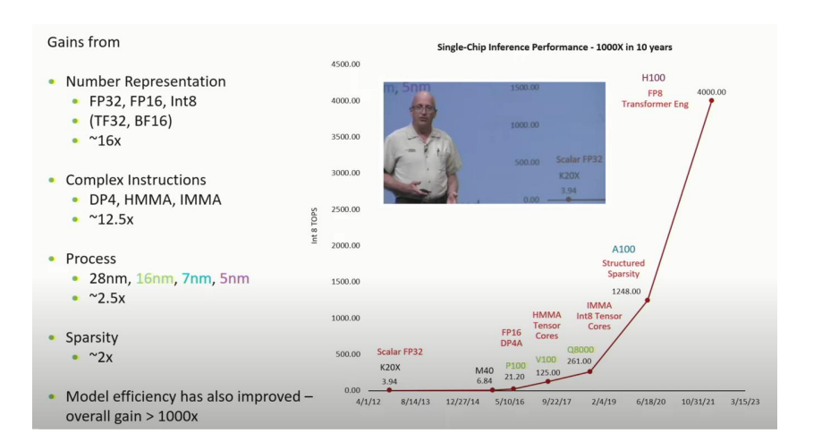

> 图13: Tensor Core的设计完美契合了混合精度的思想. 它接收16位的输入进行快速的矩阵乘法, 但内部使用32位的累加器进行求和, 这样可以在保持高速计算的同时, 有效防止中间结果的精度损失. 

**混合精度训练** (Mixed-Precision Training)就是利用了这一点. 大部分计算 (如矩阵乘法) 可以用16位完成以获得速度, 而一些需要更高精度的部分 (如累加或损失函数计算) 则保持在32位.
这是一个至关重要的技巧, 它直接解决了我们在“计算与内存的赛跑”中看到的**内存瓶颈**问题. 核心思想很简单:用更少的比特来表示数字. 

使用较低的数值精度(如从32位浮点数FP32降到16位浮点数FP16)有三大好处:

1. **减少数据移动, 提高计算强度 (Intensity)**

   * 移动一个FP16数字所需的数据量只有FP32的一半. 正如图片中的ReLU示例所示, 对于同样一次浮点运算(1 FLOP), FP32需要移动8字节的数据, 而FP16只需要4字节. 
   * 这使得**计算强度(Arithmetic Intensity)**, 即**每字节内存访问对应的浮点运算次数**, 直接翻倍. 这意味着我们的算法变得更加**计算密集**, 而不是**内存密集**, 从而能更好地利用GPU强大的算力, 远离屋顶线模型的“内存墙”斜坡. 
2. **减少内存占用**

   * 模型的权重、激活值和梯度占用的显存减半. 这使得我们可以在同样的硬件上训练**更大的模型**或使用**更大的批量(Batch Size)**, 这通常能带来更好的模型性能和训练稳定性. 
3. **利用专用硬件加速**

   * 现代GPU(从NVIDIA Volta架构开始)内置了专门为低精度计算设计的硬件单元, 即**张量核 (Tensor Core)**. 这些单元执行矩阵乘加运算(Matrix Multiply-Accumulate)的速度远超标准的FP32计算单元. 

#### 混合精度训练 (Mixed-Precision Training)

然而, 完全切换到FP16是有风险的. FP16的数值范围和精度都远低于FP32, 这可能导致两个严重问题:

* **上溢 (Overflow):** 数值过大, 变成无穷大 (infinity). 
* **下溢 (Underflow):** 数值过小, 被舍入为零. 这在梯度计算中尤其致命, 因为很多梯度值本身就非常小, 一旦归零, 权重就无法更新, 模型训练就会停滞. 

为了在享受FP16的速度优势的同时避免其不稳定性, **混合精度训练** (Mixed-Precision Training)应运而生. 它并非简单地将所有操作都换成16位, 而是一套聪明的策略:

1. **FP32权重主备份:** 在内存中始终维护一份FP32精度的“主权重”. 
2. **FP16计算:** 在每次训练迭代中, 将FP32主权重转换为FP16用于前向和反向传播. 这样, 绝大部分的矩阵运算都可以利用Tensor Core飞速完成. 
3. **动态损失缩放 (Dynamic Loss Scaling):** 这是最关键的技巧. 在反向传播开始前, 将计算出的损失值乘以一个很大的**缩放因子**(例如1024). 根据链式法则, 这个缩放会传递给所有梯度, 将那些原本可能因太小而下溢的梯度值“放大”到FP16可以有效表示的范围内. 
4. **FP32权重更新:** 梯度在FP16下计算完毕后, 将其转换回FP32, 并除以之前的缩放因子还原. 最后, 用这个精确的32位梯度来更新32位的主权重. 

举个例子

这张图揭示了混合精度训练的核心思想:**通过智能地结合专用硬件(Tensor Cores)和精细化的运算策略, 在保证数值稳定性的前提下, 最大化训练速度**. 左侧的Tensor Core工作原理图展示了其**硬件基础**:它接收低精度的16位输入(FP16/BF16)以实现极高的数据吞吐量和计算速度, 但在内部进行乘法和累加时, 使用高精度的32位累加器(FP32 accumulator). 这种“低精度输入, 高精度累加”的设计, 既享受了低精度带来的速度优势, 又避免了在连续求和过程中因舍入误差导致的精度损失. 右侧的列表则阐明了实现这一点的**软件策略**:并非所有运算都适合低精度. 像矩阵乘法和大部分逐元素操作, 构成了计算的主体, 可以安全地在16位下执行以获得巨大加速; 然而, 像归约操作(sum, softmax)和大的数值累加, 需要更高的**精度**以防止小的梯度值被“淹没”; 而像指数函数(exp)和损失函数计算, 则需要更广的**数值范围**以防止上溢. 因此, 混合精度训练的本质就是, 将计算密集且对精度不敏感的部分交给Tensor Core在16位下飞速处理, 同时战略性地将少数关键且敏感的操作保留在32位下进行, 从而实现了速度与稳定性的最佳平衡. 

通过这套组合拳, 混合精度训练巧妙地让大部分计算发生在快速的FP16路径上, 同时通过FP32主权重和损失缩放来保障训练的稳定性和精度, 是现代深度学习训练中必不可少的加速技术. 

#### 技巧3: 算子融合 (Operator Fusion)

把GPU想象成一个工厂. 输入来自一个仓库 (内存), 然后在工厂里加工 (计算). 如果计算能力 (工厂规模) 提升了, 但内存带宽 (传送带速度) 没有, 那么传送带就会成为瓶颈.

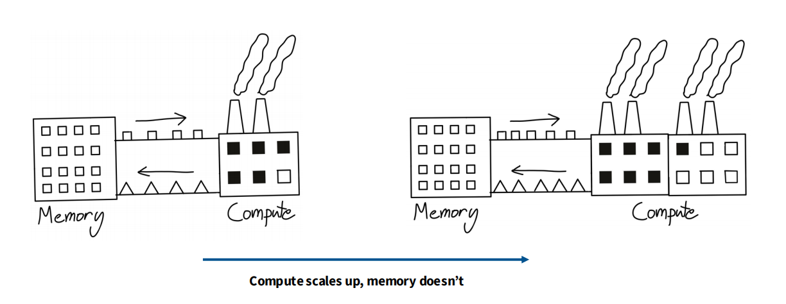

> 图14: 随着计算能力的扩展, 内存带宽成为瓶颈.

如果我们有一系列操作, 比如A->B->C->D, 天真的做法是每次操作后都把结果写回全局内存, 然后再读出来进行下一次操作. 这就像把半成品反复运回仓库再取出来一样愚蠢.


> 图15: 未融合的内核 (左) 需要多次往返内存, 而融合的内核 (右) 将中间结果保留在计算单元 (如寄存器) 中, 只需一次内存读写.

**算子融合** (Operator Fusion)就是将多个(可合并的)连续操作合并成一个单一的GPU Kernel. 这样, 中间结果可以一直保留在快速的寄存器或共享内存中, 极大地减少了对慢速全局内存的访问. 像`torch.compile`这样的编译器可以自动完成许多简单的融合.

#### 一些例子

##### 图解:未融合的执行流程


这张图通过计算 `sin²x + cos²x` 的例子, 直观地展示了在没有优化的情况下, 一个简单的计算任务是如何被分解并导致低效执行的. 

1. **左侧 (FX GRAPH IR):** 展示了像PyTorch这样的深度学习框架如何将我们的Python代码(例如 `torch.sin(x)**2 + torch.cos(x)**2`)转换成一个**中间表示 (Intermediate Representation, IR)**. 可以看到, 这个简单的表达式被分解成了一系列基础操作:`sin`, `pow`, `cos`, `pow`, `add`. 
2. **右侧 (GRAPH VIZ):** 将这个IR**可视化**成一个计算图. 这个图清晰地显示了数据的流动和依赖关系. 从输入 `x` 开始, 计算图分叉, 分别计算 `sin(x)` 和 `cos(x)`, 然后各自进行平方 (`pow_1`, `pow_2`), 最后将结果相加 (`add`) 得到最终输出. 

##### **问题的核心:低效的内核启动**

图下方的结论一针见血:**Computing sin²x + cos²x naively launches 5 CUDA kernels (back and forth)**”(朴素地计算sin²x + cos²x会来回启动5个CUDA内核). 

这正是我们之前比喻的工厂模型中的“愚蠢”做法:

* **内核1 (sin):** 从全局内存读取 `x`, 计算 `sin(x)`, 然后将结果写回全局内存. 
* **内核2 (cos):** 再次从全局内存读取 `x`, 计算 `cos(x)`, 写回全局内存. 
* **内核3 (pow_1):** 从全局内存读取 `sin(x)` 的结果, 计算平方, 写回全局内存. 
* **内核4 (pow_2):** 从全局内存读取 `cos(x)` 的结果, 计算平方, 写回全局内存. 
* **内核5 (add):** 从全局内存读取两个平方的结果, 相加, 再将最终结果写回全局内存. 

这种执行方式的代价是巨大的:

* **内存访问瓶颈:** 数据在GPU的计算单元和慢速的全局内存之间进行了大量不必要的“往返”, 大部分时间都浪费在了数据搬运上. 
* **内核启动开销:** 每次启动CUDA内核本身也有一定的CPU开销. 

##### **算子融合的威力**

**算子融合 (Operator Fusion)** 正是为了解决这个问题而生. 一个像 `torch.compile` 这样的智能编译器会分析这个计算图, 并意识到这五个独立的操作可以被**合并(融合)成一个单一的、功能更强大的CUDA内核**. 

这个融合后的内核会:
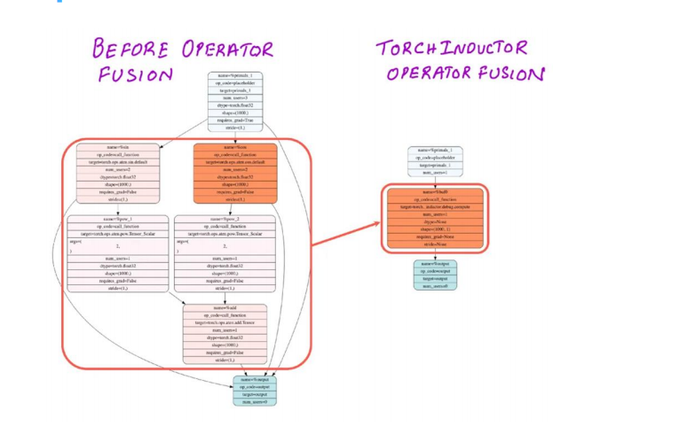

1. **只启动一次. **
2. 从全局内存中**读取一次** `x`. 
3. 在GPU内部的**高速寄存器或共享内存中**完成 `sin`, `cos`, `pow`, `add` 的所有计算. 
4. 将最终结果**写回一次**到全局内存. 

通过这种方式, 算子融合将多次内存往返变成了一次读取和一次写入, 极大地减少了内存带宽压力和内核启动开销, 从而让GPU专注于它最擅长的事情——计算. 这张图完美地说明了为什么算子融合是现代深度学习编译器中至关重要的一项优化技术. 

#### 技巧4: 重计算 (Recomputation)

在训练深度神经网络时, 反向传播算法需要用到前向传播过程中计算出的激活值(中间结果)来计算梯度. 
在传统的实现中, 这些激活值会被全部存储在内存(如GPU显存)中, 以便在反向传播时直接读取. 
然而, 当模型非常深或者输入数据很大(例如高分辨率图像)时, 存储所有激活值会消耗大量的内存, 甚至超出硬件容量, 成为训练的瓶颈. 

**重计算(Recomputation)**, 也常被称为**激活检查点(Activation Checkpointing)**或梯度检查点, 是一种旨在用额外的计算资源来换取内存空间的优化策略.  它的核心思想是:在前向传播过程中, 不再保存所有的中间激活值, 而只是有策略地保存其中一部分, 这些被保存的激活值被称为“检查点”. 

在反向传播需要用到某个未被保存的激活值时, 系统会找到其上游最近的一个检查点, 并从该点开始重新执行一部分前向传播计算, 以实时获得所需的激活值. 

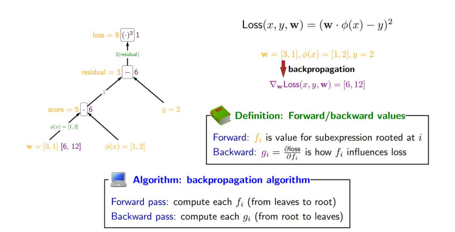

> 图16: 在反向传播中, 我们存储激活值(黄色)并计算雅可比矩阵(绿色).

**重计算 (Recomputation)**, 也被称为**激活检查点 (Activation Checkpointing)**, 是一种用计算换内存的策略. 在前向传播时, 我们不存储所有的激活值, 只存储其中一部分 (检查点). 在反向传播时, 当需要一个未存储的激活值时, 我们从最近的一个检查点开始, **重新计算**前向传播路径以得到它.

  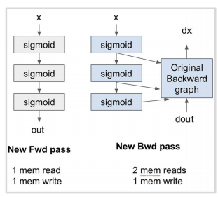

> 图17: 通过在前向传播中丢弃激活值并在反向传播中重计算它们, 我们可以显著减少内存读写次数.

#### 左侧:传统方法 (Old Pass)

* **前向传播 (Old Fwd pass):**
  * 从内存中读取输入 `x`(1次读取). 
  * 依次通过三个 `sigmoid` 层, 并将中间结果 `s2`、`s1` 以及最终输出 `out` 全部写入内存(3次写入). 这样做的目的是为了让反向传播可以直接使用 `s1` 和 `s2`. 
* **反向传播 (Old Bwd pass):**
  * 为了计算梯度 `dx`, 需要从内存中读取之前存下的 `s2`、`s1` 和上一层传回的梯度 `dout`(3次读取). 
  * 计算完成后, 将梯度 `dx` 写入内存(1次写入). 
* **总计:** 4次内存读取, 4次内存写入. 

#### 右侧:采用重计算 (New Pass)

* **前向传播 (New Fwd pass):**
  * 从内存读取输入 `x`(1次读取). 
  * 虽然计算过程和之前一样, 但**只将最终的输出 `out` 写入内存**, 中间结果 `s1` 和 `s2` 在计算后即被丢弃(1次写入). 这一步显著减少了内存占用. 
* **反向传播 (New Bwd pass):**
  * 由于 `s1` 和 `s2` 没有被存储, 我们无法直接读取. 
  * 因此, 该过程首先从内存中读取最初的输入 `x` 和上一层的梯度 `dout`(2次读取). 
  * 接着, 它**重新执行**了前向传播的部分计算(图中蓝色的 `sigmoid` 模块), 以实时生成 `s1` 和 `s2`. 
  * 使用这些即时重计算出的激活值, 结合 `dout`, 完成原始的反向图计算, 得到梯度 `dx`. 
  * 最后将梯度 `dx` 写入内存(1次写入). 
* **总计:** 3次内存读取, 2次内存写入. 

**结论**

对比两种方法, 重计算策略通过增加额外的计算(在反向传播中重新执行前向计算), 成功地将总内存访问次数从8次减少到5次, 并大幅降低了峰值内存需求. 
当GPU的内存带宽或容量成为瓶颈时, 这种**牺牲部分计算性能以换取巨大内存收益**的策略, 能够有效提升训练大型模型的效率和可能性. 

#### 技巧5: 内存合并访问 (Memory Coalescing)

为了充分发挥GPU的性能, 理解其内存系统的工作方式至关重要. GPU中速度较慢的全局内存, 即DRAM, 其访问模式是性能优化的一个关键点. 

#### DRAM的突发读取模式 (Burst Mode)

GPU的DRAM在硬件层面进行了一项优化, 使其能以**突发模式** (burst mode) 进行读取. 这意味着, 当你请求读取内存中的某一个地址时, 硬件并不会只返回你请求的那一个数据, 而是会一次性读取并返回该地址所在的整个连续内存块. 这个内存块被称为**突发段” (Burst section)**. 


> 图示1: 内存地址空间被划分为多个突发段(如黄、红、蓝、绿色的块). 当访问段内任意一个位置时(例如地址0), 整个突发段(地址0、1、2、3)的数据都会被一次性传送到处理器. 

该设计背后的根本原因在于DRAM的物理工作原理. DRAM将数据存储在由电容器组成的二维网格中, 排列成行和列. 访问其中任何一个数据都不是一步到位的操作. 

最耗时的步骤是初始的**行激活 (Row Activation)**. 当需要访问某个内存地址时, 内存控制器首先必须定位并激活其所在的整个物理行.  这个过程在电气层面上, 需要将该行上所有数千个存储单元(电容器)的微弱电荷读出, 并送入一组称为**感应放大器** (Sense Amplifiers) 的临时高速缓存中.  感应放大器负责将这些微弱、易失的信号放大并稳定成清晰的数字0或1. 这个从存储单元到感应放大器的过程涉及复杂的电路操作, 是DRAM随机访问延迟(latency)的主要来源. 

然而, 一旦一个行被成功激活, 其全部数据实际上已经暂存在了快速的感应放大器中. 此时, 从这些放大器中连续读取数据(即访问该行中的不同列)就变得非常迅速, 几乎没有额外的延迟. 

硬件利用了这一特性:为了摊销初始行激活所带来的高昂时间成本, 它不会只返回最初请求的那几个字节.  相反, 它会一次性地将感应放大器中一大块连续的数据(一个“突发段”)流式传输出来. 这就是**突发模式 (burst mode)** 的本质.  通过单次慢操作(行激活)后跟一次快速的数据“突发”, 系统可以用接近峰值带宽的速度传输大量数据, 从而有效地掩盖了DRAM的高延迟. 在现代GPU中, 一个突发段的大小通常为128字节或更多. 

#### 内存合并访问 (Memory Coalescing)

**内存合并访问 (Memory Coalescing)** 是一项利用DRAM突发模式的关键优化技术. 在GPU上, 线程是以32个为一组的**线程束 (warp)** 的形式同时执行的. 当一个warp中的所有32个线程同时执行一条内存加载指令时, 理想的情况是它们的访问能够被硬件“合并”. 

内存访问模式对性能有着决定性的影响. 如果一个计算任务需要访问的数据序列, 其内存地址是随机或非连续的, 导致它们分散在不同的**突发段 (Burst Section)** 中, 那么每一次内存访问都可能触发一次独立的、高延迟的DRAM事务. 在这种最差情况下, 所需执行的DRAM请求数量几乎与序列中需要访问的元素数量一样多, 导致内存带宽被严重浪费, 因为每次取回的整个突发段中, 只有一个元素是真正被需要的. 

相反, 通过巧妙地组织数据在内存中的布局并设计访问模式, 确保一个线程束 (warp) 中的多个线程同时访问的地址能够落在同一个突发段内, 就可以实现**内存合并访问 (Memory Coalescing)**. 此时, 硬件会将这些本应独立的请求合并为一次DRAM事务, 用一次操作取回整个突发段, 从而满足多个线程的需求. 


> 图示2: 当一个线程束(warp)中的多个线程(T₀, T₁, T₂, T₃等)要访问的内存地址恰好都落在同一个突发段内时, 硬件可以将这些独立的访问请求合并成一次单一的DRAM请求. 这次访问就是“完全合并的”(fully coalesced). 

**合并访问的条件与优势:**

* **条件:** 一个warp中的所有线程访问的内存地址, 必须落在同一个突发段内. 
* **优势:** 如果满足条件, 硬件就能用**一次DRAM事务**来满足所有32个线程的数据需求, 极大地提高了内存访问效率. 反之, 如果线程访问的地址分散在不同的突发段中, 就会触发多次独立的DRAM事务, 导致性能急剧下降, 这种情况被称为非合并访问. 

简而言之, 通过精心安排线程的内存访问模式, 使其变得连续且对齐, 我们就能触发内存合并, 从而最大化地利用有限的DRAM带宽. 这是编写高性能CUDA核函数时必须考虑的核心要素之一. 
虽然上述方法听起来非常朴素简单, 但在实际上它非常重要, 特别是在进行矩阵计算这个AI时代中核心中的核心

**第一步:理解内存布局**

计算机的物理内存(DRAM)是一维线性的, 像一把无限长的尺子. 而我们的矩阵是二维的. 为了存下矩阵, 系统必须把它“拍平”成一维. 最常见的方式叫**行主序** (Row-Major Order). 

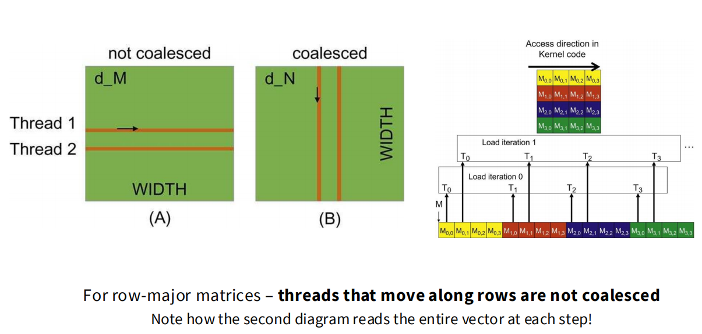

* **行主序存储**:先把第0行的所有元素 `M₀,₀, M₀,₁, M₀,₂...` 连续地存放在内存里. 紧接着, 再把第1行的所有元素 `M₁,₀, M₁,₁, M₁,₂...` 连续地存进去, 以此类推. 

**第二步:“沿行访问”与“沿列访问”**

这里的“访问”指的是**一个Warp(线程束)里的32个并行线程在同一时刻的行为**. 

* **沿行访问” (Accessing along a row):**

  * **含义:** 指派一个Warp里的32个相邻线程, 去同时读取**同一行**中的32个相邻元素. 单个线程随着T增加访问同一列的不同行
  * **例如:** 线程0读 `Mᵢ,₀`, 线程1读 `Mᵢ,₁`, 线程2读 `Mᵢ,₂`...
  * **结果:** 因为是行主序存储, 这些元素 `Mᵢ,₀, Mᵢ,₁, Mᵢ,₂`... 在物理内存中本身就是**连续排列**的. 因此, 它们的地址是连续的. 这是一种**高效的、合并友好**的访问模式. 
* **沿列访问” (Accessing along a column):**

  * **含义:** 指派一个Warp里的32个相邻线程, 去同时读取**同一列**中的32个相邻元素. 
  * **例如:** 线程0读 `M₀,ⱼ`, 线程1读 `M₁,ⱼ`, 线程2读 `M₂,ⱼ`...
  * **结果:** 因为是行主序存储, `M₀,ⱼ` 和 `M₁,ⱼ` 在物理内存中的地址**相隔了整整一行**！所以这些线程请求的地址是**跳跃的、不连续的**. 这是一种**低效的、非合并**的访问模式. 

**第三步:结合图片分析朴素算法的问题**

现在我们看图, `d_M` 和 `d_N` 分别代表对矩阵M和N的访问. 

* **对于矩阵M:** 在朴素算法中, 为了计算 `P` 的一个元素 `Pᵢ,ⱼ`, 一个线程需要完整读取 `M` 的第 `i` 行. 如果一个Warp的线程都在读取各自不同行的元素, 就会导致非合并访问. 但更常见的问题是, 在计算 `N` 的时候, 访问模式是灾难性的. 
* **对于矩阵N:** 为了计算 `Pᵢ,ⱼ`, 线程需要读取 `N` 的第 `j` 列. 现在, 想象一个Warp的线程(线程0, 1, 2...)同时开始计算 `P` 矩阵的`P₀,₀, P₁,₀, P₂,₀...` 这些**同一列**的元素. 

  1. 在计算的第一个步骤, 它们都需要 `N` 矩阵第0列的元素. 
  2. 所以, 线程0需要 `N₀,₀`, 线程1需要 `N₁,₀`, 线程2需要 `N₂,₀`...
  3. 这正是一个典型的**沿列访问**！
  4. 这导致所有线程同时请求的内存地址是**跳跃的、不连续的**. 硬件无法将这些请求合并成一次读取. 它必须为每个线程(或每几个线程)发起一次独立的、高延迟的DRAM事务. 

这就是**非合并访问**. 它使得本应并行高效的GPU, 在等待数据从慢速内存中“涓涓细流”般地送达时, 浪费了大量的宝贵时间. 

一句话解释为什么

#### 技巧6: 平铺 (Tiling)

平铺(Tiling), 也常被称为分块(Blocking), 是最高效、最重要的GPU性能优化技巧之一. 其核心思想是, **通过巧妙地利用GPU的内存层次结构, 将计算任务分解, 在快速的片上内存(On-chip Memory)中最大化数据重用, 从而根本性地减少对缓慢的、高延迟的全局内存(Global Memory)的访问次数. **

正如讲者在课堂上反复强调的, 现代GPU的性能瓶颈在于内存带宽. 平铺技术正是为了攻克这一核心瓶颈而设计的. 

#### 理想的计算模式

在深入算法之前, 我们先构想一个理想的GPU计算模式, 这也是平铺技术的目标:

> “理想的结果是, 我花一小段时间, 将一块数据从全局内存加载到所有东西都很快的共享内存中. 然后, 我想在共享内存里做海量的计算. 最后, 当我对这块数据的处理完成后, 我才把它写回去. 我将对全局内存的访问最小化了. ”

平铺就是实现这一理想模式的具体方法. 

#### 解决方案:利用共享内存进行平铺计算

平铺技术通过将大型矩阵分解为小的**瓦片 (Tiles)** 来解决朴素算法的两个致命缺陷(冗余读取和非合并访问). 它不再让单个线程处理一个完整的内积, 而是让一个**线程块 (Thread Block)** 协同计算输出矩阵的一个**瓦片 (Tile)**. 

这个过程的关键, 在于利用了GPU上一种高速的、可由程序员控制的片上内存——**共享内存 (Shared Memory)**. 共享内存位于SM内部, 对同一个线程块内的所有线程都可见, 其访问速度远快于全局内存. 

平铺矩阵乘法的算法流程可以分解为以下几个阶段:

1. **划分瓦片:** 将输入的 `M` 和 `N` 矩阵以及输出的 `P` 矩阵在逻辑上划分为大小相同的瓦片. 瓦片的大小(`TILE_SIZE`)需要精心选择, 以确保它能完全装入一个SM的共享内存中. 
2. **协同加载 (Cooperative Loading):** 这是至关重要的一步. 一个线程块负责计算 `P` 的一个输出瓦片. 为此, 该线程块内的所有线程协同工作, 从全局内存中读取计算当前输出瓦片所需的**一个 `M` 矩阵的瓦片**和**一个 `N` 矩阵的瓦片**, 并将它们加载到该线程块的共享内存中. 

   * **关键优化:** 这一加载过程本身可以被精心设计, 让线程以“沿行访问”的模式进行读取, 从而实现**完全的内存合并访问 (Memory Coalescing)**, 确保数据从全局内存到共享内存的搬运过程本身就是最高效的. 
3. **同步 (Synchronization):** 在进行计算之前, 线程块内必须执行一次同步(在CUDA中通常是`__syncthreads()`). 这确保了所有线程都完成了它们的加载任务, 整个瓦片的数据已经完整地存在于共享内存中, 之后才能被安全地访问. 
4. **本地计算与数据重用 (Local Computation & Data Reuse):** 这是性能提升的核心所在. 一旦数据进入共享内存, 线程块内的所有线程就可以从这片**极速的本地“缓存”**中读取数据, 进行矩阵乘法计算, 并将累加结果(部分和)保存在自己私有的、更快的**寄存器 (Registers)**中. 

   * **解决冗余读取:** 在这个阶段, 共享内存中的每一个元素都会被块内的多个线程重复使用. 例如, `M` 瓦片的第一行会被用于计算输出瓦片的所有元素. 但现在, 所有这些重复读取都发生在几乎没有延迟的共享内存上, 而不是昂贵的全局内存. 
5. **迭代 (Iteration):** 一个输出瓦片的最终结果, 是多个输入瓦片对计算结果的累加. 因此, 线程块会重复步骤2-4:加载下一组`M`和`N`的瓦片, 在共享内存中进行计算, 并不断更新每个线程寄存器中的部分和. 
6. **写回结果 (Write Back):** 当所有相关的输入瓦片都被处理完毕后, 每个线程将自己寄存器中计算出的最终结果, 一次性地写回到全局内存中对应的输出瓦片位置. 


> 图21: 该图完美诠释了平铺流程. 一个线程块 (Block) 协同地将M和N的一个瓦片 (Tile) 通过合并访问的方式, 高效地加载到快速的共享内存 (Shared Memory) 中. 随后, 所有计算中的重复数据读取都发生在共享内存内部, 极大地减少了对全局内存的访问, 从而实现了数据重用. 

#### 平铺带来的收益:量化分析


我们可以简单分析一下平铺带来的收益. 假设矩阵大小为`N x N`, Tile大小为`T x T`. 

* **无平铺:** 为了计算一行输出, `M`矩阵的每个元素平均被从全局内存读取`N`次. 
* **有平铺:**
  * 每个元素从**全局内存**被读取的次数减少为 `N / T` 次(因为每次加载一个瓦片后, 可以在共享内存里重用`T`次). 
  * 同时, 每个元素会在**共享内存**中被读取 `T` 次. 

平铺的本质, 是将`N`次缓慢的全局内存读取, 转化为了 `N/T` 次(可以合并的)全局内存读取和 `T` 次极速的共享内存读取. 只要共享内存足够大(即`T`足够大), 就能带来**一个数量级**(a factor of T)的全局内存访问缩减. 

**总而言之**, 平铺技术通过将大量、低效的全局内存访问, 转化为了**少量、高效(合并)的全局内存加载**, 以及**大量在极快的共享内存上的数据重用**, 完美地解决了朴素算法的两个核心瓶瓶颈, 是榨干GPU性能的基石. 

更详细的内容请查看[Tail详解](./Lecture5-Tiling-for-Performance.md)

#### 融会贯通: 理解一个矩阵之谜

现在我们已经掌握了这些技巧, 让我们回到开头那个神秘的性能图. 经过一堂课, 这个图对我们来说已经不神秘了, 已经完全可以理解它的性能特性了
(其实和男厕所的小便池数量蛮像的哈哈哈哈, 男同志们应该都能理解)

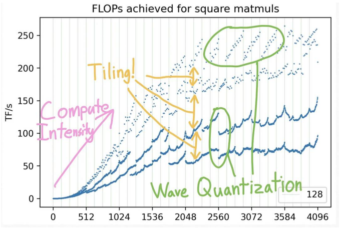

> 图22: 再看这张图, 我们现在可以识别出一些模式, 如计算强度和可能的平铺效应.

这张图展示了不同矩阵维度下的性能. 我们可以用我们学到的知识来解释它.


> 图23: 将性能点按矩阵维度是否能被K整除进行着色. 维度对齐得越好 (可被更大的数整除), 性能越高.

**第一部分: 平铺**. 图中不同的性能曲线簇, 实际上对应着不同的**内存对齐** (memory alignment)情况. 当矩阵的维度能够很好地被Tile大小或burst section大小整除时 (例如, 是128的倍数), 内存访问就是对齐的, 性能就高 (紫色点). 当对齐很差时, 就会导致“坏瓦片”, 需要多次内存读取, 性能就低 (蓝色点). 这解释了为什么Andre Karpathy通过将词汇表大小从50257增加到50304 (64的倍数) 获得了25%的加速——他改善了内存对齐, 使得GPU可以走上一个利用率高得多的内核路径.

**第二部分: 波浪量化 (Wave Quantization)**. 那些周期性的性能波动是怎么回事?

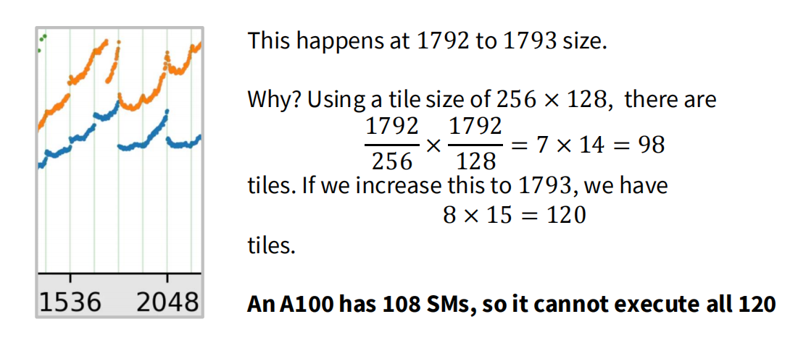

> 图24: 当矩阵维度从1792增加到1793时, 性能出现断崖式下跌.

这与GPU上**SM** (流式多处理器)的数量有关. 假设我们使用256x128的瓦片大小:

- 当矩阵大小为1792x1792时, 我们需要 `(1792/256) x (1792/128) = 7 x 14 = 98` 个线程块 (tiles).
- 当大小增加到1793x1793时, 我们需要 `ceil(1793/256) x ceil(1793/128) = 8 x 15 = 120` 个线程块.

一个A100 GPU有108个SM. 当有98个块时, 它们可以全部被同时调度到不同的SM上, 并行执行, 这被称为一个**波 (wave)**. 当有120个块时, GPU无法一次性执行所有块. 它会先执行一个包含108个块的波, 完成后再执行第二个只包含12个块的波. 第二个波的**利用率极低**, 导致整体性能急剧下降. 这就是所谓的**波浪量化**效应.

### 案例研究: FlashAttention

FlashAttention是Transformer架构中一项里程碑式的优化, 它通过应用GPU底层优化技术, 显著提升了注意力机制的计算速度和内存效率. 其成功主要建立在**平铺 (Tiling)**和**重计算 (Recomputation)**这两个核心技巧之上. 

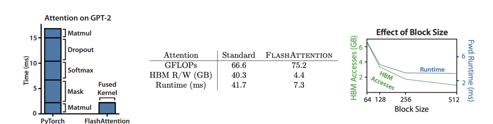

> 图25: FlashAttention将HBM (全局内存) 的读写从40.3GB减少到4.4GB, 运行时间从41.7ms减少到7.3ms, 效果是惊人的. 

#### 1. 问题根源:标准注意力的内存瓶颈

标准注意力计算 `Attention(Q, K, V) = softmax(QKᵀ/√d)V` 的主要性能瓶颈在于对一个巨大的中间矩阵——注意力分数矩阵 `S = QKᵀ` ——的读写. 

* **中间矩阵的物化 (Materialization):**
  * “物化”指在内存中完整地、显式地创建并存储这个矩阵. 
  * 对于一个长度为 `N` 的序列, `S` 矩阵的大小是 `N x N`. 当 `N` 很大时(例如 `N=8192`), 这个矩阵会消耗巨大的GPU内存(`8192 * 8192 * 4 bytes ≈ 256MB`). 
* **低效的内存访问模式:**
  * 标准实现中, GPU需要将这个 `N x N` 的巨型中间矩阵在计算单元和慢速的**全局内存 (HBM)** 之间进行多次往返:
    1. 计算 `S = QKᵀ`, 并将结果**写回**HBM. 
    2. 从HBM中**读出**整个 `S` 矩阵, 计算Softmax, 并将结果 `P` **写回**HBM. 
    3. 从HBM中**读出** `P` 矩阵和 `V` 矩阵, 计算最终结果 `O = PV`. 
  * 这些对HBM的读写操作构成了性能瓶颈, 导致计算单元大部分时间都在等待数据, 这正是典型的“内存墙”问题. 

#### 2. FlashAttention的核心思想:Tiling与算子融合

FlashAttention的核心思想是**避免物化**这个`N x N`的矩阵. 它通过**平铺 (Tiling)** 技术, 将Q, K, V矩阵分割成更小的块(**Tiles**), 并将计算的主战场从慢速的HBM转移到极速的**片上内存 (SRAM)**, 即GPU的共享内存. 

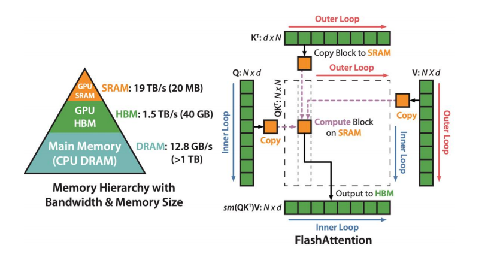

> 图26: FlashAttention将Q, K, V矩阵分块(Tiling). 计算流程在一个外部循环中遍历K和V的Tiles, 在一个内部循环中遍历Q的Tiles. 关键在于, 计算出的中间分数块并不会被写回到HBM, 而是在SRAM中直接用于后续计算. 

通过**算子融合 (Operator Fusion)**, FlashAttention将 `QKᵀ` 的计算、Softmax的计算、以及与`V`的乘法**融合成一个大的CUDA内核**. 这使得整个计算流程可以在不将中间的 `N x N` 矩阵写入全局内存的情况下完成. 

然而, 这引出了一个技术挑战. 

#### 3. 挑战:在分块架构下计算全局Softmax

Softmax操作 `Pᵢⱼ = exp(Sᵢⱼ) / Σₖ exp(Sᵢₖ)` 本质上是一个行级别的全局操作. 为了正确归一化, 它需要知道**整行**的两个统计量:

1. 行最大值 `mᵢ = maxⱼ(Sᵢⱼ)` (用于数值稳定). 
2. 行归一化因子 `lᵢ = Σⱼ exp(Sᵢⱼ - mᵢ)`. 

当计算被分解到不同的Tiles中时, 每个Tile只能看到部分的行数据, 无法直接计算出全局的`mᵢ`和`lᵢ`. 

#### 4. 解决方案:在线Softmax (Online Softmax)

FlashAttention通过一种名为**在线Softmax**的算法解决了这个问题. 该算法允许以流式、逐块的方式迭代地计算出正确的Softmax结果. 

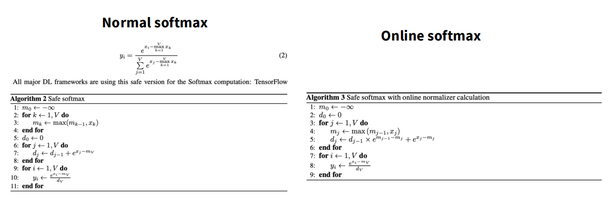

> 图27: 在线Softmax算法的核心是维护一个“运行中”的统计量, 并能在看到新数据时对旧的计算结果进行数学修正. 

其核心思想如下:
假设我们已经处理了 `j-1` 个块, 并保存了到目前为止的三个统计量:

* 当前的最大值: `m[j-1]`
* 当前的归一化因子: `l[j-1]`
* 当前的加权输出值: `O[j-1]`

当处理第 `j` 个块时, 我们计算出这个新块内部的最大值 `mⱼ` 和归一化因子 `lⱼ`. 然后, 我们可以按如下方式更新全局统计量:

1. **更新全局最大值:**
   `m[j] = max(m[j-1], mⱼ)`
2. **更新全局归一化因子:**
   `l[j] = l[j-1] * exp(m[j-1] - m[j]) + lⱼ * exp(mⱼ - m[j])`
3. **更新全局输出值:**
   `O[j] = (O[j-1] * l[j-1] * exp(m[j-1] - m[j]) + Oⱼ * lⱼ * exp(mⱼ - m[j])) / l[j]`

这个过程的关键在于 `exp(...)` 这个**重缩放因子 (Rescaling Factor)**. 它能将在旧的最大值 `m[j-1]` 下计算出的 `l[j-1]` 和 `O[j-1]`, 正确地“平移”到新的全局最大值 `m[j]` 的坐标系下, 从而保证了最终结果的数学等价性. 这个技巧也被称为“伸缩求和 (telescoping sum)”. 

通过这个方法, FlashAttention可以在一个外部循环中不断迭代K和V的Tiles, 每处理一个新Tile, 就更新一次全局的`max`和`sum`, 并对之前累计的结果进行修正. 

#### 5. 反向传播与重计算

在反向传播过程中, 标准实现需要存储前向传播时计算出的巨大的`N x N`注意力矩阵`P`, 这同样会造成内存瓶颈. 

FlashAttention在这里应用了**重计算 (Recomputation)** 技巧. 它在前向传播时不存储完整的`P`矩阵, 只保存计算出的最终输出`O`以及在线Softmax的归一化统计量`l`和`m`. 在反向传播需要用到`P`的某些块时, 它会从全局内存中重新加载相应的Q, K, V的Tiles到SRAM中, 并利用保存的统计量**重新计算**出那一小块注意力分数. 这是一种典型的“以计算换内存”策略, 用富余的计算资源来避免对稀缺内存带宽的占用. 

#### 总结

FlashAttention通过以下优化技术的精妙组合, 实现了对标准注意力的降维打击:

1. **平铺 (Tiling):** 将计算的主战场从慢速的HBM转移到极速的SRAM. 
2. **算子融合 & 避免物化:** 将多个操作融合成一个大内核, 避免了`N x N`中间矩阵在全局内存中的读写. 
3. **在线Softmax:** 使用巧妙的数学技巧, 使得全局的Softmax操作可以被分解, 以逐块更新和修正的方式在平铺架构下实现. 
4. **重计算 (Recomputation):** 在反向传播时, 重新计算部分前向结果, 避免存储巨大的中间激活值. 

### 课程总结

- **硬件驱动扩展**: 硬件能力是扩展的基础, 而底层的细节决定了什么能扩展, 什么不能.
- **Matmul + 数据移动**: 当前基于GPU的计算强烈鼓励我们围绕矩阵乘法 (Matmul) 和数据移动来思考问题.
- **精心思考GPU**: 仔细思考GPU的特性 (合并访问、平铺、融合) 会带来良好的性能.
