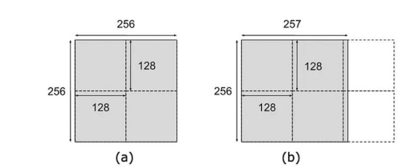
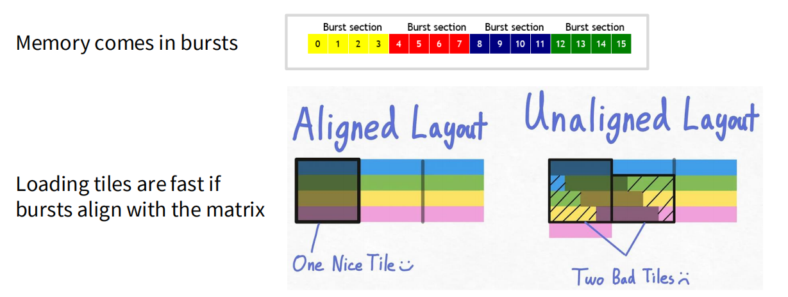

# 平铺矩阵乘法:从原理到量化分析的深度指南

## 1. 核心问题: 内存墙 (The Memory Wall)

在现代GPU中, 计算能力 (FLOPS) 的增长速度远远超过了内存带宽的增长速度. 这导致了一个根本性的瓶颈:即使GPU的计算单元能力再强, 如果数据不能及时从慢速的**全局内存**送达, 它们也只能空闲等待. **平铺 (Tiling)**, 有时也称为**分块 (Blocking)**, 是解决这一“内存墙”问题的最核心、最有效的策略之一. 

## 2. 方法一:朴素实现 - 低效的起点

让我们以矩阵乘法 `P = M * N` 为例. 一个朴素的实现方式是, 启动一个线程网格 (Grid), 其中每个线程负责计算输出矩阵P中的一个元素 $P_{ij}$. 

```cpp
// 伪代码: 朴素矩阵乘法内核
__global__ void NaiveMatMul(float* M, float* N, float* P, int WIDTH) {
    int row = blockIdx.y * blockDim.y + threadIdx.y;
    int col = blockIdx.x * blockDim.x + threadIdx.x;

    if (row < WIDTH && col < WIDTH) {
        float sum = 0;
        for (int k = 0; k < WIDTH; ++k) {
            sum += M[row * WIDTH + k] * N[k * WIDTH + col];
        }
        P[row * WIDTH + col] = sum;
    }
}
```

这个实现存在两个致命的性能问题:

1. **极高的数据冗余**: 为了计算`P`的一整行, 矩阵`M`的**同一行**需要被完整读取N次 (每次与`N`的一列相乘). 同样, 为了计算`P`的一整列, 矩阵`N`的**同一列**也需要被完整读取N次. 所有这些读取都来自慢速的全局内存. 
2. **糟糕的内存访问模式**: 在行主序存储下, 对`N`矩阵的列访问是**非合并的**, 这会极大地降低有效的内存带宽, 导致计算单元长时间处于“饥饿”状态. 

## 3. 方法二:平铺优化 - 拥抱共享内存

平铺优化的核心思想是**最大化数据重用**. 我们不再让每个线程独立地从全局内存中抓取所有需要的数据, 而是让一组线程 (一个线程块) 协作起来, 将一小块数据 (一个**Tile**或**Tile**) 从全局内存搬运到快速的**共享内存**中, 然后再对这个Tile进行密集的计算. 


> 图1: 平铺矩阵乘法的核心思想. 一个线程块负责计算输出矩阵P的一个Tile (如P₁,₁). 它会分阶段加载M和N的相应Tile (如M₁,₀和N₀,₁) 到共享内存中, 然后再进行计算.

#### 平铺矩阵乘法的执行流程:

1. 将输入矩阵M和N, 以及输出矩阵P, 概念上划分为大小为 `TILE_WIDTH x TILE_WIDTH` 的Tile.
2. 启动一个线程网格, 其中每个**线程块 (Thread Block)** 负责计算P的一个输出Tile.
3. 在每个线程块内部, 执行一个循环, 遍历M的行Tile和N的列Tile.
4. 在循环的每一次迭代中:
   a.  线程块内的所有线程**协作**, 从全局内存中加载M的一个Tile和N的一个Tile到**共享内存 (Shared Memory)**中. 这一步可以被精心设计以实现**内存合并访问**. 
   b.  使用 `__syncthreads()` 进行块内同步, 确保所有线程都完成了加载. 
   c.  每个线程从共享内存中读取数据, 计算其负责的PTile元素的部分和, 并将结果累加在自己的**寄存器 (Registers)**中. 
   d.  再次使用 `__syncthreads()` 确保所有计算完成, 以免在加载下一个Tile时发生数据冲突. 
5. 循环结束后, 每个线程将自己寄存器中保存的最终结果写回全局内存中的P矩阵相应位置. 

---

## 4. 量化对比:一个4x4的具体示例

为了直观地感受性能差异, 让我们设定一个场景:计算两个4x4矩阵相乘, 平铺的Tile大小为2x2. 

### 场景设定

* **计算任务:** `P = M * N`
* **矩阵维度:** `M`, `N`, `P` 均为 **4x4**. 
* **平铺参数:** Tile大小为 **2x2**. 一个包含`2x2=4`个线程的线程块负责计算`P`的一个`2x2`的Tile. 
* **内存布局:** 行主序. 

### 在朴素实现中:

每个线程计算一个`P`元素, 需要读取`M`的一整行(4个元素)和`N`的一整列(4个元素), 共8次全局内存读取. 计算整个4x4的`P`矩阵, 总共需要 `16 (个线程) * 8 (次读取/线程) = 128` 次全局内存读取. 

更糟糕的是, `M`矩阵的每个元素被冗余读取了4次, `N`矩阵的每个元素也被冗余读取了4次, 且对`N`的访问是**非合并**的. 

### 在平铺实现中:

我们以计算`P`左上角2x2 的Tile的线程块为例. 

#### 阶段1:处理第一组输入Tile

1. **协同加载:** 4个线程合作, 从全局内存加载`M`的左上角Tile和`N`的左上角Tile到共享内存. 

   ```
   加载 M 的Tile M_tile0:      加载 N 的Tile N_tile0:
   [ M₀₀, M₀₁ ]                 [ N₀₀, N₀₁ ]
   [ M₁₀, M₁₁ ]                 [ N₁₀, N₁₁ ]
   ```

   * **全局内存读取次数:** 4 (from M) + 4 (from N) = **8次**. 
2. **本地计算:** 4个线程**从共享内存中**读取数据计算部分和. 共享内存中的`M₀₀`被`Thread(0,0)`和`Thread(0,1)`重复使用, 但这次是在极速的共享内存中！

#### 阶段2:处理第二组输入Tile

1. **协同加载:** 4个线程再次合作, 加载下一组Tile. 

   ```
   加载 M 的Tile M_tile1:      加载 N 的Tile N_tile1:
   [ M₀₂, M₀₃ ]                 [ N₂₀, N₂₁ ]
   [ M₁₂, M₁₃ ]                 [ N₃₀, N₃₁ ]
   ```

   * **全局内存读取次数:** 4 (from M) + 4 (from N) = **8次**. 
2. **本地计算与累加:** 线程再次从共享内存读取数据, 更新寄存器中的部分和. 

#### 结果统计

* 计算一个2x2的PTile所需的全局内存读取:`8 (阶段1) + 8 (阶段2) = 16` 次. 
* 计算整个4x4的P矩阵所需的全局内存读取:`P`矩阵有4个这样的Tile, 总共需要 `4 (个线程块) * 16 (次读取/块) = 64` 次全局内存读取. 

---

## 5. 性能收益分析:从具体到一般


| 特性               | 方法一:朴素实现 | 方法二:平铺实现       | 效果对比         |
| :----------------- | :--------------- | :--------------------- | :--------------- |
| **总全局内存读取** | **128 次**       | **64 次**              | **减少了50%！**  |
| **数据重用位置**   | 慢速的全局内存   | 极速的共享内存         | 性能天壤之别     |
| **内存合并**       | 读取N时为非合并  | 加载Tile时可设计为合并 | 访问效率极大提升 |

当我们将这个分析推广到 `N x N` 的矩阵和 `T x T` 的Tile时, 结论更加惊人:

* **朴素实现**的总全局内存浮点数读取量约为 $O(2 \times N^3)$. 
* **平铺实现**的总全局内存浮点数读取量约为 $O(2 \times N^3 / T)$. 

通过平铺, 我们将对全局内存的访问量**减少了T倍**. 考虑到T通常是16或32, 这是一个巨大的性能提升. 我们用一次昂贵的全局内存加载, 换来了T次在超高速共享内存中的计算. 

## 6. 平铺的复杂性与挑战

平铺并非没有代价, 它引入了新的复杂性:

* **Tile大小选择**: Tile大小 `T` 是一个关键的超参数. 
  * 太小: 无法充分利用数据重用, 性能提升有限. 
  * 太大: 可能超出单个SM的共享内存容量, 或者导致每个SM上活跃的线程块数量过少, 降低整体并行度. 

如果矩阵的维度刚好比T的整数倍大一点点, 那么最后一个Tile将几乎什么都不干 . 

  * **内存对齐**: 如果矩阵的维度`N`不能被`T`整除, 就会产生处理边缘情况的复杂逻辑(通常需要Padding), 否则会因非对齐访问导致性能下降. 
  
  当内存不对齐, 即T或矩阵大小不是burst section的整数倍时, 行与burst section之间不对齐, 内存访问量也增加了一倍, 所以必须进行padding

* **代码复杂度**: 平铺的kernel代码远比朴素实现复杂, 需要仔细处理共享内存的索引、线程同步(`__syncthreads()`)以及边界条件. 

尽管如此, 平铺带来的巨大性能收益使其成为GPU高性能计算中不可或缺的基石技术. 
