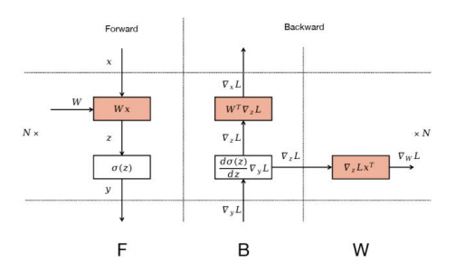
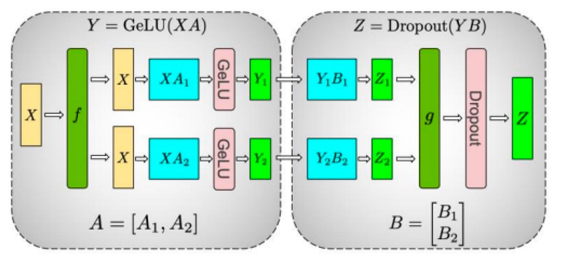

### **[瓒呰璇﹁В] 闆舵皵娉℃祦姘寸嚎骞惰 (Zero-Bubble Pipeline Parallelism)**

#### **1. 闂閲嶈锛氫负浣曗€滄祦姘寸嚎姘旀场鈥濆姝よ嚧鍛斤紵**

涓轰簡鐞嗚В鈥滈浂姘旀场鈥濇妧鏈殑闈╁懡鎬?鎴戜滑蹇呴』棣栧厛娣卞埢璁よ瘑鍒版爣鍑嗘祦姘寸嚎骞惰(鍗充娇鏄紭鍖栫殑1F1B璋冨害)涓€滄皵娉♀€濈殑鍗卞銆傚畠涓嶄粎浠呮槸鈥滀竴鐐圭偣鈥濈殑璧勬簮娴垂銆?

鍦ㄤ竴涓寘鍚?`P` 涓樁娈?鍗?`P` 涓狦PU)鐨勬祦姘寸嚎涓?澶勭悊瀹屾墍鏈夊井鎵规鎵€浜х敓鐨勬€绘皵娉℃椂闂存槸 `(P - 1) * T_step`,鍏朵腑 `T_step` 鏄鐞嗕竴涓井鎵规鍦ㄤ竴涓樁娈典笂鎵€闇€鐨勬椂闂?鍓嶅悜+鍙嶅悜)銆?

杩欐剰鍛崇潃锛?

1.  **鍒╃敤鐜囧ぉ鑺辨澘**锛欸PU鐨勭悊璁哄埄鐢ㄧ巼涓婇檺绾︿负 `M / (M + P - 1)`,鍏朵腑 `M` 鏄井鎵规鐨勬暟閲忋€傝杈惧埌90%鐨勫埄鐢ㄧ巼,寰壒娆℃暟 `M` 鑷冲皯闇€瑕佹槸娴佹按绾块樁娈垫暟 `P` 鐨?鍊嶃€傝繖鍦ㄥ疄璺典腑瑕佹眰鏋佸ぇ鐨勫叏灞€鎵规銆?
2.  **鎵规澶у皬鐨勨€滅粦鏋垛€?*锛氫负浜嗙淮鎸侀珮鏁堢巼,鎴戜滑琚揩閲囩敤鏋佸ぇ鐨?*鍏ㄥ眬鎵规澶у皬 (Global Batch Size)**銆傝繖涓嶄粎鍙兘瓒呭嚭妯″瀷璁粌鐨勬渶浣虫壒娆¤寖鍥?褰卞搷鏀舵暃),鏇村彲鑳藉洜涓烘縺娲诲唴瀛樼殑绱Н鑰岀洿鎺ュ鑷存樉瀛樻孩鍑?OOM)銆?

鍥犳,娴佹按绾挎皵娉℃槸闄愬埗娴佹按绾垮苟琛屾晥鐜囧拰閫傜敤鎬х殑鏍稿績闅滅銆?*鈥滈浂姘旀场鈥濇妧鏈殑鐩爣,灏辨槸浠庤皟搴﹀眰闈㈠交搴曟秷闄よ繖涓?`(P - 1)` 鐨勫浐瀹氬紑閿€銆?*

#### **2. 鏍稿績娲炲療锛氬弽鍚戜紶鎾苟闈炩€滈搧鏉夸竴鍧椻€?*

鈥滈浂姘旀场鈥濇妧鏈殑鈥滅伒鍏変竴鐜扳€濇椂鍒?婧愪簬瀵瑰弽鍚戜紶鎾绠椾緷璧栧叧绯荤殑娣卞埢娲炲療銆傚湪鏍囧噯鐨勮嚜鍔ㄥ井鍒?Autograd)寮曟搸鐪嬫潵,涓€涓眰鐨刞backward`鏄竴涓笉鍙垎鍓茬殑鍘熷瓙鎿嶄綔銆備絾瀹為檯涓?瀹冨寘鍚袱涓绠楁€ц川鍜屼緷璧栧叧绯绘埅鐒朵笉鍚岀殑浠诲姟銆?

涓轰簡鏇寸洿瑙傚湴鐞嗚В杩欎竴鐐?鎴戜滑鍙互鍙傝€冧竴涓畝鍗曠殑澶氬眰鎰熺煡鏈?MLP)鐨勮绠楀浘銆?

> 涓€涓畝鍗曠殑MLP璁＄畻鍥?

涓婂浘娓呮櫚鍦板睍绀轰簡鍓嶅悜浼犳挱(Forward)鍜屽弽鍚戜紶鎾?Backward)鐨勬暟鎹祦銆?
*   **鍓嶅悜浼犳挱 (F)**: 杈撳叆 `x` 缁忚繃鏉冮噸鐭╅樀 `W` 鐨勭嚎鎬у彉鎹㈠緱鍒?`z`,鍐嶉€氳繃婵€娲诲嚱鏁?$\sigma$ 寰楀埌杈撳嚭 `y`銆?
*   **鍙嶅悜浼犳挱**: 浠庝笅娓告帴鏀跺埌瀵硅緭鍑?`y` 鐨勬搴?$\nabla_y L$ 鍚?鍙嶅悜浼犳挱寮€濮嬨€?
    1.  **璁＄畻瀵硅緭鍏ョ殑姊害 (`Backward for Data`, B)**: 棣栧厛,姊害闇€瑕佺┛杩囨縺娲诲嚱鏁?$\sigma$,璁＄畻鍑哄 `z` 鐨勬搴?$\nabla_z L$銆傛帴鐫€,涓轰簡灏嗘搴︾户缁悜涓婁紶鎾粰涓婁竴灞?闇€瑕佽绠楀杈撳叆 `x` 鐨勬搴?鍗?$\nabla_x L = W^T \nabla_z L$銆?*杩欎竴姝ョ殑缁撴灉鏄笂涓€灞傚弽鍚戜紶鎾殑杈撳叆,鍥犳蹇呴』绔嬪嵆鎵ц銆?*
    2.  **璁＄畻瀵规潈閲嶇殑姊害 (`Backward for Weights`, W)**: 鍚屾椂,鎴戜滑鍙互鍒╃敤鍓嶅悜浼犳挱淇濆瓨鐨勮緭鍏?`x` 鍜屽凡缁忚绠楀嚭鐨?$\nabla_z L$ 鏉ヨ绠楀鏉冮噸 `W` 鐨勬搴?鍗?$\nabla_W L = \nabla_z L x^T$銆?

浠庤繖涓浘涓垜浠彲浠ユ竻鏅板湴鐪嬪埌,璁＄畻 $\nabla_x L$ (B) 鍜岃绠?$\nabla_W L$ (W) 鏄袱涓苟琛岀殑鍒嗘敮銆傝绠?$\nabla_W L$ 鐨勭粨鏋?*浠呯敤浜庢渶缁堢殑鍙傛暟鏇存柊,鑰屼笉浼氬奖鍝嶅埌姊害鍦ㄧ綉缁滃眰涔嬮棿鐨勫弽鍚戜紶鎾?*銆?

杩欒瘉瀹炰簡鎴戜滑鐨勬牳蹇冩礊瀵燂細

1.  **璁＄畻瀵硅緭鍏ョ殑姊害 (`Backward for Data`, 璁颁负 B)**
    *   **浠诲姟**: 璁＄畻鎹熷け $L$ 瀵硅灞?*杈撳叆婵€娲诲€?* $X_{i-1}$ 鐨勫亸瀵兼暟 $\frac{\partial L}{\partial X_{i-1}}$銆?
    *   **渚濊禆鍏崇郴**: 杩欐槸**娴佹按绾跨殑鐢熷懡绾?*銆傚畠鐨勮绠楃粨鏋滄槸涓婁竴灞?涓婃父GPU)鎵ц鍙嶅悜浼犳挱鎵€蹇呴渶鐨勮緭鍏ャ€傚洜姝?瀹冧綅浜?*鍏抽敭璺緞 (Critical Path)**涓?鍏锋湁**寮轰覆琛屼緷璧栨€?*銆?

2.  **璁＄畻瀵规潈閲嶇殑姊害 (`Backward for Weights`, 璁颁负 W)**
    *   **浠诲姟**: 璁＄畻鎹熷け $L$ 瀵硅灞?*妯″瀷鏉冮噸** $W_i$ 鐨勫亸瀵兼暟 $\frac{\partial L}{\partial W_i}$銆?
    *   **渚濊禆鍏崇郴**:**鏈€鍏抽敭鐨勬礊瀵熷湪浜?*锛氫竴鏃﹁绠楀嚭 $\frac{\partial L}{\partial W_i}$,杩欎釜缁撴灉鍦ㄥ綋鍓嶈缁冭凯浠ｆ涓?闄や簡鍦?*鏈€鍚?*琚紭鍖栧櫒鐢ㄤ簬鏇存柊鍙傛暟澶?**娌℃湁浠讳綍鍏朵粬璁＄畻渚濊禆瀹?*銆傚畠鏄竴涓?*渚濊禆鍥句腑鐨勨€滅粓绔妭鐐光€?*銆?
    *   杩欐剰鍛崇潃,`W` 鐨勮绠?*鑴辩浜嗗叧閿矾寰?*銆傚畠鏄竴涓彲浠ヨ**鎺ㄨ繜 (defer)**鍜?*閲嶆柊璋冨害 (reschedule)** 鐨勪换鍔°€?

**闈╁懡鎬х殑璋冨害鎬濇兂鐢辨璇炵敓**锛氭垜浠彲浠ュ皢 `B` 鍜?`W` 鐨勮绠?*瑙ｈ€?(decouple)**銆傛垜浠彧鍦ㄧ淮鎸佹祦姘寸嚎杩愯浆鎵€蹇呴渶鐨勬椂鍒绘墽琛?`F` (鍓嶅悜) 鍜?`B` (瀵硅緭鍏ョ殑鍙嶅悜),鑰屽皢璁＄畻閲忓悓鏍峰彲瑙傜殑 `W` (瀵规潈閲嶇殑鍙嶅悜) 瑙嗕负鍙互鐏垫椿璋冨害鐨勨€滃～鍏呭潡鈥?鐢ㄥ畠鏉ュ～婊″師鏈敱浜庣瓑寰呰€屼骇鐢熺殑姘旀场銆?

#### **3. 璋冨害绛栫暐瀵规瘮锛氫粠 1F1B 鍒伴浂姘旀场 (ZB)**

##### **3.1 鏍囧噯 1F1B 璋冨害**

> 1F1B 娴佹按绾胯皟搴︾ず鎰忓浘

鍦?1F1B 璋冨害涓?`Forward` (鍓嶅悜) 鍜?`Backward` (鍙嶅悜,浣滀负涓€涓暣浣? 浜ら敊鎵ц銆傚彲浠ョ湅鍒?鍦ㄥ惎鍔ㄥ拰缁撴潫闃舵,澶ч噺鐨勭櫧鑹叉柟鍧椾唬琛ㄤ簡璁惧绌洪棽,褰㈡垚浜嗗法澶х殑鈥滄皵娉♀€濄€?

##### **3.2 闆舵皵娉?(ZB) 璋冨害璇﹁В**

> 鎵嬪伐璁捐鐨勯浂姘旀场娴佹按绾胯皟搴?(ZB-H1/H2)

涓婂浘灞曠ず浜嗙粡杩囩簿蹇冭璁＄殑 ZB 璋冨害銆傚浘涓?`F` 浠ｈ〃鍓嶅悜,`B` 浠ｈ〃瀵硅緭鍏ョ殑鍙嶅悜(鍏抽敭璺緞),`W` 浠ｈ〃瀵规潈閲嶇殑鍙嶅悜(鍙欢杩熶换鍔?銆傝鎴戜滑涓€姝ユ瑙ｆ瀽瀹冩槸濡備綍鈥滃悆鎺夆€濇皵娉＄殑锛?

1.  **鍚姩闃舵 (Ramp-up)**锛?
    *   鍦?1F1B 涓?褰?GPU 1 鎵ц瀹岀涓€涓井鎵规鐨?`F_1,0` 鍚?瀹冧細绌洪棽涓嬫潵,绛夊緟 GPU 0 瀹屾垚 `F_0,1` 骞朵紶鏉ユ縺娲汇€?
    *   鍦?ZB 璋冨害涓?褰?GPU 1 瀹屾垚 `F_1,0` 鍚?瀹冧笉浼氱┖闂层€傝皟搴﹀櫒浼氭鏌ユ槸鍚︽湁**宸插氨缁殑 `W` 浠诲姟**銆備緥濡?褰撴搴︿粠涓嬫父浼犲洖,浣垮緱绗竴涓井鎵规鐨?`B_1,0` 璁＄畻瀹屾垚鍚?璋冨害鍣ㄥ苟**涓嶇珛鍗?*璁＄畻 `W_1,0`,鑰屾槸浼樺厛澶勭悊鍏抽敭璺緞涓婄殑涓嬩竴涓?`F` 鎴?`B` 浠诲姟銆俙W_1,0` 浣滀负涓€涓彲鎵ц鐨勪换鍔¤鏀惧叆闃熷垪銆傜幇鍦?鍦ㄧ瓑寰?`F_0,1` 婵€娲荤殑杩欎釜绌洪棽鏃堕棿鐗?GPU 1 灏卞彲浠ヤ粠闃熷垪涓彇鍑?`W_1,0` 骞舵墽琛屽畠銆?
2.  **绋冲畾闃舵 (Steady State)**锛?
    *   璁惧鐨勬瘡涓椂闂寸墖閮借 `F`, `B`, `W` 涔嬩竴鐨勮绠椾换鍔″～婊°€傝皟搴﹀櫒浼氫紭鍏堜繚璇佸叧閿矾寰?`F` 鍜?`B` 鐨勬祦鐣呮墽琛?鐒跺悗鍦ㄤ换浣曠┖闂茬殑闂撮殭鎻掑叆 `W` 鐨勮绠椼€傛暣涓祦绋嬪儚涓€涓绮惧瘑缂栨帓鐨勪氦鍝嶄箰,娌℃湁浠讳綍鍋滈】銆?
3.  **缁撴潫闃舵 (Ramp-down)**锛?
    *   褰撴渶鍚庝竴涓井鎵规鐨勫墠鍚戜紶鎾畬鎴愬悗,娴佹按绾垮紑濮嬫帓绌恒€?
    *   鍦?1F1B 涓?鍏堝畬鎴愪换鍔＄殑 GPU(濡?GPU 0)浼氳繘鍏ラ暱鏃堕棿鐨勭瓑寰呫€?
    *   鍦?ZB 璋冨害涓?杩欎簺 GPU 姝ｅソ鍒╃敤杩欐鏃堕棿,闆嗕腑澶勭悊鎵€鏈?*鍦ㄥ墠闈㈤樁娈佃鎺ㄨ繜鐨?`W` 璁＄畻浠诲姟**銆傚畠浠湁涓€涓Н鍘嬬殑 `W` 浠诲姟闃熷垪闇€瑕佹竻绌恒€?
    *   **缁撴灉**锛氭墍鏈夎澶囧嚑涔庡悓鏃跺畬鎴愭墍鏈夊伐浣?鍚屾杩涜鏈€鍚庣殑鍙傛暟鏇存柊,鐒跺悗涓€璧疯繘鍏ヤ笅涓€涓缁冩銆傛皵娉¤褰诲簳娑堥櫎銆?

#### **4. 鈥滃ぉ涓嬫病鏈夊厤璐圭殑鍗堥鈥濓細浠ｄ环涓庢寫鎴?*

铏界劧鈥滈浂姘旀场鈥濆湪璁＄畻鏁堢巼涓婅繎涔庡畬缇?浣嗗畠鏄湪鐗虹壊鍏朵粬璧勬簮鐨勫熀纭€涓婂疄鐜扮殑锛?

1.  **鍐呭瓨鍘嬪姏婵€澧?(The Biggest Trade-off)**锛?
    *   **鍘熷洜**: 鍦ㄦ爣鍑?1F1B 涓?`W` 鐨勮绠楃揣闅?`B` 涔嬪悗,杩欐剰鍛崇潃璁＄畻 `W` 鎵€闇€鐨勫墠鍚戞縺娲诲€煎彲浠ュ緢蹇浣跨敤骞堕噴鏀俱€備絾鍦?ZB 璋冨害涓?`W` 鐨勮绠楄**鏄捐憲鎺ㄨ繜**浜嗐€?
    *   **鍚庢灉**: 涓轰簡鍦ㄦ湭鏉ョ殑鏌愪釜鏃堕棿鐐硅兘璁＄畻 `W`,GPU 蹇呴』鍦ㄦ樉瀛樹腑**鏇撮暱鏃堕棿鍦颁繚鐣?*鐩稿簲寰壒娆＄殑**鍓嶅悜婵€娲诲€?*銆傝繖瀵艰嚧宄板€兼縺娲诲唴瀛樻樉钁楀鍔?鐢氳嚦鍙兘鎶垫秷鎺夋祦姘寸嚎骞惰鏈韩甯︽潵鐨勫唴瀛樿妭鐪佷紭鍔裤€傝繖鏄竴绉嶅吀鍨嬬殑鈥?*鐢ㄥ唴瀛樻崲鍙栬绠楁晥鐜?*鈥濈殑鏉冭　銆?
2.  **鏋佽嚧鐨勭郴缁熷鏉傛€?(Engineering Nightmare)**锛?
    *   **瀹炵幇闅惧害**: 瑕佸疄鐜?`F`, `B`, `W` 鐨勮绠楀垎绂诲拰鑷畾涔夎皟搴?涓嶈兘渚濊禆鏍囧噯鐨?Autograd 寮曟搸銆傚紑鍙戣€呴渶瑕侊細
        *   **娣卞害渚靛叆妗嗘灦**锛氭墜鍔ㄦ瀯寤鸿绠楀浘,鎷︽埅骞堕噸鏋勫弽鍚戜紶鎾繃绋嬨€?
        *   **鑷畾涔夎皟搴﹀櫒**: 璁捐涓€涓鏉傜殑璋冨害鍣ㄦ潵绠＄悊姣忎釜璁惧涓婄殑 `F`, `B`, `W` 浠诲姟闃熷垪,骞剁簿纭鐞嗗畠浠箣闂寸殑渚濊禆鍏崇郴銆?
        *   **鎵嬪姩鍐呭瓨绠＄悊**: 绮剧粏鍦版帶鍒朵綍鏃跺垎閰嶅拰閲婃斁婵€娲诲€?浠ラ伩鍏嶅唴瀛樻孩鍑恒€?
    *   **缁存姢鎴愭湰**: 姝ｅ璇惧爞杞朵簨鎵€鎻ず鐨?杩欑绯荤粺鏋佸叾澶嶆潅,闅句互璋冭瘯鍜岀淮鎶?閫氬父鍙湁灏戞暟椤跺皷鐨勭郴缁熶笓瀹惰兘澶熼┚椹?鎴愪负鍥㈤槦涓笉鍙垨缂虹殑鈥滄壙閲嶄箣浜衡€濄€?

#### **5. 鎬荤粨**

闆舵皵娉℃祦姘寸嚎骞惰鏄苟琛屽寲绛栫暐涓拷姹傛瀬鑷寸‖浠跺埄鐢ㄧ巼鐨勫吀鑼冦€傚畠閫氳繃瀵硅绠楀浘渚濊禆鍏崇郴鐨勬繁鍒荤悊瑙?灏嗗師鏈覆琛岀殑娴佺▼鍒嗚В涓衡€滃叧閿矾寰勨€濆拰鈥滃彲寤惰繜浠诲姟鈥?骞堕€氳繃绮惧阀鐨勮皟搴﹀皢鍚庤€呯敤浜庡～鍏呯瓑寰呴棿闅欍€?

*   **鏍稿績鎬濇兂**: 瑙ｈ€?`B` (鍏抽敭璺緞) 鍜?`W` (鍙欢杩? 鐨勮绠椼€?
*   **涓昏鏀剁泭**: 鎺ヨ繎 100% 鐨?GPU 鍒╃敤鐜?娑堥櫎浜嗕紶缁熸祦姘寸嚎鐨勬皵娉″紑閿€銆?
*   **涓昏浠ｄ环**: 鏄捐憲澧炲姞鐨勫嘲鍊兼縺娲诲唴瀛樺拰鏋侀珮鐨勭郴缁熷疄鐜颁笌缁存姢澶嶆潅搴︺€?

瀹冩槸鍍?DeepSeek (`dual-pipe` 瀹炵幇) 杩欑被鍓嶆部鍥㈤槦鍦ㄧ幇鏈夌‖浠朵笂姒ㄥ彇姣忎竴婊存€ц兘鐨勨€滄牳姝﹀櫒鈥?浣嗗浜庣粷澶у鏁板簲鐢ㄥ満鏅€岃█,鍏跺鏉傛€у彲鑳借秴杩囦簡鍏跺甫鏉ョ殑鏀剁泭銆
