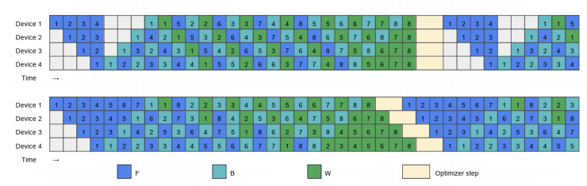

### **[超详详解] 零气泡流水线并行 (Zero-Bubble Pipeline Parallelism)**

#### **1. 问题重访:为何“流水线气泡”如此致命？**

为了理解“零气泡”技术的革命性, 我们必须首先深刻认识到标准流水线并行(即使是优化的1F1B调度)中“气泡”的危害. 它不仅仅是“一点点”的资源浪费.

在一个包含 `P` 个阶段(即 `P` 个GPU)的流水线中, 处理完所有微批次所产生的总气泡时间是 `(P - 1) * T_step`, 其中 `T_step` 是处理一个微批次在一个阶段上所需的时间(前向+反向).

这意味着:

1. **利用率天花板**:GPU的理论利用率上限约为 `M / (M + P - 1)`, 其中 `M` 是微批次的数量. 要达到90%的利用率, 微批次数 `M` 至少需要是流水线阶段数 `P` 的9倍. 这在实践中要求极大的全局批次.
2. **批次大小的“绑架”**:为了维持高效率, 我们被迫采用极大的**全局批-次大小 (Global Batch Size)**. 这不仅可能超出模型训练的最佳批次范围(影响收敛), 更可能因为激活内存的累积而直接导致显存溢出(OOM).

因此, 流水线气泡是限制流水线并行效率和适用性的核心障碍. **“零气泡”技术的目标, 就是从调度层面彻底消除这个 `(P - 1)` 的固定开销.**

#### **2. 核心洞察:反向传播并非“铁板一块”**

“零气泡”技术的“灵光一现”时刻, 源于对反向传播计算依赖关系的深刻洞察. 在标准的Autograd引擎看来, 一个层的`backward`是一个不可分割的原子操作. 但实际上, 它包含两个计算性质和依赖关系截然不同的任务.

为了更直观地理解这一点, 我们可以参考一个简单的MLP的计算图.

> 一个简单的MLP计算图

上图清晰地展示了前向传播(Forward)和反向传播(Backward)的数据流.

* **前向传播**: 输入 `x` 经过权重矩阵 `W` 的线性变换得到 `z`, 再通过激活函数 $\sigma$ 得到输出 `y`.
* **反向传播**: 从下游接收到对输出 `y` 的梯度 $\nabla_y L$ 后, 反向传播开始.
  1. **计算对输入的梯度 (`Backward for Data`, B)**: 首先, 梯度需要穿过激活函数 $\sigma$, 计算出对 `z` 的梯度 $\nabla_z L$. 接着, 为了将梯度继续向上传播给上一层, 需要计算对输入 `x` 的梯度, 即 $\nabla_x L = W^T \nabla_z L$.**这一步的结果是上一层反向传播的输入, 因此必须立即执行. **
  2. **计算对权重的梯度 (`Backward for Weights`, W)**: 同时, 我们可以利用前向传播保存的输入 `x` 和已经计算出的 $\nabla_z L$ 来计算对权重 `W` 的梯度, 即 $\nabla_W L = \nabla_z L x^T$.

从这个图中我们可以清晰地看到, 计算 $\nabla_x L$ (B) 和计算 $\nabla_W L$ (W) 是两个并行的分支. 计算 $\nabla_W L$ 的结果**仅用于最终的参数更新, 而不会影响到梯度在网络层之间的反向传播**.

这可以说明: :

1. **计算对输入的梯度 (`Backward for Data`, 记为 B)**

   * **任务**: 计算损失 $L$ 对该层**输入激活值** $X_{i-1}$ 的偏导数 $\frac{\partial L}{\partial X_{i-1}}$.
   * **依赖关系**: 这是**流水线的生命线**. 它的计算结果是上一层(上游GPU)执行反向传播所必需的输入. 因此, 它位于**关键路径 (Critical Path)**上, 具有**强串行依赖性**.
2. **计算对权重的梯度 (`Backward for Weights`, 记为 W)**

   * **任务**: 计算损失 $L$ 对该层**模型权重** $W_i$ 的偏导数 $\frac{\partial L}{\partial W_i}$.
   * **依赖关系**:**最关键的洞察在于**:一旦计算出 $\frac{\partial L}{\partial W_i}$, 这个结果在当前训练迭代步中, 除了在**最后**被优化器用于更新参数外,**没有任何其他计算依赖它**. 它是一个**依赖图中的“终端节点”**.
   * 这意味着, `W` 的计算**脱离了关键路径**. 它是一个可以被**推迟 (defer)**和**重新调度 (reschedule)** 的任务.

**革命性的调度思想由此诞生**:我们可以将 `B` 和 `W` 的计算**解耦 (decouple)**. 我们只在维持流水线运转所必需的时刻执行 `F` (前向) 和 `B` (对输入的反向), 而将计算量同样可观的 `W` (对权重的反向) 视为可以灵活调度的“填充块”, 用它来填满原本由于等待而产生的气泡.

#### **3. 调度策略对比:从 1F1B 到零气泡 (ZB)**

##### **3.1 标准 1F1B 调度**

> 1F1B 流水线调度示意图

在 1F1B 调度中, `Forward` (前向) 和 `Backward` (反向, 作为一个整体) 交错执行. 可以看到, 在启动和结束阶段, 大量的白色方块代表了设备空闲, 形成了巨大的“气泡”.

##### **3.2 零气泡 (ZB) 调度详解**

> 手工设计的零气泡流水线调度 (ZB-H1/H2)

上图展示了经过精心设计的 ZB 调度. 图中 `F` 代表前向, `B` 代表对输入的反向(关键路径), `W` 代表对权重的反向(可延迟任务). 让我们一步步解析它是如何“吃掉”气泡的:

1. **启动阶段 (Ramp-up)**:
   * 在 1F1B 中, 当 GPU 1 执行完第一个微批次的 `F_1,0` 后, 它会空闲下来, 等待 GPU 0 完成 `F_0,1` 并传来激活.
   * 在 ZB 调度中, 当 GPU 1 完成 `F_1,0` 后, 它不会空闲. 调度器会检查是否有**已就绪的 `W` 任务**. 例如, 当梯度从下游传回, 使得第一个微批次的 `B_1,0` 计算完成后, 调度器并**不立即**计算 `W_1,0`, 而是优先处理关键路径上的下一个 `F` 或 `B` 任务. `W_1,0` 作为一个可执行的任务被放入队列. 现在, 在等待 `F_0,1` 激活的这个空闲时间片, GPU 1 就可以从队列中取出 `W_1,0` 并执行它.
2. **稳定阶段 (Steady State)**:
   * 设备的每个时间片都被 `F`, `B`, `W` 之一的计算任务填满. 调度器会优先保证关键路径 `F` 和 `B` 的流畅执行, 然后在任何空闲的间隙插入 `W` 的计算. 整个流程像一个被精密编排的交响乐, 没有任何停顿.
3. **结束阶段 (Ramp-down)**:
   * 当最后一个微批次的前向传播完成后, 流水线开始排空.
   * 在 1F1B 中, 先完成任务的 GPU(如 GPU 0)会进入长时间的等待.
   * 在 ZB 调度中, 这些 GPU 正好利用这段时间, 集中处理所有**在前面阶段被推迟的 `W` 计算任务**. 它们有一个积压的 `W` 任务队列需要清空.
   * **结果**:所有设备几乎同时完成所有工作, 同步进行最后的参数更新, 然后一起进入下一个训练步. 气泡被彻底消除.

#### **4. “天下没有免费的午餐”:代价与挑战**

虽然“零气泡”在计算效率上近乎完美, 但它是在牺牲其他资源的基础上实现的:

1. **内存压力激增 (The Biggest Trade-off)**:
   * **原因**: 在标准 1F1B 中, `W` 的计算紧随 `B` 之后, 这意味着计算 `W` 所需的前向激活值可以很快被使用并释放. 但在 ZB 调度中, `W` 的计算被**显著推迟**了.
   * **后果**: 为了在未来的某个时间点能计算 `W`, GPU 必须在显存中**更长时间地保留**相应微批次的**前向激活值**. 这导致峰值激活内存显著增加, 甚至可能抵消掉流水线并行本身带来的内存节省优势. 这是一种典型的“**用内存换取计算效率**”的权衡.
2. **极致的系统复杂性 (Engineering Nightmare)**:
   * **实现难度**: 要实现 `F`, `B`, `W` 的计算分离和自定义调度, 不能依赖标准的 Autograd 引擎. 开发者需要:
     * **深度侵入框架**:手动构建计算图, 拦截并重构反向传播过程.
     * **自定义调度器**: 设计一个复杂的调度器来管理每个设备上的 `F`, `B`, `W` 任务队列, 并精确处理它们之间的依赖关系.
     * **手动内存管理**: 精细地控制何时分配和释放激活值, 以避免内存溢出.
   * **维护成本**: 正如课堂轶事所揭示的, 这种系统极其复杂, 难以调试和维护, 通常只有少数顶尖的系统专家能够驾驭, 成为团队中不可或缺的“承重之人”.

#### **5. 总结**

零气泡流水线并行是并行化策略中追求极致硬件利用率的典范. 它通过对计算图依赖关系的深刻理解, 将原本串行的流程分解为“关键路径”和“可延迟任务”, 并通过精巧的调度将后者用于填充等待间隙.

* **核心思想**: 解耦 `B` (关键路径) 和 `W` (可延迟) 的计算.
* **主要收益**: 接近 100% 的 GPU 利用率, 消除了传统流水线的气泡开销.
* **主要代价**: 显著增加的峰值激活内存和极高的系统实现与维护复杂度.

它是像 DeepSeek (`dual-pipe` 实现) 这类前沿团队在现有硬件上榨取每一滴性能的“核武器”, 但对于绝大多数应用场景而言, 其复杂性可能超过了其带来的收益.

推荐几个DualPipe的帖子

https://zhuanlan.zhihu.com/p/27045651854

https://zhuanlan.zhihu.com/p/23287346653
