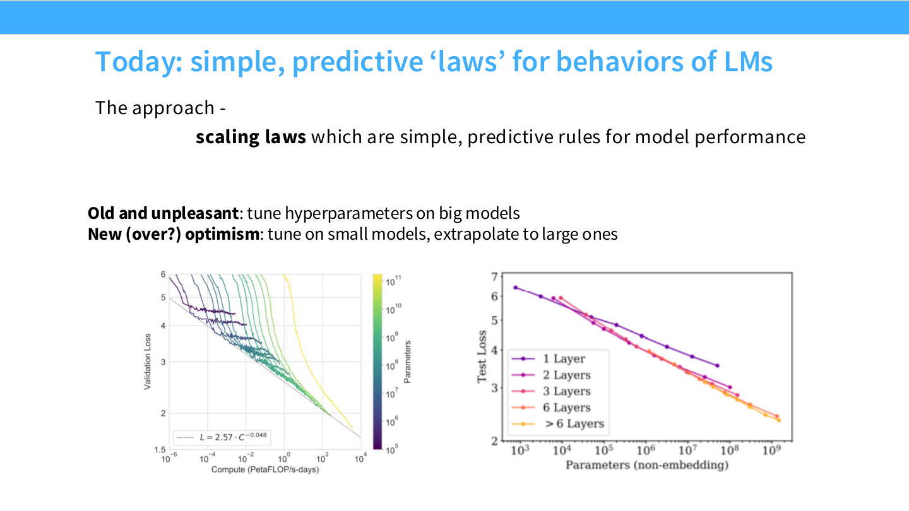
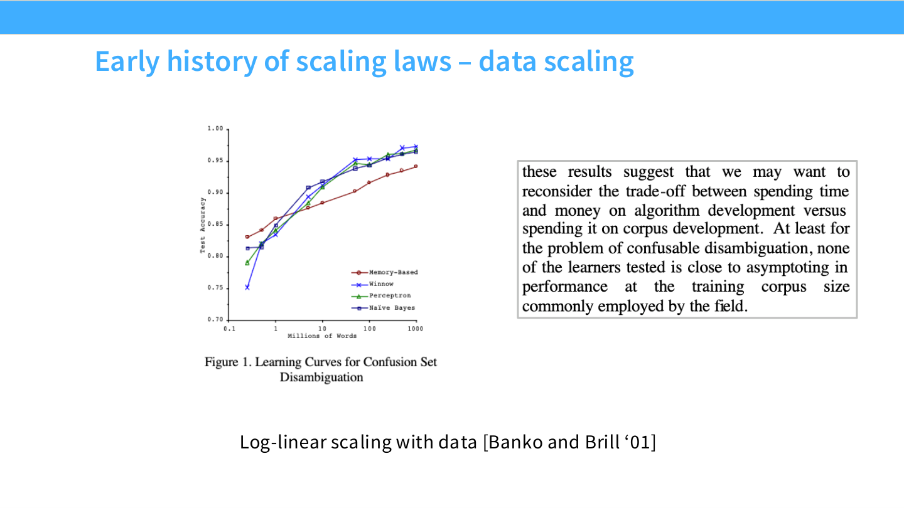
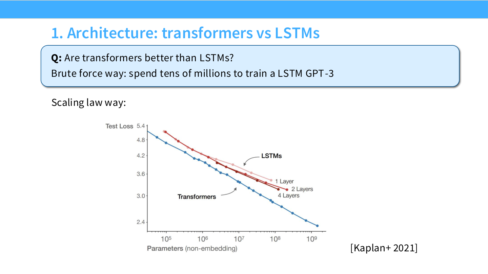
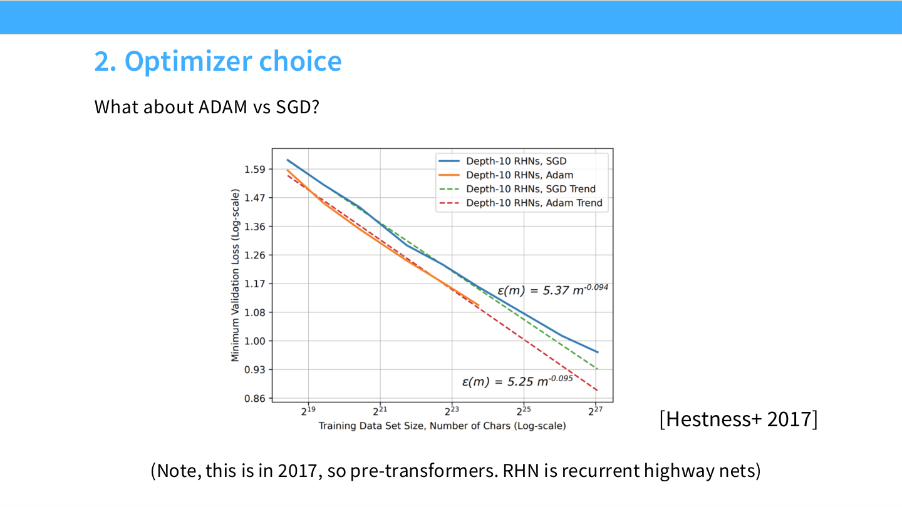
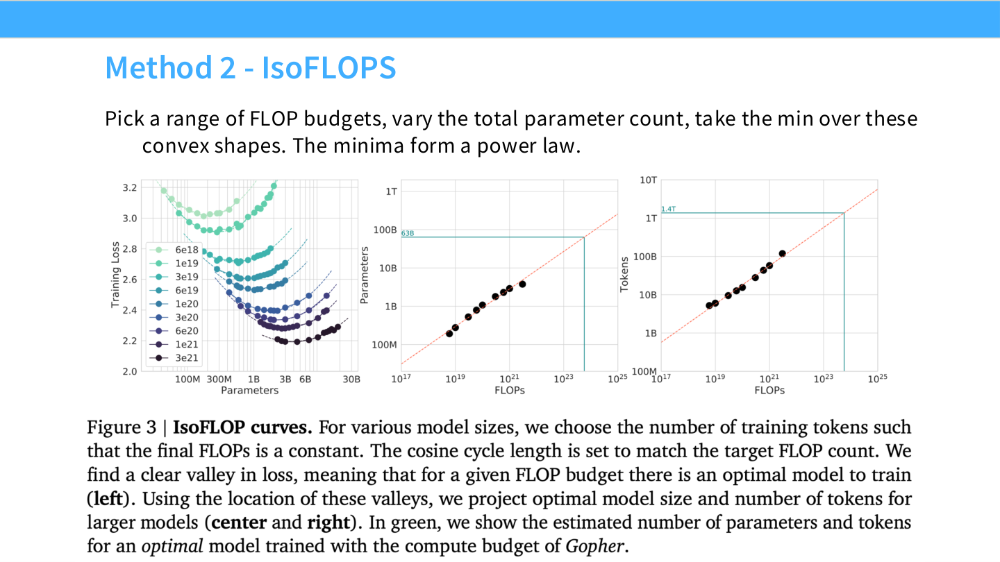

# CS336 Lecture 9: 璇﹁В Scaling Laws (Scaling Laws Explained)

## 1. 寮曡█锛氫负浠€涔堣鍏虫敞 Scaling Laws锛?

### 1.1 鎬濇兂瀹為獙锛氬瘜鏈夌殑鏈嬪弸涓庤壈闅剧殑浠诲姟
鏈潵鎴戜滑璁″垝璁ㄨ鎺ㄧ悊锛圛nference锛夛紝浣嗘垜鍐冲畾鍏堣姳浜涙椂闂磋璁?**Scaling Laws锛堟墿灞曞畾寰嬶級**锛岃繖鏄悗缁唴瀹圭殑鍩虹銆?

鎴戞兂璁╀綘浠厛杩涘叆杩欐牱涓€涓満鏅細浣犳湁涓€涓潪甯稿瘜鏈夌殑鏈嬪弸锛岀粰浜嗕綘 100,000 寮?H100 GPU 鐨勪娇鐢ㄦ潈锛堟寜鏈堣锛夈€備綘鐨勪换鍔℃槸鏋勫缓涓€涓渶濂界殑寮€婧愯瑷€妯″瀷锛圠LM锛夈€?
杩欐槸涓€涓潪甯歌壈宸ㄧ殑浠诲姟銆傝櫧鐒舵垜浠凡缁忕粰浜嗕綘涓€浜涘伐鍏封€斺€斾綘鏈変簡鍩虹璁炬柦鍥㈤槦銆佺郴缁熶汉鍛樸€佸垎甯冨紡璁粌妗嗘灦锛圢ext Assignment锛夈€侀璁粌鏁版嵁闆嗭紝涔熶簡瑙ｆ灦鏋勭煡璇嗐€備綘浼间箮鎷ユ湁浜嗘墍鏈夌鐗囷紝鍙渶杞姩鎶婃墜寮€濮嬭缁冨ぇ妯″瀷銆?

### 1.2 鍒涙柊 vs. 妯′豢
鍦ㄥ墠鍑犺妭璇句腑锛屾垜浠璁轰簡璁稿鍐崇瓥锛氭灦鏋勬槸浠€涔堬紵瓒呭弬鏁版€庝箞閫夛紵
鏃╂湡鐨勭瓟妗堝彲鑳藉緢鏃犺亰锛氣€滅収鎶勫埆浜虹殑鍋氭硶鈥濓紙姣斿 follow LLaMA锛夈€傚鏋滀綘鍦ㄤ竴涓墠娌垮疄楠屽锛岀洰鏍囨槸鏋勫缓鏈€寮虹殑妯″瀷锛屼粎浠呮ā浠挎槸涓嶅鐨勶紝浣犻渶瑕?*鍒涙柊**銆?
Scaling Laws 鐨勬牳蹇冪洰鐨勫氨鍦ㄤ簬姝わ細**閫氳繃鍦ㄥ皬瑙勬ā妯″瀷涓婂缓绔嬬畝鍗曠殑棰勬祴瀹氬緥锛屾潵鎸囧澶ц妯℃ā鍨嬬殑宸ョ▼鍐崇瓥鍜屼紭鍖栥€?*

### 1.3 娣卞害瀛︿範鐨勬柊鑼冨紡
*   **鏃ф柟娉?*锛氳缁冧竴鍫嗗ぇ妯″瀷锛岃皟鏁磋秴鍙傛暟鐩村埌澶фā鍨嬭〃鐜拌壇濂姐€傝繖鍦ㄧ畻鍔涗笂鏋佸叾鏄傝吹锛屽嚑涔庝笉鍙銆?
*   **鏂颁箰瑙備富涔夛紙Scaling 鑼冨紡锛?*锛?
    1.  璁粌涓€鍫?*灏忔ā鍨?*锛堜綅浜庤绠楄妯″浘鐨勫乏渚э級銆?
    2.  浠庡皬妯″瀷涓涔犺寰嬨€?
    3.  灏嗚寰?*澶栨帹锛圗xtrapolate锛?*鍒板ぇ妯″瀷銆?
    4.  鍦ㄦ瀯寤哄ぇ妯″瀷鏃垛€滀竴鍑诲嵆涓€濄€?

---

## 2. Scaling Laws 鐨勫巻鍙蹭笌鑳屾櫙

Scaling Laws 甯歌鎻忚堪涓洪€氬悜 AGI 鐨勨€滃讥璧涗簹寮忊€濇湳璇紙渚嬪鈥滄案杩滄槸瀵规暟绾挎€х殑鈥濄€佲€滄垜浠皢瀹炵幇瓒呯骇鏅鸿兘鈥濓級锛屼絾瀹冨叾瀹炴湁闈炲父鎵庡疄鐨勫鏈儗鏅€?

### 2.1 缁熻鏈哄櫒瀛︿範鐨勬牴婧?
Scaling Laws 鏈川涓婃槸鍛婅瘔鎴戜滑锛氶殢鐫€鏁版嵁閲忓鍔犳垨妯″瀷鍙樺ぇ锛屾垜浠湡鏈涙ā鍨嬭涓哄彂鐢熶粈涔堝彉鍖栥€傝繖涓庣粡鍏哥殑**缁熻鏈哄櫒瀛︿範鐞嗚**涓€鑴夌浉鎵匡細
*   **娉涘寲鐣?(Generalization Bounds)**锛氫緥濡?VC 缁寸悊璁猴紝娉涘寲璇樊锛圗xcess Risk锛夐殢鏍锋湰閲?$m$ 鐨勫彉鍖栧簲閬靛惊 $O(1/\sqrt{m})$銆?
*   **闈炲弬鏁扮粺璁?(Non-parametric)**锛氬浜庣伒娲荤殑鐢熸垚妯″瀷锛屽瘑搴︿及璁＄殑 $L_2$ 璇樊涓婄晫鍙兘鏄?$n^{-\frac{\beta}{2\beta+d}}$ 褰㈠紡鐨勫椤瑰紡銆?

鐞嗚瀹朵滑鏃╁凡鍦ㄦ€濊€冩牱鏈噺涓庤宸殑鍏崇郴锛屼絾杩欎簺閫氬父鏄€滀笂鐣屸€濓紙Upper Bounds锛夛紝鑰岄潪瀹為檯瀹炵幇鐨?Loss 鍊笺€?

### 2.2 鏃╂湡閲岀▼纰?
*   **1993骞?Bell Labs 璁烘枃 (Cortes, Vapnik et al.)**锛氳繖鍙兘鏄涓€绡?Scaling Law 璁烘枃銆備粬浠彁鍑哄湪璁粌瀹屾暣妯″瀷鍓嶏紝閫氳繃棰勬祴鏂规硶鍒ゆ柇妯″瀷濂藉潖銆傚叾鍏紡褰㈠紡 $Error = Error_{irreducible} + A \cdot N^{-\alpha}$ 涓庣幇浠?Scaling Law 鎯婁汉鐩镐技銆?
*   **Banko & Brill (2001)**锛氱爺绌?NLP 绯荤粺鎬ц兘闅忔暟鎹噺鐨勬墿灞曘€傜粨璁烘槸锛氫粎浠呮墿澶ф暟鎹噺灏辫兘甯︽潵宸ㄥぇ鐨勬€ц兘鎻愬崌锛岀敋鑷虫瘮绠楁硶鏀硅繘鏇存湁鏁堛€?
*   **Hestness et al. (2017, Baidu)**锛氳繖鏄幇浠ｆ繁搴﹀涔?Scaling Law 鐨勫紑灞变箣浣溿€?
    *   灞曠ず浜嗘満鍣ㄧ炕璇戙€佽闊炽€佽瑙変换鍔＄殑璇樊鐜囬殢鏁版嵁閲忓憟**骞傚緥 (Power Law)** 涓嬮檷銆?
    *   **涓変釜鍖哄煙**锛?
        1.  **闅忔満鐚滄祴鍖?(Random Guessing)**锛氭暟鎹お灏戯紝妯″瀷鐬庣寽銆?
        2.  **骞傚緥鍖?(Power Law Region)**锛氬彲棰勬祴鐨勭嚎鎬т笅闄嶏紙瀵规暟鍧愭爣涓嬶級銆?
        3.  **涓嶅彲绾﹁宸尯 (Irreducible Error)**锛氶€艰繎璐濆彾鏂宸垨鏁版嵁鍣０鏋侀檺銆?
    *   **鍓嶇灮鎬?*锛氭棭鍦?017骞达紝浠栦滑灏遍瑷€浜嗚绠楁墿灞曠殑閲嶈鎬с€侀噺鍖栫殑蹇呰鎬э紙鐢ㄨ绠楁崲绮惧害锛夈€?

### 2.3 灞€闄愭€э細骞堕潪鎬绘槸鍙樺ソ (Inverse Scaling)
Scaling Laws 鏆楃ず浜嗏€滃ぇ灏辨槸濂解€濓紝浣嗗湪鏌愪簺鐗瑰畾浠诲姟涓婏紝妯″瀷瓒婂ぇ琛ㄧ幇鍙嶈€岃秺宸紝杩欏氨鏄?**Inverse Scaling**銆?
*   **鐜拌薄**: 鍦ㄦ煇浜涗换鍔′腑锛岄殢鐫€妯″瀷瑙勬ā澧炲姞锛孡oss 涓嶉檷鍙嶅崌锛屾垨鑰呬换鍔℃寚鏍囧彉宸€?
*   **鍘熷洜**: 閫氬父鍙戠敓鍦ㄤ换鍔＄洰鏍囦笌棰勮缁冩暟鎹殑鈥滈粯璁ゅ綊绾冲亸缃€濆啿绐佹椂銆備緥濡傦紝濡傛灉浠诲姟瑕佹眰鈥滈伩鍏嶅鍒惰緭鍏モ€濓紝浣嗗ぇ妯″瀷鈥滆蹇嗕笌澶嶅埗鈥濈殑鑳藉姏鏇村己锛屽畠鍙嶈€岃〃鐜板緱鏇村樊锛堟洿鍊惧悜浜庡璇伙級銆?
*   **Inverse Scaling Prize**: 杩欐槸涓€涓笓闂ㄦ敹闆嗘绫诲弽鐩磋妗堜緥鐨勬瘮璧涳紝鎻愰啋鎴戜滑瑕佽鎯?Scaling 甯︽潵鐨勫壇浣滅敤銆?Scaling 骞朵笉鏄竾鑳借嵂锛岀壒鍒槸鍦?Out-of-Distribution (OOD) 鍦烘櫙涓嬨€?

---

## 3. 鏁版嵁鎵╁睍瀹氬緥 (Data Scaling Laws)

### 3.1 缁忛獙瑙傛祴
褰撴垜浠粯鍒?**Dataset Size ($N$)**vs.**Test Loss ($L$)**鐨勫浘鍍忔椂锛屽湪鍙屽鏁板潗鏍囩郴锛圠og-Log Plot锛変笅锛屽畠浠憟鐜?*绾挎€у叧绯?*銆?
杩欐剰鍛崇潃锛?L(N) \propto N^{-\alpha}$锛堝箓寰嬭“鍑忥級銆?

### 3.2 涓轰粈涔堟槸骞傚緥锛燂紙鏁板鐩磋锛?
璁插笀閫氳繃涓や釜渚嬪瓙璁鸿瘉骞傚緥琛板噺鏄潪甯歌嚜鐒剁殑鐜拌薄锛?

1.  **鍧囧€间及璁?(Estimating the Mean)**锛?
    *   浠诲姟锛氫粠楂樻柉鍒嗗竷涓噰鏍?$N$ 涓偣锛屼及璁″潎鍊笺€?
    *   璇樊锛堟柟宸級锛?\sigma^2 / N$銆?
    *   瀵规暟褰㈠紡锛?\log(Error) = -\log N + 2\log \sigma$銆?
    *   **鏂滅巼**锛?1 (鎴?-0.5 瀵规爣鍑嗗樊)銆傝繖缁欏嚭浜嗗畬缇庣殑骞傚緥銆?

2.  **闈炲弬鏁板洖褰?(Non-parametric Regression)**锛?
    *   浠诲姟锛氬湪 $d$ 缁寸┖闂翠及璁′竴涓厜婊戝嚱鏁?$y=f(x)$銆?
    *   鏂规硶锛氬皢绌洪棿鍒囧垎涓哄皬鐩掑瓙锛屽湪鐩掑瓙鍐呭彇骞冲潎銆?
    *   璇樊鎺ㄥ锛氳宸笌 $N^{-1/d}$ 鎴愭姣斻€?
    *   **鏂滅巼**锛?-1/d$銆?

**[娣卞叆鎺㈣: 鎵╁睍瀹氬緥鐨勭粺璁″姏瀛﹀師鐞哴(./l9-Scaling-Mechanics.md)**

### 3.3 鐜板疄涓殑鏂滅巼
铏界劧鐞嗚棰勬祴鏂滅巼鍙兘鏄?-0.5 鎴?-1锛屼絾鍦ㄥぇ璇█妯″瀷涓垜浠湅鍒扮殑鏂滅巼瑕佸钩缂撳緱澶氾細
*   鏈哄櫒缈昏瘧锛?0.13
*   璇煶璇嗗埆锛?0.3
*   **璇█妯″瀷 (LM)**锛?*-0.095**

涓轰粈涔堣繖涔堟參锛熸牴鎹笂杩伴潪鍙傛暟鍥炲綊鐨勭洿瑙夛紝杩欐殫绀轰簡鏁版嵁鐨?*鍥烘湁缁村害 (Intrinsic Dimension)** 寰堥珮銆傛枩鐜囧疄闄呬笂鍙嶆槧浜嗕换鍔″涔犵殑闅炬槗绋嬪害鎴栨暟鎹殑娴佸舰缁村害銆?

### 3.4 鏁版嵁鎵╁睍瀹氬緥鐨勫簲鐢?
### 3.4 鏁版嵁鎵╁睍瀹氬緥鐨勫簲鐢?
1.  **鏁版嵁娣峰悎涓庝唬鐞嗘ā鍨?(Data Mixture & Proxy Models)**锛?
    *   Kaplan 鎸囧嚭锛屾暟鎹泦鐨勭粍鎴愭垚鍒嗭紙Composition锛変富瑕佸奖鍝?Scaling Law 鐨?*鎴窛 (Offset)** 鑰岄潪鏂滅巼銆?
    *   **宸ョ▼鍚ず**: 杩欐剰鍛崇潃鎴戜滑鍙互閲囩敤**浠ｇ悊妯″瀷绛栫暐锛圥roxy Models锛?*銆備綘涓嶉渶瑕佸湪 100B 妯″瀷涓婃祴璇曞摢绉嶆暟鎹厤姣旀渶濂斤紝鍙渶鍦ㄤ竴涓?1B 鐢氳嚦鏇村皬鐨勬ā鍨嬩笂娴嬭瘯銆傚洜涓哄皬妯″瀷涓?Loss 鏇翠綆鐨勯厤姣旓紙Offset 鏇翠綆锛夛紝鍦ㄥぇ妯″瀷涓婂ぇ姒傜巼涔熸槸鏇翠綆鐨勩€傝繖澶уぇ鑺傜渷浜嗗疄楠屾垚鏈€?
2.  **澶氳疆璁粌 (Multi-epoch Training)**锛歁uennighoff 绛変汉鐮旂┒琛ㄦ槑锛岄噸澶嶆暟鎹瓨鍦ㄦ敹鐩婇€掑噺銆傚ぇ绾﹂噸澶?4 涓?Epoch 鍚庯紝鏀剁泭鎬ュ墽涓嬮檷銆傝繖寮曞叆浜嗏€滄湁鏁堟暟鎹噺鈥濈殑姒傚康銆?
3.  **閲嶅楂樿川閲忔暟鎹?vs. 寮曞叆鏂版暟鎹?*锛氬湪璁粌涓囦嚎 Token 鏃讹紝鏄妸 Wikipedia 閲嶅 10 閬嶅ソ锛岃繕鏄紩鍏ヨ川閲忚緝浣庣殑鏂版暟鎹ソ锛熷彲浠ラ€氳繃鎷熷悎 Scaling Law 鏉ュ鎵炬潈琛＄偣銆?

---

## 4. 妯″瀷鎵╁睍瀹氬緥 (Model Scaling Laws)

鐜板湪鎴戜滑璁ㄨ濡備綍鍒╃敤 Scaling Laws 鍋氬伐绋嬪喅绛栥€傚亣璁炬垜浠璁粌澶фā鍨嬶紝鏈夊緢澶氶€夋嫨锛歀STM vs. Transformer锛烝dam vs. SGD锛熸繁涓€鐐硅繕鏄涓€鐐癸紵

### 4.1 鏋舵瀯閫夋嫨
*   **Transformer vs. LSTM**锛欿aplan 鐨勭粨鏋滄樉绀猴紝涓よ€呴伒寰钩琛岀殑 Scaling 鏇茬嚎锛屼絾 Transformer 鏈夋槑鏄剧殑鎴窛浼樺娍锛圠oss 鏇翠綆锛夈€傝繖鎰忓懗鐫€ LSTM 鍦ㄨ绠楁晥鐜囦笂瀛樺湪涓€涓父鏁板洜瀛愮殑鍔ｅ娍锛堟瘮濡傛晥鐜囦綆15鍊嶏級銆?

*   **鍏朵粬鏋舵瀯**锛欸oogle 鐨?Yi Tay 绛変汉 (2022) 瀵规瘮浜嗗绉嶆灦鏋勩€傚彧鏈?*Gated Linear Units (GLU)**鍜?*Mixture of Experts (MoE)** 鑳藉湪鎵╁睍鎬т笂鍖归厤鎴栬秴瓒婃爣鍑?Transformer銆傝繖瑙ｉ噴浜嗕负浠€涔堢幇鍦ㄧ殑妯″瀷锛堝 LLaMA, Mixtral锛夋櫘閬嶉噰鐢?GLU 鍜?MoE銆?

### 4.2 瓒呭弬鏁伴€夋嫨
*   **瀹芥繁姣?(Aspect Ratio)**锛欿aplan 鍙戠幇锛屽湪鍥哄畾鍙傛暟閲忎笅锛屼笉鍚屽娣辨瘮鐨勬ā鍨?Loss 宸紓褰㈡垚涓€涓闃旂殑鐩嗗湴锛圔asin锛夈€傚彧瑕佸楂樻瘮鍦ㄤ竴瀹氳寖鍥村唴锛堝 4 鍒?16 鐢氳嚦 100锛夛紝鎬ц兘閮介潪甯告帴杩戞渶浼樸€傝繖鎰忓懗鐫€鎴戜滑涓嶉渶瑕佺籂缁撲簬绮剧‘鐨勫眰鏁般€?
*   **Embedding 鍙傛暟鐨勭壒娈婃€?*锛氬仛 Scaling 鍒嗘瀽鏃讹紝**涓嶈**鎶?Embedding 灞傜殑鍙傛暟绠楀湪妯″瀷鎬诲弬鏁?$N$ 閲屻€侲mbedding 鍙傛暟涓嶉伒寰悓鏍风殑鎵╁睍瑙勫緥锛屽鏋滅畻杩涘幓浼氬鑷存洸绾垮集鏇层€傚彧璁＄畻闈?Embedding 鍙傛暟锛圢on-embedding parameters锛夎兘寰楀埌鏇村共鍑€鐨勫箓寰嬨€?

### 4.3 涓や釜妫樻墜鐨勮秴鍙傛暟锛欱atch Size 鍜?Learning Rate
澶у瓒呭弬鏁板彲浠ュ湪灏忚妯¤皟鏁村悗鐩存帴杩佺Щ锛屼絾 Batch Size 鍜?LR 涓庤妯＄揣瀵嗙浉鍏炽€?

#### 4.3.1 Batch Size (鎵归噺澶у皬)
*   **涓寸晫 Batch Size (Critical Batch Size)**锛氳繖鏄苟琛屽寲鏀剁泭閫掑噺鐨勮浆鎶樼偣銆?
    *   褰?Batch Size < 涓寸晫鍊硷細澧炲姞 Batch Size 鐩稿綋浜庡鍔犳搴︽鏁帮紙瀹岀編鎵╁睍锛屾椂闂存晥鐜囬珮锛夈€?
    *   褰?Batch Size > 涓寸晫鍊硷細澧炲姞 Batch Size 涓嶅啀鏄捐憲鍑忓皯鎵€闇€鐨勬搴︽鏁帮紙鏁版嵁鏁堢巼浣庯級锛屾敹鐩婂彈闄愪簬浼樺寲鏅鐨勬洸鐜囥€?
*   **鐗╃悊鐩磋锛氬櫔澹颁笌鏇茬巼**锛?
    *   璁粌鏃╂湡锛氭搴﹀ぇ锛屾柟鍚戞槑纭€傛鏃朵富瑕佸彈闄愪簬鏇茬巼锛堜笉鑳借蛋澶揩锛夛紝鍥犳 Batch Size 涓嶉渶瑕佸お澶с€?
    *   璁粌鍚庢湡锛歀oss 鍙樺皬锛屾搴﹀彉灏忥紝**姊害鍣０ (Gradient Noise)**鍗犳嵁涓诲銆備负浜嗚幏寰楀噯纭殑涓嬮檷鏂瑰悜锛屾垜浠渶瑕佸钩鍧囨洿澶氱殑鏍锋湰鏉ユ姷娑堝櫔澹般€傝繖灏辨槸涓轰粈涔?*鐩爣 Loss 瓒婁綆锛堟ā鍨嬭秺寮?璁粌瓒婁箙锛夛紝涓寸晫 Batch Size 瓒婂ぇ**銆?
*   **宸ョ▼瀹炶返**锛氳繖鎰忓懗鐫€闅忕潃璁粌杩涜锛屼綘搴旇澧炲ぇ Batch Size銆?
    *   LLaMA 3 鐨勮缁冩姤鍛婁腑灏变綋鐜颁簡杩欎竴鐐癸細闅忕潃 Loss 涓嬮檷锛屽鍔?Batch Size銆?

#### 4.3.2 Learning Rate (瀛︿範鐜?
*   **鏍囧噯瀹炶返**锛氶€氬父璁や负鏈€浣冲涔犵巼闅忔ā鍨嬪搴?$W$ 琛板噺锛岀粡楠屾硶鍒欐槸 $LR \propto 1/W$ 鎴?$1/\sqrt{W}$銆備綘闇€瑕佸涓嶅悓瑙勬ā鐨勬ā鍨嬪鎵炬渶浣?LR锛岀劧鍚庢嫙鍚堣寰嬭繘琛屽鎺ㄣ€?
*   **MuP (Maximal Update Parametrization)**锛氳繖鏄竴绉嶆洿楂樼骇鐨勫弬鏁板寲鏂规硶銆傞€氳繃璋冩暣鍒濆鍖栫殑鏂瑰樊鍜屽悇灞傜殑涔樻暟锛屼娇寰?*鏈€浣冲涔犵巼鍦ㄤ笉鍚岃妯′笅淇濇寔绋冲畾**銆?
    *   浼樺娍锛氫綘鍦ㄥ皬妯″瀷涓婅皟鍑虹殑鏈€浣?LR锛屽彲浠ョ洿鎺ョ敤浜庤秴澶фā鍨嬶紝鏃犻渶澶栨帹銆?
    *   杩欐槸鐩墠璁稿鍓嶆部瀹為獙瀹わ紙濡?Microsoft, Meta锛夌殑鐮旂┒鐑偣銆?

**[娣卞叆鎺㈣: 鏋佸ぇ鏇存柊鍙傛暟鍖?(MuP)](./l9-MuP.md)**

### 4.4 璀︾ず锛氫笅娓镐换鍔＄殑闈炵嚎鎬?
Scaling Laws 瀵?**Log Loss (Perplexity)**棰勬祴鏋佸叾绮惧噯銆備絾瀵逛簬涓嬫父浠诲姟锛堝 SuperGLUE, 绠楁湳棰橈級锛岀敱浜庢寚鏍囩殑绂绘暎鎬ф垨娑岀幇鐜拌薄锛屾€ц兘闅忚妯＄殑鍙樺寲鍙兘涓嶆槸绾挎€х殑锛岀敋鑷充細鍑虹幇涓嶅彲棰勬祴鐨勭獊鍙樸€?*涓嶈绠€鍗曞湴灏?Perplexity 鐨勭嚎鎬ф墿灞曠瓑鍚屼簬鎵€鏈夎兘鍔涚殑绾挎€ф彁鍗囥€?*

---

## 5. 鑱斿悎鎵╁睍锛欳hinchilla 瀹氬緥 (Joint Scaling)

鏍稿績闂锛?*缁欏畾鍥哄畾鐨勮绠楅绠楋紙FLOPs锛夛紝鎴戜滑搴旇鎶婅祫婧愯姳鍦ㄦ洿澶х殑妯″瀷涓婏紝杩樻槸鏇村鐨勬暟鎹笂锛?*

### 5.1 鏃╂湡灏濊瘯锛欿aplan Scaling (OpenAI, 2020)
*   Kaplan 绛変汉鎻愬嚭鍏紡锛?L(N, D) = \frac{A}{N^\alpha} + \frac{B}{D^\beta} + E$銆?
*   浠栦滑鐨勭粨璁哄€惧悜浜庯細**澶фā鍨嬩紭浜庡ぇ鏁版嵁**銆傚鏋滀綘鏈夋洿澶氱畻鍔涳紝涓昏搴旇澧炲姞妯″瀷鍙傛暟锛屾暟鎹噺澧炲姞鐩稿杈冨皯銆?

### 5.2 淇锛欳hinchilla Scaling (DeepMind, 2022)
*   Kaplan 鐨勭粨璁哄悗鏉ヨ璇佹槑鏄湁鍋忓樊鐨勶紝涓昏鍘熷洜鏄粬浠娇鐢ㄤ簡**鎴柇鐨?Learning Rate Schedule**锛堝嵆鍦ㄥ皬鏁版嵁涓婅缁冨ぇ妯″瀷鏃舵病鏈夊畬鏁磋窇瀹?Cosine Decay锛夛紝瀵艰嚧澶фā鍨嬪湪灏戞暟鎹笅鐨勬€ц兘琚綆浼颁簡锛堟垨鑰呰璁粌璁剧疆涓嶅叕骞筹級銆?
*   **Chinchilla (Hoffmann et al.)** 閲嶆柊杩涜浜嗕弗鏍肩殑瀹為獙锛屾彁鍑轰簡涓夌鎷熷悎鏂规硶锛?

#### Method 1: 鍥哄畾妯″瀷澶у皬锛屽鎵炬渶浼樻暟鎹噺 (Envelope Method)
璁粌涓€绯诲垪涓嶅悓澶у皬鐨勬ā鍨嬶紝姣忎釜妯″瀷璺戜笉鍚岀殑鏁版嵁閲忋€傜敾鍑烘墍鏈夋洸绾匡紝鍙栧叾**涓嬪寘缁滅嚎 (Lower Envelope)**銆傝繖浠ｈ〃浜嗕换鎰忚绠楅绠椾笅鐨勬渶浼?Loss銆?

#### Method 2: IsoFLOP 鍒嗘瀽 (The Canonical Method)
1.  閫夊畾鍑犱釜鍥哄畾鐨勮绠楅绠楋紙FLOPs 绾у埆锛夈€?
2.  鍦ㄦ瘡涓绠椾笅锛岃缁冧笉鍚屽ぇ灏忕殑妯″瀷锛堝洜姝ゅ搴斾笉鍚岀殑鏁版嵁閲忥級銆?
3.  鎵惧埌姣忎釜棰勭畻涓嬬殑 Loss 鏈€浣庣偣锛堟渶浼樻ā鍨嬪ぇ灏忥級銆?
4.  鎷熷悎杩欎簺鏈€浣庣偣锛屽緱鍑哄弬鏁伴噺涓?FLOPs 鐨勫叧绯汇€?
杩欐槸鏈€鐩磋涓旇骞挎硾寮曠敤鐨勬柟娉曘€?

**[娣卞叆鎺㈣: Chinchilla IsoFLOP 鍒嗘瀽鏂规硶璁篯(./l9-Chinchilla-Methods.md)**

#### Method 3: 鍙傛暟鍖栨嫙鍚?(Parametric Fit)
鐩存帴鎷熷悎 $L(N, D)$ 鐨勫嚱鏁板舰寮忋€?
*   **瓒ｉ椈**锛欳hinchilla 鍘熻鏂囦腑 Method 3 鐨勭粨鏋滀笌鍏朵粬涓ょ鏂规硶涓嶅お涓€鑷淬€傚悗鏉?*Epoch AI** 鐨勭爺绌朵汉鍛樺彂鐜帮紝鍘熶綔鑰呭湪鏇茬嚎鎷熷悎鏃跺鐞嗘畫宸紙Residuals锛夌殑鏂瑰紡鏈夎锛堥潪闆跺潎鍊硷級銆備慨姝ｅ悗锛孧ethod 3 鐨勭粨鏋滀笌 Method 1, 2 瀹岀編鍚诲悎銆?

### 5.3 缁撹锛欳hinchilla Ratio
Chinchilla 鐨勬牳蹇冪粨璁烘槸锛?*瀵逛簬璁＄畻鏈€浼樿缁冿紙Compute-Optimal Training锛夛紝妯″瀷澶у皬鍜屾暟鎹噺搴旇鎸夌浉绛夌殑姣斾緥澧炲姞銆?*
*   Scaling Coefficients: $a \approx b \approx 0.5$銆?
*   **榛勯噾姣斾緥**锛?*20 Tokens / Parameter**銆?
*   濡傛灉浣犵殑棰勭畻澧炲姞 10 鍊嶏紝妯″瀷鍙傛暟閲忔墿澶?3.16 鍊嶏紝鏁版嵁閲忎篃鎵╁ぇ 3.16 鍊嶃€?

---

## 6. 鎺ㄧ悊鏈€浼樻墿灞?(Inference-Optimal Scaling)

Chinchilla 鍏虫敞鐨勬槸鈥滆缁冩渶浼樷€濃€斺€斿嵆鐢ㄦ渶灏戠殑閽辫缁冨嚭鏈€濂界殑妯″瀷銆?
浣嗗湪鐜板疄涓紝澶фā鍨嬫槸**浜у搧**銆傛垜浠笉浠呭叧蹇冭缁冩垚鏈紝鏇村叧蹇?*鎺ㄧ悊鎴愭湰 (Inference Cost)**銆?
*   澶фā鍨嬶細璁粌璐碉紝鎺ㄧ悊璐点€?
*   灏忔ā鍨嬶紙澶氭暟鎹缁冿級锛氳缁冭吹锛屾帹鐞嗕究瀹溿€?

鐢变簬鎺ㄧ悊鏄暱鏈熺殑杩愯惀鎴愭湰锛岀幇鍦ㄧ殑瓒嬪娍鏄?*Over-training**锛堣繃搴﹁缁冿級銆?
*   LLaMA 3 绛夋ā鍨嬩娇鐢ㄤ簡杩滆秴 Chinchilla 姣斾緥鐨勬暟鎹紙渚嬪 **100+ Tokens/Parameter**锛夈€?
*   鎴戜滑鎰挎剰鏀粯楂樻槀鐨勫墠鏈熻缁冩垚鏈紝鏉ユ崲鍙栦竴涓洿灏忋€佹帹鐞嗘洿渚垮疁浣嗘€ц兘鏋佸己鐨勬ā鍨嬨€?

## 7. 缁撹锛氭櫘閫傛€?
Scaling Laws 涓嶄粎閫傜敤浜?LLM銆傝甯堝睍绀轰簡鍏跺鐢熷湪 **Diffusion Models** 涓婄殑鐮旂┒锛屽彂鐜版墿鏁ｆā鍨嬩篃閬靛惊鎯婁汉鐩镐技鐨?Scaling Laws銆傝繖琛ㄦ槑 Log-Linear 琛屼负鍙兘鏄繁搴︾敓鎴愭ā鍨嬬殑鏅亶瑙勫緥銆?

閫氳繃 Scaling Laws锛屾垜浠彲浠ュ湪涓嶈繘琛屽叏瑙勬ā璁粌鐨勬儏鍐典笅锛屽埄鐢ㄥ皬妯″瀷棰勬祴澶фā鍨嬭〃鐜帮紝浼樺寲瓒呭弬鏁帮紝骞跺埗瀹氱悊鎬х殑璧勬簮鍒嗛厤绛栫暐銆
