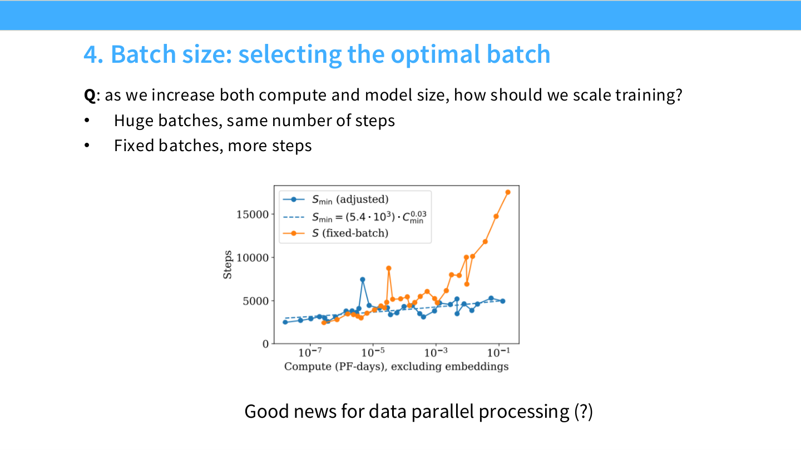

# CS336 Lecture 9: 详解 Scaling Laws (Scaling Laws Explained)

## 1. 引言：为什么要关注 Scaling Laws？

### 1.1 思想实验：富有的朋友与艰难的任务
本来我们计划讨论推理（Inference），但我决定先花些时间讲讲 **Scaling Laws（扩展定律）**，这是后续内容的基础。

我想让你们先进入这样一个场景：你有一个非常富有的朋友，给了你 100,000 张 H100 GPU 的使用权（按月计）。你的任务是构建一个最好的开源语言模型（LLM）。
这是一个非常艰巨的任务。虽然我们已经给了你一些工具——你有了基础设施团队、系统人员、分布式训练框架（Next Assignment）、预训练数据集，也了解架构知识。你似乎拥有了所有碎片，只需转动把手开始训练大模型。

### 1.2 创新 vs. 模仿
在前几节课中，我们讨论了许多决策：架构是什么？超参数怎么选？
早期的答案可能很无聊：“照抄别人的做法”（比如 follow LLaMA）。如果你在一个前沿实验室，目标是构建最强的模型，仅仅模仿是不够的，你需要**创新**。
Scaling Laws 的核心目的就在于此：**通过在小规模模型上建立简单的预测定律，来指导大规模模型的工程决策和优化。**

### 1.3 深度学习的新范式
*   **旧方法**：训练一堆大模型，调整超参数直到大模型表现良好。这在算力上极其昂贵，几乎不可行。
*   **新乐观主义（Scaling 范式）**：
    1.  训练一堆**小模型**（位于计算规模图的左侧）。
    2.  从小模型中学习规律。
    3.  将规律**外推（Extrapolate）**到大模型。
    4.  在构建大模型时“一击即中”。

---

## 2. Scaling Laws 的历史与背景

Scaling Laws 常被描述为通向 AGI 的“弥赛亚式”术语（例如“永远是对数线性的”、“我们将实现超级智能”），但它其实有非常扎实的学术背景。

### 2.1 统计机器学习的根源
Scaling Laws 本质上是告诉我们：随着数据量增加或模型变大，我们期望模型行为发生什么变化。这与经典的**统计机器学习理论**一脉相承：
*   **泛化界 (Generalization Bounds)**：例如 VC 维理论，泛化误差（Excess Risk）随样本量 $m$ 的变化应遵循 $O(1/\sqrt{m})$。
*   **非参数统计 (Non-parametric)**：对于灵活的生成模型，密度估计的 $L_2$ 误差上界可能是 $n^{-\frac{\beta}{2\beta+d}}$ 形式的多项式。

理论家们早已在思考样本量与误差的关系，但这些通常是“上界”（Upper Bounds），而非实际实现的 Loss 值。

### 2.2 早期里程碑
*   **1993年 Bell Labs 论文 (Cortes, Vapnik et al.)**：这可能是第一篇 Scaling Law 论文。他们提出在训练完整模型前，通过预测方法判断模型好坏。其公式形式 $Error = Error_{irreducible} + A \cdot N^{-\alpha}$ 与现代 Scaling Law 惊人相似。
*   **Banko & Brill (2001)**：研究 NLP 系统性能随数据量的扩展。结论是：仅仅扩大数据量就能带来巨大的性能提升，甚至比算法改进更有效。
*   **Hestness et al. (2017, Baidu)**：这是现代深度学习 Scaling Law 的开山之作。
    *   展示了机器翻译、语音、视觉任务的误差率随数据量呈**幂律 (Power Law)** 下降。
    *   **三个区域**：
        1.  **随机猜测区 (Random Guessing)**：数据太少，模型瞎猜。
        2.  **幂律区 (Power Law Region)**：可预测的线性下降（对数坐标下）。
        3.  **不可约误差区 (Irreducible Error)**：逼近贝叶斯误差或数据噪声极限。
    *   **前瞻性**：早在2017年，他们就预言了计算扩展的重要性、量化的必要性（用计算换精度）。

### 2.3 局限性：并非总是变好 (Inverse Scaling)
Scaling Laws 暗示了“大就是好”，但在某些特定任务上，模型越大表现反而越差，这就是 **Inverse Scaling**。
*   **现象**: 在某些任务中，随着模型规模增加，Loss 不降反升，或者任务指标变差。
*   **原因**: 通常发生在任务目标与预训练数据的“默认归纳偏置”冲突时。例如，如果任务要求“避免复制输入”，但大模型“记忆与复制”的能力更强，它反而表现得更差（更倾向于复读）。
*   **Inverse Scaling Prize**: 这是一个专门收集此类反直觉案例的比赛，提醒我们要警惕 Scaling 带来的副作用。 Scaling 并不是万能药，特别是在 Out-of-Distribution (OOD) 场景下。

---

## 3. 数据扩展定律 (Data Scaling Laws)

### 3.1 经验观测
当我们绘制 **Dataset Size ($N$)** vs. **Test Loss ($L$)** 的图像时，在双对数坐标系（Log-Log Plot）下，它们呈现**线性关系**。
这意味着：$L(N) \propto N^{-\alpha}$（幂律衰减）。

### 3.2 为什么是幂律？（数学直觉）
讲师通过两个例子论证幂律衰减是非常自然的现象：

1.  **均值估计 (Estimating the Mean)**：
    *   任务：从高斯分布中采样 $N$ 个点，估计均值。
    *   误差（方差）：$\sigma^2 / N$。
    *   对数形式：$\log(Error) = -\log N + 2\log \sigma$。
    *   **斜率**：-1 (或 -0.5 对标准差)。这给出了完美的幂律。

2.  **非参数回归 (Non-parametric Regression)**：
    *   任务：在 $d$ 维空间估计一个光滑函数 $y=f(x)$。
    *   方法：将空间切分为小盒子，在盒子内取平均。
    *   误差推导：误差与 $N^{-1/d}$ 成正比。
    *   **斜率**：$-1/d$。

**[深入探讨: 扩展定律的统计力学原理](./Lecture9-Scaling-Mechanics.md)**

### 3.3 现实中的斜率
虽然理论预测斜率可能是 -0.5 或 -1，但在大语言模型中我们看到的斜率要平缓得多：
*   机器翻译：-0.13
*   语音识别：-0.3
*   **语言模型 (LM)**：**-0.095**

为什么这么慢？根据上述非参数回归的直觉，这暗示了数据的**固有维度 (Intrinsic Dimension)** 很高。斜率实际上反映了任务学习的难易程度或数据的流形维度。

### 3.4 数据扩展定律的应用
### 3.4 数据扩展定律的应用
1.  **数据混合与代理模型 (Data Mixture & Proxy Models)**：
    *   Kaplan 指出，数据集的组成成分（Composition）主要影响 Scaling Law 的**截距 (Offset)** 而非斜率。
    *   **工程启示**: 这意味着我们可以采用**代理模型策略（Proxy Models）**。你不需要在 100B 模型上测试哪种数据配比最好，只需在一个 1B 甚至更小的模型上测试。因为小模型上 Loss 更低的配比（Offset 更低），在大模型上大概率也是更低的。这大大节省了实验成本。
2.  **多轮训练 (Multi-epoch Training)**：Muennighoff 等人研究表明，重复数据存在收益递减。大约重复 4 个 Epoch 后，收益急剧下降。这引入了“有效数据量”的概念。
3.  **重复高质量数据 vs. 引入新数据**：在训练万亿 Token 时，是把 Wikipedia 重复 10 遍好，还是引入质量较低的新数据好？可以通过拟合 Scaling Law 来寻找权衡点。

---

## 4. 模型扩展定律 (Model Scaling Laws)

现在我们讨论如何利用 Scaling Laws 做工程决策。假设我们要训练大模型，有很多选择：LSTM vs. Transformer？Adam vs. SGD？深一点还是宽一点？

### 4.1 架构选择
*   **Transformer vs. LSTM**：Kaplan 的结果显示，两者遵循平行的 Scaling 曲线，但 Transformer 有明显的截距优势（Loss 更低）。这意味着 LSTM 在计算效率上存在一个常数因子的劣势（比如效率低15倍）。

*   **其他架构**：Google 的 Yi Tay 等人 (2022) 对比了多种架构。只有 **Gated Linear Units (GLU)** 和 **Mixture of Experts (MoE)** 能在扩展性上匹配或超越标准 Transformer。这解释了为什么现在的模型（如 LLaMA, Mixtral）普遍采用 GLU 和 MoE。

### 4.2 超参数选择
*   **宽深比 (Aspect Ratio)**：Kaplan 发现，在固定参数量下，不同宽深比的模型 Loss 差异形成一个宽阔的盆地（Basin）。只要宽高比在一定范围内（如 4 到 16 甚至 100），性能都非常接近最优。这意味着我们不需要纠结于精确的层数。
*   **Embedding 参数的特殊性**：做 Scaling 分析时，**不要**把 Embedding 层的参数算在模型总参数 $N$ 里。Embedding 参数不遵循同样的扩展规律，如果算进去会导致曲线弯曲。只计算非 Embedding 参数（Non-embedding parameters）能得到更干净的幂律。

### 4.3 两个棘手的超参数：Batch Size 和 Learning Rate
大多超参数可以在小规模调整后直接迁移，但 Batch Size 和 LR 与规模紧密相关。

#### 4.3.1 Batch Size (批量大小)
*   **临界 Batch Size (Critical Batch Size)**：这是并行化收益递减的转折点。
    *   当 Batch Size < 临界值：增加 Batch Size 相当于增加梯度步数（完美扩展，时间效率高）。
    *   当 Batch Size > 临界值：增加 Batch Size 不再显著减少所需的梯度步数（数据效率低），收益受限于优化景观的曲率。
*   **物理直觉：噪声与曲率**：
    *   训练早期：梯度大，方向明确。此时主要受限于曲率（不能走太快），因此 Batch Size 不需要太大。
    *   训练后期：Loss 变小，梯度变小，**梯度噪声 (Gradient Noise)** 占据主导。为了获得准确的下降方向，我们需要平均更多的样本来抵消噪声。这就是为什么**目标 Loss 越低（模型越强/训练越久），临界 Batch Size 越大**。
*   **工程实践**：这意味着随着训练进行，你应该增大 Batch Size。
    *   LLaMA 3 的训练报告中就体现了这一点：随着 Loss 下降，增加 Batch Size。

#### 4.3.2 Learning Rate (学习率)
*   **标准实践**：通常认为最佳学习率随模型宽度 $W$ 衰减，经验法则是 $LR \propto 1/W$ 或 $1/\sqrt{W}$。你需要对不同规模的模型寻找最佳 LR，然后拟合规律进行外推。
*   **MuP (Maximal Update Parametrization)**：这是一种更高级的参数化方法。通过调整初始化的方差和各层的乘数，使得**最佳学习率在不同规模下保持稳定**。
    *   优势：你在小模型上调出的最佳 LR，可以直接用于超大模型，无需外推。
    *   这是目前许多前沿实验室（如 Microsoft, Meta）的研究热点。

**[深入探讨: 极大更新参数化 (MuP)](./Lecture9-MuP.md)**

### 4.4 警示：下游任务的非线性
Scaling Laws 对 **Log Loss (Perplexity)** 预测极其精准。但对于下游任务（如 SuperGLUE, 算术题），由于指标的离散性或涌现现象，性能随规模的变化可能不是线性的，甚至会出现不可预测的突变。**不要简单地将 Perplexity 的线性扩展等同于所有能力的线性提升。**

---

## 5. 联合扩展：Chinchilla 定律 (Joint Scaling)

核心问题：**给定固定的计算预算（FLOPs），我们应该把资源花在更大的模型上，还是更多的数据上？**

### 5.1 早期尝试：Kaplan Scaling (OpenAI, 2020)
*   Kaplan 等人提出公式：$L(N, D) = \frac{A}{N^\alpha} + \frac{B}{D^\beta} + E$。
*   他们的结论倾向于：**大模型优于大数据**。如果你有更多算力，主要应该增加模型参数，数据量增加相对较少。

### 5.2 修正：Chinchilla Scaling (DeepMind, 2022)
*   Kaplan 的结论后来被证明是有偏差的，主要原因是他们使用了**截断的 Learning Rate Schedule**（即在小数据上训练大模型时没有完整跑完 Cosine Decay），导致大模型在少数据下的性能被低估了（或者说训练设置不公平）。
*   **Chinchilla (Hoffmann et al.)** 重新进行了严格的实验，提出了三种拟合方法：

#### Method 1: 固定模型大小，寻找最优数据量 (Envelope Method)
训练一系列不同大小的模型，每个模型跑不同的数据量。画出所有曲线，取其**下包络线 (Lower Envelope)**。这代表了任意计算预算下的最优 Loss。

#### Method 2: IsoFLOP 分析 (The Canonical Method)
1.  选定几个固定的计算预算（FLOPs 级别）。
2.  在每个预算下，训练不同大小的模型（因此对应不同的数据量）。
3.  找到每个预算下的 Loss 最低点（最优模型大小）。
4.  拟合这些最低点，得出参数量与 FLOPs 的关系。
这是最直观且被广泛引用的方法。

**[深入探讨: Chinchilla IsoFLOP 分析方法论](./Lecture9-Chinchilla-Methods.md)**

#### Method 3: 参数化拟合 (Parametric Fit)
直接拟合 $L(N, D)$ 的函数形式。
*   **趣闻**：Chinchilla 原论文中 Method 3 的结果与其他两种方法不太一致。后来 **Epoch AI** 的研究人员发现，原作者在曲线拟合时处理残差（Residuals）的方式有误（非零均值）。修正后，Method 3 的结果与 Method 1, 2 完美吻合。

### 5.3 结论：Chinchilla Ratio
Chinchilla 的核心结论是：**对于计算最优训练（Compute-Optimal Training），模型大小和数据量应该按相等的比例增加。**
*   Scaling Coefficients: $a \approx b \approx 0.5$。
*   **黄金比例**：**20 Tokens / Parameter**。
*   如果你的预算增加 10 倍，模型参数量扩大 3.16 倍，数据量也扩大 3.16 倍。

---

## 6. 推理最优扩展 (Inference-Optimal Scaling)

Chinchilla 关注的是“训练最优”——即用最少的钱训练出最好的模型。
但在现实中，大模型是**产品**。我们不仅关心训练成本，更关心**推理成本 (Inference Cost)**。
*   大模型：训练贵，推理贵。
*   小模型（多数据训练）：训练贵，推理便宜。

由于推理是长期的运营成本，现在的趋势是**Over-training**（过度训练）。
*   LLaMA 3 等模型使用了远超 Chinchilla 比例的数据（例如 **100+ Tokens/Parameter**）。
*   我们愿意支付高昂的前期训练成本，来换取一个更小、推理更便宜但性能极强的模型。

## 7. 结语：普适性
Scaling Laws 不仅适用于 LLM。讲师展示了其学生在 **Diffusion Models** 上的研究，发现扩散模型也遵循惊人相似的 Scaling Laws。这表明 Log-Linear 行为可能是深度生成模型的普遍规律。

通过 Scaling Laws，我们可以在不进行全规模训练的情况下，利用小模型预测大模型表现，优化超参数，并制定理性的资源分配策略。