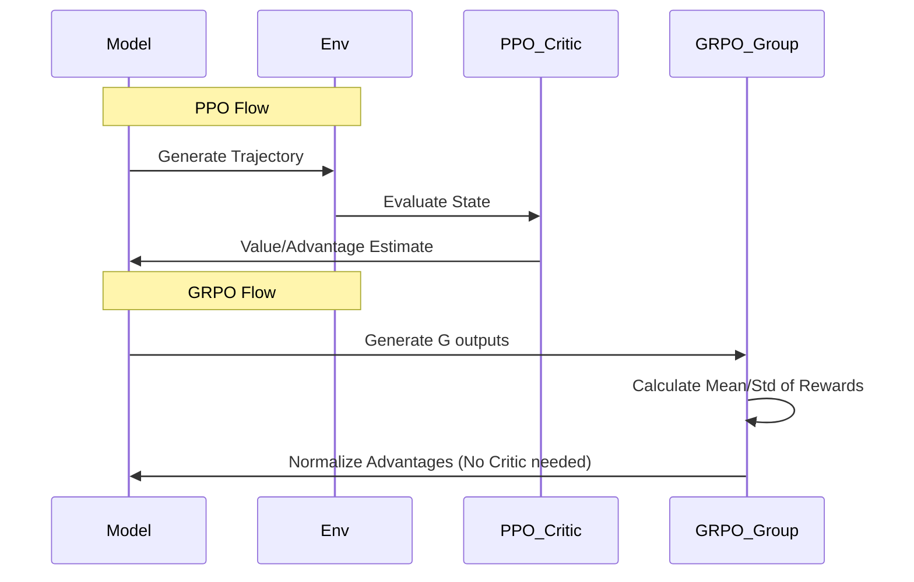

# PPO vs GRPO: Optimizing RL for LLMs

> [!INFO]
> Exploring the differences between Proximal Policy Optimization (PPO) and Group Relative Policy Optimization (GRPO) in the context of Large Language Models.

## 1. Background

Reinforcement Learning from Human Feedback (RLHF) has become the standard for aligning LLMs. **PPO** (Proximal Policy Optimization) is the default choice, but **GRPO** (Group Relative Policy Optimization) is emerging as a more stable alternative for certain reasoning tasks.

## 2. Proximal Policy Optimization (PPO)

PPO optimizes a surrogate objective function that clips probability ratios to prevent destructive updates.

$$
L^{CLIP}(\theta) = \hat{\mathbb{E}}_t [\min(r_t(\theta)\hat{A}_t, \text{clip}(r_t(\theta), 1-\epsilon, 1+\epsilon)\hat{A}_t)]
$$

### Pros & Cons
*   **Pros**: Well-studied, broadly applicable.
*   **Cons**: Sensitive to hyperparameters, requires a separate Critic model (usually).

## 3. Group Relative Policy Optimization (GRPO)

GRPO, introduced widely with DeepSeek-R1 and DeepSeekMath, eliminates the need for a critic by using group-based baselines.

### Algorithm Flow
1.  Sample a group of outputs $\{o_1, o_2, ..., o_G\}$ for a given prompt $q$.
2.  Score each output using the reward model.
3.  Compute the advantage $A_i$ as the normalized score within the group:
    $$
    A_i = \frac{r_i - \text{mean}(\mathbf{r})}{\text{std}(\mathbf{r})}
    $$
4.  Optimize the policy using this relative advantage.

### Comparison Diagram

## 4. Application in Reasoning (DeepSeek-R1)

GRPO has shown superior stability in training reasoning models like [[DeepSeek-V2]]. By removing the critic, it reduces memory overhead and simplifies the training loop, allowing for larger batch sizes and more robust convergence on mathematical tasks.

Ref: [[CS336 Lecture 1]]
