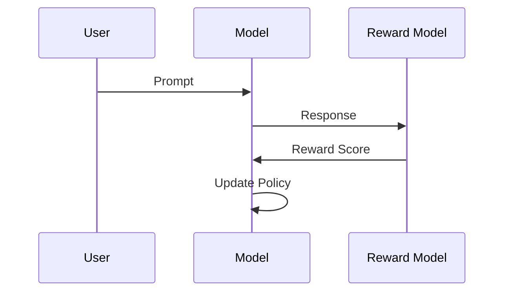

# PPO

## 人类对齐详解

**PPO** 旨在让模型行为符合人类价值观。

### 算法原理

$$
\max_\pi \mathbb{E}_{x \sim \mathcal{D}, y \sim \pi(\cdot|x)} [r(x,y)] - \beta \mathbb{D}_{KL}[\pi(\cdot|x) || \pi_{ref}(\cdot|x)]
$$

### 流程图

### 实验结果

在 Anthropic 的论文中，使用该方法相比 SFT 提升了 15% 的 Harmless 指标。

