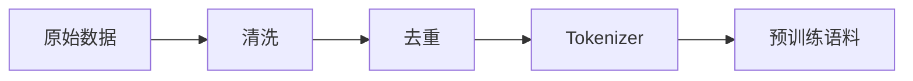

# 显存占用分析

## 训练实战指南

**显存占用分析** 是大模型训练流程中的关键环节。

### 数据处理流程



### 关键代码

```python
from transformers import Trainer, TrainingArguments

args = TrainingArguments(
    output_dir="./results",
    num_train_epochs=3,
    per_device_train_batch_size=4,
    gradient_accumulation_steps=4,
    learning_rate=2e-4,
    fp16=True
)
```

### 显存优化技巧

1. 使用混合精度 (Mixed Precision)
2. 开启梯度检查点 (Gradient Checkpointing)
3. 使用 ZeRO 优化器

