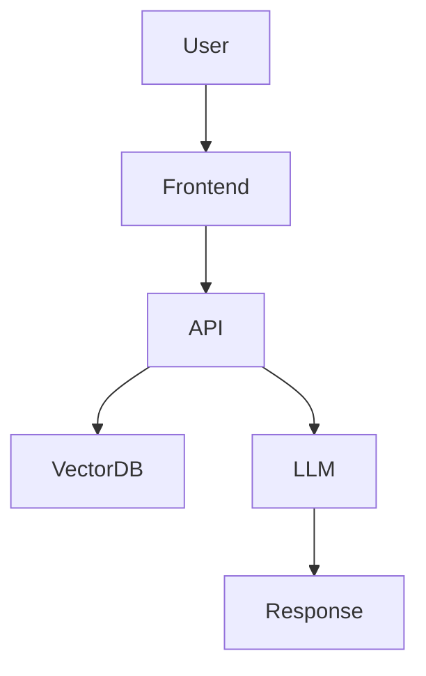

# 7.3 Agent

## 应用开发实战

利用 **7.3 Agent** 构建强大的 AI 应用。

### 系统架构



### Prompt 示例

```markdown
You are a helpful assistant specialized in 7.3 Agent.
Please explain the concept step by step.
Thinking process:
1. Define the core problem
2. Analyze solutions
3. Provide code example
```

### 最佳实践

- 保持 Prompt 简洁明了
- 使用结构化输出 (JSON Mode)
- 增加容错重试机制

