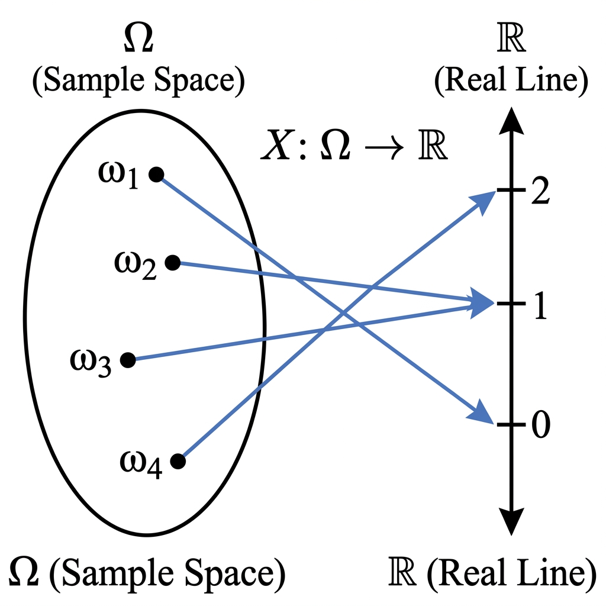

# 第0章：测度论与概率空间基础

**前置知识要求**：本章假设读者具备大学概率论基础（了解概率、随机变量、期望的直观概念）。

---

## 0. 本章目标

在学习强化学习之前，我们需要建立一个严格的数学框架来描述"随机性"。本章将回答以下问题：

1. 什么是"概率"？它是如何被严格定义的？
2. "随机变量"到底是什么？为什么说它是一个"函数"？
3. "期望"是如何从求和推广到积分的？

理解这些概念对于后续理解Bellman方程、策略梯度定理至关重要。

---

## 1. 从直觉到严格定义：为什么需要概率空间？

### 1.1 大学概率论的处理方式

在大学概率论课程中，我们通常这样定义概率：

**例子：投掷一枚均匀硬币**

- 可能的结果：正面(H) 或 反面(T)
- 每个结果的概率：$P(\text{正面}) = P(\text{反面}) = 0.5$

这种处理方式对于离散的、有限的情况是足够的。

### 1.2 问题出现在哪里？

当我们处理**连续**的情况时，直觉会出问题。

**例子：在区间 [0, 1] 上均匀选取一个实数**

- 问题1：任意一个点 $x = 0.5$ 被选中的概率是多少？
  - 答案：$P(X = 0.5) = 0$（因为有无穷多个点，每个点的概率必须是0）
- 问题2：既然每个点的概率都是0，那么所有点的概率加起来为什么等于1？
  - 这里"加起来"不能是简单的求和，而必须是**积分**。

### 1.3 测度论的作用

**测度论 (Measure Theory)** 提供了一套严格的语言来处理这些问题。它的核心思想是：

> 我们不直接给每个"点"分配概率，而是给"集合"（事件）分配概率。

这就引出了**概率空间**的概念。

---

## 2. 概率空间的三个组成部分

一个完整的概率空间由三个元素组成，记作 $(\Omega, \mathcal{F}, P)$。下面逐一解释。

### 2.1 样本空间 $\Omega$（读作"Omega"）

**定义**：所有可能结果的集合。

**解释**：

- $\Omega$ 就是"全集"，包含了实验所有可能发生的情况。
- 每一个可能的结果叫做一个**样本点**，通常用小写希腊字母 $\omega$（读作"omega"）表示。

**例子1（离散）**：投掷一枚硬币

$$
\Omega = \{\text{正面}, \text{反面}\}
$$

- 样本点 $\omega_1 = \text{正面}$
- 样本点 $\omega_2 = \text{反面}$

**例子2（连续）**：测量一个人的身高（假设在150cm到200cm之间）

$$
\Omega = [150, 200]
$$

- 样本点 $\omega = 175.3$ 表示身高为175.3cm

**在强化学习中的应用**：

- 在强化学习中，$\Omega$ 可以代表智能体与环境交互产生的所有可能的**轨迹 (trajectory)**。
- 一条轨迹 $\tau = (s_0, a_0, r_1, s_1, a_1, r_2, \ldots)$ 就是一个样本点。

### 2.2 事件集合 $\mathcal{F}$（读作"F"，代表事件的集合）

**定义**：$\mathcal{F}$ 是 $\Omega$ 的某些子集组成的集合。$\mathcal{F}$ 中的每一个元素都叫做一个**事件 (Event)**。

**直观理解**：

- 我们不能给每一个单独的样本点 $\omega$ 分配概率（在连续情况下概率为0没有意义）。
- 相反，我们给**事件**（即样本点的集合）分配概率。
- $\mathcal{F}$ 就是我们可以"讨论概率"的那些集合的总和。

**为什么需要 $\mathcal{F}$？不是所有子集都可以吗？**

理论上，在连续空间中存在一些"病态"的集合，无法被合理地赋予概率（这与Banach-Tarski悖论有关）。为了避免这些问题，我们只考虑那些"行为良好"的集合，它们组成 $\mathcal{F}$。

**$\mathcal{F}$ 必须满足的三条规则（$\sigma$-代数的定义）**：

1. **全集在里面**：$\Omega \in \mathcal{F}$

   - 含义："什么事情都可能发生"这个事件是可讨论的。
2. **对补集封闭**：如果 $A \in \mathcal{F}$，那么 $A^c = \Omega \setminus A$ 也属于 $\mathcal{F}$

   - 含义：如果"事件A发生"是可讨论的，那么"事件A不发生"也应该是可讨论的。
   - 符号解释：$A^c$ 表示 $A$ 的补集（A之外的所有元素），$\setminus$ 表示集合的差集。
3. **对可数并封闭**：如果 $A_1, A_2, A_3, \ldots \in \mathcal{F}$（可数个事件），那么 $\bigcup_{i=1}^{\infty} A_i \in \mathcal{F}$

   - 含义：如果"事件A1发生"、"事件A2发生"……都是可讨论的，那么"至少有一个事件发生"也应该是可讨论的。
   - 符号解释：$\bigcup$ 表示并集（Union）。

**例子**：

对于投掷硬币 $\Omega = \{H, T\}$，最完整的 $\mathcal{F}$ 包含：

$$
\mathcal{F} = \{\emptyset, \{H\}, \{T\}, \{H, T\}\}
$$

- $\emptyset$：空集，表示"什么都不发生"（概率为0）
- $\{H\}$：正面朝上这个事件
- $\{T\}$：反面朝上这个事件
- $\{H, T\} = \Omega$：至少有一面朝上（必然事件，概率为1）

**图1：概率空间示意图**

*图注：蓝色大椭圆为样本空间 $\Omega$，绿色和橙色圆圈为事件 $A$ 和 $B$，交集为 $A \cap B$。$\omega_1, \omega_2, \omega_3$ 为具体的样本点。*

### 2.3 概率测度 $P$

**定义**：$P$ 是一个函数，它将 $\mathcal{F}$ 中的每一个事件映射到一个 $[0, 1]$ 之间的实数。

**形式化表示**：

$$
P: \mathcal{F} \rightarrow [0, 1]
$$

**解释**：

- 输入：一个事件 $A \in \mathcal{F}$
- 输出：一个数字 $P(A)$，表示事件 $A$ 发生的概率

**$P$ 必须满足的规则（概率公理）**：

1. **非负性**：对于任意事件 $A$，$P(A) \geq 0$
2. **规范性**：$P(\Omega) = 1$

   - 含义：某件事情一定会发生，其概率为1。
3. **可列可加性**：如果 $A_1, A_2, \ldots$ 是两两不相交的事件（即 $A_i \cap A_j = \emptyset$ 对于 $i ≠ j$），那么：

$$
P\left(\bigcup_{i=1}^{\infty} A_i\right) = \sum_{i=1}^{\infty} P(A_i)
$$

**公式逐项解释**：

- $A_i \cap A_j = \emptyset$：事件 $A_i$ 和 $A_j$ 不会同时发生（互斥）
- $\bigcup_{i=1}^{\infty} A_i$：这些事件的并，即"至少有一个事件发生"
- $\sum_{i=1}^{\infty} P(A_i)$：所有事件的概率相加
- 整体含义：如果事件互斥，那么"至少发生一个"的概率等于各自概率之和

---

## 3. 随机变量：从样本空间到实数的桥梁

### 3.1 随机变量的定义

**定义**：随机变量 $X$ 是一个**函数**，它将样本空间 $\Omega$ 中的每个样本点 $\omega$ 映射到一个实数。

**形式化表示**：

$$
X: \Omega \rightarrow \mathbb{R}
$$

**符号解释**：

- $\Omega$：样本空间（所有可能结果的集合）
- $\mathbb{R}$：实数集（$\ldots, -2, -1, 0, 1, 2, \ldots$ 以及所有小数）
- $X(\omega)$：当实验结果为 $\omega$ 时，随机变量取的值

### 3.2 为什么随机变量是"函数"而不是"变量"？

这是初学者最容易困惑的地方。让我们用例子来说明。

**例子：投掷两枚硬币**

样本空间：$\Omega = \{(H,H), (H,T), (T,H), (T,T)\}$

定义随机变量 $X$ = "正面朝上的次数"

那么 $X$ 作为函数的作用是：

| 样本点$\omega$ | $X(\omega)$ 的值 |
| ---------------- | ------------------ |
| $(H, H)$       | 2                  |
| $(H, T)$       | 1                  |
| $(T, H)$       | 1                  |
| $(T, T)$       | 0                  |

所以，$X$ 并不是一个固定的数值，而是一条"规则"——告诉我们如何从每个实验结果得到一个数字。

**图2：随机变量作为映射函数**

*图注：左边是样本空间 $\Omega$，包含4个样本点 $\omega_1, \omega_2, \omega_3, \omega_4$。右边是实数轴 $\mathbb{R}$。蓝色箭头表示随机变量 $X$ 将每个样本点映射到一个实数。注意 $\omega_2$ 和 $\omega_3$ 都被映射到了同一个值1。*

### 3.3 随机变量的"可测性"条件

随机变量不能是任意的函数，它需要满足一个技术条件：**可测性 (Measurability)**。

**可测性的含义**：对于实数轴上的任何"合理的"集合 $B$（例如区间 $(-\infty, 3]$），我们都能追溯回去找到 $\Omega$ 中对应的事件。

**形式化表达**：

$$
\{ \omega \in \Omega : X(\omega) \in B \} \in \mathcal{F}
$$

**逐项解释**：

- $B$：实数轴上的一个集合，例如 $B = (-\infty, 3]$ 表示"所有小于等于3的实数"
- $X(\omega) \in B$：随机变量的值落在集合 $B$ 内
- $\{ \omega \in \Omega : X(\omega) \in B \}$：使得 $X$ 的值落在 $B$ 内的所有样本点组成的集合
- 这个集合必须属于 $\mathcal{F}$，也就是说它必须是一个"可以讨论概率"的事件

**为什么需要这个条件？**

因为我们要能够计算 $P(X \leq 3)$ 这样的概率。这个概率实际上是：

$$
P(X \leq 3) = P\left(\{\omega : X(\omega) \leq 3\}\right)
$$

如果右边的集合不在 $\mathcal{F}$ 中，我们就无法用 $P$ 来计算它的概率！

---

## 4. 期望：从求和到积分

### 4.1 离散情况下的期望

对于离散随机变量 $X$，其取值为 $x_1, x_2, \ldots$，期望定义为：

$$
\mathbb{E}[X] = \sum_{i} x_i \cdot P(X = x_i)
$$

**逐项解释**：

- $x_i$：随机变量可能取到的某个值
- $P(X = x_i)$：取到这个值的概率
- 求和遍历所有可能的值
- 整体含义：用概率加权的平均值

**例子**：投掷一枚均匀骰子，$X$ = 点数

$$
\mathbb{E}[X] = 1 \cdot \frac{1}{6} + 2 \cdot \frac{1}{6} + \ldots + 6 \cdot \frac{1}{6} = 3.5
$$

### 4.2 连续情况下的期望

对于连续随机变量 $X$，如果它的概率密度函数是 $p(x)$，期望定义为：

$$
\mathbb{E}[X] = \int_{-\infty}^{\infty} x \cdot p(x) \, dx
$$

**逐项解释**：

- $p(x)$：概率密度函数。注意：$p(x)$ 本身不是概率，而是概率的"密度"。$p(x) \, dx$ 才近似表示 $X$ 落在 $[x, x+dx]$ 区间的概率。
- $\int_{-\infty}^{\infty}$：对整个实数轴积分，对应于"遍历所有可能值"
- 积分替代了求和，因为可能的值是连续的、不可数的

### 4.3 统一视角：勒贝格积分 (Lebesgue Integral)

测度论提供了一个统一的框架，将离散和连续情况都纳入同一个公式：

$$
\mathbb{E}[X] = \int_{\Omega} X(\omega) \, dP(\omega)
$$

**逐项解释**：

- $\int_{\Omega}$：在整个样本空间 $\Omega$ 上积分
- $X(\omega)$：随机变量在样本点 $\omega$ 处的取值
- $dP(\omega)$：用概率测度 $P$ 来"加权"
- 整体含义：对所有可能的结果，用其概率加权求和（或积分）

**这个公式为什么重要？**

1. **统一性**：无论 $\Omega$ 是离散的还是连续的，公式形式相同。
2. **严格性**：它基于测度论，可以处理复杂的概率分布（例如混合分布）。
3. **理论基础**：强化学习中的价值函数 $V(s) = \mathbb{E}[G_t | S_t = s]$ 正是这种条件期望。

---

## 5. 本章总结

| 概念            | 符号                  | 直观含义                     | 形式定义                             |
| --------------- | --------------------- | ---------------------------- | ------------------------------------ |
| 样本空间        | $\Omega$            | 所有可能结果的集合           | 一个非空集合                         |
| 事件            | $A \in \mathcal{F}$ | 我们关心的某些结果的组合     | $\Omega$ 的一个子集                |
| $\sigma$-代数 | $\mathcal{F}$       | 所有"可讨论概率"的事件的集合 | 满足三条公理的集合系统               |
| 概率测度        | $P$                 | 给事件分配概率               | $P: \mathcal{F} \to [0,1]$         |
| 随机变量        | $X$                 | 把实验结果转化为数字         | 可测函数$X: \Omega \to \mathbb{R}$ |
| 期望            | $\mathbb{E}[X]$     | 概率加权的平均               | 勒贝格积分$\int X \, dP$           |

---

## 6. 与强化学习的联系预告

在强化学习中：

1. **样本空间 $\Omega$** = 所有可能的轨迹 $\tau = (s_0, a_0, r_1, s_1, a_1, \ldots)$
2. **策略 $\pi$ 和环境动态 $P$** 共同决定了轨迹上的概率测度
3. **期望回报** $\mathbb{E}[\sum_{t} \gamma^t r_t]$ 是一个在轨迹空间上的积分
4. **价值函数** $V(s)$ 是一个**条件期望**，需要用到更高级的概念（下一章将涉及）

理解了概率空间的基础，我们就可以在下一章中严格地定义 MDP 和 Bellman 方程。

---

**下一章预告**：[第1章：贝尔曼方程与马尔可夫决策过程](../01_Bellman_Equation/01_Theory_Derivation.md)
