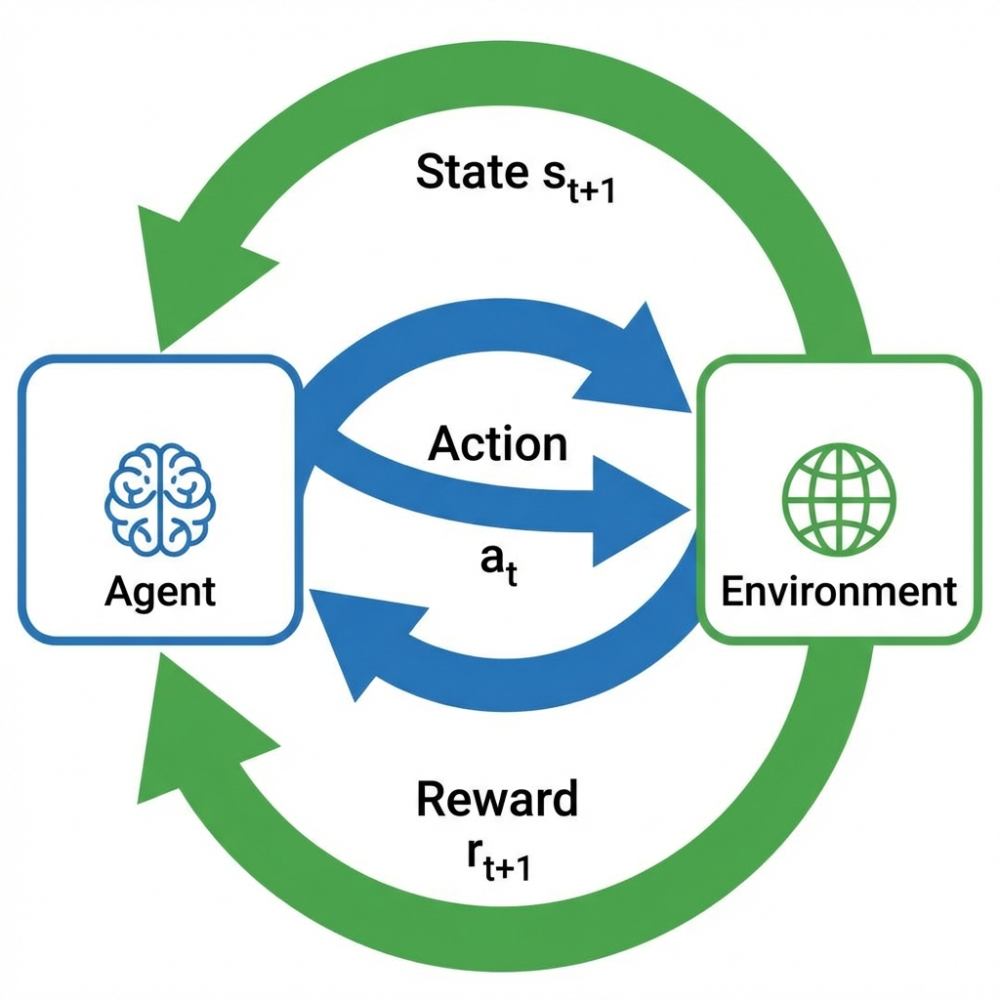
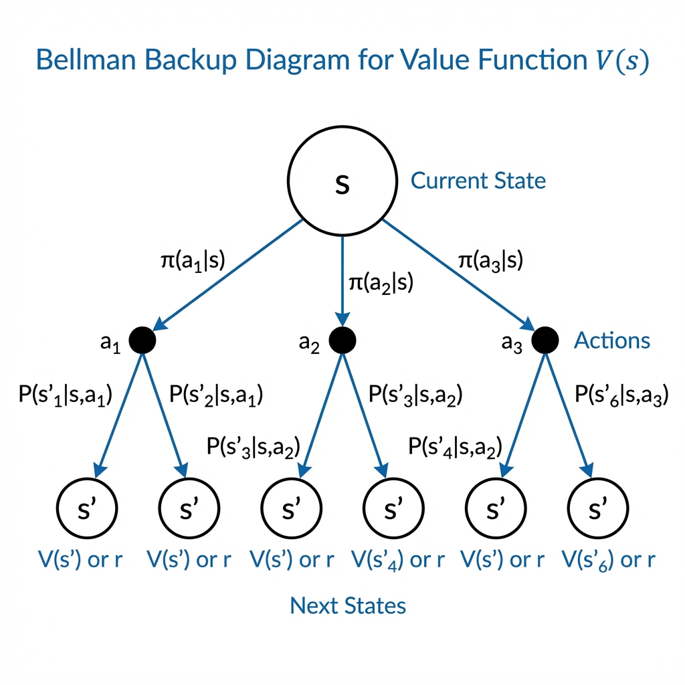

# 第1章：贝尔曼方程与马尔可夫决策过程

**前置知识要求**：本章假设读者已阅读第0章（概率空间基础），理解期望、随机变量的概念。

---

## 0. 本章目标

本章是强化学习的"物理定律"。我们将：

1. 定义**马尔可夫决策过程 (MDP)** 的数学框架
2. 引入**价值函数**的概念（状态价值 $V$ 和动作价值 $Q$）
3. 推导**贝尔曼方程**——价值函数的递归定义
4. 理解**贝尔曼最优方程**——寻找最优策略的理论基础

完成本章后，您将理解为什么Q-Learning、DQN等算法能够工作。

---

## 1. 马尔可夫决策过程 (Markov Decision Process, MDP)

### 1.1 什么是MDP？

MDP是描述智能体（Agent）与环境（Environment）交互的数学框架。想象一个机器人在迷宫中寻找出口：

- 机器人有一个当前"状态"（位置）
- 机器人可以选择一个"动作"（向上/下/左/右走）
- 环境给出"奖励"（走到出口得+1分，掉进陷阱得-1分）
- 环境转移到新的"状态"

### 1.2 MDP的五元组定义

一个MDP由五个元素组成，记作 $(S, A, P, R, \gamma)$。下面逐一解释。

#### 元素1：状态空间 $S$ (State Space)

**定义**：所有可能状态的集合。

**符号**：
- $s \in S$：当前状态
- $s' \in S$：下一个状态

**例子**：
- 迷宫问题：$S = \{(0,0), (0,1), ..., (3,3)\}$（4×4网格的所有位置）
- 围棋：$S$ = 所有可能的棋盘配置
- 机器人控制：$S$ = 所有可能的关节角度组合

#### 元素2：动作空间 $A$ (Action Space)

**定义**：在每个状态下，智能体可以选择的动作的集合。

**符号**：
- $a \in A$：一个具体的动作
- $A(s)$：在状态 $s$ 下可用的动作集合（有时动作受状态限制）

**例子**：
- 迷宫问题：$A = \{\text{上}, \text{下}, \text{左}, \text{右}\}$
- 围棋：$A$ = 所有合法的落子位置
- 机器人控制：$A$ = 每个关节的扭矩值（连续）

#### 元素3：状态转移概率 $P$ (Transition Probability)

**定义**：在状态 $s$ 执行动作 $a$ 后，转移到状态 $s'$ 的概率。

**数学表示**：
$$P(s' | s, a) = \mathbb{P}[S_{t+1} = s' | S_t = s, A_t = a]$$

**逐项解释**：
- $S_{t+1} = s'$：在时刻 $t+1$，状态变成了 $s'$
- $S_t = s, A_t = a$：在时刻 $t$，状态是 $s$，执行了动作 $a$
- $\mathbb{P}[\cdot | \cdot]$：条件概率
- 整体含义：给定当前状态和动作，下一个状态的概率分布

**例子**：
- 确定性环境：机器人向右走，就一定到达右边的格子，$P = 1$
- 随机性环境：机器人向右走，有80%概率到达右边，10%概率滑到上面，10%概率滑到下面

**马尔可夫性质的关键含义**：

> 下一个状态**只**依赖于当前状态和动作，与更早的历史无关。

这就是"马尔可夫"的含义——系统是"无记忆"的。数学表达：
$$P(S_{t+1} | S_t, A_t, S_{t-1}, A_{t-1}, \ldots) = P(S_{t+1} | S_t, A_t)$$

#### 元素4：奖励函数 $R$ (Reward Function)

**定义**：在状态 $s$ 执行动作 $a$ 后获得的即时奖励。

**数学表示**（有多种形式，这里用期望形式）：
$$R(s, a) = \mathbb{E}[R_{t+1} | S_t = s, A_t = a]$$

**逐项解释**：
- $R_{t+1}$：在时刻 $t$ 执行动作后，在时刻 $t+1$ 收到的奖励
- $\mathbb{E}[\cdot | \cdot]$：条件期望
- 整体含义：给定状态和动作，预期能获得的即时奖励

**例子**：
- 迷宫问题：到达出口 $R = +1$，掉进陷阱 $R = -1$，其他 $R = 0$
- 游戏得分：击败敌人 $R = +10$，被击中 $R = -5$

#### 元素5：折扣因子 $\gamma$ (Discount Factor)

**定义**：一个介于0和1之间的数，控制未来奖励的重要程度。

**数学表示**：$\gamma \in [0, 1]$

**含义**：
- $\gamma = 0$：只关心当前奖励（极度短视）
- $\gamma = 1$：未来奖励和当前奖励同等重要
- $\gamma = 0.9$（常用）：未来10步的奖励约等于当前奖励的 $0.9^{10} \approx 0.35$ 倍

**为什么需要 $\gamma < 1$？**

1. **数学原因**：保证无穷级数收敛。如果 $\gamma = 1$ 且任务无限长，总奖励可能是无穷大。
2. **现实原因**：不确定性使得"远期"的奖励不如"近期"的奖励有价值。

### 1.3 MDP的交互循环

智能体和环境的交互可以用下图表示：

*图注：智能体观察状态 $s_t$，选择动作 $a_t$，环境返回奖励 $r_{t+1}$ 和下一个状态 $s_{t+1}$。绿色箭头表示状态和奖励从环境流向智能体，蓝色箭头表示动作从智能体流向环境。*

---

## 2. 策略 (Policy)

### 2.1 策略的定义

**定义**：策略 $\pi$ 是一个从状态到动作的映射，告诉智能体在每个状态下应该如何行动。

**随机策略的数学表示**：
$$\pi(a | s) = \mathbb{P}[A_t = a | S_t = s]$$

**逐项解释**：
- $\pi(a | s)$：在状态 $s$ 下选择动作 $a$ 的概率
- 这是一个条件概率分布
- 对于固定的 $s$，所有可能的 $a$ 的概率之和为1：$\sum_{a \in A} \pi(a|s) = 1$

**确定性策略**：
$$\pi(s) = a$$
在状态 $s$ 下，总是选择固定的动作 $a$，没有随机性。

**例子**：
- 随机策略：在迷宫的任何位置，以25%的概率选择上/下/左/右
- 确定性策略：在位置(0,0)总是向右走，在位置(0,1)总是向下走……

---

## 3. 回报与价值函数 (Return and Value Functions)

### 3.1 回报 (Return)

**定义**：从时刻 $t$ 开始的未来总折扣奖励。

**数学表示**：
$$G_t = R_{t+1} + \gamma R_{t+2} + \gamma^2 R_{t+3} + \ldots = \sum_{k=0}^{\infty} \gamma^k R_{t+k+1}$$

**逐项解释**：
- $G_t$：从时刻 $t$ 开始的回报（Return）
- $R_{t+1}$：第一步获得的奖励（权重为 $\gamma^0 = 1$）
- $\gamma R_{t+2}$：第二步获得的奖励（权重为 $\gamma^1$）
- $\gamma^k R_{t+k+1}$：第 $k+1$ 步获得的奖励（权重为 $\gamma^k$）
- 这是一个无穷级数，但由于 $\gamma < 1$，它收敛（有限）

**递归关系**（非常重要）：
$$G_t = R_{t+1} + \gamma G_{t+1}$$

这个关系说明：当前的回报 = 当前的即时奖励 + 折扣后的未来回报。

### 3.2 状态价值函数 $V_\pi(s)$

**定义**：从状态 $s$ 出发，遵循策略 $\pi$ 行动，能获得的期望回报。

**数学表示**：
$$V_\pi(s) = \mathbb{E}_\pi[G_t | S_t = s]$$

**逐项解释**：
- $\mathbb{E}_\pi[\cdot]$：遵循策略 $\pi$ 行动时的期望
- $G_t$：从时刻 $t$ 开始的回报
- $S_t = s$：在时刻 $t$，状态为 $s$
- 整体含义：如果从状态 $s$ 开始，按照策略 $\pi$ 行动，平均能获得多少回报

**展开形式**：
$$V_\pi(s) = \mathbb{E}_\pi\left[\sum_{k=0}^{\infty} \gamma^k R_{t+k+1} \bigg| S_t = s\right]$$

### 3.3 动作价值函数 $Q_\pi(s, a)$

**定义**：从状态 $s$ 出发，首先执行动作 $a$，之后遵循策略 $\pi$ 行动，能获得的期望回报。

**数学表示**：
$$Q_\pi(s, a) = \mathbb{E}_\pi[G_t | S_t = s, A_t = a]$$

**与 $V_\pi$ 的关系**：
$$V_\pi(s) = \sum_{a \in A} \pi(a|s) Q_\pi(s, a)$$

**逐项解释**：
- 状态价值 = 在该状态下，按策略选择各动作的概率 $\times$ 各动作的价值 之和
- 这是在动作上取期望

---

## 4. 贝尔曼期望方程 (Bellman Expectation Equation)

这是贝尔曼对RL最重要的贡献：**价值函数可以用递归的方式定义**。

### 4.1 推导过程

从 $V_\pi(s)$ 的定义出发：

$$V_\pi(s) = \mathbb{E}_\pi[G_t | S_t = s]$$

利用回报的递归关系 $G_t = R_{t+1} + \gamma G_{t+1}$：

$$V_\pi(s) = \mathbb{E}_\pi[R_{t+1} + \gamma G_{t+1} | S_t = s]$$

利用期望的线性性（$\mathbb{E}[A + B] = \mathbb{E}[A] + \mathbb{E}[B]$）：

$$V_\pi(s) = \mathbb{E}_\pi[R_{t+1} | S_t = s] + \gamma \mathbb{E}_\pi[G_{t+1} | S_t = s]$$

第一项 $\mathbb{E}_\pi[R_{t+1} | S_t = s]$ 是从状态 $s$ 开始的即时奖励的期望。

第二项 $\gamma \mathbb{E}_\pi[G_{t+1} | S_t = s]$ 是折扣后的未来回报的期望。

关键洞察：$\mathbb{E}_\pi[G_{t+1} | S_t = s]$ 可以进一步分解：
- 首先，我们需要知道下一个状态 $S_{t+1} = s'$
- 然后，$\mathbb{E}_\pi[G_{t+1} | S_{t+1} = s'] = V_\pi(s')$

这给出了 $V_\pi$ 的递归形式。

### 4.2 $V_\pi$ 的贝尔曼期望方程

$$V_\pi(s) = \sum_{a \in A} \pi(a|s) \left[ R(s, a) + \gamma \sum_{s' \in S} P(s'|s, a) V_\pi(s') \right]$$

**逐项解释**：

1. $\sum_{a \in A} \pi(a|s) [\ldots]$
   - 对所有可能的动作 $a$ 求加权平均
   - 权重是策略选择该动作的概率 $\pi(a|s)$

2. $R(s, a)$
   - 在状态 $s$ 执行动作 $a$ 获得的即时奖励

3. $\gamma \sum_{s' \in S} P(s'|s, a) V_\pi(s')$
   - $\gamma$：折扣因子
   - $\sum_{s' \in S}$：遍历所有可能的下一状态
   - $P(s'|s, a)$：转移到 $s'$ 的概率
   - $V_\pi(s')$：从 $s'$ 开始的价值
   - 整体：折扣后的、关于下一状态的期望价值

**整体含义**：
当前状态的价值 = 即时奖励 + 折扣后的未来价值（两者都是期望值）

### 4.3 贝尔曼备份图 (Backup Diagram)

下图展示了 $V_\pi(s)$ 如何从子节点"备份"信息：

*图注：从状态 $s$（顶部白色圆圈）出发，根据策略 $\pi(a|s)$ 选择动作 $a_1, a_2, a_3$（黑色圆点）。每个动作根据转移概率 $P(s'|s,a)$ 转移到下一状态 $s'$（底部白色圆圈）。信息从底部（$V(s')$ 或 $r$）向上"备份"到 $V(s)$。*

### 4.4 $Q_\pi$ 的贝尔曼期望方程

$$Q_\pi(s, a) = R(s, a) + \gamma \sum_{s' \in S} P(s'|s, a) \sum_{a' \in A} \pi(a'|s') Q_\pi(s', a')$$

**逐项解释**：

1. $R(s, a)$：即时奖励
2. $\gamma$：折扣因子
3. $\sum_{s' \in S} P(s'|s, a) [\ldots]$：对下一状态求期望
4. $\sum_{a' \in A} \pi(a'|s') Q_\pi(s', a')$：在下一状态 $s'$，根据策略选择动作，对动作价值求期望

---

## 5. 贝尔曼最优方程 (Bellman Optimality Equation)

### 5.1 最优策略和最优价值函数

**最优策略** $\pi^*$：使得在所有状态下价值都最大的策略。

**最优状态价值函数**：
$$V^*(s) = \max_\pi V_\pi(s)$$

**最优动作价值函数**：
$$Q^*(s, a) = \max_\pi Q_\pi(s, a)$$

### 5.2 $V^*$ 的贝尔曼最优方程

$$V^*(s) = \max_{a \in A} \left[ R(s, a) + \gamma \sum_{s' \in S} P(s'|s, a) V^*(s') \right]$$

**与贝尔曼期望方程的对比**：
- 期望方程：$\sum_{a} \pi(a|s) [\ldots]$ —— 对动作求加权平均
- 最优方程：$\max_{a} [\ldots]$ —— 选择最好的动作

**含义**：在最优策略下，每个状态的价值等于选择最优动作后能获得的价值。

### 5.3 $Q^*$ 的贝尔曼最优方程

$$Q^*(s, a) = R(s, a) + \gamma \sum_{s' \in S} P(s'|s, a) \max_{a' \in A} Q^*(s', a')$$

**这个方程是Q-Learning和DQN的理论基础**。

在Q-Learning中，我们用迭代的方式逼近 $Q^*$：
$$Q(s, a) \leftarrow Q(s, a) + \alpha \left[ r + \gamma \max_{a'} Q(s', a') - Q(s, a) \right]$$

---

## 6. 本章总结

| 概念 | 符号 | 含义 | 关键公式 |
|------|------|------|----------|
| 状态价值 | $V_\pi(s)$ | 从 $s$ 出发遵循 $\pi$ 的期望回报 | $\mathbb{E}_\pi[G_t \mid S_t=s]$ |
| 动作价值 | $Q_\pi(s,a)$ | 从 $s$ 执行 $a$ 再遵循 $\pi$ 的期望回报 | $\mathbb{E}_\pi[G_t \mid S_t=s, A_t=a]$ |
| 贝尔曼期望 | — | 价值的递归定义 | $V = R + \gamma P V$ |
| 贝尔曼最优 | — | 最优价值的递归定义 | $V^* = \max_a (R + \gamma P V^*)$ |

---

## 7. 与下一章的联系预告

贝尔曼方程告诉我们价值函数满足什么样的递归关系，但它需要我们知道环境的完整模型（$P$ 和 $R$）。

在现实中，我们往往不知道 $P$ 和 $R$，只能通过与环境交互来学习。这就引出了：

- **策略梯度定理**：直接优化策略 $\pi_\theta$，不需要显式学习 $Q$ 或 $V$
- **这是PPO、GRPO等算法的基础**

---

**下一章预告**：[第2章：策略梯度定理](../02_Policy_Gradient/01_Theory_Derivation.md)
