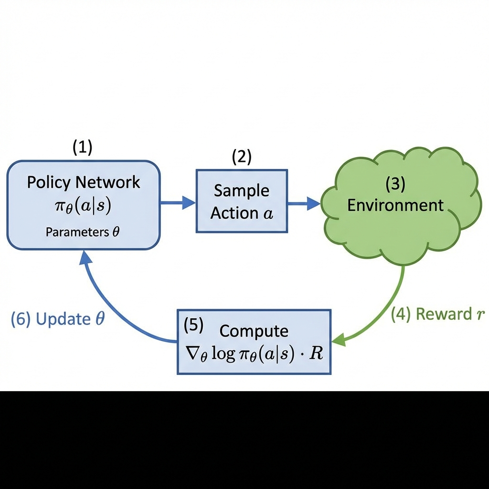

# 第2章：策略梯度定理

**前置知识要求**：本章假设读者已阅读第0章（概率空间）和第1章（贝尔曼方程），理解期望、MDP、价值函数的概念。

---

## 0. 本章目标

本章是连接"价值方法"和"策略方法"的桥梁。我们将：

1. 理解**为什么要直接优化策略**而不是学习价值函数
2. 推导**策略梯度定理 (Policy Gradient Theorem)** —— 这是REINFORCE、PPO、GRPO等所有策略优化算法的数学基础
3. 理解**对数微分技巧 (Log-Derivative Trick)** 的数学原理
4. 引入**基线 (Baseline)** 和**优势函数 (Advantage Function)** 来降低方差
5. 介绍**广义优势估计 (GAE)** —— 现代RL算法（如PPO）的核心组件

完成本章后，您将理解为什么REINFORCE算法能够工作，以及PPO/GRPO中的"优势"是什么。

---

## 1. 为什么需要策略梯度？

### 1.1 价值方法的局限性

在第1章中，我们学习了贝尔曼方程。基于价值的方法（如Q-Learning、DQN）通过学习 $Q^*(s, a)$，然后选择 $\arg\max_a Q^*(s, a)$ 来行动。

**这种方法的问题**：

**问题1：连续动作空间**

当动作空间是连续的（例如机器人关节的扭矩 $a \in [-1, 1]$），$\arg\max_a Q(s, a)$ 需要在**无穷多个**动作上找最大值，这在计算上是不可行的。

**问题2：随机策略的需求**

某些环境需要随机策略才能达到最优。

**例子：石头剪刀布**

- 如果你总是出"石头"（确定性策略），对手会学会总是出"布"
- 最优策略是随机地以1/3概率出石头/剪刀/布
- 基于 $\arg\max$ 的方法无法自然地产生这种随机性

**问题3：策略本身可能更简单**

有时候，最优策略的表示比最优价值函数简单得多。直接学习策略可能更高效。

### 1.2 策略梯度的核心思想

**核心思想**：不学习价值函数，而是**直接**优化策略。

我们将策略表示为一个参数化的函数 $\pi_\theta(a|s)$，其中 $\theta$ 是可学习的参数（例如神经网络的权重）。

**目标**：找到参数 $\theta^*$，使得期望回报最大化：

$$\theta^* = \arg\max_\theta J(\theta)$$

其中 $J(\theta)$ 是**目标函数**，表示遵循策略 $\pi_\theta$ 能获得的期望回报。

**优化方法**：使用梯度上升（因为我们要最大化）：

$$\theta \leftarrow \theta + \alpha \nabla_\theta J(\theta)$$

**关键问题**：如何计算 $\nabla_\theta J(\theta)$？

这正是**策略梯度定理**要回答的问题。

---

## 2. 目标函数 $J(\theta)$ 的定义

### 2.1 问题设置

我们考虑一个**回合制 (Episodic)** 任务：

- 智能体从某个初始状态 $s_0$ 出发
- 遵循策略 $\pi_\theta$ 与环境交互
- 产生一条**轨迹 (Trajectory)**：$\tau = (s_0, a_0, r_1, s_1, a_1, r_2, \ldots, s_T)$
- 最终获得总回报 $R(\tau) = \sum_{t=0}^{T-1} \gamma^t r_{t+1}$

### 2.2 目标函数的定义

**目标函数 $J(\theta)$**：遵循策略 $\pi_\theta$ 能获得的**期望回报**。

$$J(\theta) = \mathbb{E}_{\tau \sim \pi_\theta}[R(\tau)]$$

**符号解释**：

- $\mathbb{E}_{\tau \sim \pi_\theta}[\cdot]$：期望是对所有可能轨迹 $\tau$ 求的
- $\tau \sim \pi_\theta$：轨迹 $\tau$ 是按照策略 $\pi_\theta$ 采样得到的
- $R(\tau)$：轨迹 $\tau$ 的总回报

### 2.3 轨迹的概率

一条轨迹 $\tau = (s_0, a_0, r_1, s_1, a_1, \ldots)$ 出现的概率是多少？

$$P(\tau | \theta) = \rho_0(s_0) \prod_{t=0}^{T-1} \pi_\theta(a_t | s_t) P(s_{t+1} | s_t, a_t)$$

**逐项解释**：

1. $\rho_0(s_0)$：初始状态 $s_0$ 的分布（这是环境给定的，与策略无关）

2. $\prod_{t=0}^{T-1}$：对轨迹中的每一步连乘

3. $\pi_\theta(a_t | s_t)$：在状态 $s_t$ 时，策略选择动作 $a_t$ 的概率 **← 这是依赖于 $\theta$ 的部分**

4. $P(s_{t+1} | s_t, a_t)$：环境的状态转移概率（这是环境给定的，与策略无关）

**关键观察**：在整个轨迹概率中，**只有** $\pi_\theta(a_t | s_t)$ 依赖于参数 $\theta$。

### 2.4 将目标函数写成积分形式

$$J(\theta) = \mathbb{E}_{\tau \sim \pi_\theta}[R(\tau)] = \int P(\tau | \theta) R(\tau) d\tau$$

**符号解释**：

- $\int \cdots d\tau$：对所有可能的轨迹 $\tau$ 积分（或在离散情况下求和）
- $P(\tau | \theta)$：轨迹 $\tau$ 的概率（取决于策略参数 $\theta$）
- $R(\tau)$：轨迹 $\tau$ 的回报（**不**直接依赖于 $\theta$，只依赖于轨迹本身）

---

## 3. 策略梯度定理的推导

现在我们来推导 $\nabla_\theta J(\theta)$。这是本章的**核心内容**。

### 3.1 直接对目标函数求梯度

从目标函数的积分形式出发：

$$\nabla_\theta J(\theta) = \nabla_\theta \int P(\tau | \theta) R(\tau) d\tau$$

**步骤1：交换梯度和积分**

假设积分和微分可以交换顺序（这需要一些数学条件，我们暂时忽略）：

$$= \int \nabla_\theta P(\tau | \theta) R(\tau) d\tau$$

**问题**：$\nabla_\theta P(\tau | \theta)$ 不太好计算，因为 $P(\tau | \theta)$ 是很多概率的连乘。

### 3.2 对数微分技巧 (Log-Derivative Trick)

这是一个关键的数学技巧。

**基本恒等式**：对于任意正函数 $f(x) > 0$，有：

$$\nabla_x f(x) = f(x) \cdot \nabla_x \log f(x)$$

**推导过程**（非常重要，请仔细阅读）：

**起点**：我们想要证明 $\nabla_x f(x) = f(x) \cdot \nabla_x \log f(x)$

**从右边开始**，使用链式法则：

$$\nabla_x \log f(x) = \frac{1}{f(x)} \cdot \nabla_x f(x)$$

**解释**：
- $\log f(x)$ 是复合函数
- 外层函数：$\log(\cdot)$，其导数是 $\frac{1}{(\cdot)}$
- 内层函数：$f(x)$，其导数是 $\nabla_x f(x)$
- 链式法则：外层导数 × 内层导数 = $\frac{1}{f(x)} \cdot \nabla_x f(x)$

**两边乘以 $f(x)$**：

$$f(x) \cdot \nabla_x \log f(x) = f(x) \cdot \frac{1}{f(x)} \cdot \nabla_x f(x) = \nabla_x f(x)$$

**证毕**。

### 3.3 应用对数微分技巧

将恒等式 $\nabla_\theta P(\tau | \theta) = P(\tau | \theta) \nabla_\theta \log P(\tau | \theta)$ 代入：

$$\nabla_\theta J(\theta) = \int P(\tau | \theta) \nabla_\theta \log P(\tau | \theta) R(\tau) d\tau$$

**关键观察**：右边又可以写成**期望的形式**！

$$= \mathbb{E}_{\tau \sim \pi_\theta}\left[ \nabla_\theta \log P(\tau | \theta) \cdot R(\tau) \right]$$

这非常重要，因为期望可以通过**采样**来近似。

### 3.4 简化 $\nabla_\theta \log P(\tau | \theta)$

回忆轨迹概率：

$$P(\tau | \theta) = \rho_0(s_0) \prod_{t=0}^{T-1} \pi_\theta(a_t | s_t) P(s_{t+1} | s_t, a_t)$$

取对数（对数把乘法变成加法）：

$$\log P(\tau | \theta) = \log \rho_0(s_0) + \sum_{t=0}^{T-1} \log \pi_\theta(a_t | s_t) + \sum_{t=0}^{T-1} \log P(s_{t+1} | s_t, a_t)$$

**现在对 $\theta$ 求梯度**：

$$\nabla_\theta \log P(\tau | \theta) = \nabla_\theta \log \rho_0(s_0) + \sum_{t=0}^{T-1} \nabla_\theta \log \pi_\theta(a_t | s_t) + \sum_{t=0}^{T-1} \nabla_\theta \log P(s_{t+1} | s_t, a_t)$$

**关键观察**：

- $\nabla_\theta \log \rho_0(s_0) = 0$（初始状态分布不依赖于 $\theta$）
- $\nabla_\theta \log P(s_{t+1} | s_t, a_t) = 0$（环境转移不依赖于 $\theta$）

因此：

$$\nabla_\theta \log P(\tau | \theta) = \sum_{t=0}^{T-1} \nabla_\theta \log \pi_\theta(a_t | s_t)$$

这就是**环境模型消失**的魔法——我们不需要知道 $P(s'|s,a)$！

### 3.5 策略梯度定理的最终形式

将上述结果代入：

$$\boxed{\nabla_\theta J(\theta) = \mathbb{E}_{\tau \sim \pi_\theta}\left[ \sum_{t=0}^{T-1} \nabla_\theta \log \pi_\theta(a_t | s_t) \cdot R(\tau) \right]}$$

**逐项解释**：

1. $\nabla_\theta J(\theta)$：目标函数（期望回报）对策略参数 $\theta$ 的梯度

2. $\mathbb{E}_{\tau \sim \pi_\theta}[\cdot]$：对所有按策略 $\pi_\theta$ 采样的轨迹求期望

3. $\sum_{t=0}^{T-1}$：对轨迹中的每一步求和

4. $\nabla_\theta \log \pi_\theta(a_t | s_t)$：**对数策略的梯度**（告诉我们如何改变 $\theta$ 使得在状态 $s_t$ 选择动作 $a_t$ 的概率增大）

5. $R(\tau)$：轨迹的总回报（作为权重：如果回报高，就增大对应动作的概率）

**这个公式的直观含义**：

- 如果一条轨迹获得了高回报 $R(\tau) > 0$
- 就增大这条轨迹上所有 $(s_t, a_t)$ 对的出现概率
- 通过 $\theta \leftarrow \theta + \alpha \cdot \text{gradient}$ 实现

**图示：策略梯度更新流程**

*图注：策略梯度算法的流程。(1) 策略网络 $\pi_\theta$ 输出动作概率；(2) 采样动作 $a$；(3) 与环境交互；(4) 获得奖励 $r$；(5) 计算梯度 $\nabla_\theta \log \pi_\theta(a|s) \cdot R$；(6) 更新参数 $\theta$。*

---

## 4. 基线与方差降低 (Baseline and Variance Reduction)

### 4.1 策略梯度的方差问题

上面推导的策略梯度公式虽然正确，但它有一个实际问题：**方差太大**。

**为什么方差大？**

- $R(\tau)$ 可能总是正的（例如游戏得分从0到100）
- 这意味着**所有**动作的概率都会增大，只是增大的幅度不同
- 我们真正想要的是：**好**动作的概率增大，**坏**动作的概率减小

### 4.2 引入基线 (Baseline)

**定理**：对于任何只依赖于状态 $s_t$（不依赖于动作 $a_t$）的函数 $b(s_t)$，下式成立：

$$\mathbb{E}_{\tau \sim \pi_\theta}\left[ \sum_{t=0}^{T-1} \nabla_\theta \log \pi_\theta(a_t | s_t) \cdot b(s_t) \right] = 0$$

**这意味着**：我们可以从回报中减去任何"基线" $b(s_t)$，而不改变梯度的期望值：

$$\nabla_\theta J(\theta) = \mathbb{E}_{\tau \sim \pi_\theta}\left[ \sum_{t=0}^{T-1} \nabla_\theta \log \pi_\theta(a_t | s_t) \cdot (R(\tau) - b(s_t)) \right]$$

**证明**（简化版）：

$$\mathbb{E}_{a \sim \pi_\theta(\cdot|s)}\left[ \nabla_\theta \log \pi_\theta(a|s) \cdot b(s) \right]$$

$$= b(s) \cdot \mathbb{E}_{a \sim \pi_\theta(\cdot|s)}\left[ \nabla_\theta \log \pi_\theta(a|s) \right]$$

（因为 $b(s)$ 不依赖于 $a$，可以提到期望外面）

$$= b(s) \cdot \sum_a \pi_\theta(a|s) \cdot \nabla_\theta \log \pi_\theta(a|s)$$

应用对数微分技巧的逆过程 $\pi_\theta \cdot \nabla_\theta \log \pi_\theta = \nabla_\theta \pi_\theta$：

$$= b(s) \cdot \sum_a \nabla_\theta \pi_\theta(a|s)$$

$$= b(s) \cdot \nabla_\theta \sum_a \pi_\theta(a|s)$$

$$= b(s) \cdot \nabla_\theta 1$$

（因为 $\sum_a \pi_\theta(a|s) = 1$，这是概率归一化条件）

$$= b(s) \cdot 0 = 0$$

**证毕**。

### 4.3 最佳基线的选择

**最常用的基线**：状态价值函数 $V(s_t)$

$$b(s_t) = V^{\pi_\theta}(s_t) = \mathbb{E}[R(\tau) | S_t = s_t]$$

**直观理解**：

- $R(\tau)$ 是实际获得的回报
- $V(s_t)$ 是从状态 $s_t$ 出发的**平均**回报
- $R(\tau) - V(s_t)$：比平均好多少？

### 4.4 优势函数 (Advantage Function)

**定义**：优势函数 $A^{\pi}(s, a)$ 衡量动作 $a$ 相对于平均水平的好坏程度。

$$A^{\pi}(s, a) = Q^{\pi}(s, a) - V^{\pi}(s)$$

**逐项解释**：

- $Q^{\pi}(s, a)$：在状态 $s$ 执行动作 $a$，之后遵循策略 $\pi$ 的期望回报
- $V^{\pi}(s)$：在状态 $s$，遵循策略 $\pi$ 的期望回报（对动作求了平均）
- $A^{\pi}(s, a)$：动作 $a$ 比"随机按策略选一个动作"好多少

**优势的性质**：

- $A^{\pi}(s, a) > 0$：动作 $a$ **优于**平均
- $A^{\pi}(s, a) = 0$：动作 $a$ **等于**平均
- $A^{\pi}(s, a) < 0$：动作 $a$ **劣于**平均
- 对于策略下的动作分布：$\mathbb{E}_{a \sim \pi(\cdot|s)}[A^{\pi}(s, a)] = 0$

**图示：优势函数与基线**

*图注：横轴表示优势值 $A$。基线 $b(s) = V(s)$ 位于0点。$A > 0$ 表示"好动作"，应增大其概率（绿色向上箭头）；$A < 0$ 表示"坏动作"，应减小其概率（红色向下箭头）。*

### 4.5 使用优势函数的策略梯度

$$\nabla_\theta J(\theta) = \mathbb{E}_{\tau \sim \pi_\theta}\left[ \sum_{t=0}^{T-1} \nabla_\theta \log \pi_\theta(a_t | s_t) \cdot A^{\pi_\theta}(s_t, a_t) \right]$$

**这个形式的优点**：

1. **方差更低**：减去基线后，梯度估计的方差显著降低
2. **更直观**：增大好动作的概率，减小坏动作的概率
3. **更稳定**：训练过程更稳定

---

## 5. 广义优势估计 (Generalized Advantage Estimation, GAE)

### 5.1 问题：如何估计优势函数？

理论上，$A(s_t, a_t) = Q(s_t, a_t) - V(s_t)$。

但在实践中，我们不知道真正的 $Q$ 和 $V$，只能用**估计**。

### 5.2 时序差分 (TD) 误差

**单步TD误差** $\delta_t$：

$$\delta_t = r_{t+1} + \gamma V(s_{t+1}) - V(s_t)$$

**逐项解释**：

- $r_{t+1}$：实际获得的即时奖励
- $\gamma V(s_{t+1})$：下一状态的价值（折扣后）
- $r_{t+1} + \gamma V(s_{t+1})$：这是 $Q(s_t, a_t)$ 的一个**估计**（用贝尔曼方程）
- $V(s_t)$：当前状态的价值
- $\delta_t$：当前的"惊喜程度"——实际比预期好多少

**$\delta_t$ 是 $A(s_t, a_t)$ 的无偏估计**（但方差可能很大）。

### 5.3 多步优势估计

我们可以用多步TD来估计优势：

**1步估计**：
$$\hat{A}_t^{(1)} = \delta_t = r_{t+1} + \gamma V(s_{t+1}) - V(s_t)$$

**2步估计**：
$$\hat{A}_t^{(2)} = \delta_t + \gamma \delta_{t+1} = r_{t+1} + \gamma r_{t+2} + \gamma^2 V(s_{t+2}) - V(s_t)$$

**n步估计**：
$$\hat{A}_t^{(n)} = \sum_{k=0}^{n-1} \gamma^k \delta_{t+k}$$

**无穷步估计**（蒙特卡洛）：
$$\hat{A}_t^{(\infty)} = \sum_{k=0}^{\infty} \gamma^k \delta_{t+k} = R_t - V(s_t)$$

这就是用实际回报 $R_t$ 减去基线 $V(s_t)$。

### 5.4 偏差-方差权衡 (Bias-Variance Tradeoff)

| 方法 | 偏差 | 方差 |
|------|------|------|
| 1步TD (n=1) | 高（依赖于 $V$ 的准确性） | 低 |
| 蒙特卡洛 (n=∞) | 无偏差 | 高 |

**问题**：能否在偏差和方差之间找到平衡？

### 5.5 GAE公式

**广义优势估计 (GAE)** 使用指数加权平均来组合不同步数的估计：

$$\hat{A}_t^{\text{GAE}(\gamma, \lambda)} = \sum_{k=0}^{\infty} (\gamma \lambda)^k \delta_{t+k}$$

**逐项解释**：

- $\gamma$：折扣因子（通常 0.99）
- $\lambda$：GAE参数（通常 0.95）
- $(\gamma \lambda)^k$：第 $k$ 步TD误差的权重（指数衰减）
- $\delta_{t+k}$：第 $t+k$ 步的TD误差

**$\lambda$ 的作用**：

- $\lambda = 0$：$\hat{A}_t^{\text{GAE}} = \delta_t$（纯1步TD，低方差高偏差）
- $\lambda = 1$：$\hat{A}_t^{\text{GAE}} = \sum_k \gamma^k \delta_{t+k} = R_t - V(s_t)$（蒙特卡洛，无偏差高方差）
- $0 < \lambda < 1$：在两者之间平衡

### 5.6 GAE的递归计算

在实际实现中，GAE可以高效地递归计算（从轨迹末尾向前）：

$$\hat{A}_t = \delta_t + \gamma \lambda \hat{A}_{t+1}$$

初始条件：$\hat{A}_T = 0$（轨迹结束后没有优势）

**计算过程**（假设轨迹长度为 $T$）：

1. 计算所有 $\delta_t = r_{t+1} + \gamma V(s_{t+1}) - V(s_t)$
2. 设置 $\hat{A}_T = 0$
3. 从后往前：$\hat{A}_{T-1} = \delta_{T-1}$，$\hat{A}_{T-2} = \delta_{T-2} + \gamma\lambda \hat{A}_{T-1}$，……

---

## 6. 本章总结

### 6.1 核心公式回顾

| 公式名称 | 数学表达 | 含义 |
|----------|----------|------|
| 目标函数 | $J(\theta) = \mathbb{E}_{\tau \sim \pi_\theta}[R(\tau)]$ | 策略的期望回报 |
| 对数微分技巧 | $\nabla f = f \nabla \log f$ | 求解策略梯度的关键 |
| 策略梯度定理 | $\nabla J = \mathbb{E}[\nabla \log \pi \cdot R]$ | 不需要环境模型 |
| 优势函数 | $A(s,a) = Q(s,a) - V(s)$ | 动作相对平均的好坏 |
| GAE | $\hat{A}_t = \sum_k (\gamma\lambda)^k \delta_{t+k}$ | 平衡偏差与方差 |

### 6.2 本章的重要性

本章推导的策略梯度定理是以下所有算法的理论基础：

- **REINFORCE**：最简单的策略梯度算法
- **Actor-Critic**：同时学习策略和价值函数
- **PPO**：使用裁剪目标的稳定策略优化
- **GRPO**：使用组相对优势的策略优化（LLM微调）

---

## 7. 与下一章的联系预告

本章我们推导了策略梯度定理：

$$\nabla_\theta J(\theta) = \mathbb{E}\left[ \nabla_\theta \log \pi_\theta(a|s) \cdot A(s, a) \right]$$

但直接使用这个公式（即REINFORCE算法）有两个问题：

1. **更新步长敏感**：步长太大可能导致策略崩溃
2. **样本效率低**：每次更新后必须重新采样

下一章，我们将学习如何用**重要性采样**和**裁剪目标**来解决这些问题，这就是PPO算法的核心思想。

---

**下一章预告**：[第3章：REINFORCE算法](../03_Classic_REINFORCE/01_Theory_Derivation.md)
