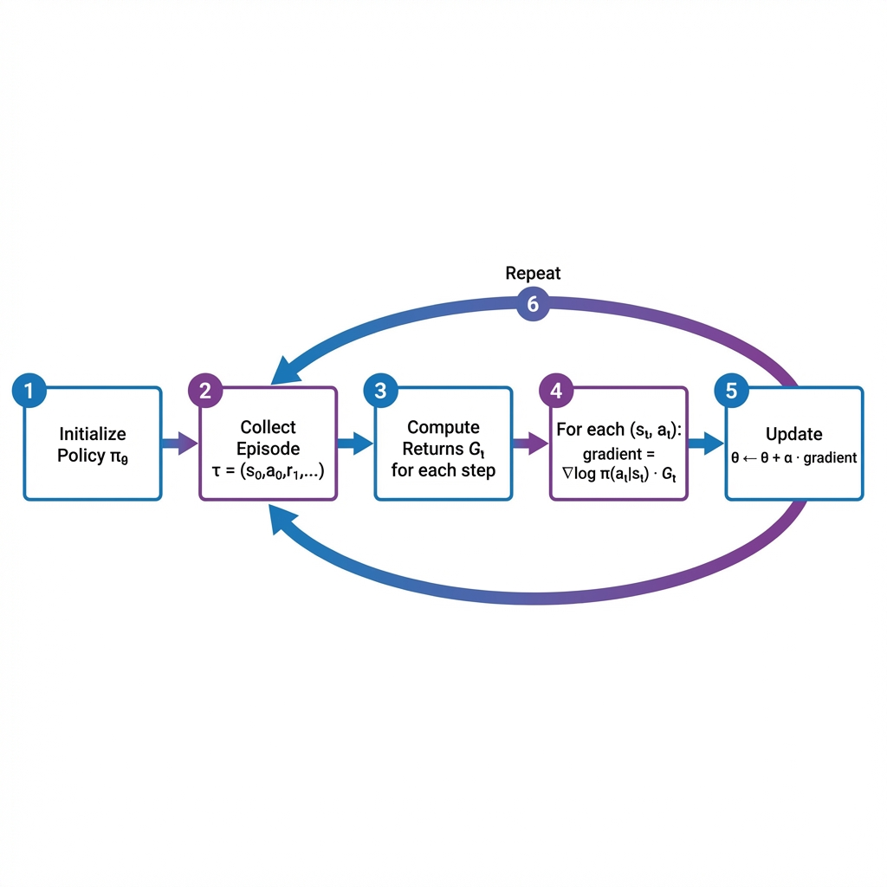

# 第3章：REINFORCE算法

**前置知识要求**：本章假设读者已阅读第2章（策略梯度定理），理解策略梯度的数学推导。

---

## 0. 本章目标

REINFORCE是**最简单的策略梯度算法**，也是所有现代策略优化算法（PPO、GRPO等）的起点。

本章将：

1. 完整展示REINFORCE算法的伪代码和每一步的数学含义
2. 详细解释**蒙特卡洛回报估计**的原理
3. 讨论REINFORCE的**优缺点**
4. 引入**带基线的REINFORCE**以降低方差
5. 为学习PPO做好铺垫

---

## 1. REINFORCE算法概述

### 1.1 算法定位

REINFORCE属于**蒙特卡洛策略梯度**方法：

- **蒙特卡洛**：使用完整轨迹的实际回报（而非估计值）
- **策略梯度**：直接优化策略参数

### 1.2 算法的历史背景

REINFORCE由Ronald J. Williams于1992年提出，论文标题是：

> "Simple Statistical Gradient-Following Algorithms for Connectionist Reinforcement Learning"

"REINFORCE"这个名字来源于论文中的一个公式记忆法。尽管算法很简单，但它建立了策略梯度方法的理论基础。

### 1.3 核心思想（一句话总结）

> **如果一个动作导致了好的结果，就增加该动作的概率；如果导致了坏的结果，就减少该动作的概率。**

数学表达：

$$\theta \leftarrow \theta + \alpha \cdot \nabla_\theta \log \pi_\theta(a_t|s_t) \cdot G_t$$

---

## 2. 回报 $G_t$ 的定义与计算

### 2.1 回报的定义

从时刻 $t$ 开始的**折扣回报 (Discounted Return)**：

$$G_t = r_{t+1} + \gamma r_{t+2} + \gamma^2 r_{t+3} + \ldots + \gamma^{T-t-1} r_T$$

或者使用求和符号：

$$G_t = \sum_{k=0}^{T-t-1} \gamma^k r_{t+k+1}$$

### 2.2 逐项解释

- $G_t$：从时刻 $t$ 开始到回合结束的总折扣回报
- $r_{t+1}$：时刻 $t$ 执行动作后获得的即时奖励（权重 $\gamma^0 = 1$）
- $\gamma^k r_{t+k+1}$：未来第 $k+1$ 步的奖励，权重为 $\gamma^k$
- $T$：回合结束的时刻

### 2.3 回报的递归关系

$$G_t = r_{t+1} + \gamma G_{t+1}$$

**含义**：当前时刻的回报 = 即时奖励 + 折扣后的未来回报

### 2.4 计算回报的代码实现

```python
def compute_returns(rewards: List[float], gamma: float) -> List[float]:
    """
    从奖励序列计算每个时刻的回报
    
    使用从后往前的递归方式计算（更高效）
    
    Args:
        rewards: [r_1, r_2, ..., r_T]，共 T 个奖励
        gamma: 折扣因子
        
    Returns:
        returns: [G_0, G_1, ..., G_{T-1}]，共 T 个回报
    """
    T = len(rewards)
    returns = [0.0] * T
    
    # 从后往前计算
    # G_{T-1} = r_T（最后一步没有未来）
    returns[T-1] = rewards[T-1]
    
    # G_t = r_{t+1} + gamma * G_{t+1}
    for t in range(T-2, -1, -1):  # T-2, T-3, ..., 1, 0
        returns[t] = rewards[t] + gamma * returns[t+1]
    
    return returns
```

**例子**：假设 $\gamma = 0.9$，奖励序列为 $[1, 0, 2, 1]$

- $G_3 = r_4 = 1$（假设第4个奖励是1）
- 等等...

实际计算（从后往前）：
- $G_3 = 1$
- $G_2 = 2 + 0.9 \times 1 = 2.9$
- $G_1 = 0 + 0.9 \times 2.9 = 2.61$
- $G_0 = 1 + 0.9 \times 2.61 = 3.349$

---

## 3. REINFORCE算法详解

### 3.1 算法伪代码

```
算法: REINFORCE (蒙特卡洛策略梯度)

输入:
  - 可微分策略 π_θ(a|s)（例如神经网络）
  - 学习率 α

初始化:
  - 策略参数 θ（随机初始化）

重复以下过程直到收敛:
  1. 使用当前策略 π_θ 执行一个完整回合:
     收集轨迹 τ = (s_0, a_0, r_1, s_1, a_1, r_2, ..., s_{T-1}, a_{T-1}, r_T)
     
  2. 对轨迹中的每一步 t = 0, 1, ..., T-1:
     2a. 计算回报 G_t = Σ_{k=0}^{T-t-1} γ^k r_{t+k+1}
     
  3. 对轨迹中的每一步 t = 0, 1, ..., T-1:
     3a. 计算策略梯度: ∇_θ J ≈ ∇_θ log π_θ(a_t|s_t) · G_t
     3b. 更新参数: θ ← θ + α · ∇_θ log π_θ(a_t|s_t) · G_t
```

### 3.2 算法流程图



*图注：REINFORCE算法的主循环。(1) 初始化策略；(2) 收集一个完整回合的轨迹；(3) 计算每一步的回报 $G_t$；(4) 计算策略梯度；(5) 更新参数；(6) 重复。*

### 3.3 每一步的数学解释

#### 步骤1：收集轨迹

使用当前策略 $\pi_\theta$ 与环境交互：

- 在状态 $s_t$，采样动作 $a_t \sim \pi_\theta(\cdot|s_t)$
- 环境返回奖励 $r_{t+1}$ 和下一状态 $s_{t+1}$
- 继续直到回合结束

**关键点**：必须收集**完整回合**才能计算蒙特卡洛回报。

#### 步骤2：计算回报

对于轨迹中的每一步，计算从该步开始到回合结束的总回报 $G_t$。

**为什么用 $G_t$ 而不是 $G_0$？**

理论上，策略梯度是：

$$\nabla_\theta J(\theta) = \mathbb{E}\left[\sum_t \nabla_\theta \log \pi_\theta(a_t|s_t) \cdot R(\tau)\right]$$

其中 $R(\tau)$ 是整条轨迹的总回报。

但我们可以将其改写为：

$$\nabla_\theta J(\theta) = \mathbb{E}\left[\sum_t \nabla_\theta \log \pi_\theta(a_t|s_t) \cdot G_t\right]$$

**这两者在期望上是等价的**，但使用 $G_t$ 而非 $R(\tau)$ 可以**降低方差**。

**直观解释**：时刻 $t$ 的动作 $a_t$ 只能影响从时刻 $t$ 开始的奖励，不能影响过去的奖励 $r_1, r_2, \ldots, r_t$。因此，只用 $G_t$（未来的奖励）来评估 $a_t$ 更合理。

#### 步骤3：更新参数

对于每一步 $(s_t, a_t)$，计算梯度并更新：

$$\theta \leftarrow \theta + \alpha \cdot \nabla_\theta \log \pi_\theta(a_t|s_t) \cdot G_t$$

**逐项解释**：

1. $\nabla_\theta \log \pi_\theta(a_t|s_t)$：

   这是**对数策略的梯度**，也叫做**得分函数 (Score Function)**。
   
   它告诉我们：如果我们想增大在状态 $s_t$ 选择动作 $a_t$ 的概率，应该如何调整 $\theta$？

2. $G_t$：

   回报作为**权重**或**强化信号**。
   
   - 如果 $G_t > 0$：朝着增大 $\pi_\theta(a_t|s_t)$ 的方向更新
   - 如果 $G_t < 0$：朝着减小 $\pi_\theta(a_t|s_t)$ 的方向更新
   - $|G_t|$ 越大，更新幅度越大

3. $\alpha$：

   学习率，控制每次更新的步长。

---

## 4. 为什么使用"对数"策略？

### 4.1 问题的提出

在策略梯度更新中，我们使用的是 $\nabla_\theta \log \pi_\theta$ 而不是 $\nabla_\theta \pi_\theta$。为什么？

### 4.2 数值稳定性

**问题**：$\pi_\theta(a|s)$ 是一个概率，取值在 $(0, 1)$。

- 当 $\pi_\theta(a|s)$ 很小时（比如 $10^{-10}$），$\nabla_\theta \pi_\theta$ 也会非常小
- 这会导致梯度消失，学习停滞

**对数的作用**：

$\log \pi_\theta(a|s)$ 把 $(0, 1)$ 映射到 $(-\infty, 0)$：

- 当 $\pi = 0.001$ 时，$\log \pi \approx -6.9$（不是很极端）
- 当 $\pi = 10^{-10}$ 时，$\log \pi \approx -23$（仍然可处理）

### 4.3 梯度的解释更直观

根据链式法则：

$$\nabla_\theta \log \pi_\theta = \frac{1}{\pi_\theta} \nabla_\theta \pi_\theta$$

或者反过来：

$$\nabla_\theta \pi_\theta = \pi_\theta \cdot \nabla_\theta \log \pi_\theta$$

**含义**：$\nabla_\theta \log \pi_\theta$ 可以理解为**相对变化率**——"如果我调整 $\theta$，概率会相对增加多少百分比？"

---

## 5. REINFORCE的优缺点

### 5.1 优点

1. **简单易实现**
   - 只需要能计算 $\nabla_\theta \log \pi_\theta$
   - 不需要学习价值函数

2. **无偏估计**
   - 使用真实的蒙特卡洛回报，没有偏差
   - 只要采样足够多，会收敛到正确的策略梯度

3. **适用于任何可微分策略**
   - 离散动作空间、连续动作空间都可以
   - 可以使用任何可微分的参数化形式

4. **不需要环境模型**
   - 只需要能与环境交互
   - 适用于 model-free 设置

### 5.2 缺点

1. **高方差**

   **问题**：每条轨迹的回报 $G_t$ 差异可能很大。
   
   **例子**：
   - 轨迹1：$G_0 = 100$
   - 轨迹2：$G_0 = 5$
   - 轨迹3：$G_0 = 80$
   
   梯度估计会随着采样的轨迹剧烈波动，导致训练不稳定。

2. **样本效率低**

   **问题**：每次更新参数后，必须丢弃所有旧数据，重新采样。
   
   这是**on-policy**方法的固有局限：新策略 $\pi_{\theta'}$ 与旧策略 $\pi_\theta$ 不同，旧数据不能直接复用。

3. **需要完整回合**

   **问题**：必须等到回合结束才能计算 $G_t$ 并更新。
   
   对于很长或无限长的任务，这是不可接受的。

4. **对学习率敏感**

   **问题**：高方差 + 不合适的学习率 = 训练崩溃
   
   学习率太大会导致策略剧烈震荡，太小会导致学习缓慢。

---

## 6. 带基线的REINFORCE (REINFORCE with Baseline)

### 6.1 动机

为了降低方差，我们引入**基线 (Baseline)**。

回忆第2章的结论：从回报中减去任何只依赖于状态的函数 $b(s_t)$，不会改变梯度的期望值，但可能降低方差。

### 6.2 带基线的更新公式

$$\theta \leftarrow \theta + \alpha \cdot \nabla_\theta \log \pi_\theta(a_t|s_t) \cdot (G_t - b(s_t))$$

### 6.3 最佳基线的选择

**理论最优基线**（使方差最小）：

$$b^*(s_t) = \frac{\mathbb{E}[(\nabla_\theta \log \pi_\theta)^2 \cdot G_t]}{\mathbb{E}[(\nabla_\theta \log \pi_\theta)^2]}$$

这个公式比较复杂，实践中很少直接使用。

**常用的近似**：

$$b(s_t) \approx V^{\pi_\theta}(s_t)$$

即使用**状态价值函数**作为基线。

### 6.4 直观理解

- $G_t$：实际获得的回报
- $b(s_t) = V(s_t)$：从状态 $s_t$ 出发的**平均**回报
- $G_t - b(s_t)$：实际回报相对于平均水平的差距

**核心思想**：

> 不是所有正回报都意味着动作好，而是**比平均更好**才值得正强化。

**例子**：

假设某游戏的平均得分是50分：
- 如果这次得了60分，$G_t - b = 60 - 50 = +10$，增大相关动作的概率
- 如果这次得了40分，$G_t - b = 40 - 50 = -10$，减小相关动作的概率
- 如果每次都用原始 $G_t = 40$（正值），会错误地增大概率

### 6.5 如何估计基线 $V(s)$？

这就引出了**Actor-Critic**方法——同时学习：

- **Actor（演员）**：策略 $\pi_\theta(a|s)$
- **Critic（评论家）**：价值函数 $V_\phi(s)$（用另一个神经网络 $\phi$）

下一章我们将详细介绍Actor-Critic。

---

## 7. 本章总结

### 7.1 核心公式

| 名称 | 公式 | 说明 |
|------|------|------|
| 回报 $G_t$ | $\sum_{k=0}^{T-t-1} \gamma^k r_{t+k+1}$ | 从时刻 $t$ 到回合结束的折扣奖励和 |
| REINFORCE更新 | $\theta \leftarrow \theta + \alpha \nabla \log \pi_\theta(a_t|s_t) \cdot G_t$ | 蒙特卡洛策略梯度 |
| 带基线的更新 | $\theta \leftarrow \theta + \alpha \nabla \log \pi_\theta(a_t|s_t) \cdot (G_t - b)$ | 降低方差 |

### 7.2 REINFORCE的地位

REINFORCE虽然简单，但它是理解所有策略梯度算法的基础：

- **Actor-Critic**：学习一个 $V(s)$ 作为基线
- **PPO**：使用重要性采样 + 裁剪来稳定更新
- **GRPO**：使用组内相对排名作为优势信号

---

## 8. 与下一章的联系预告

REINFORCE的两个主要问题：

1. **高方差**：虽然加基线有帮助，但还是不够
2. **样本效率低**：每次更新后必须丢弃数据

下一章（Actor-Critic）将解决第一个问题：用一个learned的 $V(s)$ 替代蒙特卡洛 $G_t$。

之后的PPO章节将解决第二个问题：使用重要性采样来复用旧数据。

---

**下一章预告**：[第4章：Actor-Critic方法](../04_Actor_Critic/01_Theory_Derivation.md)
