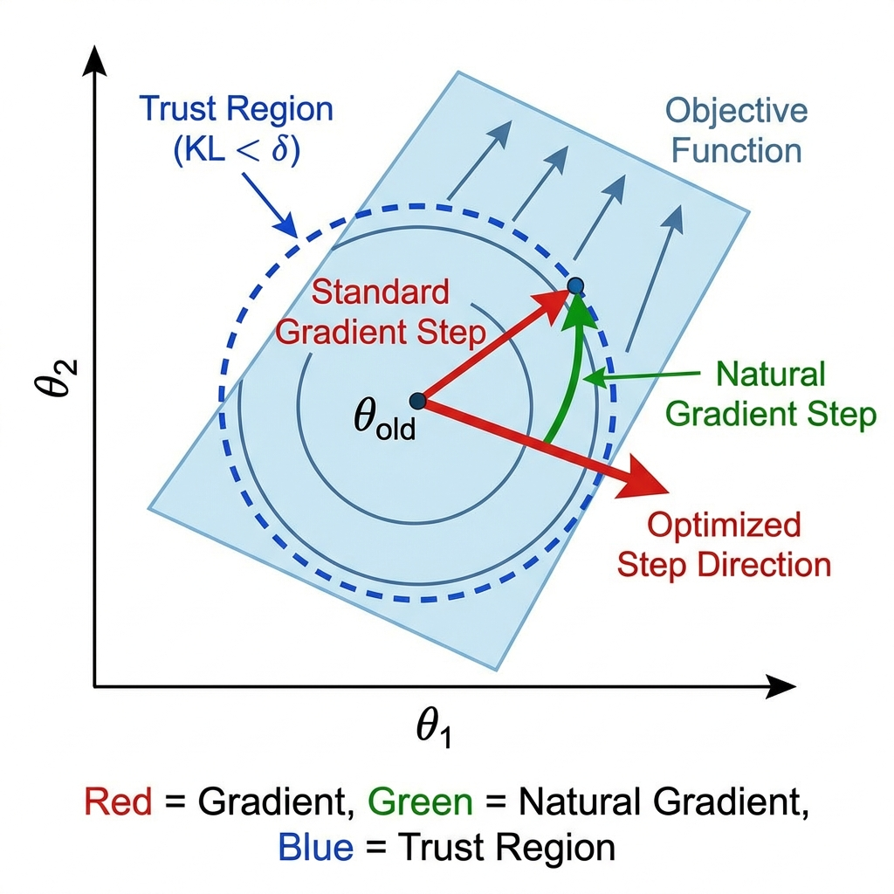

# 第4章：信任区域策略优化 (Trust Region Policy Optimization, TRPO)

**论文信息**：
- **标题**：Trust Region Policy Optimization
- **作者**：John Schulman, Sergey Levine, Pieter Abbeel, Michael Jordan, Philipp Moritz
- **年份**：2015
- **arXiv**：1502.05477
- **PDF**：见 `papers/` 目录

**前置知识**：策略梯度（第2章）、REINFORCE（第3章）、KL散度

---

## 0. 本章目标

TRPO是深度强化学习历史上的重要里程碑，它首次为策略更新提供了**理论上的单调改进保证**。

虽然现代LLM训练更多使用它的后继者**PPO**，但理解TRPO对于掌握**自然梯度 (Natural Gradient)**、**KL约束**和**线搜索**等高级概念至关重要。

本章将：

1. 推导**单调改进定理**，解释为什么要限制策略更新幅度
2. 详细讲解**自然梯度法**与普通梯度的区别
3. 展示如何使用**共轭梯度法 (Conjugate Gradient)** 高效求解逆矩阵乘积
4. 实现一个完整的TRPO算法

---

## 1. 理论基础：寻找单调改进

### 1.1 性能差异引理

我们想要找到一个新策略 $\pi_{new}$，使得它的期望回报 $J(\pi_{new})$ 必定大于旧策略 $J(\pi_{old})$。

根据Cacla & Kakade (2002) 的结果，两个策略的性能差异可以表示为：

$$J(\pi_{new}) - J(\pi_{old}) = \mathbb{E}_{\tau \sim \pi_{new}} \left[ \sum_t \gamma^t A^{\pi_{old}}(s_t, a_t) \right]$$

这个公式告诉我们：如果新策略总是选择旧策略下优势 $A > 0$ 的动作，性能就会提升。

### 1.2 代理目标函数

由于 $\tau \sim \pi_{new}$ 包含未知的状态分布，直接优化上式很困难。TRPO引入了**代理目标 (Surrogate Objective)**：

$$L_{\pi_{old}}(\pi) = \mathbb{E}_{s \sim \rho_{old}, a \sim \pi} \left[ A^{\pi_{old}}(s, a) \right]$$

我们可以证明，当策略变化不大时：
$$J(\pi_{new}) - J(\pi_{old}) \approx L_{\pi_{old}}(\pi_{new}) - L_{\pi_{old}}(\pi_{old})$$

### 1.3 信任区域约束

为了保证上述近似有效，我们需要限制新旧策略的差异。TRPO使用**KL散度**来衡量这种差异：

$$\max_\theta \quad \mathbb{E}_t \left[ \frac{\pi_\theta(a_t|s_t)}{\pi_{\theta_{old}}(a_t|s_t)} A_t \right]$$

$$\text{s.t.} \quad \bar{D}_{KL}(\pi_{\theta_{old}} \| \pi_\theta) \le \delta$$

**符号详解**：

| 符号 | 含义 | 说明 |
|------|------|------|
| $\frac{\pi_\theta}{\pi_{\theta_{old}}}$ | **概率比率** | 衡量策略变化大小 |
| $A_t$ | **优势函数** | 指引更新方向 |
| $\bar{D}_{KL}$ | **平均KL散度** | 对所有状态求平均 |
| $\delta$ | **信任区域半径** | 这是一个超参数，通常为0.01 |

---

## 2. 求解优化问题：自然梯度法

### 2.1 泰勒展开

这是一个带约束的非线性优化问题。我们对目标函数和约束条件进行泰勒展开：

**目标函数 (一阶展开)**：
$$L(\theta) \approx g^T (\theta - \theta_{old})$$
其中 $g = \nabla_\theta L(\theta)|_{\theta_{old}}$ 是策略梯度。

**KL约束 (二阶展开)**：
$$D_{KL}(\theta_{old} \| \theta) \approx \frac{1}{2} (\theta - \theta_{old})^T H (\theta - \theta_{old})$$
其中 $H$ 是KL散度的Hessian矩阵（也称为**Fisher信息矩阵, FIM**）。这里因为KL在 $\theta=\theta_{old}$ 处最小值为0，所以一阶项为0。

### 2.2 解析解

现在的优化问题变成了：
$$\max_{\Delta\theta} g^T \Delta\theta \quad \text{s.t.} \quad \frac{1}{2} \Delta\theta^T H \Delta\theta \le \delta$$

这是一个二次约束线性规划问题，使用拉格朗日乘子法可得解析解：

$$\Delta\theta = \sqrt{\frac{2\delta}{g^T H^{-1} g}} H^{-1} g$$

这里 $H^{-1} g$ 就是所谓的**自然梯度 (Natural Gradient)**。

---

### 图解：信任区域与自然梯度

**图片详细说明**：
- **普通梯度 ($g$)**：指向目标函数上升最快的方向（垂直于等高线）。
- **信任区域**：图中的蓝色椭圆（由Hessian矩阵 $H$ 决定形状）。KL散度定义了一个非欧几里得的距离。
- **自然梯度 ($H^{-1}g$)**：指向在信任区域内能最大化目标的方向。它考虑了参数空间的曲率。

---

### 2.3 共轭梯度法 (Conjugate Gradient)

直接计算 $H^{-1}$ 是不可行的，因为神经网络参数量巨大（$H$ 是 $N \times N$ 矩阵）。

TRPO使用**共轭梯度法 (CG)** 来直接计算 $x = H^{-1} g$，也就是求解线性方程 $Hx = g$。

关键技巧是只需要计算**Hessian-vector product (Hv)**，这可以通过反向传播自动求导实现，无需显式构建矩阵 $H$。

$$Hv = \nabla_\theta ((\nabla_\theta D_{KL})^T v)$$

---

## 3. 算法流程

1. **采样**：使用当前策略 $\pi_{\theta_k}$ 采集一批轨迹。
2. **计算优势**：使用GAE计算优势函数 $A_t$。
3. **计算梯度**：计算目标函数的梯度 $g$。
4. **计算自然梯度**：使用CG算法求解 $Hx = g$，得到搜索方向 $s \approx H^{-1}g$。
5. **计算步长**：计算缩放系数 $\beta = \sqrt{2\delta / (s^T H s)}$，最大步长为 $\beta s$。
6. **线搜索 (Line Search)**：在最大步长方向上进行回溯搜索，确保目标函数提升且KL约束满足。
7. **更新参数**：$\theta_{k+1} = \theta_k + \alpha \beta s$。

---

## 4. 与PPO的对比

| 特性 | TRPO | PPO |
|------|------|-----|
| **核心机制** | 强KL约束 + 二阶优化 | 裁剪目标 + 一阶优化 |
| **计算复杂度** | 高 (需要CG和Hv乘积) | 低 (仅需SGD) |
| **实现难度** | 困难 (很多数学细节) | 简单 |
| **每步提升** | 更有保证 (单调性) | 近似保证 |
| **适用场景** | 理论研究、小模型 | 大规模模型 (LLM) |

**结论**：TRPO在理论上更优美，但PPO在工程上更实用。

---

## 5. 本章总结

### 5.1 核心公式

| 概念 | 公式 |
|------|------|
| 优化目标 | $\max \mathbb{E}[r_t A_t] \quad \text{s.t.} D_{KL} \le \delta$ |
| 自然梯度 | $\Delta\theta \propto H^{-1} g$ |
| 步长计算 | $\sqrt{2\delta / (g^T H^{-1} g)}$ |

### 5.2 关键贡献

1. 引入了**信任区域**概念，解决了步长选择难题。
2. 展示了如何在大规模参数下应用**二阶优化** (CG + Hv)。
3. 为PPO等后续算法奠定了理论基础。

---

**下一章预告**：[第5章：近端策略优化 (PPO)](../05_PPO/01_Theory_Derivation.md)
