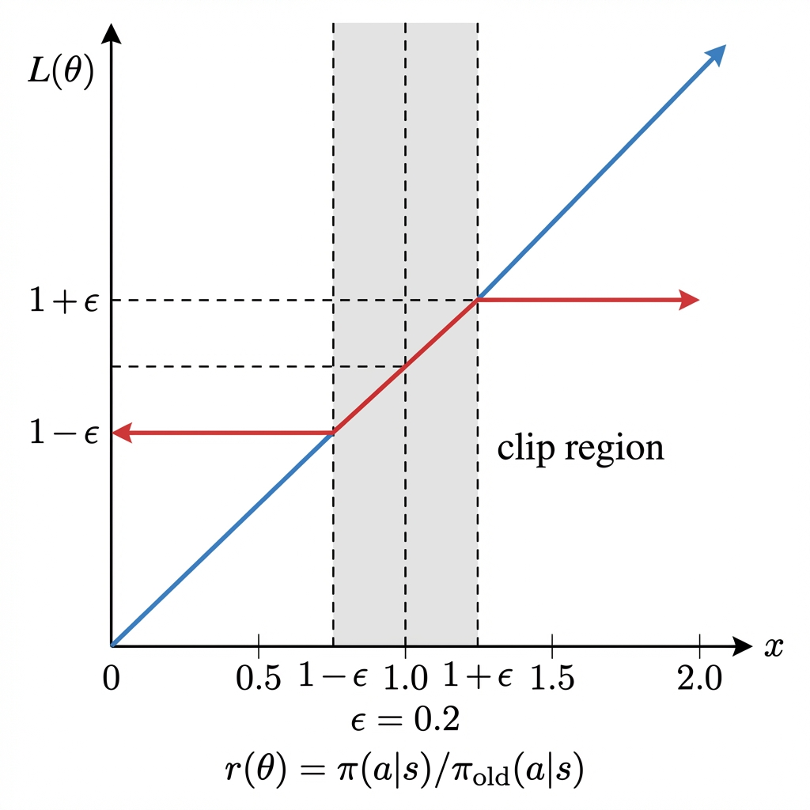
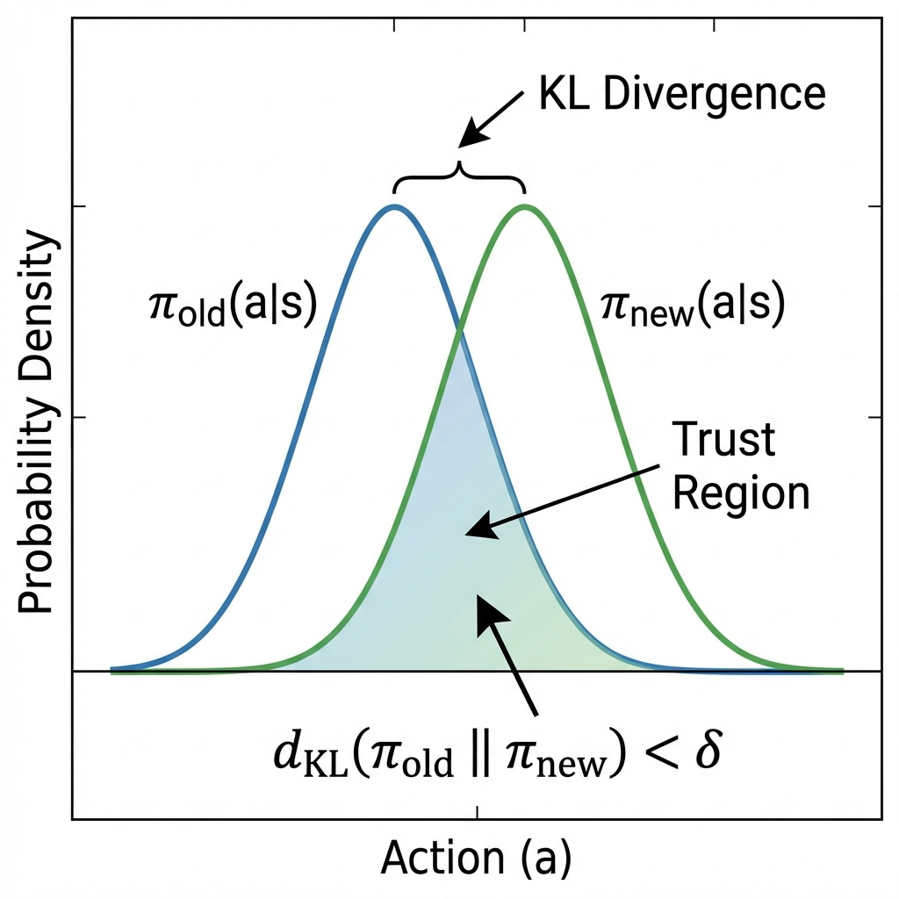

# 第5章：近端策略优化 (Proximal Policy Optimization, PPO)

**论文信息**：
- **标题**：Proximal Policy Optimization Algorithms
- **作者**：John Schulman, Filip Wolski, Prafulla Dhariwal, Alec Radford, Oleg Klimov ****<u> ~~(OpenAI)~~</u>****
- **年份**：2017
- **arXiv**：1707.06347
- **PDF**：见 `papers/` 目录

**前置知识**：策略梯度定理（第2章）、REINFORCE

---

## 0. 本章目标

PPO是**现代深度强化学习的标准算法**，被广泛应用于：
- OpenAI Five (Dota 2)
- ChatGPT训练 (RLHF)
- 机器人控制
- 各种LLM对齐任务

本章将：

1. 解释REINFORCE/TRPO的局限性，以及PPO如何解决这些问题
2. 详细推导**重要性采样 (Importance Sampling)** 的数学原理
3. 逐步推导**PPO-Clip目标函数**
4. 解释裁剪机制的直观含义和数学意义
5. 介绍完整的PPO算法流程

---

## 1. REINFORCE和TRPO的问题

### 1.1 REINFORCE的问题回顾

回忆第3章，REINFORCE的更新规则是：

$$\theta \leftarrow \theta + \alpha \nabla_\theta \log \pi_\theta(a|s) \cdot G_t$$

**公式符号详解**：

| 符号 | 含义 | 类型 | 说明 |
|------|------|------|------|
| $\theta$ | 策略网络的**可训练参数**（权重和偏置） | 向量 | 维度可达数十亿（LLM） |
| $\leftarrow$ | **赋值符号**，表示用右边的值更新左边 | 操作 | - |
| $\alpha$ | **学习率**(Learning Rate)，控制每步更新的大小 | 标量 | 通常 $10^{-3}$ 到 $10^{-6}$ |
| $\nabla_\theta$ | 关于 $\theta$ 的**梯度算子** | 算子 | 计算损失对每个参数的偏导数 |
| $\log$ | **自然对数**（以 $e$ 为底） | 函数 | - |
| $\pi_\theta(a\|s)$ | 参数为 $\theta$ 的策略在状态 $s$ 下选择动作 $a$ 的**概率** | 标量 | $\in (0, 1)$ |
| $a$ | **动作**(Action)，在LLM中是下一个token | 离散/连续 | - |
| $s$ | **状态**(State)，在LLM中是prompt + 已生成tokens | 向量/序列 | - |
| $G_t$ | 从时刻 $t$ 开始的**累计回报** $G_t = \sum_{k=0}^{\infty} \gamma^k r_{t+k}$ | 标量 | - |

**问题1：On-Policy限制**

每次更新 $\theta$ 后，必须丢弃所有旧数据，重新采样。

**原因**：策略梯度公式中的期望 $\mathbb{E}_{\tau \sim \pi_\theta}[\ldots]$ 要求轨迹必须来自**当前策略** $\pi_\theta$。

**后果**：样本效率极低，需要大量环境交互。

**问题2：更新步长敏感**

- 步长太大 → 策略可能"跳"得太远，性能突然崩溃
- 步长太小 → 学习太慢

### 1.2 TRPO：一种解决方案

**信任区域策略优化 (Trust Region Policy Optimization, TRPO)** 通过限制策略更新的幅度来保证单调改进。

TRPO的优化问题：

$$\max_\theta \quad \mathbb{E}_{s \sim \rho^{\pi_{\text{old}}}} \left[ \frac{\pi_\theta(a|s)}{\pi_{\theta_{\text{old}}}(a|s)} A^{\pi_{\text{old}}}(s, a) \right]$$

$$\text{s.t.} \quad D_{KL}\left(\pi_{\theta_{\text{old}}}(\cdot|s) \| \pi_\theta(\cdot|s)\right) \leq \delta$$

**公式各项逐一详解**：

| 符号 | 含义 | 说明 |
|------|------|------|
| $\max_\theta$ | 关于参数 $\theta$ **最大化** | 目标是找到最优的 $\theta$ |
| $\mathbb{E}_{s \sim \rho^{\pi_{\text{old}}}}$ | 在**状态分布** $\rho^{\pi_{\text{old}}}$ 下的期望 | $\rho$ 是状态的稳态分布 |
| $\frac{\pi_\theta(a\|s)}{\pi_{\theta_{\text{old}}}(a\|s)}$ | **概率比率**（重要性权重） | 衡量新旧策略的差异 |
| $\pi_\theta(a\|s)$ | **新策略**在状态 $s$ 选择动作 $a$ 的概率 | 我们要优化的策略 |
| $\pi_{\theta_{\text{old}}}(a\|s)$ | **旧策略**在状态 $s$ 选择动作 $a$ 的概率 | 采样数据时使用的策略 |
| $A^{\pi_{\text{old}}}(s, a)$ | 旧策略下的**优势函数** | $A = Q(s,a) - V(s)$ |
| $\text{s.t.}$ | "subject to"，**约束条件** | 以下是必须满足的限制 |
| $D_{KL}(\cdot \| \cdot)$ | **KL散度**（Kullback-Leibler Divergence） | 衡量两个概率分布的差异 |
| $\pi_{\theta_{\text{old}}}(\cdot\|s)$ | 旧策略在状态 $s$ 的**动作分布** | 以状态 $s$ 为条件的动作概率分布 |
| $\pi_\theta(\cdot\|s)$ | 新策略在状态 $s$ 的**动作分布** | - |
| $\leq$ | **小于等于**约束 | 限制KL散度不超过 $\delta$ |
| $\delta$ | **信任区域半径** | 超参数，控制策略更新幅度 |

**TRPO的问题**：

- 求解带约束的优化问题需要二阶导数（Hessian矩阵）
- 实现复杂（共轭梯度、线搜索等）
- 计算代价高

### 1.3 PPO的动机

> **PPO的核心思想**：用简单的**裁剪 (Clipping)** 机制替代TRPO的KL约束，获得类似的效果但实现更简单。

---

## 2. 重要性采样 (Importance Sampling)

### 2.1 动机：复用旧数据

我们想用旧策略 $\pi_{\theta_{\text{old}}}$ 采集的数据来更新新策略 $\pi_\theta$。

**问题**：策略梯度公式要求 $\tau \sim \pi_\theta$，但我们只有 $\tau \sim \pi_{\theta_{\text{old}}}$。

**解决方案**：重要性采样。

### 2.2 重要性采样的数学原理

**基本定理**：如果我们想计算关于分布 $p$ 的期望，但只能从分布 $q$ 采样，可以使用：

$$\mathbb{E}_{x \sim p}[f(x)] = \mathbb{E}_{x \sim q}\left[\frac{p(x)}{q(x)} f(x)\right]$$

**公式符号详解**：

| 符号 | 含义 | 说明 |
|------|------|------|
| $\mathbb{E}_{x \sim p}$ | 在分布 $p$ 下的**期望** | 我们想要计算的目标 |
| $f(x)$ | 关于 $x$ 的**任意函数** | 例如策略梯度中的目标 |
| $\mathbb{E}_{x \sim q}$ | 在分布 $q$ 下的**期望** | 我们实际能采样的分布 |
| $\frac{p(x)}{q(x)}$ | **重要性权重** | 校正采样分布的偏差 |
| $p(x)$ | $x$ 在**目标分布** $p$ 下的概率密度 | - |
| $q(x)$ | $x$ 在**采样分布** $q$ 下的概率密度 | 必须 $q(x) > 0$ 当 $p(x) > 0$ |

**推导**：

$$\mathbb{E}_{x \sim p}[f(x)] = \int p(x) f(x) dx$$

$$= \int q(x) \cdot \frac{p(x)}{q(x)} \cdot f(x) dx$$

$$= \mathbb{E}_{x \sim q}\left[\frac{p(x)}{q(x)} f(x)\right]$$

**关键**：$\frac{p(x)}{q(x)}$ 称为**重要性权重 (Importance Weight)**。

### 2.3 应用到策略梯度

在策略梯度中：
- $p$ = 新策略 $\pi_\theta$
- $q$ = 旧策略 $\pi_{\theta_{\text{old}}}$

因此，我们可以用旧策略采集的数据来估计新策略的目标：

$$J(\theta) = \mathbb{E}_{(s,a) \sim \pi_{\theta_{\text{old}}}}\left[\frac{\pi_\theta(a|s)}{\pi_{\theta_{\text{old}}}(a|s)} A^{\pi_{\theta_{\text{old}}}}(s, a)\right]$$

定义**概率比**：

$$r_t(\theta) = \frac{\pi_\theta(a_t|s_t)}{\pi_{\theta_{\text{old}}}(a_t|s_t)}$$

**公式符号详解**：

| 符号 | 含义 | 取值范围 | 含义解释 |
|------|------|----------|----------|
| $r_t(\theta)$ | 时刻 $t$ 的**概率比率** | $(0, +\infty)$ | 新旧策略选择该动作的概率之比 |
| $\pi_\theta(a_t\|s_t)$ | **新策略**选择动作 $a_t$ 的概率 | $(0, 1)$ | - |
| $\pi_{\theta_{\text{old}}}(a_t\|s_t)$ | **旧策略**选择动作 $a_t$ 的概率 | $(0, 1)$ | - |
| $r_t = 1$ | 新旧策略**相同** | - | 概率没有变化 |
| $r_t > 1$ | 新策略**更可能**选择该动作 | - | 概率增加了 |
| $r_t < 1$ | 新策略**更不可能**选择该动作 | - | 概率减少了 |
| $r_t \to \infty$ | 新策略**极其偏好**该动作 | - | 危险！可能不稳定 |
| $r_t \to 0$ | 新策略**几乎不选**该动作 | - | 危险！可能不稳定 |

则目标变为：

$$J(\theta) = \mathbb{E}_t\left[r_t(\theta) A_t\right]$$

### 2.4 重要性权重的问题

**问题**：当 $\pi_\theta$ 和 $\pi_{\theta_{\text{old}}}$ 差异很大时，$r_t(\theta)$ 可能变得非常大或非常小，导致：

1. **方差爆炸**：梯度估计不稳定
2. **策略崩溃**：一次大步更新可能使策略变得很差

**这就是PPO裁剪机制要解决的问题**。

---

## 3. PPO-Clip目标函数

### 3.1 核心公式

PPO的核心创新是**裁剪的代理目标 (Clipped Surrogate Objective)**：

$$L^{CLIP}(\theta) = \mathbb{E}_t\left[\min\left(r_t(\theta) A_t, \text{clip}(r_t(\theta), 1-\epsilon, 1+\epsilon) A_t\right)\right]$$

**公式各项逐一详解**：

| 符号 | 含义 | 类型 | 说明 |
|------|------|------|------|
| $L^{CLIP}(\theta)$ | **PPO裁剪目标函数** | 标量 | 需要**最大化**（损失函数取负） |
| $\mathbb{E}_t$ | 对所有**时间步 $t$** 的期望 | 期望 | 遍历采样的所有状态-动作对 |
| $\min(\cdot, \cdot)$ | 取两个值的**最小值** | 函数 | "悲观"估计，防止过度乐观 |
| $r_t(\theta)$ | 时刻 $t$ 的**概率比率** | 标量 | $r_t = \frac{\pi_\theta(a_t\|s_t)}{\pi_{\theta_{\text{old}}}(a_t\|s_t)}$ |
| $A_t$ | 时刻 $t$ 的**优势函数** | 标量 | 通常用GAE估计，$A_t = Q(s_t, a_t) - V(s_t)$ |
| $\text{clip}(r, a, b)$ | **裁剪函数**，将 $r$ 限制在 $[a, b]$ 范围 | 函数 | $\text{clip}(r, a, b) = \max(a, \min(b, r))$ |
| $1-\epsilon$ | 裁剪的**下界** | 标量 | 当 $\epsilon=0.2$ 时为0.8 |
| $1+\epsilon$ | 裁剪的**上界** | 标量 | 当 $\epsilon=0.2$ 时为1.2 |
| $\epsilon$ | **裁剪超参数** | 标量 | 通常 $0.1 \sim 0.2$，控制信任区域大小 |

### 3.2 clip函数的定义

$$\text{clip}(r, 1-\epsilon, 1+\epsilon) = \begin{cases} 1-\epsilon & \text{if } r < 1-\epsilon \\ r & \text{if } 1-\epsilon \leq r \leq 1+\epsilon \\ 1+\epsilon & \text{if } r > 1+\epsilon \end{cases}$$

**公式符号详解**：

| 条件 | 输出 | 含义 |
|------|------|------|
| $r < 1-\epsilon$ | $1-\epsilon$ | 概率比过小，**截断到下界** |
| $1-\epsilon \leq r \leq 1+\epsilon$ | $r$ | 概率比在安全范围，**保持不变** |
| $r > 1+\epsilon$ | $1+\epsilon$ | 概率比过大，**截断到上界** |

---

### 图解：PPO裁剪目标函数



**图片详细说明**：

此图展示了PPO裁剪目标函数 $L^{CLIP}$ 如何随概率比 $r$ 变化而变化。

**图片结构**：

1. **横轴：Policy Ratio $r$（概率比）**
   - 表示 $r_t(\theta) = \frac{\pi_\theta(a_t|s_t)}{\pi_{\theta_{\text{old}}}(a_t|s_t)}$
   - $r = 1$ 表示新旧策略相同
   - $r > 1$ 表示新策略更偏好该动作
   - $r < 1$ 表示新策略更不偏好该动作

2. **纵轴：Objective Value（目标值）**
   - 表示 $L^{CLIP}$ 的值
   - 正值表示"应该增加该动作的概率"
   - 负值表示"应该减少该动作的概率"

3. **蓝色实线：原始目标 $r \cdot A$**
   - 未裁剪的目标函数
   - 线性关系：$r$ 越大，目标值越高（当 $A > 0$ 时）
   - **问题**：$r$ 可以无限大，导致不稳定

4. **红色线段（平坦区域）：裁剪后的区域**
   - 当 $r > 1 + \epsilon$ 时（图中约1.2），目标值**不再增加**
   - 当 $r < 1 - \epsilon$ 时（图中约0.8），目标值**不再减少**
   - **效果**：梯度变为0，阻止进一步更新

5. **灰色阴影区域 $[1-\epsilon, 1+\epsilon]$**
   - "信任区域"或"安全区"
   - 在此范围内，策略可以自由更新
   - 超出此范围，梯度被"切断"

6. **两种情况的对比**：
   - **$A > 0$（好动作）**：我们想增大 $r$，但 $r > 1+\epsilon$ 时停止
   - **$A < 0$（坏动作）**：我们想减小 $r$，但 $r < 1-\epsilon$ 时停止

**关键理解**：
- PPO通过裁剪限制了策略更新的幅度
- 保证新策略不会偏离旧策略太远
- 实现了与TRPO类似的"信任区域"效果，但计算更简单

---

### 3.3 为什么用min而不是直接clip？

**关键洞察**：$\min$ 的作用取决于 $A_t$ 的符号。

**情况1：$A_t > 0$（好动作）**

目标是**增大**动作的概率。

- 原始目标 $r \cdot A_t$ 希望 $r$ 越大越好
- 但 $\text{clip}(r, 1-\epsilon, 1+\epsilon) \cdot A_t$ 限制了 $r$ 最大只能是 $1+\epsilon$
- $\min$ 取两者较小值 = 裁剪后的值
- **效果**：$r > 1+\epsilon$ 时梯度消失，防止过度增大概率

**情况2：$A_t < 0$（坏动作）**

目标是**减小**动作的概率。

- 原始目标 $r \cdot A_t$ 希望 $r$ 越小越好（因为 $A_t < 0$）
- $\text{clip}$ 限制了 $r$ 最小只能是 $1-\epsilon$
- $\min$ 在 $A_t < 0$ 时取到的是较大（负得更少）的那个 = 裁剪后的值
- **效果**：$r < 1-\epsilon$ 时梯度消失，防止过度减小概率

**总结**：无论 $A_t$ 正负，$\min$ 都起到"保守更新"的作用。

---

### 图解：PPO信任区域视角



**图片详细说明**：

此图从"信任区域"角度解释PPO的工作原理。

**图片结构**：

1. **蓝色曲线：旧策略 $\pi_{\theta_{\text{old}}}$**
   - 表示采样数据时使用的策略
   - 在动作空间上的概率分布
   - 这是我们的"起点"

2. **绿色曲线：新策略 $\pi_{\theta}$**
   - **表示经过优化后的策略**
   - 我们希望它比旧策略更好
   - 但不能偏离太远

3. **阴影区域：信任区域**
   - 表示允许的策略变化范围
   - 由 $D_{KL}(\pi_{\text{old}} \| \pi_{\text{new}}) \leq \delta$ 或 $r \in [1-\epsilon, 1+\epsilon]$ 定义
   - 新策略必须落在这个区域内

4. **虚线箭头：策略更新方向**
   - 梯度希望把策略往某个方向更新
   - 但被信任区域约束

**关键理解**：
- TRPO通过显式的KL约束 $D_{KL} \leq \delta$ 定义信任区域
- PPO通过裁剪 $r \in [1-\epsilon, 1+\epsilon]$ 隐式实现类似效果
- 两者目标相同：防止策略剧烈变化导致性能崩溃

---

## 4. 完整的PPO算法

### 4.1 PPO-Clip伪代码

```
算法: PPO-Clip

初始化:
  - 策略网络 π_θ
  - 价值网络 V_φ
  - 设置 ε = 0.2, γ = 0.99, λ = 0.95

重复 N 次迭代:
  1. 采集数据:
     使用当前策略 π_θ_old 采集 T 步数据
     存储 (s_t, a_t, r_t, s_{t+1}, log π_θ_old(a_t|s_t))
     
  2. 计算优势:
     使用 GAE 计算 Â_t
     计算目标价值 V_target = Â_t + V(s_t)
     
  3. 优化:
     for k = 1, 2, ..., K 次迭代:
       # 策略损失
       r_t(θ) = π_θ(a_t|s_t) / π_θ_old(a_t|s_t)
       L_clip = min(r_t Â_t, clip(r_t, 1-ε, 1+ε) Â_t)
       L_π = -mean(L_clip)
       
       # 价值损失
       L_V = mean((V_φ(s_t) - V_target)²)
       
       # 熵正则化（鼓励探索）
       L_entropy = mean(Entropy(π_θ(·|s_t)))
       
       # 总损失
       L = L_π + c_1 * L_V - c_2 * L_entropy
       
       # 梯度更新
       θ, φ ← θ, φ - α * ∇L
     
  4. 更新旧策略:
     θ_old ← θ
```

### 4.2 关键超参数详解

| 参数 | 符号 | 典型值 | 含义与作用 |
|------|------|--------|----------|
| 裁剪系数 | $\epsilon$ | 0.1~0.2 | **控制策略更新范围，越小越保守** |
| 折扣因子 | $\gamma$ | 0.99 | 控制未来奖励的权重，越大越重视长期 |
| GAE参数 | $\lambda$ | 0.95 | 偏差-方差权衡，越大方差越大但偏差越小 |
| 优化轮数 | $K$ | 3~10 | 每批数据的复用次数，太多可能过拟合 |
| 价值系数 | $c_1$ | 0.5 | 价值损失的权重，平衡策略和价值学习 |
| 熵系数 | $c_2$ | 0.01 | **熵正则化的权重，鼓励探索** |

---

## 5. 本章总结

### 5.1 核心公式汇总

| 概念 | 公式 | 关键符号说明 |
|------|------|--------------|
| 概率比 | $r_t(\theta) = \frac{\pi_\theta(a_t\|s_t)}{\pi_{\theta_{\text{old}}}(a_t\|s_t)}$ | $\pi_\theta$=新策略，$\pi_{\text{old}}$=旧策略 |
| PPO-Clip | $L = \mathbb{E}[\min(r_t A_t, \text{clip}(r_t, 1\pm\epsilon) A_t)]$ | $\epsilon$=裁剪范围，$A_t$=优势 |
| 重要性采样 | $\mathbb{E}_{p}[f] = \mathbb{E}_{q}[\frac{p}{q} f]$ | $\frac{p}{q}$=重要性权重 |

### 5.2 PPO的贡献

1. **简单高效**：只需一阶梯度，无需复杂约束求解
2. **稳定可靠**：裁剪机制保证策略不会剧烈变化
3. **样本高效**：可以多次复用同一批数据
4. **广泛适用**：从游戏到机器人到LLM

---

## 6. 开源实现参考

### 6.1 官方实现

- **OpenAI Baselines**: https://github.com/openai/baselines
- **Spinning Up**: https://spinningup.openai.com/

### 6.2 常用库

- **Stable-Baselines3**: https://github.com/DLR-RM/stable-baselines3
- **TRL (Transformer RL)**: https://github.com/huggingface/trl
- **CleanRL**: https://github.com/vwxyzjn/cleanrl

---

**下一章预告**：[第6章：RLHF与人类反馈对齐](../06_RLHF/01_Theory_Derivation.md)
