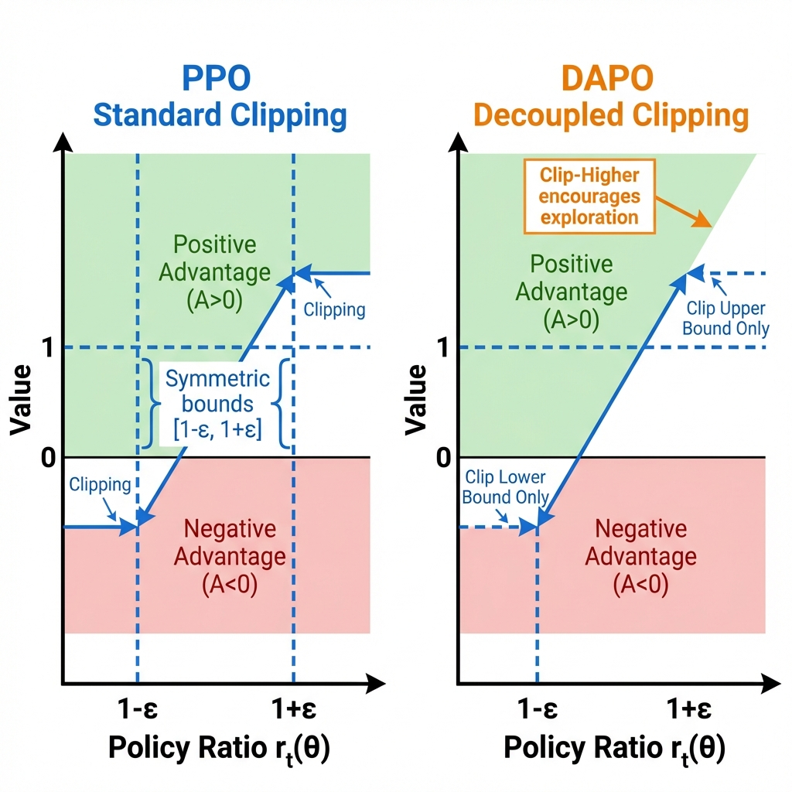

# 第9章：DAPO (Decoupled Clip and Dynamic Sampling Policy Optimization)

**论文信息**：
- **标题**：DAPO: An Open-Source LLM Reinforcement Learning System at Scale
- **作者**：ByteDance Seed Team
- **年份**：2025
- **arXiv**：2505.14953
- **验证**：Qwen2.5-32B在AIME 2024达到50分
- **PDF**：见 `papers/` 目录

**前置知识**：PPO（第5章）、GRPO（第8章）

---

## 0. 本章目标

DAPO是**ByteDance开源的大规模LLM RL训练系统**，提出了4个关键技术改进：

1. **Clip-Higher**：解耦裁剪，对正负优势使用不同边界
2. **Dynamic Sampling**：动态过滤无效样本
3. **Token-Level Loss**：Token级策略梯度损失
4. **Overlong Reward Shaping**：过长回复的奖励塑造

本章将详细解释每个技术的数学原理和实现细节。

---

## 1. 动机：GRPO的局限性

### 1.1 问题1：熵坍缩 (Entropy Collapse)

在长链式思维(CoT)推理中，GRPO会导致策略熵快速下降：

- **现象**：模型输出逐渐趋于确定性，探索能力丧失
- **原因**：标准PPO裁剪对正负优势使用对称边界

### 1.2 问题2：无效样本

当一个prompt的所有response都得到0奖励时：

$$A_i = R_i - \bar{R} = 0 - 0 = 0$$

**公式符号详解**：

| 符号 | 含义 | 说明 |
|------|------|------|
| $A_i$ | 第 $i$ 个response的**优势值** | 衡量该response相对于平均的好坏 |
| $R_i$ | 第 $i$ 个response的**奖励** | 在此场景下 $R_i = 0$ |
| $\bar{R}$ | **组内均值** | 当所有 $R_i = 0$ 时，$\bar{R} = 0$ |

**结果**：优势为0，这些样本不产生任何学习信号，浪费计算资源。

### 1.3 问题3：Token-Sequence不匹配

GRPO使用序列级奖励但Token级优化：

- 奖励：整个response一个分数
- 梯度：每个token分别计算

---

## 2. DAPO的四大技术

### 2.1 Clip-Higher (解耦裁剪)

**核心思想**：对正负优势使用**不同的裁剪边界**。

**原始PPO裁剪**：
$$\text{clip}(r_t, 1-\epsilon, 1+\epsilon)$$

**公式符号详解**：

| 符号 | 含义 | 类型 | 典型值 |
|------|------|------|--------|
| $\text{clip}(\cdot)$ | **裁剪函数**，限制输入值在指定范围 | 函数 | - |
| $r_t$ | 时刻 $t$ 的**概率比率** $r_t = \frac{\pi_\theta(y_t)}{\pi_{old}(y_t)}$ | 标量 | 通常接近1 |
| $\epsilon$ | **裁剪范围参数** | 标量 | 通常0.2 |
| $1-\epsilon$ | 裁剪的**下界** | 标量 | 0.8 |
| $1+\epsilon$ | 裁剪的**上界** | 标量 | 1.2 |

**DAPO解耦裁剪公式**：

$$\text{clip}^{DAPO}(r_t, A_t) = \begin{cases}
\min(r_t, 1+\epsilon_{high}) & \text{if } A_t > 0 \\
\max(r_t, 1-\epsilon_{low}) & \text{if } A_t < 0
\end{cases}$$

**公式各项逐一详解**：

| 符号 | 含义 | 说明 |
|------|------|------|
| $\text{clip}^{DAPO}(r_t, A_t)$ | **DAPO解耦裁剪函数**，根据优势符号选择不同裁剪方式 | 核心创新 |
| $r_t$ | 时刻 $t$ 的**概率比率** | $r_t = \frac{\pi_\theta(y_t\|y_{<t})}{\pi_{old}(y_t\|y_{<t})}$ |
| $A_t$ | 时刻 $t$ 对应的**优势值**（通常是序列级优势 $A_i$ 广播到每个token） | 正值=好动作，负值=差动作 |
| $\epsilon_{high}$ | **正优势时的上界参数** | DAPO设为0.28，比标准PPO的0.2更宽 |
| $\epsilon_{low}$ | **负优势时的下界参数** | DAPO设为0.2，与标准PPO相同 |
| $\min(r_t, 1+\epsilon_{high})$ | 当 $A_t > 0$ 时，**只裁剪上界** | 下界不限，允许概率大幅下降 |
| $\max(r_t, 1-\epsilon_{low})$ | 当 $A_t < 0$ 时，**只裁剪下界** | 上界不限，允许概率大幅上升 |

**参数设置**：
- $\epsilon_{high} = 0.28$（比标准0.2更宽，允许更大概率增益）
- $\epsilon_{low} = 0.2$（与标准PPO相同）

---

### 图解：DAPO解耦裁剪机制



**图片详细说明**：

此图对比了**PPO标准裁剪**与**DAPO解耦裁剪**的机制差异。

**图片结构**（左右两个子图）：

#### 左图：PPO Standard Clipping（PPO标准裁剪）

1. **横轴：Policy Ratio $r_t(\theta)$**
   - 表示概率比率 $r_t = \frac{\pi_\theta(y_t)}{\pi_{old}(y_t)}$
   - $r_t = 1$ 表示策略未变化
   - $r_t > 1$ 表示新策略更可能选择该动作
   - $r_t < 1$ 表示新策略更不可能选择该动作

2. **纵轴：Value（损失贡献）**
   - 表示 $r_t \cdot A_t$ 或 $\text{clip}(r_t) \cdot A_t$ 的值

3. **蓝色虚线标记 $1-\epsilon$ 和 $1+\epsilon$**
   - 表示对称裁剪边界
   - 当 $\epsilon = 0.2$ 时，边界为 $[0.8, 1.2]$

4. **绿色区域：Positive Advantage ($A > 0$)（正优势）**
   - 表示"好动作"的区域
   - PPO同时限制上界和下界
   - **问题**：限制上界会阻止好动作获得更多概率增益

5. **红色区域：Negative Advantage ($A < 0$)（负优势）**
   - 表示"差动作"的区域
   - PPO同时限制上界和下界
   - **问题**：限制下界会阻止差动作被充分惩罚

6. **"Symmetric bounds [1-ε, 1+ε]" 标注**
   - 强调PPO对正负优势使用**相同的对称边界**
   - 这是导致熵坍缩的原因之一

#### 右图：DAPO Decoupled Clipping（DAPO解耦裁剪）

1. **与左图相同的轴定义**

2. **绿色区域（正优势，$A > 0$）**
   - **"Clip Upper Bound Only"（只裁剪上界）标注**
   - 上界设为 $1 + \epsilon_{high} = 1.28$（比PPO更宽）
   - 下界不限制，允许 $r_t$ 无限小
   - **效果**：好动作可以获得更大的概率增益

3. **红色区域（负优势，$A < 0$）**
   - **"Clip Lower Bound Only"（只裁剪下界）标注**
   - 下界设为 $1 - \epsilon_{low} = 0.8$
   - 上界不限制，允许 $r_t$ 无限大
   - **效果**：差动作不会被过度惩罚

4. **右上角橙色标注："Clip-Higher encourages exploration"**
   - 核心洞察：放宽正优势的上界鼓励探索
   - 这是DAPO解决熵坍缩的关键

**关键理解**：
- PPO：对称裁剪 $[1-\epsilon, 1+\epsilon]$ 同时限制好动作和差动作
- DAPO：解耦裁剪，正优势只裁上界（鼓励好动作），负优势只裁下界（防止过度惩罚差动作）
- 结果：DAPO在长CoT推理中保持更高的策略熵，避免过早收敛

---

### 2.2 Dynamic Sampling (动态采样)

**核心思想**：过滤掉**全零奖励**的prompts。

**问题场景**：
```
Prompt X:
  Response 1: Reward = 0
  Response 2: Reward = 0
  Response 3: Reward = 0
  → 所有优势 = 0，无学习信号
```

**解决方案**：
1. 检测全零奖励的prompts
2. **动态补充**新prompts直到获得有效样本
3. 保持每批次有效样本数量

**伪代码**：
```python
def dynamic_sampling(prompts, model, reward_fn, group_size, min_valid=0.5):
    valid_samples = []
    while len(valid_samples) < len(prompts) * min_valid:
        responses = sample_responses(model, prompts, group_size)
        rewards = reward_fn(responses)
        
        # 过滤全零prompts
        for i, prompt_rewards in enumerate(rewards.view(-1, group_size)):
            if prompt_rewards.any():  # 有非零奖励
                valid_samples.append((prompts[i], responses[i], rewards[i]))
        
        # 补充新prompts
        prompts = get_new_prompts()
    
    return valid_samples
```

---

### 2.3 Token-Level Policy Gradient Loss

**核心思想**：使用**Token级**损失而非**序列级**。

**序列级损失 (GRPO)**：

$$L^{seq} = -\sum_{i} r_i^{seq} \cdot A_i$$

其中：
$$r_i^{seq} = \exp\left(\sum_t \log\frac{\pi_\theta(y_t)}{\pi_{old}(y_t)}\right)$$

**公式符号详解**：

| 符号 | 含义 | 说明 |
|------|------|------|
| $L^{seq}$ | **序列级损失** | 对整个序列计算一个损失 |
| $r_i^{seq}$ | 第 $i$ 个response的**序列级概率比率** | 所有token比率的乘积（在log空间是求和） |
| $\sum_t$ | 对所有**token位置 $t$** 求和 | $t = 1, 2, \ldots, T$ |
| $\pi_\theta(y_t)$ | 当前策略对第 $t$ 个token的概率 | 简写，完整为 $\pi_\theta(y_t\|y_{<t})$ |
| $\pi_{old}(y_t)$ | 旧策略对第 $t$ 个token的概率 | 采样时的策略 |
| $A_i$ | 第 $i$ 个response的**序列级优势** | 由组均值计算 |
| $\exp(\cdot)$ | 指数函数 | 将log空间转回原空间 |

**Token级损失 (DAPO)**：

$$L^{token} = -\sum_{i} \sum_t r_{i,t}^{token} \cdot A_i$$

其中：
$$r_{i,t}^{token} = \frac{\pi_\theta(y_t)}{\pi_{old}(y_t)}$$

**公式符号详解**：

| 符号 | 含义 | 说明 |
|------|------|------|
| $L^{token}$ | **Token级损失** | 对每个token分别计算损失后求和 |
| $\sum_i$ | 对所有**response $i$** 求和 | $i = 1, \ldots, G \times B$，$B$ 是batch size |
| $\sum_t$ | 对response $i$ 的所有**token $t$** 求和 | $t = 1, \ldots, T_i$ |
| $r_{i,t}^{token}$ | 第 $i$ 个response第 $t$ 个token的**概率比率** | 独立计算每个token |
| $A_i$ | 第 $i$ 个response的**优势**（广播到每个token） | 同一个response的所有token共享优势 |

**优势**：
- 更细粒度的信用分配
- 减少方差（序列比率可能因乘积而爆炸）
- 更稳定的训练

---

### 2.4 Overlong Reward Shaping

**问题**：长回复可能超过最大长度限制，无法获得正确奖励。

**解决方案**：对过长回复给予**软惩罚**而非硬截断。

$$R_{shaped} = \begin{cases}
R_{original} & \text{if } |y| < L_{max} \\
R_{original} - \lambda \cdot (|y| - L_{max}) & \text{if } |y| \geq L_{max}
\end{cases}$$

**公式符号详解**：

| 符号 | 含义 | 类型 | 说明 |
|------|------|------|------|
| $R_{shaped}$ | **塑造后的奖励** | 标量 | 用于训练的最终奖励 |
| $R_{original}$ | **原始奖励** | 标量 | 由奖励模型或验证器给出 |
| $\|y\|$ | response $y$ 的**长度**（token数） | 正整数 | 例如500 tokens |
| $L_{max}$ | **最大允许长度** | 正整数 | 例如4096 tokens |
| $\lambda$ | **过长惩罚系数** | 正标量 | 典型值0.01 |
| $\|y\| - L_{max}$ | **超出长度** | 非负整数 | 超出的token数 |

**效果**：
- 当 $|y| < L_{max}$：奖励不变
- 当 $|y| = L_{max} + 100$：奖励减少 $0.01 \times 100 = 1.0$

---

## 3. DAPO完整算法

### 3.1 伪代码

```
算法: DAPO

输入: 策略模型 π_θ, 参考模型 π_ref, Prompt集合 D

重复:
  1. 动态采样:
     while 有效样本数 < 阈值:
       采样responses，计算rewards
       过滤全零prompts
       补充新prompts
  
  2. 计算优势:
     A_i = R_i - mean(R)  (Dr. GRPO风格)
  
  3. Token级PPO更新:
     for each token t:
       r_t = π_θ(y_t) / π_old(y_t)
       
       if A_i > 0:
         clipped_r = min(r_t, 1 + ε_high)
       else:
         clipped_r = max(r_t, 1 - ε_low)
       
       loss += -clipped_r * A_i
  
  4. 梯度更新:
     θ ← θ - α∇loss
```

### 3.2 超参数详解

| 参数 | 符号 | 值 | 含义与作用 |
|------|------|----|----|
| 正优势上界 | $\epsilon_{high}$ | 0.28 | 控制好动作概率增益的最大幅度，比标准PPO更宽松 |
| 负优势下界 | $\epsilon_{low}$ | 0.2 | 控制差动作概率降低的最大幅度，与标准PPO相同 |
| 组大小 | $G$ | 8-16 | 每个prompt采样的response数量 |
| KL惩罚系数 | $\beta$ | 0.01 | 控制策略偏离参考模型的程度 |
| 过长惩罚 | $\lambda$ | 0.01 | 超出最大长度的惩罚强度 |

---

## 4. DAPO vs GRPO vs PPO

### 4.1 核心差异对比

| 特性 | PPO | GRPO | DAPO |
|------|-----|------|------|
| 基线来源 | 价值网络 $V(s)$ | 组均值 $\bar{R}$ | 组均值 $\bar{R}$ |
| 裁剪方式 | 对称 $[1-\epsilon, 1+\epsilon]$ | 对称 | 解耦（$\epsilon_{high} \neq \epsilon_{low}$） |
| 无效样本处理 | 无 | 无 | 动态过滤 |
| 损失级别 | Token级 | 序列级 | Token级 |
| 过长处理 | 硬截断 | 硬截断 | 软惩罚 |

---

## 5. 本章总结

### 5.1 核心公式汇总

| 组件 | 公式 | 关键参数 |
|------|------|----------|
| 解耦裁剪 | $A>0 \to \min(r, 1+\epsilon_{high})$; $A<0 \to \max(r, 1-\epsilon_{low})$ | $\epsilon_{high}=0.28$, $\epsilon_{low}=0.2$ |
| Token级损失 | $-\sum_i\sum_t r_{i,t} \cdot A_i$ | - |
| 动态采样 | 过滤 $\forall j: R_j = 0$ 的prompts | min_valid=0.5 |
| 过长塑造 | $R - \lambda \cdot \max(0, \|y\| - L_{max})$ | $\lambda=0.01$ |

### 5.2 DAPO的贡献

1. **解决熵坍缩**：Clip-Higher允许更多探索
2. **提高样本效率**：动态采样避免无效更新
3. **更细信用分配**：Token级损失
4. **开源**：完整代码和数据集公开

---

## 6. 开源实现参考

- **官方**: https://github.com/volcengine/verl (集成DAPO)
- **论文**: https://dapo-sia.github.io/
- **arXiv**: https://arxiv.org/abs/2505.14953

---

**下一章预告**：[第10章：GSPO与序列级优化](../10_GSPO/01_Theory_Derivation.md)
