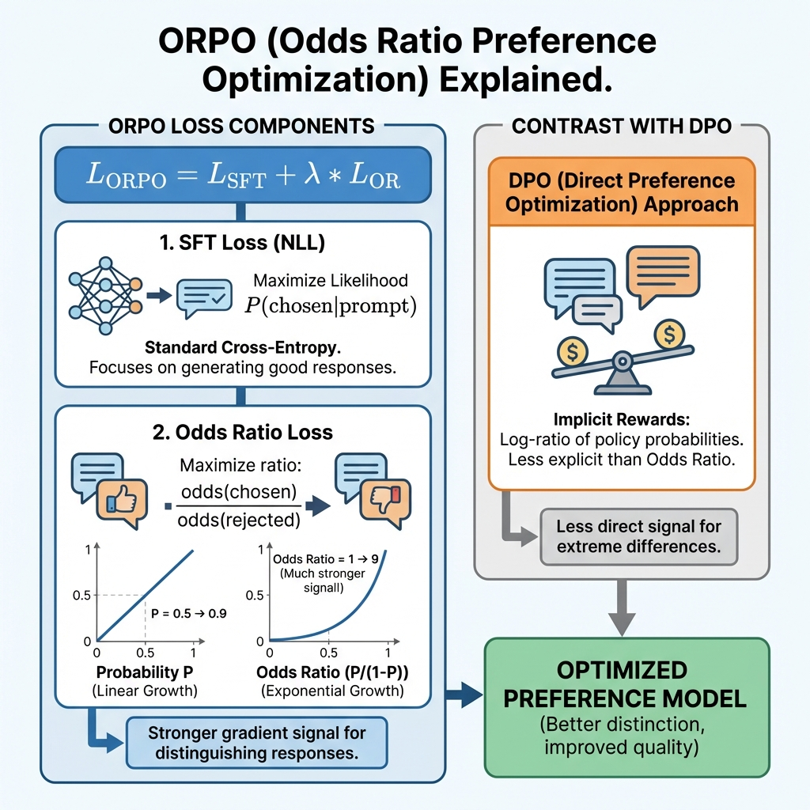

# 第11章：优势比偏好优化 (Odds Ratio Preference Optimization, ORPO)

**论文信息**：
- **标题**：ORPO: Monolithic Preference Optimization without Reference Model
- **作者**：Jiwoo Hong, Noah Lee, James Thorne (KAIST)
- **年份**：2024
- **arXiv**：2403.07691
- **PDF**：见 `papers/` 目录

**前置知识**：DPO（第7章）、交叉熵损失

---

## 0. 本章目标

在2024年，ORPO作为一种**极其简洁**的对齐算法横空出世。

> **核心痛点**：RLHF和DPO都需要一个**参考模型 (Reference Model)** 来防止策略跑偏（KL惩罚）。这需要加载两个LLM（Policy + Ref），显存开销翻倍。

ORPO通过重新思考偏好优化的数学本质，提出：
**我们不需要参考模型，只需要在微调的同时，惩罚对"坏回复"的生成概率。**

本章将：
1. 解释**Odds Ratio (优势比)** 的概念及其为何适合偏好优化
2. 推导ORPO的单目标损失函数
3. 证明ORPO如何隐式实现SFT+对齐的统一
4. 提供ORPO的极简PyTorch实现

---

## 1. 理论基础：Odds Ratio

### 1.1 什么是Odds (几率/优势)?

在概率论中，一个事件发生的概率为 $p$，则其**Odds**定义为：

$$\text{odds}(p) = \frac{p}{1-p}$$

- 当 $p=0.5$ 时，$\text{odds}=1$
- 当 $p=0.9$ 时，$\text{odds}=9$
- 当 $p \to 1$ 时，$\text{odds} \to \infty$

### 1.2 为什么用Odds?

DPO使用的是对数概率比 $\log \frac{\pi}{\pi_{ref}}$。
ORPO发现，使用Odds可以更敏锐地放大模型对两个回复的区别。

定义模型生成一个输出序列 $y$ 的Odds：

$$\text{odds}_\theta(y|x) = \frac{P_\theta(y|x)}{1 - P_\theta(y|x)}$$

注：在实际计算中，$P_\theta(y|x)$ 通常是Token级概率的乘积，数值非常小，所以 $1 - P \approx 1$，$\text{odds} \approx P$。
但在微观的Token级别，**Odds Ratio** 提供了强有力的梯度信号。

### 1.3 OR (Odds Ratio)

给定好回复 $y_w$ 和坏回复 $y_l$，**Odds Ratio** 定义为：

$$OR = \frac{\text{odds}_\theta(y_w|x)}{\text{odds}_\theta(y_l|x)}$$

我们希望最大化这个比率，即让模型生成 $y_w$ 的几率远大于 $y_l$。

---

## 2. ORPO损失函数

### 2.1 整体目标

ORPO将SFT（监督微调）和偏好对齐合并到一个损失函数中：

$$\mathcal{L}_{ORPO} = \mathcal{L}_{SFT} + \lambda \cdot \mathcal{L}_{OR}$$

**公式各项逐一详解**：

| 符号 | 含义 | 说明 |
|------|------|------|
| $\mathcal{L}_{SFT}$ | **监督微调损失** | 负对数似然 (NLL) |
| $\mathcal{L}_{OR}$ | **优势比损失** | 偏好优化的核心 |
| $\lambda$ | **权重系数** | 用于平衡两个任务，典型值 [0.1, 1.0] |

---

### 2.2 SFT Loss (基础)

$$\mathcal{L}_{SFT} = -\sum_{t} \log P_\theta(y_{w,t} | y_{w,<t}, x)$$

这一项保证模型**学会说话**，保持生成的流畅性。只在 $y_w$（好回复）上计算。

### 2.3 Odds Ratio Loss (对齐)

ORPO设计了一个对数Sigmoid损失来最大化Odds Ratio：

$$\mathcal{L}_{OR} = -\log \sigma (\log OR)$$

展开后：

$$\mathcal{L}_{OR} = -\log \sigma \left( \log \frac{\text{odds}_\theta(y_w)}{\text{odds}_\theta(y_l)} \right)$$

利用 $\log \frac{a}{b} = \log a - \log b$，以及 $\text{odds}(p) = \frac{p}{1-p}$：

$$\mathcal{L}_{OR} = -\log \sigma \left( \log \frac{P(y_w)}{1-P(y_w)} - \log \frac{P(y_l)}{1-P(y_l)} \right)$$

**梯度分析**：
这个损失函数包含了一个巧妙的机制：当模型错误地给 $y_l$ 高概率时，梯度的惩罚力度会随Odds的指数增长而急剧增加。

---

### 图解：ORPO如何工作



**图片详细说明**：
- **左侧 (SFT Loss)**：标准的Next Token Prediction，确保模型学会正确的语法和知识。
- **右侧 (Odds Ratio Loss)**：一个"天平"，压低坏回复 $y_l$ 的Odds，抬高好回复 $y_w$ 的Odds。
- **无需参考模型**：注意整个流程没有 $\pi_{ref}$ 参与，节省了一半显存。

---

## 3. 实现细节

### 3.1 概率计算技巧

如何在数值稳定的前提下计算 $\text{odds}$?

我们通常从模型得到的是 Logits。
$$P = \text{softmax}(L)$$
$$\text{odds} = \frac{P}{1-P}$$

但直接算 $1-P$ 可能下溢。
对于Token级别：
$$\log \text{odds} = \log P - \log(1-P)$$

ORPO论文在序列级别处理：
1. 计算整个序列的平均 Log Probability
2. 用这个平均值计算 odds

$$ \log P(y|x) = \frac{1}{T} \sum \log P(token) $$
$$ \log \text{odds}(y|x) = \log \text{sigmoid}(\text{logit}) - \log(1 - \text{sigmoid}(\text{logit})) = \text{logit} $$

*(注：论文中的具体实现略有不同，通常直接用 sequence logical probability)*

### 3.2 官方代码逻辑

```python
def odd_ratio_loss(beta, policy_chosen_logps, policy_rejected_logps):
    # odds = p / (1-p)
    # log_odds = log(p) - log(1-p)
    
    log_odds_chosen = policy_chosen_logps - torch.log1p(-torch.exp(policy_chosen_logps))
    log_odds_rejected = policy_rejected_logps - torch.log1p(-torch.exp(policy_rejected_logps))
    
    ratio = log_odds_chosen - log_odds_rejected
    return -F.logsigmoid(ratio).mean()
```

注意：这里 `log_prob` 是负数，`exp(log_prob)` 是 $P$。
`torch.log1p(-x)` 等价于 $\log(1-x)$。

---

## 4. ORPO vs DPO vs RLHF

| 特性 | RLHF (PPO) | DPO | ORPO |
|------|------------|-----|------|
| **阶段** | SFT -> RM -> PPO (3) | SFT -> DPO (2) | **ORPO (1)** |
| **参考模型** | 需要 | 需要 | **不需要** |
| **显存占用** | 高 (4模型*) | 中 (2模型) | **低 (1模型)** |
| **训练速度** | 慢 | 中 | **快** |
| **性能** | SOTA | 接近SOTA | **有竞争力** |

*注：PPO通常需要 Policy, Value, Ref, Reward 四个网络。*

---

## 5. 本章总结

### 5.1 核心公式

$$\mathcal{L}_{ORPO} = \underbrace{\mathcal{L}_{SFT}}_{\text{学会说话}} + \lambda \cdot \underbrace{-\log \sigma(\log \text{odds}(y_w) - \log \text{odds}(y_l))}_{\text{学会偏好}}$$

### 5.2 ORPO的贡献

1. **Monolithic（单体式）**：无需SFT预训练，直接在偏好数据上从头训练。
2. **Reference-Free**：彻底移除了KL惩罚项和参考模型，用Odds Ratio隐式控制生成多样性。
3. **高效**：是目前显存最友好的对齐算法之一。

---

**下一章预告**：待定 (SimPO或其他)
