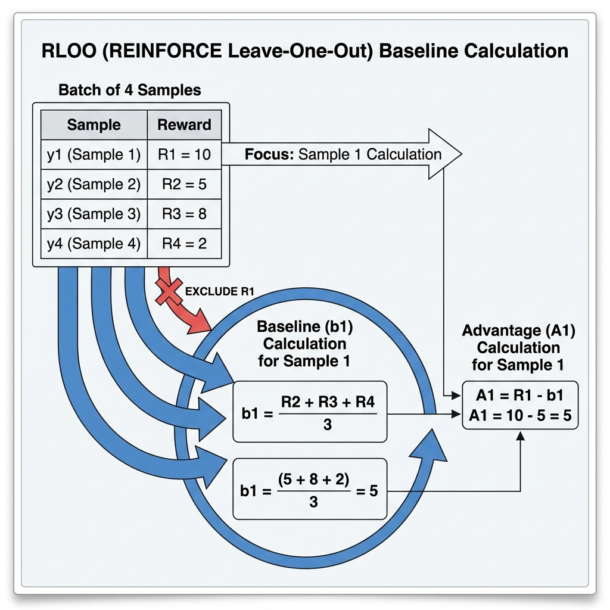

# 第12章：留一法策略梯度优化 (REINFORCE Leave-One-Out, RLOO)

**论文信息**：
- **标题**：Back to Basics: Revisiting REINFORCE Style Optimization for Learning from Human Feedback in LLMs
- **作者**：Arash Ahmadian et al. (Cohere For AI)
- **年份**：2024
- **arXiv**：2402.14740
- **PDF**：见 `papers/` 目录

**前置知识**：REINFORCE（第3章）、GRPO（第8章）

---

## 0. 本章目标

RLOO (REINFORCE Leave-One-Out) 是**Cohere团队**提出的算法，旨在**回归本源**。

> **RLOO的核心思想**：不需要PPO的复杂裁剪，也不需要训练价值网络，只需要用**留一法 (Leave-One-Out)** 构造一个无偏且低方差的基线。

本章将：

1. 解释RLOO如何解决REINFORCE的高方差问题
2. 详细推导留一法基线 (LOO Baseline)
3. 对比RLOO与GRPO的细微但关键的差别
4. 展示RLOO的PyTorch实现

---

## 1. 动机：REINFORCE的回归

### 1.1 REINFORCE的问题

标准REINFORCE的梯度估计：
$$\nabla J(\theta) = \mathbb{E}\left[ (R(y) - b) \nabla \log \pi(y|x) \right]$$

如果基线 $b$ 是常数（如0），方差极大。你需要一个这就依赖状态的基线 $b(x)$。
PPO训练了一个价值网络 $V(x)$ 作为基线，但这增加了显存和计算开销。

### 1.2 GRPO的思路

GRPO使用**组内均值**作为基线：
$$b_i = \bar{R} = \frac{1}{G} (R_1 + R_2 + \dots + R_G)$$

这很简单且有效，但有一个理论缺陷：**基线 $b_i$ 包含了 $R_i$ 自身的信息**。这意味着基线与当前的动作 $y_i$ **不独立**，导致梯度估计在数学上是有偏的（虽然实践中通常没问题）。

### 1.3 RLOO的解决方案

RLOO使用**除自己以外的其他样本的均值**作为基线：

$$b_i = \text{Mean}(\text{Others}) = \frac{1}{G-1} \sum_{j \neq i} R_j$$

**优势**：
1. **无偏估计**：基线 $b_i$ 与当前样本 $y_i$ 完全独立
2. **低方差**：利用了同一个prompt下的多个样本
3. **极简实现**：代码比PPO更简单，效率更高

---

## 2. RLOO的数学推导

### 2.1 留一法基线 (Leave-One-Out Baseline)

假设我们对同一个prompt $x$ 采样了 $G$ 个response：
$$\{y_1, y_2, \dots, y_G\}$$
每个response的奖励为：
$$\{R_1, R_2, \dots, R_G\}$$

对于**第 $i$ 个样本** $y_i$，其基线 $b_i$ 计算如下：

$$b_i = \frac{1}{G-1} \sum_{j=1, j \neq i}^G R_j$$

**展开公式**（以 $G=4$ 为例）：

对于样本 $1$ ($i=1$)，基线是 $2, 3, 4$ 的均值：
$$b_1 = \frac{1}{3} (R_2 + R_3 + R_4)$$

对于样本 $2$ ($i=2$)，基线是 $1, 3, 4$ 的均值：
$$b_2 = \frac{1}{3} (R_1 + R_3 + R_4)$$

...以此类推。

### 2.2 优势计算

$$A_i^{RLOO} = R_i - b_i = R_i - \frac{1}{G-1} \sum_{j \neq i} R_j$$

**公式符号详解**：

| 符号 | 含义 | 说明 |
|------|------|------|
| $A_i^{RLOO}$ | 第 $i$ 个样本的**RLOO优势** | 衡量 $R_i$ 是否高于"其他样本的平均水平" |
| $R_i$ | 第 $i$ 个样本的**奖励** | - |
| $\sum_{j \neq i}$ | **留一求和** | 对除了 $i$ 以外的所有 $j$ 求和 |
| $G$ | **组大小** | 样本总数 |
| $G-1$ | **其他样本数量** | 求均值的分母 |

---

### 图解：RLOO留一法计算



**图片详细说明**：
此图展示了RLOO如何计算样本1的优势。
- **输入**：4个样本的奖励 $R_1, R_2, R_3, R_4$
- **基线计算**：$b_1$ 排除 $R_1$，只取 $R_2, R_3, R_4$ 的平均
- **优势计算**：$A_1 = R_1 - b_1$
- 箭头清楚地展示了数据流向，强调了 $R_1$ 不参与 $b_1$ 的计算

---

### 2.3 目标函数

RLOO直接优化REINFORCE目标（通常带有KL惩罚）：

$$J(\theta) = \mathbb{E}_{x \sim \mathcal{D}, y \sim \pi_\theta} \left[ (R(x,y) - b(x)) \nabla \log \pi_\theta(y|x) - \beta D_{KL}(\pi_\theta || \pi_{ref}) \right]$$

在代码实现中，既然 $A_i$ 已经是去基线后的奖励，我们通常直接最小化：

$$\mathcal{L}^{RLOO} = -\frac{1}{G} \sum_{i=1}^G A_i^{RLOO} \cdot \log \pi_\theta(y_i|x)$$

注意：这里通常不需要PPO的clip操作，因为RLOO是On-Policy的REINFORCE变体，且通常结合多样本平均来稳定训练。不过，**实际上很多RLOO实现（包括DeepMind和Cohere的实验）也会加上PPO-clip来进一步增加稳定性**。如果加了Clip，它就变成了**PPO-LOO**。但这一章我们关注纯粹的RLOO。

---

## 3. RLOO vs GRPO

这也是用户最关心的地方。让我们把公式写在一起对比。

### 3.1 基线计算对比

#### GRPO (Group Baseline)

$$b_i^{GRPO} = \bar{R} = \frac{1}{G} \sum_{j=1}^G R_j = \frac{1}{G} (\textcolor{red}{R_i} + \sum_{j \neq i} R_j)$$

*注意：基线包含了 $R_i$ 自己。*

#### RLOO (Leave-One-Out Baseline)

$$b_i^{RLOO} = \frac{1}{G-1} \sum_{j \neq i} R_j$$

*注意：基线完全排除 $R_i$。*

### 3.2 优势对比

假设 $G=4, R=[10, 5, 8, 2]$

**GRPO计算 $A_1$**:
Mean = $(10+5+8+2)/4 = 6.25$
$A_1 = 10 - 6.25 = \mathbf{3.75}$

**RLOO计算 $A_1$**:
Baseline = $(5+8+2)/3 = 5.0$
$A_1 = 10 - 5.0 = \mathbf{5.0}$

**差异**：
- RLOO的优势通常绝对值更大（因为没有被自己"平均"掉一部分）
- 当 $G \to \infty$ 时，两者趋于一致
- 当 $G$ 较小（如4或8）时，RLOO在理论上更优（无偏）

---

## 4. 为什么选择RLOO？

| 特性 | GRPO | RLOO |
|------|------|------|
| **理论性质** | 有偏估计 (包含自身) | **无偏估计** (独立基线) |
| **计算量** | 极低 | 极低 |
| **实现难度** | 简单 | 简单 |
| **PPO-Clip** | 通常使用 | 可用可不用 (纯REINFORCE) |
| **归一化** | 通常除以std | 通常不需要除以std |

**结论**：对于小Batch Size（小Group Size），RLOO是比GRPO更严谨的选择。DeepSeek选择GRPO可能是因为在大规模训练下（大G）偏差可忽略，且除以标准差有助于训练稳定性。

---

## 5. 实现细节

### 5.1 高效计算技巧

直接循环计算 $G$ 次均值很慢。我们可以用总和减去当前值来快速计算：

$$b_i = \frac{\text{Sum} - R_i}{G-1}$$

代码：
```python
# 假设 rewards 是 [Batch, Group]
sum_rewards = rewards.sum(dim=1, keepdim=True)  # [B, 1]
loo_means = (sum_rewards - rewards) / (group_size - 1)  # [B, G]
advantages = rewards - loo_means
```

### 5.2 归一化

虽然RLOO理论上不需要归一化，但在深度学习实践中，对优势进行标准化（减均值除方差）往往能加速收敛。
即：
$$A_{normalized} = \frac{A - \text{mean}(A)}{\text{std}(A) + \epsilon}$$

这一步通常在Batch级别进行。

---

## 6. 本章总结

### 6.1 核心公式

| 组件 | 公式 |
|------|------|
| 留一基线 | $b_i = \frac{1}{G-1} \sum_{j \neq i} R_j$ |
| 快速计算 | $b_i = \frac{\sum R - R_i}{G-1}$ |
| RLOO优势 | $A_i = R_i - b_i$ |

### 6.2 RLOO的贡献

1. **理论修正**：修正了GRPO基线包含自身的偏差
2. **极简主义**：证明了REINFORCE配合好的基线在RLHF中依然强大
3. **高效**：无需训练价值网络，仅需简单的张量操作

---

**下一章预告**：待定 (GMPO或其他)
