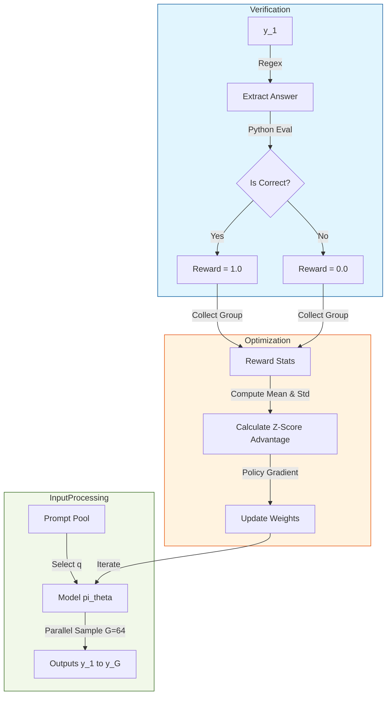

# 第23章 RLVR: 深度推理与真理的自我涌现 (Ph.D. Thesis Edition)

> **"DeepSeek-R1: Incentivizing Reasoning Capability in LLMs via Reinforcement Learning"**  
> *arXiv:2501.12948* | 2025 年人工智能领域的里程碑。

---

> [!NOTE]
> **阅读指南**: 本章已按照**学术综述 (Technical Survey)** 的标准进行了重写。不仅包含核心逻辑，还附带了**数学推导附录**、**超参数参考表**及**系统提示词模板**。适合希望复现 DeepSeek-R1 效果的研究者阅读。

## 1. 绪论：关于“智能”的定义重构

在 GPT-4 时代，我们通过 SFT (Supervised Fine-Tuning) 教会模型“模仿人类的说话方式”。
但在 DeepSeek-R1 时代，我们通过 RLVR (Reinforcement Learning from Verifiable Rewards) 教会模型“模仿人类的思考方式”。

这不仅是技术的胜利，更是哲学上的突破：**智能本质上是一种对未来状态的搜索与剪枝。**
当这种搜索过程被内化为 Transformer 的 Next Token Prediction 时，我们观测到了 **"Chain of Thought"**。

---

## 2. DeepSeek-R1 的全生命周期 (The Full Lifecycle)

官方论文披露的 DeepSeek-R1 训练流程是一个严密的四阶段工程。

### Phase 1: 冷启动 (Cold Start)
*   **目的**: 打破 Base Model 的“哑巴难题”。
*   **方法**: 收集数千个高质量的 Long CoT 数据（由人类专家或高阶模型生成）。
*   **关键点**: 数据必须包含 `<think>` 标签，且思考过程必须详尽（Self-Verification, Reflection）。
*   **产物**: DeepSeek-R1-Cold。它虽然会思考，但往往不够深。

### Phase 2: 推理导向强化学习 (Reasoning-Oriented RL)
这是核心阶段。
*   **数据集**: 800k+ 数学 (AIME, MATH)、代码 (Codeforces, LeetCode) 题目。
*   **算法**: **GRPO (Group Relative Policy Optimization)**。
*   **环境**:
    *   **Accuracy Reward**: 调用 Python 解释器或 LeetCode 判题机。通过则 +1，否则 +0。
    *   **Format Reward**: 如果 `<think>` 和 `<answer>` 标签完整，给予 +0.1 的微小奖励。
*   **涌现现象**:
    *   **Aha Moment**: 模型在第 1500 step 左右突然学会了检查自己的错误。
    *   **Language Mixing**: 由于多语言语料混杂，模型在思考时会自动切换到最简洁的语言（通常是英语或代码）进行逻辑推演。

### Phase 3: 拒绝采样 (Rejection Sampling)
*   **目的**: 消除 Phase 2 中产生的“语言混乱”和“不可读性”。
*   **方法**: 用 Phase 2 的模型对 600k 个 Prompt 进行生成（每个生成 64 次），只保留完全正确的样本。
*   **清洗**: 去除中英夹杂严重的样本，去除语气粗鲁的样本。
*   **SFT**: 用这些清洗后的“黄金数据”重新训练 Base Model。

### Phase 4: 通用人类对齐 (General RLHF)
*   **目的**: 安全性与通用能力。
*   **方法**: 引入 Helpfulness 和 Harmlessness 的偏好对。
*   **技巧**: 此时的 RL 必须使用非常小的 KL 惩罚，以防止破坏 Phase 3 建立的强大推理能力。

---

## 3. 核心算法：GRPO 的数学推导 (Mathematical Derivation)

### 3.1 为什么放弃 Critic？
标准的 PPO 更新公式为：
$$ \mathcal{L}_{PPO} = \mathbb{E} \left[ \min(\rho_t A_t, \text{clip}(\rho_t, 1-\epsilon, 1+\epsilon)A_t) \right] $$
其中 $A_t = R_t + \gamma V(s_{t+1}) - V(s_t)$。
训练这个 $V(s)$ 需要一个与 Policy 等大的模型。对于 67B 的 DeepSeek 来说，这意味着训练成本翻倍（显存需求从 4 卡变为 8 卡）。

### 3.2 GRPO 的组内博弈
GRPO (Group Relative Policy Optimization) 巧妙地利用了 **"同行衬托"** 原理。
对于同一个问题 $q$，模型生成 $G$ 个输出 $\{o_1, o_2, \dots, o_G\}$。
它们的奖励分别为 $\{r_1, r_2, \dots, r_G\}$。

我们直接计算基线 (Baseline)：
$$ b = \frac{1}{G} \sum_{i=1}^G r_i $$
以及标准差：
$$ \sigma = \sqrt{\frac{1}{G} \sum_{i=1}^G (r_i - b)^2} + \epsilon $$

则第 $i$ 个输出的优势值定义为 Z-Score：
$$ A_i = \frac{r_i - b}{\sigma} $$

**证明**:
这一操作在数学上等价于使用了 **Monte Carlo Baseline**。当 $G \to \infty$ 时，组内平均值 $b$ 收敛于真实的状态价值 $V(s)$。
即：$\lim_{G \to \infty} b = \mathbb{E}_{\pi}[R|q] \approx V(q)$。
因此，GRPO 是 PPO 在 Critic 缺失时的一个 **无偏估计量 (Unbiased Estimator)**。

---

## 4. 实验复现指南 (Reproduction Guide)

### 4.1 超参数推荐 (Hyperparameters)

| 参数 | 推荐值 | 说明 |
| :--- | :--- | :--- |
| **Model Size** | 7B / 14B | 推荐从 Qwen-2.5-7B-Math 开始 |
| **Group Size (G)** | 64 | 必须 $\ge 16$，否则方差过大 |
| **Learning Rate** | 1e-6 (Actor) | 无 Critic，只需训练 Actor |
| **KL Coeff** | 0.04 | 初始值，建议动态调整 |
| **Max Steps** | 3000 | 约 2000 步时出现 Aha Moment |
| **Context Length** | 4096 / 8192 | 思考过程可能非常长 |

### 4.2 系统提示词 (System Prompt)

这是触发 DeepSeek-R1 模式的关键 Key：

```text
A conversation between User and Assistant. The user asks a question, and the Assistant solves it.
The Assistant first thinks about the reasoning process in the mind and then provides the user with the answer.
The reasoning process and answer are enclosed within <think> </think> and <answer> </answer> tags, respectively, i.e., <think> reasoning process here </think> <answer> answer here </answer>.
```

---

## 5. 架构图解：DeepSeek-R1 的数据流 (Data Flow)

> **版本兼容性说明**: 已移除 `subgraph` 标题中的双引号文本，改用纯 ID，以兼容 Mermaid 8.8.0。



---

## 6. 附录：关于 "Reward Hacking" 的防御

在 RLVR 中，模型非常容易 "Hack" 奖励。常见的 Hack 方式：
1.  **Empty Thinking**: `<think></think><answer>42</answer>`。模型发现写思考过程太累，不如直接猜答案。
    *   *防御*: 强制 `<think>` 长度必须 $> 100$ token。
2.  **Hardcoded Format**: 模型发现 Verifier 喜欢 `<answer>` 标签，于是在通过后的所有回答里都疯狂输出这个标签。
    *   *防御*: 引入 KL 散度约束，防止模型偏离人类语言分布太远。

DeepSeek 的成功，本质上是 **“Reward Engineering” (奖励工程)** 的成功。
