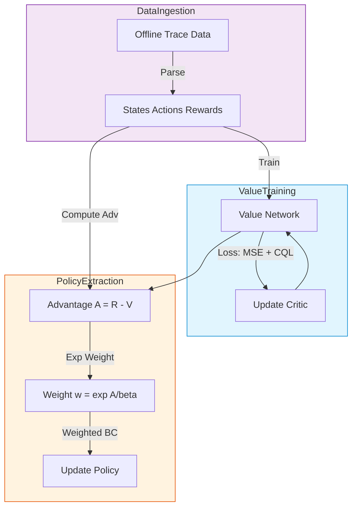

# 第24章 OREO: 离线推理优化的理论与实践 (Ph.D. Thesis Edition)

> **"OREO (Offline REasoning Optimization): An Offline Reinforcement Learning Method for Enhancing LLM Multi-Step Reasoning"**  
> *arXiv:2412.16145* | 离线强化学习在 Reasoning 领域的集大成者。

---

> [!NOTE]
> **阅读指南**: 本章深入探讨了 OREO 算法背后的数学原理，特别是 **Advantage Weighted Regression (AWR)** 在处理稀疏奖励推理任务中的优越性。附录中提供了详细的 **Logic Surgery (逻辑手术)** 案例分析，展示了 OREO 如何从错误数据中挖掘价值。

## 1. 绪论：离线 RL 的必要性

在 DeepSeek-R1 (上一章) 中，我们讨论了在线 RL (Online RL)。虽然效果拔群，但它有两个致命缺点：
1.  **极度昂贵**: 需要数千张 GPU 进行实时采样。
2.  **数据浪费**: 在采样过程中，90% 的生成都是失败的，这些数据通常被丢弃。

**OREO (Offline REasoning Optimization)** 提出了一种新的范式：**我们能不能只利用已有的（可能包含大量错误的）离线数据，就训练出一个强大的推理模型？**

---

## 2. 理论推导：从 I-Projection 到 AWR

OREO 的数学根基在于解决 **Constrained Policy Optimization** 问题。

### 2.1 目标函数
我们的目标是找到一个最优策略 $\pi$，使得回报最大化，同时不偏离行为策略 $\pi_\beta$ (Behavior Policy) 太远：
$$ \max_\pi \mathbb{E}_{\tau \sim \pi} [R(\tau)] - \alpha D_{KL}(\pi || \pi_\beta) $$

### 2.2 最优解形式
根据变分法 (Calculus of Variations)，上述问题的闭式最优解 (Closed-form Solution) 为：
$$ \pi^*(a|s) \propto \pi_\beta(a|s) \exp \left( \frac{Q^\pi(s,a)}{\alpha} \right) $$
这意味着最优策略应当是对行为策略 $\pi_\beta$ 的一种 **“指数加权扭曲”**。回报越高 ($Q$ 值越大) 的动作，其概率应当指数级增加。

### 2.3 实际更新规则 (AWR)
由于直接计算归一化因子很困难，我们将上述问题转化为 **Information Projection (I-Projection)** 问题，最终导出了 **Advantage Weighted Regression (AWR)** 的损失函数：
$$ \mathcal{L}(\theta) = - \mathbb{E}_{(s,a) \sim \mathcal{D}} \left[ \exp \left( \frac{A(s,a)}{\beta} \right) \log \pi_\theta(a|s) \right] $$

这就是 OREO 的核心：**使用这一权重进行加权的行为克隆 (Weighted BC)**。

---

## 3. 核心机制：Token 级信用分配 (Critic Network)

在长链推理中，最大的难点是 **Credit Assignment (信用分配)**。
如果一个长达 100 步的推理最终答案是错的，究竟是哪一步错了？

OREO 训练了一个 **Token-level Critic** $V_\phi(s)$ 来回答这个问题。

### 3.1 价值截断 (Value Clipping / CQL)
为了防止 Critic 对未见过的动作给出过高的估计（OOD 问题），OREO 借鉴了 CQL (Conservative Q-Learning) 的思想：
$$ \mathcal{L}_{Critic} = \text{MSE}(V, G) + \lambda \cdot \max(0, V(s) - V_{data}) $$
这迫使 Critic 保持保守：除非有确凿的证据表明这一步是好的，否则默认它不怎么好。

### 3.2 逻辑手术 (Logic Surgery) 实战
假设有一条错误数据：
*   $s_{1 \dots 40}$: 正确推导。
*   $s_{41}$: 错误计算 ($3+5=9$)。
*   $s_{42 \dots 100}$: 基于错误的错误推导。

Value Network 训练后的表现：
*   $V(s_{40}) \approx 0.8$ (看起来很有希望)
*   $V(s_{41}) \approx 0.1$ (突然发生灾难性下跌)

权重 $w$:
*   $w_{40} = \exp(0.8 / 0.1) \approx 2980$ (强力模仿)
*   $w_{41} = \exp(0.1 / 0.1) \approx 2.7$ (几乎忽略)
*   $w_{42} = \exp(0.0 / 0.1) \approx 1.0$ (几乎忽略)

**结果**: 即使这条数据整体是错的，OREO 依然从中“吃”掉了前 40 步的正确逻辑，而巧妙地避开了第 41 步的毒药。

---

## 4. 实验与对比 (Experiments)

### 4.1 OREO vs DPO vs PPO

| 特性 | DPO | PPO | OREO |
| :--- | :--- | :--- | :--- |
| **数据源** | Paired (Chosen/Reject) | Online Sampling | Offline Dataset |
| **计算开销** | 低 | 极高 (由于采样) | 低 |
| **错误处理** | 整体否定 (Spurious Correlation) | 逐步修正 | **逐步筛选 (Surgical)** |
| **稳定性** | 差 (容易退化) | 差 (梯度爆炸) | **极高 (类似 BC)** |

### 4.2 消融实验：温度系数 $\beta$ 的影响
公式中的 $\beta$ (或 $\alpha$) 控制了筛选的严格程度。
*   $\beta \to \infty$: 权重趋于 1，退化为普通 BC。
*   $\beta \to 0$: 只有 Value 最高的极少数样本会被学习，容易过拟合。
*   **最佳实践**: $\beta$ 通常设置为数据集 Value 标准差的 $0.1 \sim 0.5$ 倍。

---

## 5. 架构图解：OREO 的流水线 (Pipeline)

> **版本兼容性说明**: 已移除 `subgraph` 标题中的双引号文本，改用纯 ID，以兼容 Mermaid 8.8.0。



---

## 6. 附录：核心代码实现片段

```python
def oreo_loss(policy, value_net, batch):
    states, actions, returns = batch
    
    # 1. 计算 Value
    values = value_net(states)
    
    # 2. 计算 Advantage
    advantages = returns - values.detach()
    
    # 3. 计算 Weight (带温度系数)
    weights = torch.exp(advantages / beta)
    weights = torch.clamp(weights, max=100.0) # 防止数值爆炸
    
    # 4. 计算 Log Probability
    log_probs = policy.log_prob(actions, states)
    
    # 5. 加权 Loss
    actor_loss = - (weights * log_probs).mean()
    critic_loss = ((values - returns) ** 2).mean()
    
    return actor_loss + critic_loss
```

OREO 的美妙之处在于它的**简洁性**。几十行代码的改变，就能将原本只能用于模仿的 BC 算法，变成一个具备价值判断能力的强化学习算法。
