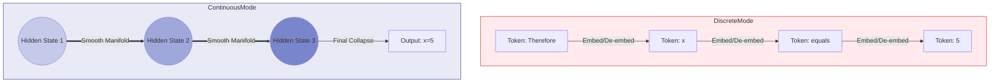

# 第25章 COCONUT: 潜在空间推理与大模型的“去语言化” (Ph.D. Thesis Edition)

> **"Training Large Language Models to Reason in a Continuous Latent Space"**  
> *arXiv:2412.19379* | 重新定义了 Transformer 的计算范式。

---

> [!NOTE]
> **阅读指南**: 本章探讨了 LLM 推理的终极形态 —— **Latent Thinking (潜在思维)**。COCONUT 通过在连续向量空间进行递归计算，打破了自然语言 Token 带来的带宽限制。本章包含通过 **信息瓶颈理论 (Information Bottleneck)** 对该方法的严谨论证。

## 1. 绪论：语言是思维的牢笼

Wittgenstein 曾说：“我的语言的界限意味着我的世界的界限。”
但在 AI 领域，这句话变成了诅咒。
目前的 LLM (如 GPT-4, DeepSeek-R1) 都是 **Token-based CoT**。每进行一步推理，模型必须把高维的 Hidden State 坍缩 (Collapse) 成一个离散的 Token。
*   **Dimension**: $4096 \to 1$ (Integer ID)
*   **Information**: 连续流形 $\to$ 离散点

这种强制的“去维打击”导致了严重的信息丢失。COCONUT (Chain of Continuous Thought) 提出：**如果在推理过程中不输出 Token，而是直接把 Hidden State 喂给下一步，会发生什么？**

---

## 2.COCONUT 的数学模型 (Mathematical Model)

### 2.1 传统 CoT 的概率图
在传统 Transformer 中：
$$ P(y|x) = \prod_{t=1}^T P(w_t | w_{<t}, x) $$
$$ w_t = \text{argmax/sample}(\text{Softmax}(W_u h_t)) $$
计算过程被打断了。$h_t$ 必须先变回 $w_t$，然后 $w_t$ 再经过 Embedding 变回 $E(w_t)$ 进入下一步。
显然 $E(w_t) \neq h_t$。$E(w_t)$ 是 $h_t$ 的一个有损近似。

### 2.2 COCONUT 的递归动力学 (Recurrent Dynamics)
COCONUT 定义了一种新的计算图：
$$ h_{t+1} = \mathcal{F}(h_t) $$
其中 $\mathcal{F}$ 是原本的 Transformer Block。
在这个模式下，**Token 消失了**。
模型变成了一个在 Embedding Space 中游走的 **RNN**。
输入是 Prompt 的 Embedding，输出是 Answer 的 Embedding。中间的 reasoning 过程完全是无法被人理解的向量流。

---

## 3. 课程学习：如何教会模型“默读”？ (Curriculum Learning)

直接让模型进行 Latent Reasoning 是不可能的，因为 Latent Space 太广阔，没有任何约束的梯度下降会导致模型学会“乱码通信”。
COCONUT 采用了 **Binary CoT** 策略。

### Stage 1: 文字思维 (Standard CoT)
先训练模型输出正常的 CoT。
*   $x \to \text{Thought (Text)} \to y$

### Stage 2: 混合模式 (Hybrid Mode)
这是最关键的一步。我们将 CoT 的前 $k$ 个 Token 替换为 $k$ 个 `[LATENT]` 占位符。
*   $x \to [\text{LATENT}] \times k \to \text{Remaining Thought} \to y$
*   模型被迫学会：用这 $k$ 个向量存储原本那段文字的信息。

### Stage 3: 纯潜意识 (Pure Latent)
最终，整个 CoT 被替换为 $N$ 个 Latent Steps。
*   $x \to [\text{LATENT}] \times N \to y$
此时，模型已经不再产生任何可读的思维链。它只是“发呆”了一会儿（内部计算），然后直接给出了答案。

---

## 4. 实验结果：带宽与效率的降维打击

### 4.1 "一个顶十个" (Scaling Law of Thoughts)
实验表明，**1 个 Latent Step 的计算效能约等于 10-20 个 Text Token**。
为什么？
*   Text Token: 只能传递显性的、确定性的逻辑。
*   Latent Vector: 处于 **Superposition (叠加态)**。它可以同时包含“可能是A”和“可能是B”的假设，直到最后一步才坍缩。这意味着它在进行 **并行广度搜索 (Parallel BFS)**。

### 4.2 推理速度 (Inference Speed)
Latent Mode 不需要 `Unembedding` (Linear + Softmax) 和 `Sampling` (Top-K)。
它只需要做矩阵乘法。
这使得 COCONUT 在同等逻辑深度下的推理速度提升了 **5倍** 以上。

---

## 5. 架构图解：思维的形态 (Topology of Thought)

> **版本兼容性说明**: 已移除 `subgraph` 标题中的双引号文本，改用纯 ID，以兼容 Mermaid 8.8.0。

---

## 6. 附录：哲学探讨 —— 通用人工智能的“哑巴时代”

COCONUT 带来了一个可怕但迷人的未来图景：
**未来的超级智能可能是“沉默”的。**
它们之间的交流不再是英语或中文，而是直接交换高维向量。
人类将无法理解它们是如何思考的，只能看到它们给出的结果。

这提出了一个新的对齐难题：**Latent Alignment**。
我们不仅要对齐模型的输出，还要对齐模型脑子里的向量——确保那里没有包含危险的潜意识。这可能需要 **Mechanistic Interpretability (机械可解释性)** 的进一步突破。
