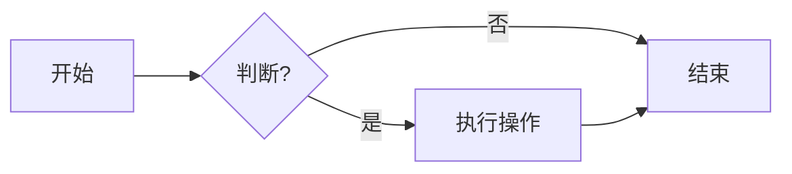
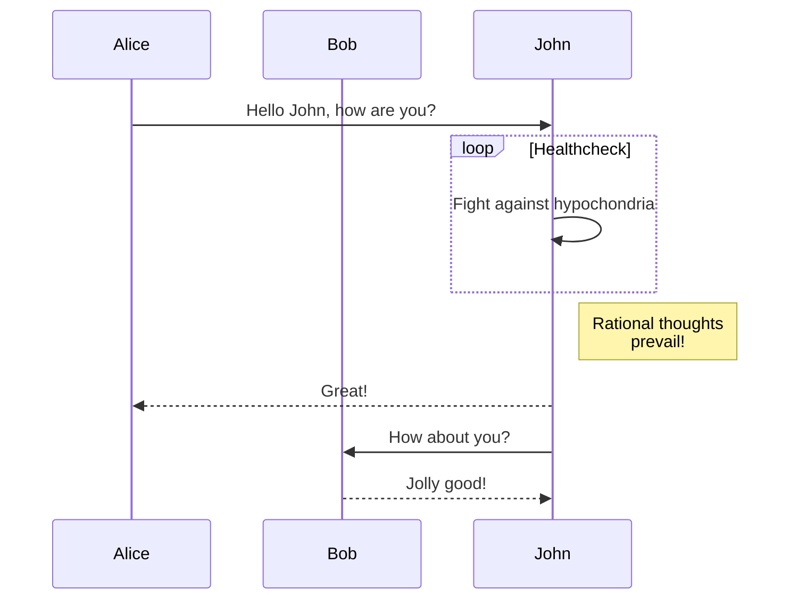
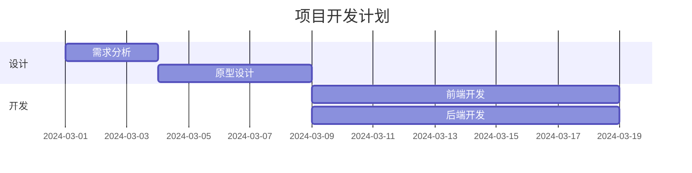

# Markdown 全特性演示

> [!TIP]
> 本文用于演示 MetaUniverse 博客系统支持的所有 Markdown 语法和高级特性。

[[TOC]]

## 1. 基础排版

### 1.1 标题层级

# H1 标题
## H2 标题
### H3 标题
#### H4 标题
##### H5 标题
###### H6 标题

### 1.2 文本样式

- **加粗文本** (Bold)
- *斜体文本* (Italic)
- ***粗斜体*** (Bold Italic)
- ~~删除线~~ (Strikethrough)
- `行内代码` (Inline Code)
- ==高亮文本== (Highlight)
- [链接到 Google](https://google.com)
- 脚注[^1]

[^1]: 这里是脚注的内容。

### 1.3 列表

**无序列表**：
- 项目 1
- 项目 2
  - 子项目 A
  - 子项目 B

**有序列表**：
1. 第一步
2. 第二步
   1. 子步骤 2.1
   2. 子步骤 2.2

**任务列表**：
- [x] 已完成任务
- [ ] 未完成任务
- [ ] 待办事项

### 1.4 引用

>这是一段引用文本。
>
>> 这是嵌套引用。

## 2. 表格与对齐

| 左对齐 | 居中对齐 | 右对齐 |
| :----- | :----: | -----: |
| 单元格 1 | 单元格 2 | 单元格 3 |
| Content | Content | Content |

## 3. 代码高亮

### 3.1 基础代码块

```typescript:line-numbers {3}
// TypeScript 示例
interface User {
  id: number;
  name: string;
}

const user: User = {
  id: 1,
  name: 'MetaUniverse'
};
```

### 3.2 代码组

::: code-group

```bash [npm]
npm install
```

```bash [pnpm]
pnpm install
```

```bash [yarn]
yarn install
```

:::

### 3.3 Diff 显示

```diff
- console.log('Old Code');
+ console.log('New Code');
```

## 4. 数学公式 (LaTeX)

### 4.1 行内公式

爱因斯坦质能方程：$E = mc^2$

### 4.2 块级公式

$$
\frac{1}{\Bigl(\sqrt{\phi \sqrt{5}}-\phi\Bigr) e^{\frac25 \pi}} = 
1+\frac{e^{-2\pi}} {1+\frac{e^{-4\pi}} {1+\frac{e^{-6\pi}}
{1+\frac{e^{-8\pi}} {1+\ldots} } } } 
$$

### 4.3 矩阵与对齐

$$
\mathbf{V}_1 \times \mathbf{V}_2 =  \begin{vmatrix} 
\mathbf{i} & \mathbf{j} & \mathbf{k} \\
\frac{\partial X}{\partial u} &  \frac{\partial Y}{\partial u} & 0 \\
\frac{\partial X}{\partial v} &  \frac{\partial Y}{\partial v} & 0 \\
\end{vmatrix}
$$

## 5. 图表 (Mermaid)

### 5.1 流程图



### 5.2 时序图



### 5.3 甘特图



## 6. 自定义容器

::: tip 提示
这是提示信息容器。
:::

::: warning 警告
这是警告信息容器。
:::

::: danger 危险
这是危险信息容器。
:::

::: details 点击查看详细信息
这里是隐藏的详细内容，点击上方标题展开。
可以包含**加粗**、代码块等任何内容。
:::

## 7. 交互式组件

### 7.1 张量可视化 (TensorPlayground)

<TensorPlayground></TensorPlayground>

### 7.2 语义热力图 (SemanticHeatmap)

右侧浮动的热力图条即为此组件。

### 7.3 WASM 沙箱 (CodeSandbox)

<CodeSandbox></CodeSandbox>

## 8. WikiLinks (双向链接)

- [[Transformer]] - 链接到 Transformer 文章
- [[Hello World]] - 链接到 Hello World 文章

---

*End of Demo*
