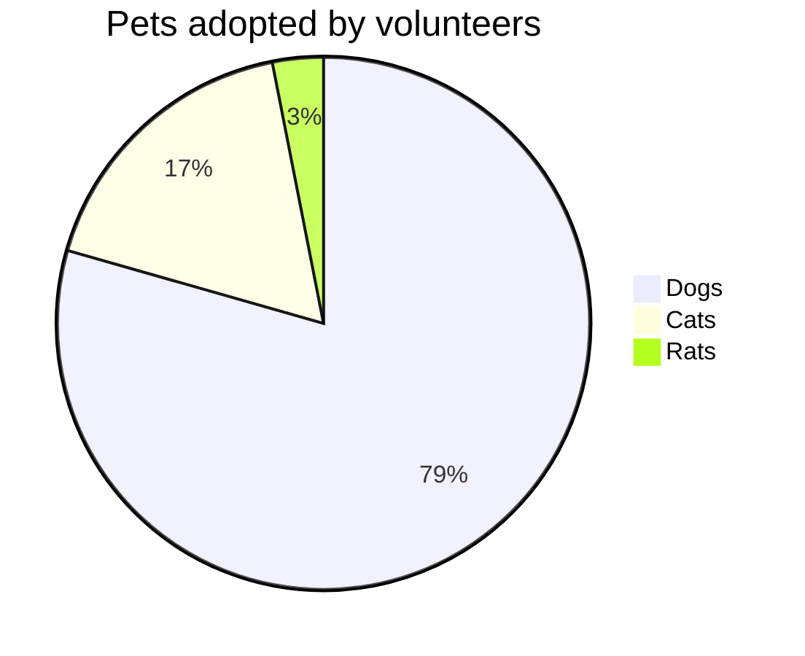

# Markdown 全特性演示

> [!TIP] 
> 本文演示 MetaUniverse 博客系统支持的所有 Markdown 语法和高级特性。

[[TOC]]

## 1. 基础排版

### 1.1 标题层级

# H1 标题
## H2 标题
### H3 标题
#### H4 标题
##### H5 标题
###### H6 标题

### 1.2 文本装饰与样式

- **加粗文本** (Bold): `**Bold**`
- *斜体文本* (Italic): `*Italic*`
- ***粗斜体*** (Bold Italic): `***Bold Italic***`
- ~~删除线~~ (Strikethrough): `~~Strikethrough~~`
- <u>下划线文本</u>: `<u>Underline</u>`
- <span style="color: red">红色文本</span>: `<span style="color: red">Red</span>`
- <span style="background-color: yellow">背景高亮</span>: `<span style="background-color: yellow">Highlight</span>`
- `行内代码` (Inline Code): `` `Code` ``
- 键盘按键: <kbd>Ctrl</kbd> + <kbd>C</kbd>
- 上标: X<sup>2</sup>
- 下标: H<sub>2</sub>O

### 1.3 列表与缩进

**无序列表 (嵌套)**：
- Level 1
  - Level 2
    - Level 3
      - Level 4

**有序列表**：
1. 第一步
2. 第二步
   1. 子步骤 A
   2. 子步骤 B

**任务列表**：
- [x] 已完成任务
- [ ] 未完成任务
- [ ] <span style="color:blue">进行中...</span>

**引用块**：
> 这是一个一级引用
>
> > 这是一个嵌套引用
> > 
> > 包含列表：
> > - Item A
> > - Item B

## 2. 表格与对齐

| 左对齐 | 居中对齐 | 右对齐 |
| :----- | :----: | -----: |
| Left | Center | Right |
| 1 | 2 | 3 |
| <span style="color:green">✔</span> | <span style="color:red">✘</span> | - |

## 3. 代码高亮与增强

### 3.1 基础功能 (行号与高亮)

```typescript:line-numbers {3,6-7}
// TypeScript 示例: 行号 + 行高亮
interface User {
  id: number; // 高亮行
  name: string;
}
// 高亮区域
const user: User = {
  id: 1,
  name: 'MetaUniverse'
};
```

### 3.2 代码组 (Tabs)

::: code-group

```bash [npm]
npm install
```

```bash [pnpm]
pnpm install
```

```bash [yarn]
yarn install
```

:::

### 3.3 Diff 模式

```diff
- console.log('Old Code');
+ console.log('New Code');
  console.log('Unchanged Code');
```

## 4. 高级数学公式 (LaTeX)

### 4.1 基础公式

- 行内公式: $E = mc^2$
- 块级公式:
$$
\sum_{i=1}^{n} i = \frac{n(n+1)}{2}
$$

### 4.2 复杂对齐 (Aligned)

$$
\begin{align}
\nabla \cdot \mathbf{E} &= \frac{\rho}{\varepsilon_0} \\
\nabla \cdot \mathbf{B} &= 0 \\
\nabla \times \mathbf{E} &= -\frac{\partial \mathbf{B}}{\partial t} \\
\nabla \times \mathbf{B} &= \mu_0\mathbf{J} + \mu_0\varepsilon_0\frac{\partial \mathbf{E}}{\partial t}
\end{align}
$$

### 4.3 矩阵与行列式

$$
\mathbf{X} = \begin{pmatrix}
x_{11} & x_{12} & \cdots & x_{1n} \\
x_{21} & x_{22} & \cdots & x_{2n} \\
\vdots & \vdots & \ddots & \vdots \\
x_{m1} & x_{m2} & \cdots & x_{mn}
\end{pmatrix}
$$

$$
\left| \begin{array}{cc}
a & b \\ c & d
\end{array} \right| = ad - bc
$$

### 4.4 积分与求和

$$
\int_{-\infty}^{\infty} e^{-x^2} dx = \sqrt{\pi}
$$

### 4.5 公式染色与样式

$$
\color{red}{f(x)} = \int \color{blue}{g(x)} \,dx
$$

$$
\underbrace{a + \overbrace{b + \dots + b}^{m \text{ times}} + c}_{n \text{ times}}
$$

## 5. 图表 (Mermaid)

### 5.1 流程图 (Flowchart)


### 5.2 时序图 (Sequence)


### 5.3 饼图 (Pie)



## 6. 自定义容器 (Containers)

::: tip 💡 提示 (Tip)
推荐使用这种方式提示关键信息。
:::

::: warning ⚠️ 警告 (Warning)
请注意可能的副作用。
:::

::: danger 🚨 危险 (Danger)
这是一项危险操作！
:::

::: info ℹ️ 信息 (Info)
这里是一些背景信息。
:::

::: details ▶️ 点击展开详细内容
这里是隐藏的详细内容。
可以包含 **Markdown** 语法。
```python
print("Hello Details")
```
:::

## 7. 交互式组件 (Vue)

### 7.1 交互组件 (ClientOnly)

::: warning 注意
以下组件可能包含 WebGL 或 WASM 内容，使用 `<ClientOnly>` 包裹以兼容 SSR。
:::

<!-- 
<ClientOnly>
  <TensorPlayground></TensorPlayground>
</ClientOnly> 
-->
*(TensorPlayground 组件暂时禁用以排查 404 问题，取消注释上方代码即可启用)*

### 7.2 语义热力 (SemanticHeatmap)

> 右侧浮动的热力图条即为此组件。

## 8. 双向链接 (WikiLinks)

- 链接到: [[Transformer]]
- 链接到: [[Hello World]]

## 9. 脚注 (Footnote)

这是一个脚注引用[^1]。
这是另一个[^2]。

[^1]: 这是第一个脚注的内容。
[^2]: 这是第二个脚注的内容。

---
*End of Demo*
