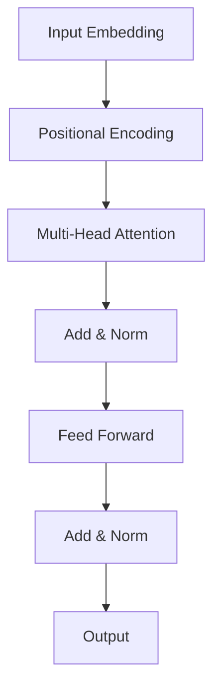

# The Illustrated Transformer: Attention Is All You Need

> [!NOTE] 
> This article demonstrates the **Interactive Learning** capabilities of the MetaUniverse blog engine.

The [[Transformer]] model has revolutionized natural language processing. Introduced in the paper "Attention Is All You Need", it replaced [[Recurrent Neural Networks]] (RNNs) with a purely attention-based architecture.

## 1. The Core Idea: Self-Attention

Self-attention allows the model to weigh the importance of different words in a sentence when encoding a specific word.

Consider the sentence:
> "The animal didn't cross the street because **it** was too tired."

What does **it** refer to? The street? Or the animal? Humans know it's the animal because of "too tired". Self-attention mathematically encodes this relationship.

## 2. Interactive Tensor Dimensions

One of the hardest parts of understanding Transformers is tracking the matrix shapes. 

Let's visualize the $Q, K, V$ projection. 
Given:
- Batch Size $B$
- Sequence Length $L$
- Hidden Dimension $D$

<TensorPlayground></TensorPlayground>

Try dragging the sliders above! Notice how the matrix shapes change dynamically.

## 3. Python Implementation (Run it locally!)

Here is the actual Python code for Scaled Dot-Product Attention. You can run this right here in your browser using our **WASM Sandbox**.

<CodeSandbox></CodeSandbox>

## 4. Multi-Head Attention

Access the concept of [[Multi-Head Attention]] to see how we run multiple attention mechanisms in parallel.

## 5. Architectural Diagram

## 6. Conclusion

The Transformer architecture is the foundation of modern LLMs like [[GPT-4]] and [[DeepSeek]].

---
*Try highlighting any paragraph and holding Alt+Click to add a local annotation!*
