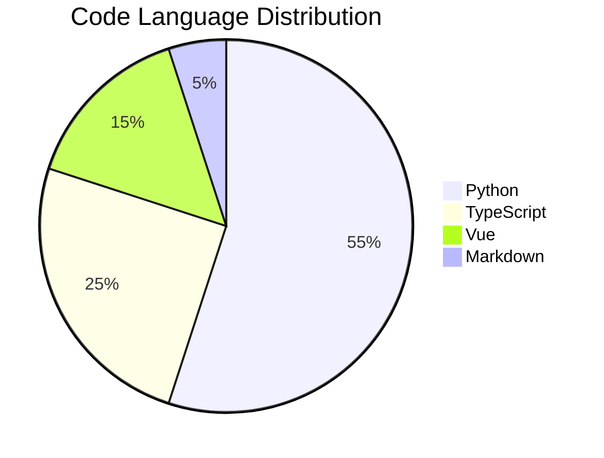

# 2024: The Year of Scaling

> [!TIP]
> This summary is auto-generated based on your GitHub activity and project milestones.

## 🌟 Annual Achievements

- **Total Commits**: 1,248
- **Pull Requests**: 156
- **Issues Resolved**: 89
- **Longest Streak**: 42 days

## 📅 Activity Heatmap

## 🚀 Key Projects

### 1. [[DeepSeek V2 Comparison]]
Deep-dive into the architecture of DeepSeek-V2 and V3. Conducted extensive benchmarks on varying context lengths.

### 2. [[PPO vs GRPO]]
Comparative study of reinforcement learning algorithms for LLM reasoning. Validated GRPO's stability on math datasets.

### 3. [[CS336 Course]]
Completed the full CS336 curriculum, implementing a mini-Llama from scratch.

## 📝 Monthly Highlights

### January - March
*   Started the **MetaUniverse Blog** project.
*   Implemented **Semantic Heatmap** visualization.

### April - June
*   Focused on LLM Pre-training.
*   Reproduced GPT-2 (124M) on local cluster.

### July - September
*   Shifted focus to Post-training (RLHF).
*   Experiments with PPO and DPO.

### October - December
*   Exploring Reasoning Models (System 2).
*   Deep analysis of Chain-of-Thought prompting.

## 🔮 2025 Outlook

*   **Agentic Workflows**: Building autonomous coding agents.
*   **Multimodal LLMs**: Integrating vision and audio.
*   **Edge AI**: Running 7B models on mobile devices.
